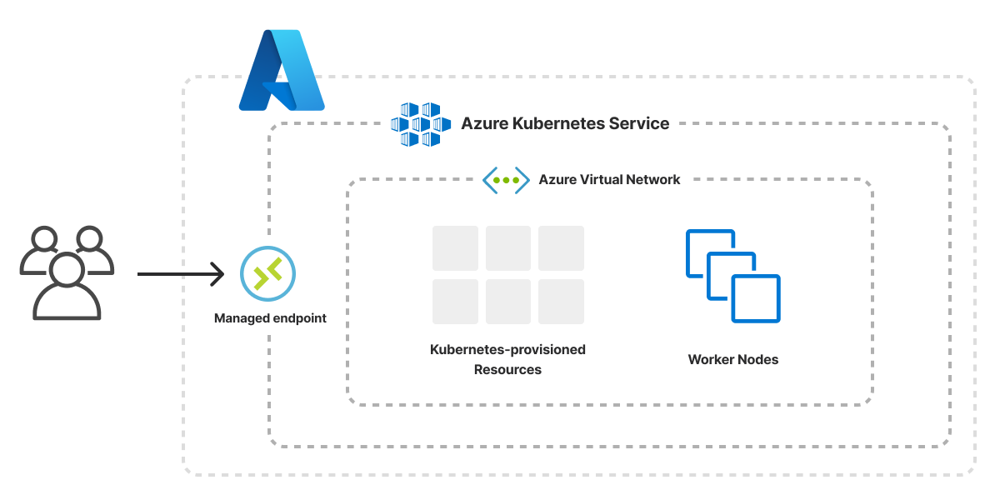

The Azure Kubernetes Cluster template scaffolds a Pulumi project that provisions a managed [Azure Kubernetes Service (AKS) cluster](/registry/packages/azure-native/api-docs/containerservice/managedcluster) inside a new [Azure Virtual Network](/registry/packages/azure-native/api-docs/network/virtualnetwork/) with three subnets. Worker nodes are deployed with private IP addresses for improved security and spread across multiple availability zones for resilience.



## Using this template

To use this template to deploy your own Kubernetes cluster, make sure you've [installed Pulumi](/docs/install/) and [configured your Azure credentials](/registry/packages/azure-native/installation-configuration#credentials), then create a new [project](/docs/iac/concepts/projects/) using the template in the language of your choice:



Follow the prompts to complete the new-project wizard. When it's done, you'll have a complete Pulumi project that's ready to deploy and configured with the most common settings. Feel free to inspect the code in  for a closer look.

## Deploying the project

You must supply two values to deploy the cluster. You can input both through the new-project wizard:

mgmtGroupId
: The object ID of an existing Azure AD group that will serve as the cluster administrator.

sshPubKey
: The contents of the public key used for SSH access to the cluster nodes.

Once the project is created, you can deploy it with [`pulumi up`](/docs/iac/cli/commands/pulumi_up):

```bash
$ pulumi up
```

When the deployment completes, Pulumi exports the following [stack output](/docs/iac/concepts/stacks/#outputs) values:

rgname
: The name of the Azure Resource Group containing the Kubernetes cluster resources.

vnetName
: The name of the Azure Virtual Network used for worker nodes, apps, and workloads.

clusterName
: The name of the AKS cluster.

kubeconfig
: The cluster's kubeconfig file, which you can use with `kubectl` to access and communicate with your cluster.

Output values like these are useful in many ways, most commonly as inputs for other stacks or related cloud resources.

## Customizing the project

Projects created with the Kubernetes Cluster template expose the following [configuration](/docs/iac/concepts/config/) settings:

numWorkerNodes
: The number of nodes in your cluster. Defaults to `3`.

kubernetesVersion
: The version of Kubernetes used in your AKS cluster. Defaults to `1.24.3`.

prefixForDns
: The unique DNS prefix for your AKS cluster. Defaults to `pulumi`.

nodeVmSize
: The VM instance type used to run your nodes. Defaults to `Standard_DS2_v2`.

All of these settings are optional and may be adjusted either by editing the stack configuration file directly (by default, `Pulumi.dev.yaml`) or by changing their values with [`pulumi config set`](/docs/iac/cli/commands/pulumi_config_set):

```bash
$ pulumi config set numWorkerNodes 5
$ pulumi up
```

## Cleaning up

You can cleanly destroy the stack and all of its infrastructure with [`pulumi destroy`](/docs/iac/cli/commands/pulumi_destroy):

```bash
$ pulumi destroy
```

## Learn more

* Browse other architecture templates in the [Templates gallery](/templates).
* Explore the [Azure Native provider API docs](/registry/packages/azure-native) in the Pulumi Registry.
* Walk through Pulumi from the ground up in [Pulumi Tutorials](/tutorials/).
* Read the latest [Kubernetes posts on the Pulumi blog](/blog/tag/kubernetes).
