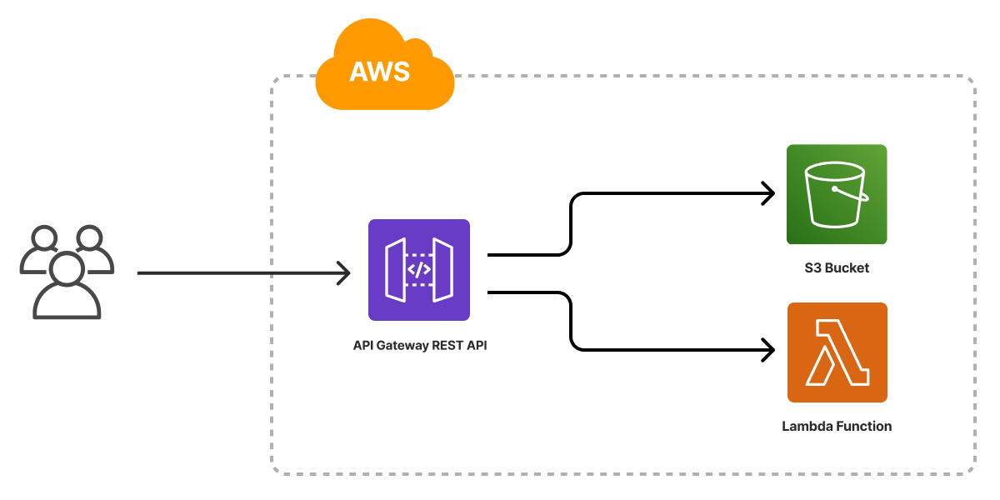

The AWS Serverless Application template scaffolds a Pulumi project that deploys a serverless web application to AWS. It provisions an [Amazon S3 bucket](/registry/packages/aws/api-docs/s3/bucket/) for static website hosting, an [AWS Lambda function](/registry/packages/aws/api-docs/lambda/function/) for the application backend, and an [Amazon API Gateway REST API](/registry/packages/aws/api-docs/apigateway/restapi/) that routes requests to the static content and the Lambda function. The template ships with a placeholder web page that displays the current time so the project deploys end to end out of the box.



## Using this template

To use this template to deploy your own AWS serverless application, make sure you've [installed Pulumi](/docs/install/) and [configured your AWS credentials](/registry/packages/aws/installation-configuration#credentials), then create a new [project](/docs/iac/concepts/projects/) using the template in the language of your choice:



Follow the prompts to complete the new-project wizard. When it's done, you'll have a complete Pulumi project that's ready to deploy and configured with the most common settings. Feel free to inspect the code in  for a closer look.

## Deploying the project

The template requires no additional configuration. Once the new project is created, you can deploy it with [`pulumi up`](/docs/iac/cli/commands/pulumi_up):

```bash
$ pulumi up
```

When the deployment completes, Pulumi exports the following [stack output](/docs/iac/concepts/stacks/#outputs) values:

url
: The HTTP URL for the application.

Stack outputs are useful in a number of ways, most commonly as inputs to other stacks or cloud resources.

## Customizing the project

Projects created with the AWS Serverless template expose the following [configuration](/docs/iac/concepts/config/) settings:

path
: The path to the folder containing the files of the website. Defaults to `www`, which is the folder included with the template. The `/date` path is a GET endpoint that retrieves the current time from the Lambda function.

code
: The path to the folder containing the Lambda function code. Defaults to the `function` folder included with the template.

None of these settings is required; by default, the template deploys the website and function using the files in the `www` and `function` folders bundled with the template.

### Using your own web content

If you already have a website you'd like to deploy, you can do so by replacing the contents of the `www` folder and redeploying with `pulumi up`.

Alternatively, you can configure the stack to deploy from another folder on your machine by using [`pulumi config set`](/docs/iac/cli/commands/pulumi_config_set) to change the value of the `path` setting:

```bash
$ pulumi config set path ../my-website/dist
$ pulumi up
```

### Customizing the application's functionality

You can customize the placeholder website by editing the Lambda function to perform another action, such as displaying a countdown to a future time. You can also add new functionality by creating a new Lambda function, adding a new path to the REST API, and updating the HTML to call the new path.

## Cleaning up

You can cleanly destroy the stack and all of its infrastructure with [`pulumi destroy`](/docs/iac/cli/commands/pulumi_destroy):

```bash
$ pulumi destroy
```

## Learn more

* Browse other architecture templates in the [Templates gallery](/templates).
* Explore the [AWS provider API docs](/registry/packages/aws) in the Pulumi Registry.
* Walk through Pulumi from the ground up in [Pulumi Tutorials](/tutorials/).
* Read the latest [serverless posts on the Pulumi blog](/blog/tag/serverless).
