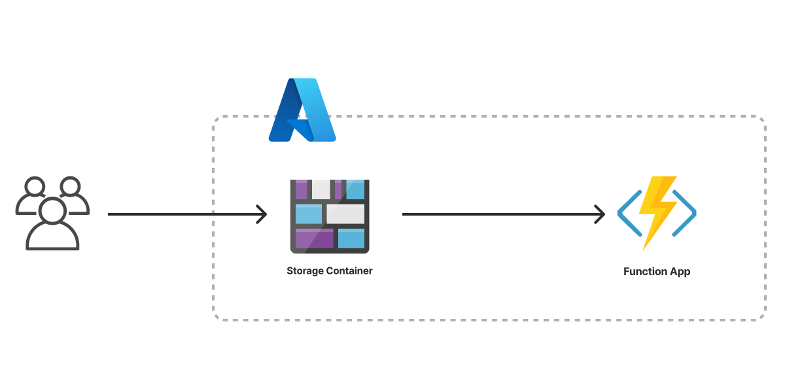

The Serverless Application template creates an infrastructure as code project in your favorite language that deploys a serverless application to Azure with Pulumi. It deploys an [Azure Blob Storage account](/registry/packages/azure-native/api-docs/storage/storageaccount/) configured for [static website hosting](/registry/packages/azure-native/api-docs/storage/storageaccountstaticwebsite/) and an [Azure Function](/registry/packages/azure-native/api-docs/web/webappfunction/) written in the same language as the template. The template ships with placeholder content to give you a working project out of the box that you can customize easily and extend to suit your needs.



## Using this template

To use this template to deploy your own serverless application, make sure you've [installed Pulumi](/docs/install/) and [configured your Azure credentials](/registry/packages/azure/installation-configuration#credentials), then create a new [project](/docs/concepts/projects/) using the template in your language of choice:



Follow the prompts to complete the new-project wizard. When it's done, you'll have a complete Pulumi project that's ready to deploy and configured with the most common settings. Feel free to inspect the code in  for a closer look.

## Deploying the project

The template requires no additional configuration. Once the new project is created, you can deploy it immediately with [`pulumi up`](/docs/cli/commands/pulumi_up):

```bash
$ pulumi up
```

When the deployment completes, Pulumi exports the following [stack output](/docs/concepts/stack#outputs) values:

siteURL
: The HTTP URL of the static website.

apiURL
: The HTTP URL of the serverless function endpoint.

Output values like these are useful in many ways, most commonly as inputs for other stacks or related cloud resources. The computed `siteURL`, for example, can be used from the command line to open the newly deployed website in your favorite web browser:

```bash
$ open $(pulumi stack output siteURL)
```

## Customizing the project

Projects created with the Serverless Application template expose the following [configuration](/docs/concepts/config/) settings:

sitePath
: The path to the folder containing the files of the website. Defaults to `www`, which is the name (and relative path) of the folder included with the template.

appPath
: The path to the folder containing the serverless functions to be deployed. Defaults to `app`, which is also included with the template.

indexDocument
: The file to use for top-level pages. Defaults to `index.html`.

errorDocument
: The file to use for error pages. Defaults to `error.html`.

All of these settings are optional and may be adjusted either by editing the stack configuration file directly (by default, `Pulumi.dev.yaml`) or by changing their values with [`pulumi config set`](/docs/cli/commands/pulumi_config_set).

```bash
$ pulumi config set sitePath ../my-existing-website/build
$ pulumi up
```

## Tidying up

You can cleanly destroy the stack and all of its infrastructure with [`pulumi destroy`](/docs/cli/commands/pulumi_destroy):

```bash
$ pulumi destroy
```

## Learn more

Congratulations! You're now well on your way to managing a production-grade serverless application on Azure with Pulumi --- and there's lots more you can do from here:

* Discover more architecture templates in [Templates &rarr;](/templates)
* Dive into the Azure Native package by exploring the [API docs in the Registry &rarr;](/registry/packages/azure-native)
* Expand your understanding of how Pulumi works in [Learn Pulumi &rarr;](/learn)
* Read up on the latest new Azure features [in the Pulumi Blog &rarr;](/blog/tag/azure)
