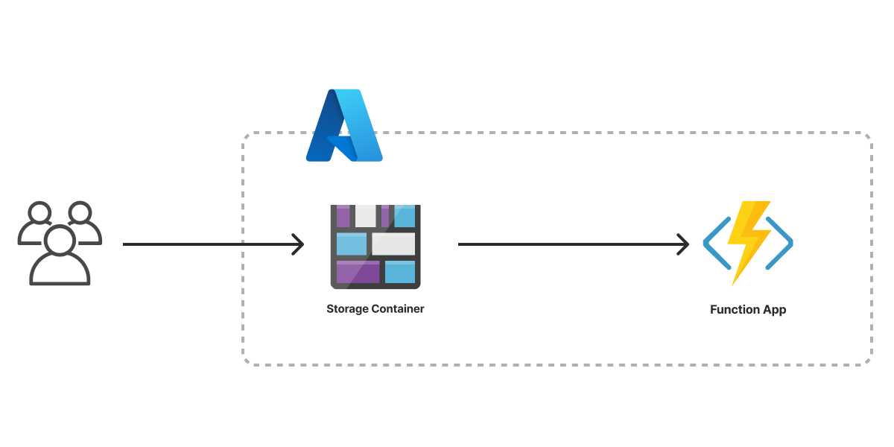

The Azure Serverless Application template scaffolds a Pulumi project that deploys an [Azure Blob Storage account](/registry/packages/azure-native/api-docs/storage/storageaccount/) configured for [static website hosting](/registry/packages/azure-native/api-docs/storage/storageaccountstaticwebsite/) and an [Azure Function](/registry/packages/azure-native/api-docs/web/webappfunction/) for the application backend. The template ships with placeholder web and function content so the project deploys end to end out of the box.



## Using this template

To use this template to deploy your own serverless application, make sure you've [installed Pulumi](/docs/install/) and [configured your Azure credentials](/registry/packages/azure-native/installation-configuration#credentials), then create a new [project](/docs/iac/concepts/projects/) using the template in the language of your choice:



Follow the prompts to complete the new-project wizard. When it's done, you'll have a complete Pulumi project that's ready to deploy and configured with the most common settings. Feel free to inspect the code in  for a closer look.

## Deploying the project

The template requires no additional configuration. Once the new project is created, you can deploy it with [`pulumi up`](/docs/iac/cli/commands/pulumi_up):

```bash
$ pulumi up
```

When the deployment completes, Pulumi exports the following [stack output](/docs/iac/concepts/stacks/#outputs) values:

siteURL
: The HTTP URL of the static website.

apiURL
: The HTTP URL of the serverless function endpoint.

Output values like these are useful in many ways, most commonly as inputs for other stacks or related cloud resources. The computed `siteURL`, for example, can be used from the command line to open the newly deployed website in your favorite web browser:

```bash
$ open $(pulumi stack output siteURL)
```

## Customizing the project

Projects created with the Serverless Application template expose the following [configuration](/docs/iac/concepts/config/) settings:

sitePath
: The path to the folder containing the files of the website. Defaults to `www`, which is the folder included with the template.

appPath
: The path to the folder containing the serverless functions to be deployed. Defaults to `app`, which is also included with the template.

indexDocument
: The file to use for top-level pages. Defaults to `index.html`.

errorDocument
: The file to use for error pages. Defaults to `error.html`.

All of these settings are optional and may be adjusted either by editing the stack configuration file directly (by default, `Pulumi.dev.yaml`) or by changing their values with [`pulumi config set`](/docs/iac/cli/commands/pulumi_config_set):

```bash
$ pulumi config set sitePath ../my-existing-website/build
$ pulumi up
```

## Cleaning up

You can cleanly destroy the stack and all of its infrastructure with [`pulumi destroy`](/docs/iac/cli/commands/pulumi_destroy):

```bash
$ pulumi destroy
```

## Learn more

* Browse other architecture templates in the [Templates gallery](/templates).
* Explore the [Azure Native provider API docs](/registry/packages/azure-native) in the Pulumi Registry.
* Walk through Pulumi from the ground up in [Pulumi Tutorials](/tutorials/).
* Read the latest [Azure posts on the Pulumi blog](/blog/tag/azure).
