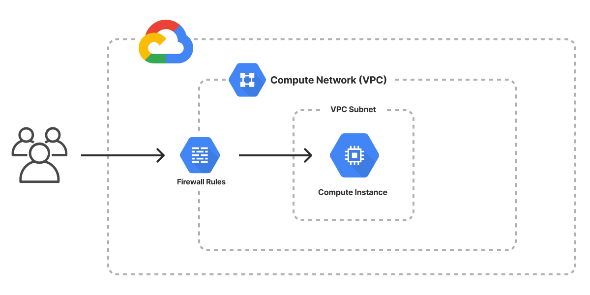

The Google Cloud Virtual Machine template scaffolds a Pulumi project that provisions a [Compute Engine instance](/registry/packages/gcp/api-docs/compute/instance/) and the supporting [Compute Engine network](/registry/packages/gcp/api-docs/compute/network/). The instance boots an HTTP server on port 80 from a small init script, so the project deploys end to end out of the box. Use it as a starting point for a web application, backend service, or database VM.



## Using this template

To use this template to deploy your own virtual machine, make sure you've [installed Pulumi](/docs/install/) and [configured your Google Cloud credentials](/registry/packages/gcp/installation-configuration#credentials), then create a new [project](/docs/iac/concepts/projects/) using the template in the language of your choice:



Follow the prompts to complete the new-project wizard. When it's done, you'll have a complete Pulumi project that's ready to deploy and configured with the most common settings. Feel free to inspect the code in  for a closer look.

## Deploying the project

The template requires no additional configuration. Once the new project is created, you can deploy it immediately with [`pulumi up`](/docs/iac/cli/commands/pulumi_up):

```bash
$ pulumi up
```

When the deployment completes, Pulumi exports the following [stack output](/docs/iac/concepts/stacks/#outputs) values:

ip
: The IP address of the virtual machine.

hostname
: The provider-assigned hostname of the virtual machine.

url
: The fully-qualified HTTP URL of the HTTP server running on the virtual machine.

Output values like these are useful in many ways, most commonly as inputs for other stacks or related cloud resources. The computed `url`, for example, can be used from the command line to open the newly deployed website in your favorite web browser:

```bash
$ open $(pulumi stack output url)
```

## Customizing the project

Projects created with the Virtual Machine template expose the following [configuration](/docs/iac/concepts/config/) settings:

machineType
: The Compute Engine machine type to use for the VM. Defaults to `e2-micro`.

osImage
: The OS image type to use for the VM. Defaults to `debian-11`.

instanceTag
: The tag to apply to the VM instance. Defaults to `webserver`.

servicePort
: The HTTP service port to expose on the VM. Defaults to `80`.

All of these settings are optional and may be adjusted either by editing the stack configuration file directly (by default, `Pulumi.dev.yaml`) or by changing their values with [`pulumi config set`](/docs/iac/cli/commands/pulumi_config_set):

## Cleaning up

You can cleanly destroy the stack and all of its infrastructure with [`pulumi destroy`](/docs/iac/cli/commands/pulumi_destroy):

```bash
$ pulumi destroy
```

## Learn more

* Browse other architecture templates in the [Templates gallery](/templates).
* Explore the [Google Cloud provider API docs](/registry/packages/gcp) in the Pulumi Registry.
* Walk through Pulumi from the ground up in [Pulumi Tutorials](/tutorials/).
* Read the latest [Google Cloud posts on the Pulumi blog](/blog/tag/google-cloud).
