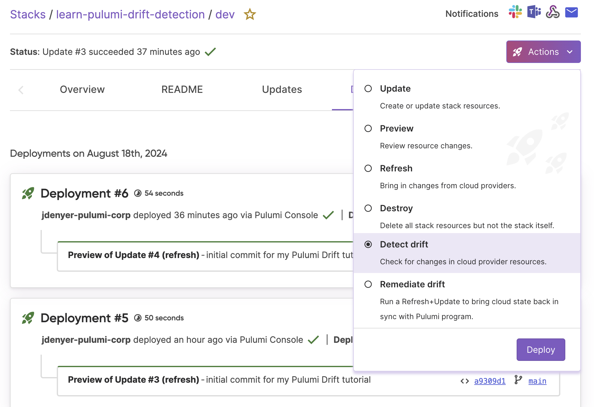

[Drift Detection and Remediation](/docs/pulumi-cloud/deployments/drift/) is a feature of Pulumi Cloud that automates the detection and correction of drift in your cloud environments. It integrates seamlessly with Pulumi Deployments and can be incorporated into CI/CD workflows and tools using the [Pulumi CLI](/docs/cli/) or [Automation API](docs/using-pulumi/automation-api/). When changes occur outside of Pulumi, such as manual updates in the cloud provider's console, Pulumi reports these discrepancies. Auto-remediation can also be configured to refresh your last known desired state, correcting any drift without manual intervention.

Drift detection can be initiated via the CLI, performed on-demand in Pulumi Cloud with [Click to Deploy](/docs/pulumi-cloud/deployments/#deployment-triggers) actions, or [scheduled](/docs/pulumi-cloud/deployments/schedules/) to run at regular intervals. During each run, Pulumi compares the actual state of your cloud resources with the expected state stored in Pulumi Cloud. Any discrepancies are logged in the Drift tab, which also provides a history of detection runs, details of the drift detected, and triggered notifications. [Notifications](docs/pulumi-cloud/deployments/drift/#configuring-notifications-for-drift-detection) can be sent via webhooks, Slack, or Microsoft Teams and detail the nature and scope of the drift.

To get started with Drift Detection in Pulumi, we will use Pulumi Deployments, which runs on Pulumi-hosted compute.

## Provision infrastructure

Let’s begin by using the Pulumi CLI to create a web server environment on AWS using a [Pulumi Template](/templates/). In this example, you will select a template that provisions an EC2 instance within a VPC with a public subnet, an internet gateway, and a security group allowing HTTP traffic. You can also use [Pulumi AI](https://www.pulumi.com/ai) to create a scenario based on your cloud and language of choice.

Initialize a new Pulumi project and pick your programming language of choice:



{}

```bash
$ mkdir learn-pulumi-drift-detection && cd learn-pulumi-drift-detection
$ pulumi new vm-aws-typescript
```

{}
{}

```bash
$ mkdir learn-pulumi-drift-detection && cd learn-pulumi-drift-detection
$ pulumi new vm-aws-python
```

{}
{}

```bash
$ mkdir learn-pulumi-drift-detection && cd learn-pulumi-drift-detection
$ pulumi new vm-aws-go
```

{}
{}

```bash
$ mkdir learn-pulumi-drift-detection && cd learn-pulumi-drift-detection
$ pulumi new vm-aws-csharp
```

{}
{}

```bash
$ mkdir learn-pulumi-drift-detection && cd learn-pulumi-drift-detection
$ pulumi new vm-aws-yaml
```

{}

Follow the prompts to set up your project and accept the default values or specify new values, such as `aws-region`.

Run `pulumi preview` to see the changes that will be made.

```bash
pulumi preview
```

Now you can deploy the stack to see the outputs of your EC2 instance, in this case `hostname`, `ip` and `url` which you will use to introduce manual changes via the AWS console.

```bash
pulumi up
```

```bash
View in Browser (Ctrl+O): https://app.pulumi.com/tutorials/learn-pulumi-drift-detection/dev/updates/1

    Type                              Name                   Status
+   pulumi:pulumi:Stack               drift3-dev             created (36s)
+   ├─ aws:ec2:Vpc                    vpc                    created (11s)
+   ├─ aws:ec2:Subnet                 subnet                 created (10s)
+   ├─ aws:ec2:InternetGateway        gateway                created (0.55s)
+   ├─ aws:ec2:SecurityGroup          secGroup               created (2s)
+   ├─ aws:ec2:RouteTable             routeTable             created (0.91s)
+   ├─ aws:ec2:RouteTableAssociation  routeTableAssociation  created (0.51s)
+   └─ aws:ec2:Instance               server                 created (12s)

Outputs:
   hostname: "ec2-18-236-205-169.us-west-2.compute.amazonaws.com"
   ip      : "18.236.205.169"
   url     : "http://ec2-18-236-205-169.us-west-2.compute.amazonaws.com"

Resources:
   + 8 created
```

Now you can view your new stack in Pulumi Cloud by following the **View in Browser** link. Click on the **Drift** tab and you will see that Drift is unavailable as your stack's deployments are not yet configured. Click on the **Configure deployments setting** to see your Deployments source control settings.

To use Drift Detection with Deployments you will first need to create a new GitHub repository.

## Create a new repository on GitHub

1. Go to [GitHub](https://github.com/new) and create a new repository manually.
2. Copy the repository URL provided by GitHub.
3. Replace the origin with your new GitHub repo using the following commands:

```bash
git init
git add .
git commit -m "Initial commit for my Pulumi Drift tutorial"
git branch -M main
git remote add origin https://github.com/your-username/learn-pulumi-drift-detection.git
git push -u origin main
```

## Configure Drift Detection

Now you will return to your browser to set your deployment configuration source control settings. Navigate to your stack `Settings` and `Deploy` tab. Next, configure the required Deployment settings, including your source control.

1. Add your GitHub organization/repository and the branch you created.

2. Add your Secret environment variables, including `AWS_ACCESS_KEY_ID` and `AWS_SECRET_ACCESS_KEY`.

{}
Secret environment variables, such as `AWS_SECRET_ACCESS_KEY`, are encrypted end-to-end with Pulumi and can be set on each stack. However, by creating an [environment](/docs/pulumi-cloud/esc) with Pulumi ESC, you can centralize secrets and set up OIDC for secure authentication. This allows you to manage and share sensitive configuration data across multiple stacks efficiently.
{}

Click **Save deployment configuration**.

<video autoplay loop muted playsinline>
    <source src="pulumi-configure-drift.mp4" type="video/mp4">
    Your browser does not support the video tag.
</video>

Once you have configured Pulumi Deployments, open the Actions menu and choose `Detect Drift`, then click `Deploy` to validate your stack, program and deployments are all running before we introduce drift.



After the drift detection is complete, you will see a new Drift run on the `Drift` tab timeline. Since this is the initial check and no deviations have been introduced, you will not receive any notifications indicating that drift has been detected, nor will you see any resources with changes.

## Introduce drift

To see Drift Detection in action, you will now introduce drift by manually making changes to your newly created EC2 resource, in this case by adding a new tag.

### Add a tag to EC2 using AWS CLI

To add a tag via the AWS CLI you will first need to retrieve the EC2 Instance ID before you can add a tag. Use the the following command:

```bash
   aws ec2 describe-instances --filters "Name=tag:Name,Values=webserver" --query "Reservations[*].Instances[*].InstanceId" --output text
```

Now, add the tag with the key `Description` and the value `Pulumi Drift Detection`:

```bash
   aws ec2 create-tags --resources <instance-id> --tags Key=Description,Value="Pulumi Drift Detection"
```

Replace `<instance-id>` with the actual instance ID of your EC2 instance.

### Add a tag to EC2 using the AWS console

To add a tag via the AWS console, log in with your browser and ensure you are in the correct AWS region where your Pulumi stack is deployed.

Modify your EC2 Instance by going to the EC2 Dashboard, then select the EC2 instance named `webserver` and click on the **Tags** tab. Next, add a tag by clicking the **Manage tags** button. Then click the **Add new tag** button with the key `Description` and value of `Pulumi Drift Detection`. Finally, **Save** the changes.

## Run a Drift Detection

Return to the Pulumi Cloud and your stack, and again choose the **Detect Drift** action and click **Deploy**.

After your run completes you will see a warning icon on the Drift tab, indicating that drift has been detected. You can see a detailed summary of what resources have been updated or deleted, the properties that have changed, when the drift run happened and a link to the Deployment with further details.

<video autoplay loop muted playsinline>
    <source src="pulumi-drift-detected.mp4" type="video/mp4">
    Your browser does not support the video tag.
</video>

## Remediate Drift

Now that you have detected and reviewed your infrastructure drift, you can choose to remediate and overwrite the changes made in your cloud provider with the most recently specified desired state of your Pulumi program. This can be done via the **Remediate drift** option in the **Actions** menu on your stack page.

Alternatively, you can accept the changes made in your cloud provider and apply them to your Pulumi state. This can be done via the **Refresh** option in the **Actions** drop down on your stack page. You will also want to update your Pulumi program to align with the changes made in the cloud provider.

As the final step of this tutorial select the **Remediate drift** option in the Actions drop down on your stack page to remediate the manual changes. Once the deployment is complete, your infrastructure will be restored to the desired state expressed in your code.

## Automate Drift Detection

In addition to manually triggering drift detection, you can automate this process by scheduling regular drift detection runs using [Deployment Schedules](/docs/pulumi-cloud/deployments/schedules/). This ensures that any unexpected changes in your infrastructure are promptly identified and remediated without manual intervention.

## Clean up your resources

To avoid incurring any unwanted charges, clean up the resources you created:

1. Navigate to your stack in Pulumi Cloud and open the **Actions** menu.
2. Select the **Destroy** option to delete all resources in this stack, and click the confirmation checkbox.
3. Delete the stack by navigating to the **Settings** tab and choose **Delete stack** to remove the stack, including all its deployment history and state files from Pulumi Cloud.
4. Delete the GitHub repository you created.

## Next Steps

In this tutorial, you created an EC2 instance with Pulumi, including a VPC with a public subnet, an internet gateway, and a security group allowing HTTP traffic. Then, you introduced drift by manually adding a tag to your EC2 resource via the AWS console. Finally, you learned how to detect your drifted infrastructure and how to remediate the manual changes.

To learn more about Drift Detection with Pulumi, take a look at the following resources:

- Learn more about [Pulumi Drift Detection](docs/pulumi-cloud/deployments/drift/).
- Learn more about [Pulumi Deployments](/docs/pulumi-cloud/deployments/).
