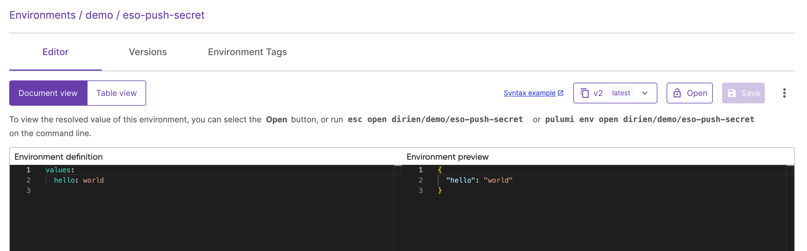
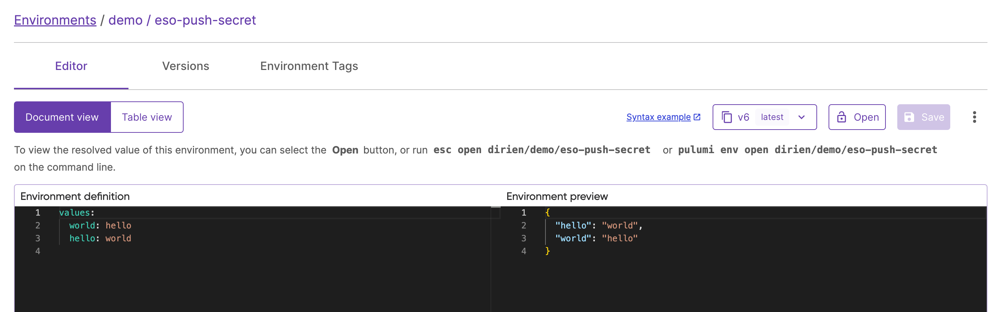

## Deploy External Secrets Operator

### Deploy using Helm

#### Install from Helm Chart Repository

```bash
helm repo add external-secrets https://charts.external-secrets.io
helm repo update

helm upgrade --install external-secrets external-secrets/external-secrets \
    --namespace external-secrets \
    --create-namespace \
    --wait
```

#### Create secret containing Pulumi access token

```bash
kubectl create secret generic pulumi-access-token -from-literal=PULUMI_ACCESS_TOKEN=${PULUMI_ACCESS_TOKEN} \
    --namespace external-secrets
```

#### Create ClusterSecretStore

Now you can create a [ClusterSecretStore](https://external-secrets.io/main/api/clustersecretstore/) resource that will tell External Secrets Operator to use Pulumi ESC as a secret provider.

If you want to limit the access by namespace, you can create a [SecretStore](https://external-secrets.io/main/api/secretstore/) resource instead, which is scoped to a single namespace.

```yaml
cat <<EOF | kubectl apply -f -
apiVersion: external-secrets.io/v1beta1
kind: ClusterSecretStore
metadata:
  name: secret-store
spec:
  provider:
    pulumi:
      organization: ${PULUMI_ORG}
      project: ${ESC_PROJECT}
      environment: ${ESC_ENV}
      accessToken:
        secretRef:
          name: pulumi-access-token
          key: PULUMI_ACCESS_TOKEN
          namespace: external-secrets
EOF
```

Please replace `${PULUMI_ORG}`, `${ESC_PROJECT}`, `${ESC_ENV}` with your Pulumi organization, project, and environment names.

For demo purposes, we assume that we already have an [ESC environment](/docs/esc/get-started/create-environment/) `my-org/my-project/my-env` with a secret `my-secret` that we want to manage using External Secrets Operator.

```yaml
values:
  hello: world
```

#### Create ExternalSecret

Now you can create an [ExternalSecret](https://external-secrets.io/main/api/externalsecret/) resource that will tell External Secrets Operator to fetch the secret from Pulumi ESC. There is also an [ClusterExternalSecret](https://external-secrets.io/main/api/clusterexternalsecret/) resource, which is a cluster scoped resource that can be used to manage ExternalSecret resources in specific namespaces.

```yaml
cat <<EOF | kubectl apply -f -
apiVersion: external-secrets.io/v1beta1
kind: ExternalSecret
metadata:
  name: secret
spec:
  data:
  - secretKey: esc-secret
    remoteRef:
      key: hello
  refreshInterval: 20s
  secretStoreRef:
    kind: ClusterSecretStore
    name: secret-store
EOF
```

There a many other options available for [ExternalSecret](https://external-secrets.io/main/api/externalsecret/) resource to control the creation of the secret like rewriting keys, templating and more. You can find more information in the [External Secrets Operator documentation](https://external-secrets.io/main/guides/introduction/).

#### Verify the secret

With the following command, you can verify that the secret has been created in the cluster:

```bash
kubectl get secret secret -o jsonpath='{.data.esc-secret}'  | base64 -d
# Output:
world
```

#### Cleanup

To remove the External Secrets Operator and the created resources, you can use the following commands:

```bash
kubectl delete externalsecret secret
kubectl delete clustersecretstore secret-store
kubectl delete secret pulumi-access-token -n external-secrets
helm uninstall external-secrets -n external-secrets
```

### Deploy using Pulumi

Of course, you can also deploy the External Secrets Operator using Pulumi. The following examples shows how to deploy the External Secrets Operator on some of the [Pulumi supported languages](/docs/iac/languages-sdks/).

#### Select your Pulumi supported language

Create a new Pulumi program in your preferred language and add the following code to deploy the External Secrets Operator.

```bash
pulumi new <your-preferred-language> --name external-secrets-operator
```

Add the following code to the `index.ts`, `index.py`, or `main.go` file:



{}

```typescript
import * as pulumi from "@pulumi/pulumi";
import * as kubernetes from "@pulumi/kubernetes";

const config = new pulumi.Config();

const externalSecretsNamespace = new kubernetes.core.v1.Namespace("external-secrets-namespace", {
    metadata: {
        name: "external-secrets",
    }
});
const externalSecretsRelease = new kubernetes.helm.v3.Release("external-secrets-release", {
    chart: "external-secrets",
    version: "0.10.4",
    namespace: externalSecretsNamespace.metadata.apply(metadata => metadata.name),
    repositoryOpts: {
        repo: "https://charts.external-secrets.io",
    },
});
const patSecret = new kubernetes.core.v1.Secret("patSecret", {
    metadata: {
        namespace: externalSecretsNamespace.metadata.apply(metadata => metadata.name),
        name: "pulumi-access-token",
    },
    stringData: {
        PULUMI_ACCESS_TOKEN: config.require("pulumi-pat"),
    },
    type: "Opaque",
});

const clusterSecretStore = new kubernetes.apiextensions.CustomResource("cluster-secret-store", {
    apiVersion: "external-secrets.io/v1beta1",
    kind: "ClusterSecretStore",
    metadata: {
        name: "secret-store",
    },
    spec: {
        provider: {
            pulumi: {
                organization: pulumi.getOrganization(),
                project: "dirien",
                environment: "hello-world",
                accessToken: {
                    secretRef: {
                        name: patSecret.metadata.name,
                        key: "PULUMI_ACCESS_TOKEN",
                        namespace: patSecret.metadata.namespace,
                    },
                },
            },
        },
    },
}, { dependsOn: externalSecretsRelease });

const externalSecret = new kubernetes.apiextensions.CustomResource("external-secret", {
    apiVersion: "external-secrets.io/v1beta1",
    kind: "ExternalSecret",
    metadata: {
        name: "secret",
        namespace: "default",
    },
    spec: {
        data: [
            {
                secretKey: "esc-secret",
                remoteRef: {
                    key: "hello",
                }
            }
        ],
        refreshInterval: "20s",
        secretStoreRef: {
            kind: clusterSecretStore.kind,
            name: clusterSecretStore.metadata.name,
        }
    },
}, { dependsOn: externalSecretsRelease });
```

{}

{}

```python
import pulumi
import pulumi_kubernetes as kubernetes

config = pulumi.Config()

external_secrets_namespace = kubernetes.core.v1.Namespace(
    "external-secrets-namespace",
    metadata=kubernetes.meta.v1.ObjectMetaArgs(name="external-secrets"),
)

external_secrets_release = kubernetes.helm.v3.Release(
    "external-secrets-release",
    chart="external-secrets",
    version="0.10.4",
    namespace=external_secrets_namespace.metadata.apply(lambda metadata: metadata.name),
    repository_opts=kubernetes.helm.v3.RepositoryOptsArgs(
        repo="https://charts.external-secrets.io"
    ),
)

pat_secret = kubernetes.core.v1.Secret(
    "patSecret",
    metadata=kubernetes.meta.v1.ObjectMetaArgs(
        namespace=external_secrets_namespace.metadata.apply(
            lambda metadata: metadata.name
        ),
        name="pulumi-access-token",
    ),
    string_data={"PULUMI_ACCESS_TOKEN": config.require("pulumi-pat")},
    type="Opaque",
)

cluster_secret_store = kubernetes.apiextensions.CustomResource(
    "cluster-secret-store",
    api_version="external-secrets.io/v1beta1",
    kind="ClusterSecretStore",
    metadata=kubernetes.meta.v1.ObjectMetaArgs(name="secret-store"),
    spec={
        "provider": {
            "pulumi": {
                "organization": pulumi.get_organization(),
                "project": "dirien",
                "environment": "hello-world",
                "accessToken": {
                    "secretRef": {
                        "name": pat_secret.metadata.name,
                        "key": "PULUMI_ACCESS_TOKEN",
                        "namespace": pat_secret.metadata.namespace,
                    }
                },
            }
        }
    },
    opts=pulumi.ResourceOptions(depends_on=[external_secrets_release]),
)

external_secret = kubernetes.apiextensions.CustomResource(
    "external-secret",
    api_version="external-secrets.io/v1beta1",
    kind="ExternalSecret",
    metadata=kubernetes.meta.v1.ObjectMetaArgs(name="secret", namespace="default"),
    spec={
        "data": [{"secretKey": "esc-secret", "remoteRef": {"key": "hello"}}],
        "refreshInterval": "20s",
        "secretStoreRef": {
            "kind": cluster_secret_store.kind,
            "name": cluster_secret_store.metadata.name,
        },
    },
    opts=pulumi.ResourceOptions(depends_on=[external_secrets_release]),
)
```

{}

{}

```go
package main

import (
	"github.com/pulumi/pulumi-kubernetes/sdk/v4/go/kubernetes"
	"github.com/pulumi/pulumi-kubernetes/sdk/v4/go/kubernetes/apiextensions"
	"github.com/pulumi/pulumi-kubernetes/sdk/v4/go/kubernetes/core/v1"
	"github.com/pulumi/pulumi-kubernetes/sdk/v4/go/kubernetes/helm/v3"
	metav1 "github.com/pulumi/pulumi-kubernetes/sdk/v4/go/kubernetes/meta/v1"
	"github.com/pulumi/pulumi/sdk/v3/go/pulumi"
	"github.com/pulumi/pulumi/sdk/v3/go/pulumi/config"
)

func main() {
	pulumi.Run(func(ctx *pulumi.Context) error {
		conf := config.New(ctx, "")

		externalSecretsNamespace, err := v1.NewNamespace(ctx, "external-secrets-namespace", &v1.NamespaceArgs{
			Metadata: &metav1.ObjectMetaArgs{
				Name: pulumi.String("external-secrets"),
			},
		})
		if err != nil {
			return err
		}

		externalSecretsRelease, err := helm.NewRelease(ctx, "external-secrets-release", &helm.ReleaseArgs{
			Chart:     pulumi.String("external-secrets"),
			Version:   pulumi.String("0.10.4"),
			Namespace: externalSecretsNamespace.Metadata.Name(),
			RepositoryOpts: &helm.RepositoryOptsArgs{
				Repo: pulumi.String("https://charts.external-secrets.io"),
			},
		})
		if err != nil {
			return err
		}

		patSecret, err := v1.NewSecret(ctx, "patSecret", &v1.SecretArgs{
			Metadata: &metav1.ObjectMetaArgs{
				Namespace: externalSecretsNamespace.Metadata.Name(),
				Name:      pulumi.String("pulumi-access-token"),
			},
			StringData: pulumi.StringMap{
				"PULUMI_ACCESS_TOKEN": conf.RequireSecret("pulumi-pat"),
			},
			Type: pulumi.String("Opaque"),
		})
		if err != nil {
			return err
		}

		clusterSecretStore, err := apiextensions.NewCustomResource(ctx, "cluster-secret-store", &apiextensions.CustomResourceArgs{
			ApiVersion: pulumi.String("external-secrets.io/v1beta1"),
			Kind:       pulumi.String("ClusterSecretStore"),
			Metadata: &metav1.ObjectMetaArgs{
				Name: pulumi.String("secret-store"),
			},
			OtherFields: kubernetes.UntypedArgs{
				"spec": pulumi.Map{
					"provider": pulumi.Map{
						"pulumi": pulumi.Map{
							"organization": pulumi.String(ctx.Organization()),
							"project":      pulumi.String("dirien"),
							"environment":  pulumi.String("hello-world"),
							"accessToken": pulumi.Map{
								"secretRef": pulumi.Map{
									"name":      patSecret.Metadata.Name(),
									"key":       pulumi.String("PULUMI_ACCESS_TOKEN"),
									"namespace": patSecret.Metadata.Namespace(),
								},
							},
						},
					},
				}},
		}, pulumi.DependsOn([]pulumi.Resource{externalSecretsRelease}))
		if err != nil {
			return err
		}

		_, err = apiextensions.NewCustomResource(ctx, "external-secret", &apiextensions.CustomResourceArgs{
			ApiVersion: pulumi.String("external-secrets.io/v1beta1"),
			Kind:       pulumi.String("ExternalSecret"),
			Metadata: &metav1.ObjectMetaArgs{
				Name:      pulumi.String("secret"),
				Namespace: pulumi.String("default"),
			},
			OtherFields: kubernetes.UntypedArgs{
				"spec": pulumi.Map{
					"data": pulumi.Array{
						pulumi.Map{
							"secretKey": pulumi.String("esc-secret"),
							"remoteRef": pulumi.Map{
								"key": pulumi.String("hello"),
							},
						},
					},
					"refreshInterval": pulumi.String("20s"),
					"secretStoreRef": pulumi.Map{
						"kind": clusterSecretStore.Kind,
						"name": clusterSecretStore.Metadata.Name(),
					},
				},
			},
		}, pulumi.DependsOn([]pulumi.Resource{externalSecretsRelease}))
		if err != nil {
			return err
		}

		return nil
	})
}
```

{}

You can then deploy the Pulumi program using below command as you would normally do with any Pulumi program:

```bash
pulumi up
```

#### Cleanup

To remove the External Secrets Operator and the created resources, you can use the following commands:

```bash
pulumi destroy
```

## Push Secrets to Pulumi ESC

The Pulumi ESC provider for External Secrets Operator supports also [PushSecrets](https://external-secrets.io/latest/api/pushsecret/). This feature allows you to push secrets from a Kubernetes cluster to Pulumi ESC. This is useful, if you have for example other operators that create secrets in the cluster and you want automatically push them to Pulumi ESC for further management.

Here is an example of a [PushSecret](https://external-secrets.io/latest/api/pushsecret/) resource:

```yaml
apiVersion: external-secrets.io/v1alpha1
kind: PushSecret
metadata:
  name: push-secret-example
spec:
  refreshInterval: 10s
  selector:
    secret:
      name: <NAME_OF_THE_KUBERNETES_SECRET>
  secretStoreRefs:
  - kind: ClusterSecretStore
    name: secret-store
  data:
  - match:
      secretKey: <KEY_IN_KUBERNETES_SECRET>
      remoteRef:
        remoteKey: <PULUMI_PATH_SYNTAX>
```

Let's see `PushSecret` in action:

This is how out demo Pulumi ESC environment looks like before we push the secret:



Only one configuration `hello: world` is present. Now, assume that another process (for example an application, operator, etc.) creates during runtime a Kubernetes secret.

This secret is called `my-secret` and contains the following data:

```yaml
apiVersion: v1
data:
  world: aGVsbG8=
kind: Secret
metadata:
  name: test-cred
  namespace: default
type: Opaque
```

The `world` key contains the value `hello`. We can now create a `PushSecret` resource that will select the secret `test-cred` and push the `world` key to the Pulumi ESC environment.

```yaml
apiVersion: external-secrets.io/v1alpha1
kind: PushSecret
metadata:
  name: pushsecret-example # Customisable
  namespace: default # Same of the SecretStores
spec:
  refreshInterval: 10s
  selector:
    secret:
      name: test-cred
  secretStoreRefs:
  - kind: ClusterSecretStore
    name: secret-store
  data:
  - match:
      secretKey: world
      remoteRef:
        remoteKey: world
```

This `PushSecret` resource will push the `world` key from the `test-cred` secret to the Pulumi ESC environment. After applying this resource, the Pulumi ESC environment will look like this:



This is a great way to manage secrets that are created by other processes in the cluster and ensure that they are stored in a secure and compliant way reducing the risk of [secret sprawl](/blog/how-secrets-sprawl-is-slowing-you-down/).

## Next steps

This tutorial showed you how to deploy the External Secrets Operator and use it to manage secrets stored in Pulumi ESC. This gives you the ability to elevate Pulumi ESC as the single source of truth for your secrets even when you are not using Pulumi to manage your Kubernetes resources.

As we continue to improve the integration between Pulumi ESC and External Secrets Operator, we highly recommend you to check the [External Secrets Operator Pulumi ESC](https://external-secrets.io/latest/provider/pulumi/) for the latest features.

To dive deeper into using Pulumi ESC for advanced scenarios, check out the following resources:

- **Environment Composition**: Learn more about to effectively compose multiple environments to manage configurations across your infrastructure. Explore the [Pulumi documentation on environment imports](/docs/esc/environments/imports/).

- **Managing Secrets**: Learn how to securely manage and adopt dynamic, short-lived secrets on demand using Pulumi ESC, ensuring sensitive information is protected across different environments. Read more in the [Pulumi ESC documentation](/docs/esc/).
