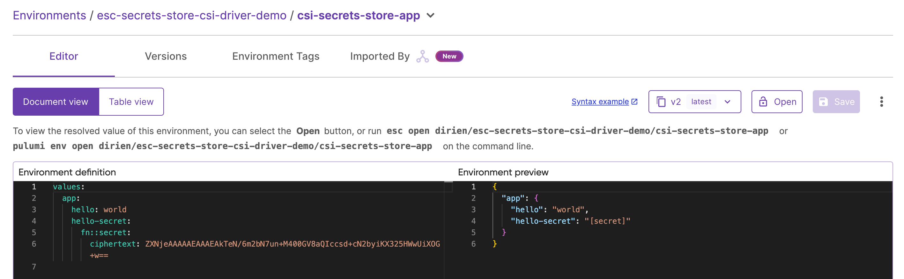
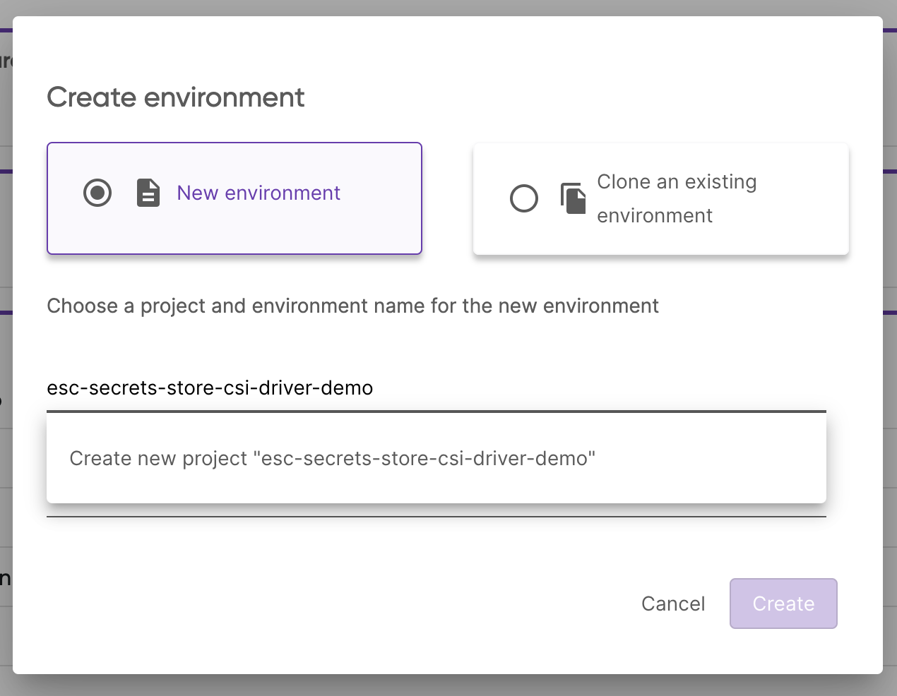
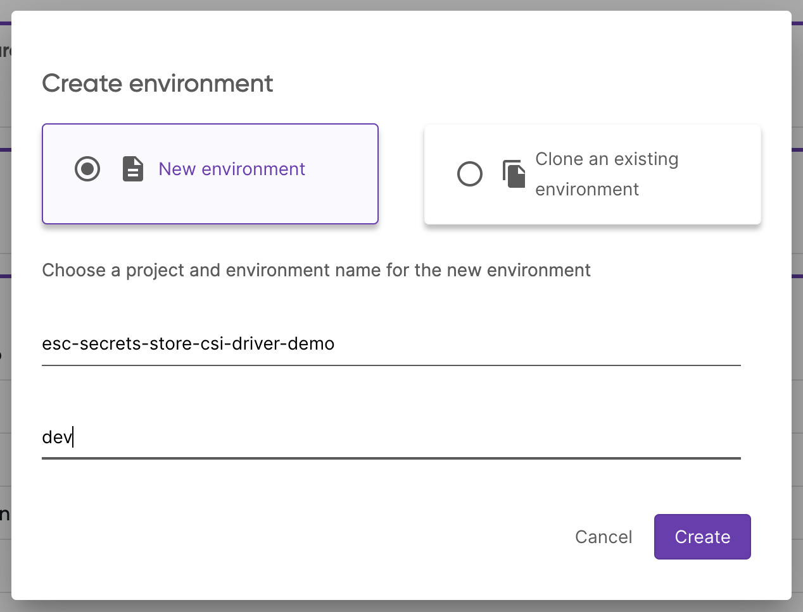

## Deploy Secret Store CSI Driver

### Deploy using Helm

First, you need to deploy the Secret Store CSI Driver before you can install the Pulumi ESC provider.

```bash
helm repo add secrets-store-csi-driver https://kubernetes-sigs.github.io/secrets-store-csi-driver/charts
helm repo update
helm upgrade -i csi-secrets-store secrets-store-csi-driver/secrets-store-csi-driver --namespace kube-system
```

Running the above `helm upgrade -i` command will install the Secret Store CSI Driver on Linux nodes in the `kube-system` namespace.

To validate the installer is running as expected, run the following commands:

```bash
kubectl get pods -n kube-system
```

You should see the `csi-secrets-store` pod running.

```bash
NAME                                               READY   STATUS    RESTARTS   AGE
csi-secrets-store-secrets-store-csi-driver-drv44   3/3     Running   0          54s
```

Additionally, you should see the following CRDs installed:

```bash
kubectl get crds | grep secrets-store
secretproviderclasses.secrets-store.csi.x-k8s.io            2025-01-02T14:03:58Z
secretproviderclasspodstatuses.secrets-store.csi.x-k8s.io   2025-01-02T14:03:58Z
```

Now that the Secret Store CSI Driver is running, you can deploy the Pulumi ESC Provider.

```bash
helm upgrade -i pulumi-esc-csi-provider oci://ghcr.io/pulumi/helm-charts/pulumi-esc-csi-provider --namespace kube-system
```

After a few seconds, the `pulumi-esc-csi-provider` should be running.

```bash
kubectl get pods -n kube-system -l app=pulumi-esc-csi-provider
NAME                            READY   STATUS    RESTARTS   AGE
pulumi-esc-csi-provider-l8w5f   1/1     Running   0          76s
```

Now with everything running, we can start using the Pulumi ESC provider to retrieve our secrets from Pulumi ESC.

#### Create secret containing Pulumi access token

```bash
kubectl create secret generic pulumi-secret-provider-auth-credentials --from-literal=pulumi-access-token=${PULUMI_ACCESS_TOKEN}
```

#### Create your own SecretProviderClass object

To use the Pulumi ESC provider, you need to create a `SecretProviderClass` object. This object tells the Secret Store CSI Driver how to connect to the Pulumi ESC provider.

```yaml
cat <<EOF | kubectl apply -f -
apiVersion: secrets-store.csi.x-k8s.io/v1
kind: SecretProviderClass
metadata:
  name: example-provider-pulumi-esc
  namespace: default
spec:
  provider: pulumi
  parameters:
    apiUrl: https://api.pulumi.com/api/esc
    organization: ${PULUMI_ORG}
    project:  ${ESC_PROJECT}
    environment: ${ESC_ENV}
    authSecretName: pulumi-secret-provider-auth-credentials
    authSecretNamespace: default
    secrets: |
      - secretPath: "/"
        fileName: "hello"
        secretKey: "app.hello"
EOF
```

Please replace `${PULUMI_ORG}`, `${ESC_PROJECT}`, `${ESC_ENV}` with your Pulumi organization, project, and environment names.

In the `secrets` section, you can define the secrets you want to retrieve from Pulumi ESC. `secretPath` is the path in the Pulumi ESC project where the secret is stored, `fileName` is the name of the file that will be created.

Now, we will create a secret in the Pulumi ESC project and synchronize it into the Kubernetes cluster by creating an `SecretProviderClass`:

Create a new [ESC environment](/docs/esc/get-started/create-environment/)  called `csi-secrets-store-app` in the `esc-secrets-store-csi-driver-demo` project:

```bash
values:
  app:
    hello: world
    hello-secret:
      fn::secret: world
```

If you prefer to use the Pulumi CLI, you can create the environment by running:

```bash
pulumi env init <your-org>/esc-secrets-store-csi-driver-demo/csi-secrets-store-app
```

And set the configuration by running the `env edit` command and copy the above YAML into the editor:

```bash
pulumi env edit <your-org>/esc-secrets-store-csi-driver-demo/csi-secrets-store-app
```

Either way, you should see following environment configuration in the Pulumi Cloud Console:



Now we can update our deployment to use the `example-provider-pulumi-esc` provider.

```yaml
apiVersion: apps/v1
kind: Deployment
metadata:
  name: example-provider-pulumi-esc
  namespace: default
  labels:
    app: example-provider-pulumi-esc
spec:
  replicas: 1
  selector:
    matchLabels:
      app: example-provider-pulumi-esc
  template:
    metadata:
      labels:
        app: example-provider-pulumi-esc
    spec:
      containers:
      - name: client
        image: busybox:latest
        command: ["sh", "-c"]
        args:
        - |
          set -eux
          ls /run/secrets
          find /run/secrets/ -mindepth 1 -maxdepth 1 -not -name '.*' | xargs -t -I {} sh -c 'echo "$(cat "{}")"'
          tail -f /dev/null
        volumeMounts:
        - name: data
          mountPath: /run/secrets
      volumes:
      - name: data
        csi:
          driver: secrets-store.csi.k8s.io
          readOnly: true
          volumeAttributes:
            secretProviderClass: "example-provider-pulumi-esc"
```

An important part of the deployment is the `secretProviderClass: "example-provider-pulumi-esc"` attribute in the `volumeAttributes` section. This tells the Secret Store CSI Driver to use the `example-provider-pulumi-esc` provider to retrieve the secrets.

On pod start or restart, the Secret Store CSI Driver will communicate with the Pulumi ESC provider to retrieve the secrets content from Pulumi ESC as defined in the `SecretProviderClass` object.

Then the volume is mounted in the pod as `tmpfs` and the secret contents are written to the mounted volume.

Now you can deploy the deployment and validate that the secrets are mounted in the pod.

```bash
kubectl apply -f deployment.yaml
```

#### Verify the secret is mounted in the pod

```bash
NAME=$(kubectl get pods -o name | grep example-provider-pulumi-esc | cut -d'/' -f2)
kubectl logs $NAME
```

You should see the secret content `world` printed to the console.

```bash
+ ls /run/secrets
hello
+ find /run/secrets/ -mindepth 1 -maxdepth 1 -not -name '.*'
+ xargs -t -I '{}' sh -c 'echo "$(cat "{}")"'
sh -c echo "$(cat "/run/secrets/hello")"
world
+ tail -f /dev/null
```

Or you can exec into the pod and check the content of the mounted secret:

```bash
kubectl exec -it $NAME -- cat /run/secrets/hello
```

You should see the following output:

```bash
world
```

#### Cleanup

To uninstall the `pulumi-esc-csi-provider` deployment:

```bash
kubectl delete secret pulumi-secret-provider-auth-credentials
kubectl delete -f deployment.yaml
helm uninstall pulumi-esc-csi-provider
helm uninstall csi-secrets-store
```

### Deploy using Pulumi

Of course, you can also deploy the CSI driver and Pulumi ESC provider using Pulumi. To do so, you can use the following Pulumi program:

#### Select your Pulumi supported language

Create a new Pulumi program in your preferred language and add the following code to deploy the External Secrets Operator.

```bash
pulumi new <your-preferred-language> --name external-secrets-operator
```

Before we dig into the code, let's head to the Pulumi Cloud Console and create a new Pulumi ESC project with the name `esc-secrets-store-csi-driver-demo`.



And create the environment `dev`:



In the editor add the following yaml into the `Environment definition`:

```yaml
values:
  pulumiConfig:
    pulumi-pat:
      fn::secret: <your-pulumi-pat>
```



{}

```typescript

```

{}

{}

```javascript

```

{}

{}

```python

```

{}

{}

```go


```

{}

{}

```csharp


```

{}

Deploy the stack by running:

```bash
pulumi up
```

You will see that the secret was created in the Kubernetes cluster and the ESO instance was deployed successfully.

```bash
kubectl get secret pulumi-access-token -o jsonpath='{.data.PULUMI_ACCESS_TOKEN}' | base64 -d
```

#### Create a SecretProviderClass



{}

```typescript

```

{}

{}

```javascript

```

{}

{}

```python

```

{}

{}

```go

```

{}

{}

```csharp

```

{}

We can check that the secret was successfully synchronized by running:

```bash
kubectl get secretproviderclasses example-provider-pulumi-esc
```

### Deploy an Application and Mount the Secret

Now, we can deploy an application that references the secret from the Kubernetes cluster. I am going to use `busybox` that reads mounted file in.



{}

```typescript

```

{}

{}

```javascript

```

{}

{}

```python

```

{}

{}

```go

```

{}

{}

```csharp

```

{}

After deploying the stack, you can get the logs of the `busybox` pod to see that the secret was successfully mounted:

```bash
NAME=$(kubectl get pods -o name | grep example-provider-pulumi-esc | cut -d'/' -f2)
kubectl logs $NAME
```

You should see the following output:

```bash
+ ls /run/secrets
hello
+ find /run/secrets/ -mindepth 1 -maxdepth 1 -not -name '.*'
+ xargs -t -I '{}' sh -c 'echo "$(cat "{}")"'
sh -c echo "$(cat "/run/secrets/hello")"
world
+ tail -f /dev/null
```

Or you can exec into the pod and check the content of the mounted secret:

```bash
kubectl exec -it $NAME -- cat /run/secrets/hello
```

You should see the following output:

```bash
world
```

#### Cleanup

To uninstall the `pulumi-esc-csi-provider` deployment:

```bash
pulumi destroy
```

## Next Steps

In this tutorial, you learned how to integrate the Secret Store CSI Driver with Pulumi ESC to securely manage your secrets in Kubernetes. To learn more about Pulumi ESC, check out the [Pulumi ESC documentation](/docs/esc/).

As we continue to improve the Pulumi ESC provider, we would love to hear your feedback. Please reach out to us on [Slack](https://pulumi-community.slack.com/) or [GitHub](https://github.com/pulumi/pulumi-esc-csi-provider) with any questions or suggestions.

To dive deeper into using Pulumi ESC for advanced scenarios, check out the following resources:

- **Pulumi ESC and External Secrets Operator**: Learn how to use the External Secrets Operator to manage secrets in Pulumi ESC and synchronize them with your Kubernetes cluster. Check out the [Pulumi ESC and External Secrets Operator tutorial](/tutorials/esc-external-secret-operator/).
- **Environment Composition**: Learn more about how to effectively compose multiple environments to manage configurations across your infrastructure. Explore the [Pulumi documentation on environment imports](/docs/esc/environments/imports/).
- **Managing Secrets**: Learn how to securely manage and adopt dynamic, short-lived secrets on demand using Pulumi ESC, ensuring sensitive information is protected across different environments. Read more in the [Pulumi ESC documentation](/docs/esc/).
