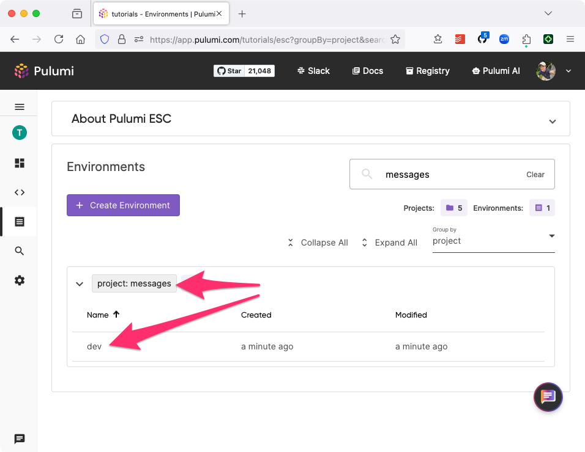
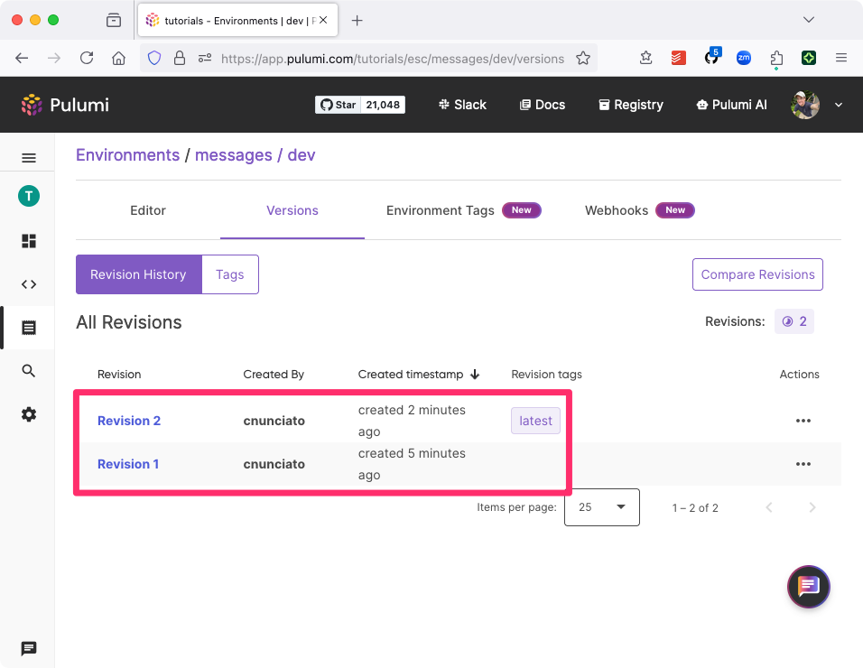

{}
The examples in this tutorial use `esc`, the standalone Pulumi ESC CLI. However, if you've already installed the Pulumi CLI, you can use that as well; all ESC CLI functionality is also built into the Pulumi CLI. Just substitute `pulumi` wherever you see `esc` below.
{}

## Log into Pulumi Cloud

Before you begin, make sure you've [signed into Pulumi Cloud](https://app.pulumi.com/) with an account that has access to a Pulumi organization with an [Enterprise edition](https://pulumi.com/pricing) subscription. Once you've done so, you can log in with the ESC CLI and be prompted to :

```bash
$ esc login

Manage your Pulumi ESC environments by logging in.
Run `esc login --help` for alternative login options.
Enter your access token from https://app.pulumi.com/account/tokens
    or hit <ENTER> to log in using your browser
```

## Obtain a personal access token

To complete the application-configuration portion of the tutorial, you'll also need a Pulumi Cloud [personal access token](/docs/pulumi-cloud/access-management/access-tokens/#personal-access-tokens). Create a short-lived access token for this tutorial, copy it into your current shell, an apply it as an environment variable as follows:

```bash
export PULUMI_ACCESS_TOKEN="${YOUR_TOKEN_VALUE}"
```

## Create a new ESC project and environment

The application you're building is a Node.js web service designed to return a dynamically configurable [message of the day](https://en.wikipedia.org/wiki/Message_of_the_day) (MOTD). In ESC, configuration settings belong to collections called [_environments_](/docs/esc/environments/working-with-environments/), and environments in turn belong to _projects_. Projects and environments may be created either with the Pulumi Cloud console or with the ESC CLI.

To get started, use the ESC CLI to create a new project and environment in the organization of your choice. We'll use the `tutorials` organization in this tutorial as an example. Name the new project `messages` and the environment `dev`:

```bash
$ esc env init tutorials/messages/dev

Environment created: tutorials/messages/dev
```

Once it's created, you'll be able to see the new project in Pulumi Cloud as well by navigating to Pulumi ESC &gt; Environments:



## Create a new configuration setting

Use `esc env set` to create a new setting for the message of the day and add it to the `dev` environment. Name the setting `motd`:

```bash
$ esc env set tutorials/messages/dev motd 'Hello, world!'
```

You're now able to use this setting in any way you like. Try using `esc env get`, for example, in combination with `echo` to fetch the message and print it to the terminal:

```bash
$ echo "$(esc env get tutorials/messages/dev motd --value json)"

"Hello, world!"
```

## Change the setting's value, produce a new version

Every change to a configuration value in an ESC environment produces a new, immutable snapshot of the environment. These snapshots are called [_versions_](/docs/esc/environments/versioning/) and are indexed numerically.

As of now, your `dev` environment has two versions:  version `1`, the empty starting point, and version `2`, which contains a single setting (for `motd`). You can see this in the Pulumi Cloud console by clicking into the `dev` environment and navigating to the Versions tab:



Now let's produce a third version by setting the value of `motd` again:

```bash
$ esc env set tutorials/messages/dev motd 'Good day, world!'

$ echo "$(esc env get tutorials/messages/dev motd --value json)"

"Good day, world!"
```

With `esc env version history`, you can confirm that version `3` now exists:

```bash
$ esc env version history tutorials/messages/dev

revision 3 (tag: latest)
Author: Christian Nunciato <cnunciato>
Date:   2024-09-18 15:23:58.997 -0700 PDT

revision 2
Author: Christian Nunciato <cnunciato>
Date:   2024-09-18 15:06:54.347 -0700 PDT

revision 1
Author: Christian Nunciato <cnunciato>
Date:   2024-09-18 15:04:20.07 -0700 PDT
```

## Version tagging

In the output above, you may also have noticed that version `3` is now [_tagged_](https://www.pulumi.com/docs/esc/environments/versioning/#tagging-versions) with a label of `latest`. Every environment has a built-in `latest` that always points to the most recent version of the environment. You can fetch an environment by tag by adding an `@` symbol with the tag name to the end of the environment name. For example, to pull the `latest` version explicitly:

```bash
$ esc env get tutorials/messages/dev@latest motd --value json

"Good day, world!"
```

In addition to using the built-in `latest` tag, you can also create version tags of your own, as well as change the environment version that a given tag points to. This additional layer of manageability lets you not only pin your configurations to a tag instead of to an explicit version --- to a `production` tag, for example, whose underlying value may change --- but also to apply broad configuration changes easily and instantaneously.

## Using tagging to configure multiple applications

To demonstrate how version tagging works in practice, let's stand up a set of web applications configured to respond with the same, shared message of the day.

First, create a new version tag called `active` and apply it to version `3` of the environment:

```bash
$ esc env version tag tutorials/messages/dev@active @3
```

The `active` tag identifies the message that all applications should deliver.

Verify the currently tagged version with the CLI:

```bash
$ esc env get tutorials/messages/dev@active motd --value json

"Good day, world!"
```

The Versions tab should also reflect this:


Now try setting a new `motd` value, and notice that while the `latest` tag immediately reflects the new value, the `active` tag's value remains unchanged at version `3`:

```bash
$ esc env set tutorials/messages/dev motd 'Lovely to see you, world!'

$ esc env get tutorials/messages/dev@latest motd --value json
"Lovely to see you, world!"

$ esc env get tutorials/messages/dev@active motd --value json
"Good day, world!"
```

Next, initialize new Node.js project and install the [Pulumi ESC SDK for Node.js](/docs/esc/development/languages-sdks/javascript/):

```bash
$ npm init -y
$ npm install @pulumi/esc-sdk
$ touch index.js
```

Copy the following script into `index.js` and save the file, substituting your Pulumi organization for `tutorials`. The script starts five Node.js web servers (to simulate multiple running applications) that handle requests by fetching and returning the `active` greeting:

```javascript
const http = require("http");
const esc = require("@pulumi/esc-sdk");

const startServers = () => {

    // Instantiate the ESC client.
    const client = esc.DefaultClient();

    // Start five web servers on successive ports, beginning with 8080.
    for (let i = 0; i < 5; i++) {
        const port = 8080 + i;

        http.createServer(async (req, res) => {

            // Fetch and return the `active` message of the day.
            const result = await client.openAndReadEnvironmentAtVersion(
                "tutorials", "messages", "dev", "active"
            );

            res.end(result.values.motd);
        }).listen(port);

        console.log(`Listening on http://localhost:${port}`);
    }
}

startServers();
```

Making sure you're in the same shell into which you exported your `PULUMI_ACCESS_TOKEN` earlier, run the script with Node.js, and see that five HTTP servers are now listening on five different local ports:

```bash
$ node index.js

Listening on http://localhost:8080
Listening on http://localhost:8081
Listening on http://localhost:8082
Listening on http://localhost:8083
Listening on http://localhost:8084
```

In a new terminal session, run the following Bash `for` loop, which `curl`s each endpoint and shows that the active MOTD is returned:

```bash
$ for i in {0..4}; do curl "http://localhost:$((8080 + i))"; done

Good day, world!
Good day, world!
Good day, world!
Good day, world!
Good day, world!
```

Finally, update the `active` tag (either with the CLI as below or in the Pulumi Cloud console) to point to the latest version of the environment, then run the loop again to see that all applications have now been reconfigured:

```bash
$ esc env version tag tutorials/messages/dev@active @4

$ for i in {0..4}; do curl "http://localhost:$((8080 + i))"; done

Lovely to see you, world!
Lovely to see you, world!
Lovely to see you, world!
Lovely to see you, world!
Lovely to see you, world!
```

You can stop the server with `Control-C`.

## Wrapping up

In this tutorial, you learned how to use Pulumi ESC's version-tagging features and the ESC SDK for Node.js to apply real-time configuration changes to multiple running applications simultaneously --- without having to touch the source code of any of those applications or redeploy them.

To learn more about working with Pulumi ESC environments --- versions, tagging, dynamic credentials, third-party providers, and more --- [see the ESC documentation](/docs/esc/).
