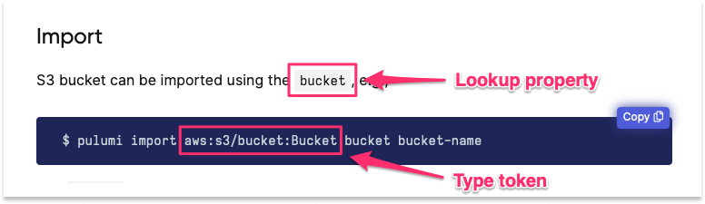
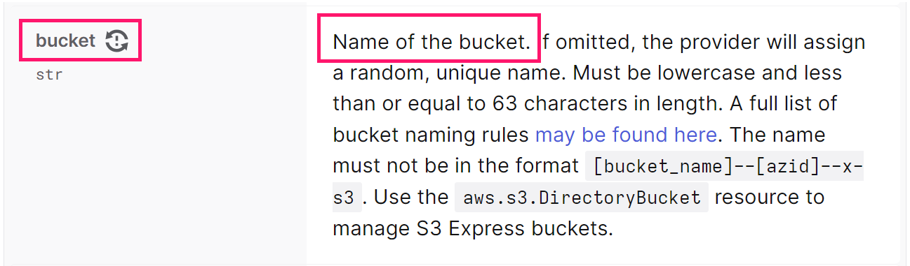
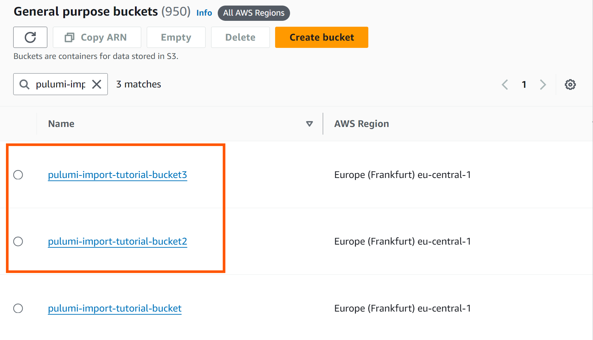

## Create initial resources

To start, login to the [AWS Console](https://console.aws.amazon.com/s3) and [create a new S3 bucket](https://docs.aws.amazon.com/AmazonS3/latest/userguide/creating-bucket.html). You can create the bucket using default settings, making sure to provide a globally unique name for the bucket. For the purposes of this tutorial, we have created an S3 bucket named `pulumi-import-tutorial-bucket`.



Then, login to the [Pulumi CLI](/tutorials/cli-authentication/) and ensure it is [configured to use your AWS account](/docs/iac/get-started/aws/begin/#configure-pulumi-to-access-your-aws-account).

Next, [create a new project and stack](/docs/iac/get-started/aws/create-project/) that will be used to hold the resource definition for your imported resources.

```bash
# Example using Python
$ mkdir pulumi-tutorial-import
$ cd pulumi-tutorial-import
$ pulumi new python
```

This tutorial will define the S3 bucket resource using the AWS Classic provider, so you will also need to make sure to [install the AWS Classic dependency into your project](https://www.pulumi.com/registry/packages/aws/installation-configuration/).

## Importing a resource

In Pulumi, there are three paths to take when importing resources:

- the `pulumi import` CLI command for individual resources
- the `pulumi import` CLI command with a special JSON file for bulk import
- an import option in your Pulumi program code.

### Import using the CLI

The `pulumi import` command looks up the resource using the specified type token and resource identifier, adds the resource to the stack's current state, and emits the code required to manage the resource with Pulumi from that point forward. This option requires the least manual effort, so it is generally recommended and best suited to projects consisting consisting of only one stack.

To import an existing cloud resource with the Pulumi CLI, use the following syntax:

```bash
$ pulumi import <type> <name> <id>
```

- The first argument, `type`, is the Pulumi type token to use for the imported resource. You can find the type token for a given resource by navigating to the Import section of the resource's API documentation in the [Pulumi Registry](/registry/). For example, the type token of an [Amazon S3 Bucket](/registry/packages/aws/api-docs/s3/bucket/#import) resource is `aws:s3/bucket:Bucket`.

- The second argument, `name`, is the [resource name](/docs/concepts/resources/names) to apply to the resource once it's imported.

- The third argument, `id`, corresponds to the value you would use in Pulumi to lookup the resource in the cloud provider. This value should correspond to the designated `lookup property` specified in the **Import** section of the resource's API documentation in the Registry. In the case of an [AWS S3 bucket](/registry/packages/aws/api-docs/s3/bucket/#import), this would be the `bucket` property.

  

  If you scroll to the [`bucket` property](/registry/packages/aws/api-docs/s3/bucket/#bucket_python) section of the API documentation, you will see that this lookup property translates to the name of the bucket.

  

When put all together, the `import` command should look something like the following example, where `imported-s3-bucket` is the resource name that will be applied to the S3 bucket once imported, and `pulumi-import-tutorial-bucket` corresponds to the existing name of the S3 bucket you want to import:

```bash
$ pulumi import aws:s3/bucket:Bucket imported-s3-bucket pulumi-import-tutorial-bucket
```

The output should look something like the following:

```bash
$ pulumi import aws:s3/bucket:Bucket imported-s3-bucket pulumi-import-tutorial-bucket

Previewing import (dev)

     Type                 Name        Plan
 +   pulumi:pulumi:Stack  dev         create
 =   └─ aws:s3:Bucket     my-bucket   import

Resources:
    + 1 to create
    = 1 to import
    2 changes

Do you want to perform this import?
> yes
  no
  details
```

Notice the equals sign (`=`) instead of our usual plus sign (`+`) in the resource table and in the details. This is Pulumi’s way of telling you that it’s adding something to the state without modifying it.

Choose `yes` to complete the import. This will immediately add the resource to the current stack’s state and will emit a block of code to `STDOUT` to be added to your Pulumi program. If the current program were written in Python, for example, the resulting CLI output would resemble the following:

```bash
...
Importing (dev)

     Type                 Name                Status
 +   pulumi:pulumi:Stack  dev                 created
 =   └─ aws:s3:Bucket     imported-s3-bucket  imported (0.65s)

Resources:
    + 1 created
    = 1 imported
    2 changes

Duration: 4s

Please copy the following code into your Pulumi application. Not doing so
will cause Pulumi to report that an update will happen on the next update command.

Please note that the imported resources are marked as protected. To destroy them
you will need to remove the `protect` option and run `pulumi update` *before*
the destroy will take effect.

import pulumi
import pulumi_aws as aws

imported_s3_bucket = aws.s3.Bucket("imported-s3-bucket",
    arn="arn:aws:s3:::pulumi-import-tutorial-bucket",
    bucket="pulumi-import-tutorial-bucket",
    hosted_zone_id="Z21DNDUVLTQW6Q",
    request_payer="BucketOwner",
    server_side_encryption_configuration={
        "rule": {
            "apply_server_side_encryption_by_default": {
                "sse_algorithm": "AES256",
            },
            "bucket_key_enabled": True,
        },
    },
    opts = pulumi.ResourceOptions(protect=True))
```

Next, copy the emitted code snippet and replace the contents of your Pulumi program file with it. Then, save the file and run `pulumi up`. You should see that the update produces no changes:

```bash
$ pulumi up

Previewing update (dev)

     Type                 Name                     Plan
     pulumi:pulumi:Stack  dev

Resources:
    2 unchanged

Do you want to perform this update? yes

Updating (dev)

     Type                 Name                     Status
     pulumi:pulumi:Stack  dev

Resources:
    2 unchanged

Duration: 2s
```

The resource is now under management with Pulumi!



Resources imported with the CLI are marked as __protected__ to guard against accidental deletion. If, for example, you forgot to append the generated code to your program before running another `pulumi up`, Pulumi would first interpret the missing code as an intention to delete the resource. The `protect` property will prevent this from happening, leaving the resource intact. If you ever want to delete this resource, you will have to set the `protect` property to `false` in the code. You can learn more by visiting the [Resource option: protect documentation](/docs/concepts/options/protect/).



### Import in bulk

The `pulumi import` command also enables you to import resources in bulk for scenarios in which you need to bring multiple resources under management with Pulumi. To do so, you will need to create a JSON file that has all of the required information for each resource: a `type`, a desired `name`, and an `id`.

To start, return to the AWS console and create two additional S3 buckets.



Next, return to your program folder and create a new file called `resources.json`. Inside of this file, copy and paste the following JSON object, making sure to replace the values of the `id` parameters with the actual names of your S3 buckets in your environment:

```json
{
    "resources": [
        {
            "type": "aws:s3/bucket:Bucket",
            "name": "second-imported-bucket",
            "id": "pulumi-import-tutorial-bucket2" # REPLACE
        },
        {
            "type": "aws:s3/bucket:Bucket",
            "name": "third-imported-bucket",
            "id": "pulumi-import-tutorial-bucket3" # REPLACE
        }
    ]
}
```

To import these resources, save the file and then run the `pulumi import` command with the `-f` flag, passing in the path to the `resources.json` file:

```bash
$ pulumi import -f ./resources.json

Previewing import (dev)

     Type                 Name                    Plan
     pulumi:pulumi:Stack  dev
 =   ├─ aws:s3:Bucket     second-imported-bucket  import
 =   └─ aws:s3:Bucket     third-imported-bucket   import

Resources:
    = 2 to import
    2 unchanged

Do you want to perform this import? yes
Importing (dev)

     Type                 Name                    Status
     pulumi:pulumi:Stack  dev
 =   ├─ aws:s3:Bucket     third-imported-bucket   imported (0.64s)
 =   └─ aws:s3:Bucket     second-imported-bucket  imported (1s)

Resources:
    = 2 imported
    2 unchanged

Duration: 4s

Please copy the following code into your Pulumi application. Not doing so
will cause Pulumi to report that an update will happen on the next update command.

Please note that the imported resources are marked as protected. To destroy them
you will need to remove the `protect` option and run `pulumi update` *before*
the destroy will take effect.

# Code begins here...
```

Just like when running the command against a single resource, the `pulumi import` command will import the resources into your stack's state file and will generate the code snippets for all of the resources in the JSON file. Once again, copy the generated code for the two new resources into your existing program file, save the file, and run the `pulumi up` command to bring these new resources under the management of Pulumi.



You only need to copy over the resource definitions of the two buckets and not the import statements again.



### Import using code

The third method to import existing cloud resources into a Pulumi project is by defining the resource code yourself and configuring the [`import` resource option](/docs/iac/concepts/options/import/) in the resource's definition. This approach may be better suited for scenarios that require importing multiple resources of the same type across multiple stacks and/or deployment environments as part of an automation workflow.

To demonstrate, you will start by creating a simple IAM role in the AWS Console. For the purposes of this tutorial, you can follow the steps in AWS's [Creating an execution role in the IAM console guide](https://docs.aws.amazon.com/lambda/latest/dg/lambda-intro-execution-role.html#permissions-executionrole-console) to create your IAM role resource. When doing so, select the **AWSLambdaDynamoDBExecutionRole** managed policy on the **Add permissions** page and enter **pulumi-tutorial-iam-role** for the role name.

Once that is complete, you will need to identify the lookup property (e.g. the `id`) of the IAM role resource. To do so, navigate to the **Import** section of the [AWS IAM Role resource page](https://www.pulumi.com/registry/packages/aws/api-docs/iam/role/#import) in the Pulumi documentation. You will notice that the lookup property is the `name`, which corresponds to the name of the IAM role.

Now, navigate to your program code file and update the code with the following resource definition:



As you can see, the name of the IAM role, in this case `pulumi-tutorial-iam-role`, has been provided as the value of the `import` option in the resource definition.

At this point, the definition for the imported resources has only been written, meaning it has not yet been imported into your project's state and is therefore not yet under management by Pulumi. To complete the import process using this method, you will need to save your file and run the `pulumi up` command. You should see output resembling the following example:

```bash
$ pulumi up -y
Previewing update (dev)

     Type                 Name           Plan
     pulumi:pulumi:Stack  dev
 =   └─ aws:iam:Role      imported_role  import

Resources:
    = 1 to import
    4 unchanged

Updating (dev)

     Type                 Name           Status
     pulumi:pulumi:Stack  dev
 =   └─ aws:iam:Role      imported_role  imported (0.93s)

Resources:
    = 1 imported
    4 unchanged

Duration: 8s
```

It is important to note that when defining resources that you want to import using the `import` resource option method, the resource definition must match all properties of the existing resource. If you fail to include all of the existing properties, you will run into an error similar to the following:

```bash {hl_lines=[5]}
Previewing update (dev)

     Type                 Name           Plan       Info
 +   pulumi:pulumi:Stack  dev            create
 =   └─ aws:iam:Role      imported_role  import     [diff: -description]; 1 warning

Diagnostics:
  aws:iam:Role (imported_role):
    warning: inputs to import do not match the existing resource; importing this resource will fail

Resources:
    + 1 to create
    = 1 to import
    2 changes

Updating (dev)

     Type                 Name           Status                       Info
 +   pulumi:pulumi:Stack  dev            **creating failed (5s)**     1 error
 =   └─ aws:iam:Role      imported_role  **importing failed**         1 error

Diagnostics:
  aws:iam:Role (imported_role):
    error: inputs to import do not match the existing resource

  pulumi:pulumi:Stack (dev):
    error: update failed

Resources:
    + 1 created

Duration: 7s
```

The highlighted line in the preview section of the output indicates which property of the existing resource is missing in the resource definition. You can use this to correct your resource definition before re-deploying. Once a resource is successfully imported, make sure to remove the `import` option from your code because Pulumi is now managing the resource.

## Clean-up





With the resources you imported via the CLI command, make sure to set the `protect` property to `false` in the code and run `pulumi up` to make the change before running the `pulumi destroy` command. Otherwise the deletion will fail.



## Next steps

In this tutorial, you imported existing cloud resources via the CLI and updated the program code to include the definition of those imported resources. You also imported existing cloud resources by manually defining the resource definition using the `import` resource option method.

To learn more about creating and managing resources in Pulumi, take a look a the following resources:

- Learn more about importing resources in Pulumi in the [Adopting Pulumi -> Import resources documentation](/docs/iac/adopting-pulumi/import/).
- Learn more about migrating to Pulumi in the [Migrating from other solutions to Pulumi documentation](/docs/iac/adopting-pulumi/migrating-to-pulumi/).
- Learn more about other useful Pulumi CLI commands in the [Pulumi CLI overview documentation](/docs/iac/cli/).
