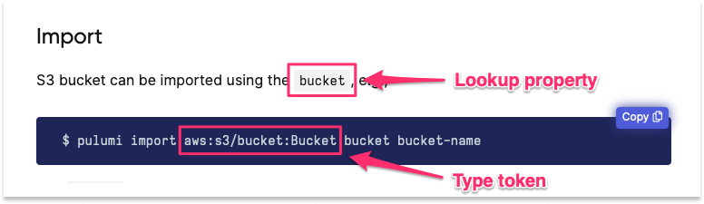
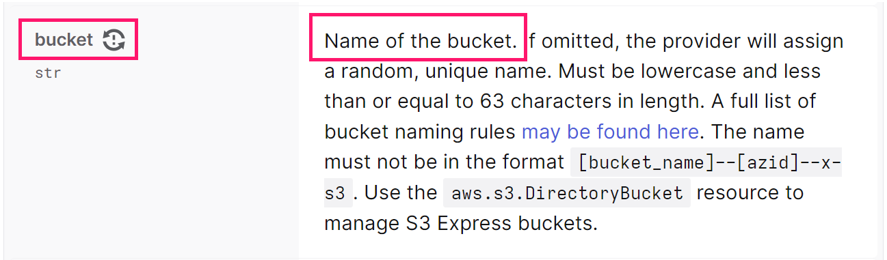

## Create initial resources

To start, login to the [AWS Console](https://console.aws.amazon.com/s3) and [create a new S3 bucket](https://docs.aws.amazon.com/AmazonS3/latest/userguide/creating-bucket.html). You can create the bucket using default settings, making sure to provide a globally unique name for the bucket. For the purposes of this tutorial, we have created an S3 bucket named `pulumi-import-tutorial-bucket`.



Then login to the [Pulumi CLI](/docs/cli/commands/pulumi_login/) and ensure it is [configured to use your AWS account](/docs/clouds/aws/get-started/begin/#configure-pulumi-to-access-your-aws-account). Next, [create a new project](/docs/clouds/aws/get-started/create-project/) and stack for the S3 bucket resource to live in.

```bash
# Example using Python
$ mkdir pulumi-tutorial-import
$ cd pulumi-tutorial-import
$ pulumi new python
```

This tutorial will define the S3 bucket resource using the AWS Classic provider, so you will also need to make sure to [install this dependency into your project](https://www.pulumi.com/registry/packages/aws/installation-configuration/).

## Importing a resource

In Pulumi, there are three paths to take when importing resources. Pulumi allows you to import resources from any currently existing system with either (1) the `pulumi import` CLI command or (2) an import option in the code. Alternately, you can bulk import resources from anywhere with a special JSON file and the `pulumi import` CLI command. The CLI command also offers a resource definition that you can add to your Pulumi program to manage the resource going forward.

### Import using the CLI

The `pulumi import` command looks up the resource using the specified type token and resource identifier, adds the resource to the stack's current state, and emits the code required to manage the resource with Pulumi from that point forward. This option requires the least manual effort, so it is generally recommended, and is best suited to projects consisting consisting of only one stack.

To import an existing cloud resource with the Pulumi CLI, use the following syntax:

```bash
$ pulumi import <type> <name> <id>
```

* The first argument, `type`, is the Pulumi type token to use for the imported resource. You can find the type token for a given resource by navigating to the Import section of the resource's API documentation in the [Pulumi Registry](/registry/). For example, the type token of an [Amazon S3 Bucket](/registry/packages/aws/api-docs/s3/bucket/#import) resource is `aws:s3/bucket:Bucket`.

* The second argument, `name`, is the [resource name](/docs/concepts/resources/names) to apply to the resource once it's imported. The generated code will use this name for the resource declaration (the first parameter in any resource), so like all Pulumi resource names, it must be unique among all resources for this type within the scope of the containing project. (That is, you may have an S3 bucket and a VPC named `foo`, but you cannot have two S3 buckets named `foo`.)

* The third argument, `id`, corresponds to the value you would use in Pulumi to lookup the resource in the cloud provider. This value should correspond to the designated `lookup property` specified in the Import section of the resource's API documentation in the Registry. In the case of an AWS S3 bucket, this would be the `bucket` property.

  

  If you scroll to the [`bucket` property](/registry/packages/aws/api-docs/s3/bucket/#bucket_python) section of the API documentation, you will see that this translates to the name of the bucket.

  

When put all together, the `import` command should look something like the following example, where `imported-s3-bucket` is the resource name that will be applied to the S3 bucket once imported, and `pulumi-import-tutorial-bucket` corresponds to the existing name of the S3 bucket you want to import:

```bash
$ pulumi import aws:s3/bucket:Bucket imported-s3-bucket pulumi-import-tutorial-bucket
```

The output should look something like the following:

```bash
$ pulumi import aws:s3/bucket:Bucket imported-s3-bucket pulumi-import-tutorial-bucket

Previewing import (dev)

     Type                 Name        Plan
 +   pulumi:pulumi:Stack  dev         create
 =   └─ aws:s3:Bucket     my-bucket   import

Resources:
    + 1 to create
    = 1 to import
    2 changes

Do you want to perform this import?
> yes
  no
  details
```

Notice the equals sign (`=`) instead of our usual plus sign (`+`) in the resource table and in the details. This is Pulumi’s way of telling you that it’s adding something to the state without modifying it.

Choose `yes` to complete the import. This will immediately add the resource to the current stack’s state and will emit a block of code to `STDOUT` to be added to your Pulumi program. If the current program were written in Python, for example, the resulting CLI output would resemble the following:

```bash
...
Importing (dev)

     Type                 Name                Status
 +   pulumi:pulumi:Stack  dev                 created
 =   └─ aws:s3:Bucket     imported-s3-bucket  imported (0.65s)

Resources:
    + 1 created
    = 1 imported
    2 changes

Duration: 4s

Please copy the following code into your Pulumi application. Not doing so
will cause Pulumi to report that an update will happen on the next update command.

Please note that the imported resources are marked as protected. To destroy them
you will need to remove the `protect` option and run `pulumi update` *before*
the destroy will take effect.

import pulumi
import pulumi_aws as aws

imported_s3_bucket = aws.s3.Bucket("imported-s3-bucket",
    arn="arn:aws:s3:::pulumi-import-tutorial-bucket",
    bucket="pulumi-import-tutorial-bucket",
    hosted_zone_id="Z21DNDUVLTQW6Q",
    request_payer="BucketOwner",
    server_side_encryption_configuration={
        "rule": {
            "apply_server_side_encryption_by_default": {
                "sse_algorithm": "AES256",
            },
            "bucket_key_enabled": True,
        },
    },
    opts = pulumi.ResourceOptions(protect=True))
```

Next, copy the emitted code snippet and replace the contents of your Pulumi program file with it. Then, save the file and run `pulumi up`. You should see that the update produces no changes:

```bash
$ pulumi up

Previewing update (dev)

     Type                 Name                     Plan
     pulumi:pulumi:Stack  dev

Resources:
    2 unchanged

Do you want to perform this update? yes

Updating (dev)

     Type                 Name                     Status
     pulumi:pulumi:Stack  dev

Resources:
    2 unchanged

Duration: 2s
```

The resource is now under management with Pulumi!



Resources imported with the CLI are marked as __protected__ to guard against accidental deletion. If, for example, you forgot to append the generated code to your program before running another `pulumi up`, Pulumi would first interpret the missing code as an intention to delete the resource. The `protect` property will prevent this from happening, leaving the resource intact. If you ever want to delete this resource, you will have to set the `protect` property to `false` in the code. You can learn more by visiting the [Resource option: protect documentation](/docs/concepts/options/protect/).



### Import in bulk

The `pulumi import` command also enables you to import resources in bulk for scenarios in which you need to bring multiple resources under management with Pulumi. To do so, you will need to create a JSON file that has all of the required information for each resource: a `type`, a desired `name`, and an `id`.

To start, let's create some additional resources.

### Import using code

TBD
