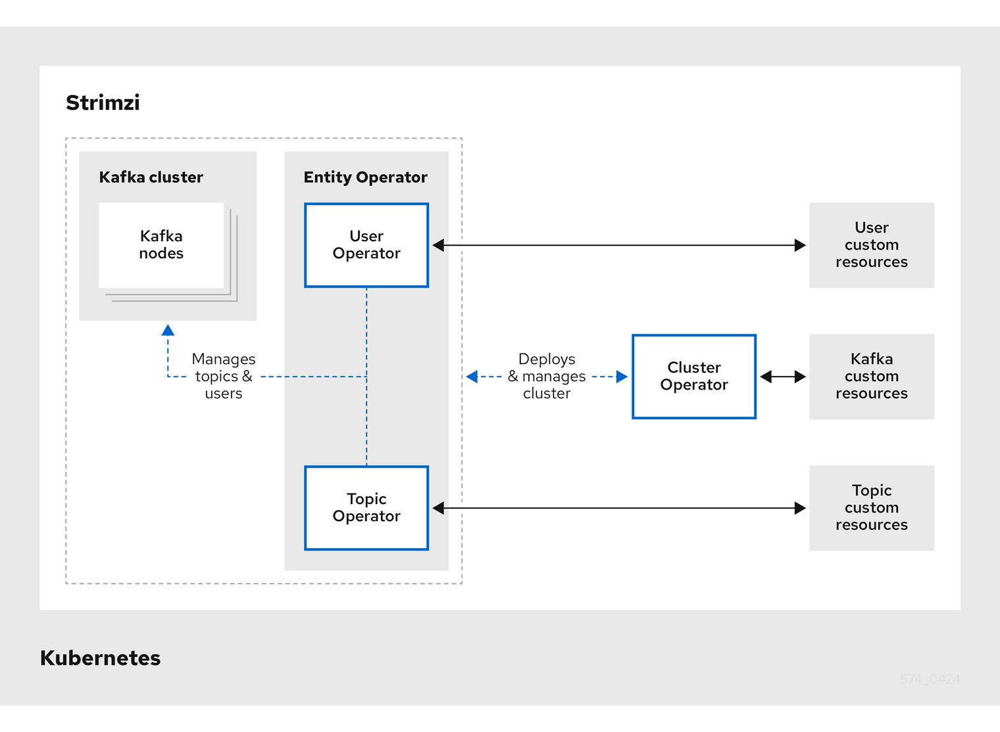
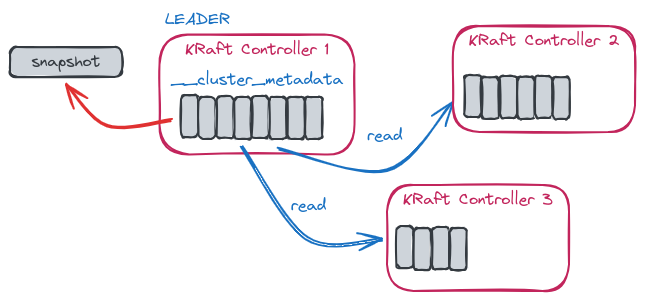

## What is Strimzi?

[Strimzi](https://strimzi.io/) is an open-source project that provides a way to run an Apache Kafka cluster on Kubernetes. It provides operators and custom resources to deploy and manage Kafka clusters on Kubernetes.

It is a CNCF project and is widely used in the Kubernetes community to deploy Kafka clusters as it makes it very easy handle the lifecycle of Kafka clusters. Before Strimzi, deploying Kafka on Kubernetes was a complex task with many manual steps. From creating topics to managing brokers, everything was a manual task.

Strimzi provides the following operators for managing a Kafka cluster running within a Kubernetes cluster.

* **Cluster Operator**: Deploys and manages Apache Kafka clusters, Kafka Connect, Kafka MirrorMaker, Kafka Bridge, Kafka Exporter, Cruise Control, and the Entity Operator

* **Entity Operator**: Comprises the Topic Operator and User Operator
 
* **Topic Operator**: Manages Kafka topics
 
* **User Operator**: Manages Kafka users

The Cluster Operator can deploy the Topic Operator and User Operator as part of an Entity Operator configuration at the same time as a Kafka cluster.



## Deploying the Strimzi Kafka Operator

In this tutorial, we will two different ways to deploy a Kafka cluster on Kubernetes using Strimzi. The first way is to use Helm to deploy the Strimzi Kafka Operator and then create a Kafka cluster using the Strimzi Kafka Custom Resource Definition (CRD). 

The second way is to use Pulumi to deploy the Strimzi Kafka Operator and create a Kafka cluster using the Strimzi Kafka Custom Resource Definition (CRD).

### Deploy using Helm

To deploy Kafka on Kubernetes using Strimzi, we need to install the Strimzi Kafka Operator first.

```bash
helm upgrade -i strimzi-cluster-operator oci://quay.io/strimzi-helm/strimzi-kafka-operator --namespace strimzi --create-namespace --set watchAnyNamespace="true"
```

Now check that the Strimzi Cluster Operator is running:

```bash
kubectl get pods -n strimzi
```

You should see the Strimzi Cluster Operator pod running.

```bash
NAME                                       READY   STATUS    RESTARTS   AGE
strimzi-cluster-operator-b8f99bbc4-68btq   1/1     Running   0          17m
```

#### Deploy your first Kafka cluster

First we deploy our Kafka `NodePool` with ephemeral storage:

```yaml
apiVersion: kafka.strimzi.io/v1beta2
kind: KafkaNodePool
metadata:
  name: my-kafka-node-pool
  labels:
    strimzi.io/cluster: my-cluster
spec:
  replicas: 1
  roles:
  - controller
  - broker
  storage:
    type: ephemeral
```

Then we deploy our `Kafka` Cluster, with `KRaft` enabled:

#### What is KRaft?

In order to overcome the limitations related to the ZooKeeper usage, the Kafka community came up with the idea of using Kafka itself to store metadata and use an event-driven pattern to make updates across the nodes. The work started with KIP-500 in late 2019 with the introduction of a built-in consensus protocol based on Raft. That was named Kafka Raft (**KRaft**)

KRaft is an event-based implementation of the Raft protocol with a quorum controller maintaining an event log and a single-partition topic named __cluster_metadata to store the metadata. Unlike the other topics, this is special because records are written to disk synchronously, which is required by the Raft algorithm for correctness. 

It works in a leader-follower mode, where the leader writes events into the metadata topic which is then replicated to the follower controllers by using the KRaft replication algorithm. The leader of that single-partition topic is actually the controller node of the Kafka cluster. The metadata changes propagation has the benefit of being event-driven via replication instead of using RPCs. The metadata management is part of Kafka with the usage of a new quorum controller service which uses an event-sources storage model. The KRaft protocol is used to ensure that metadata are fully replicated across the quorum.



Here is the Kafka cluster configuration:

```yaml
apiVersion: kafka.strimzi.io/v1beta2
kind: Kafka
metadata:
  name: my-cluster
  annotations:
    strimzi.io/kraft: enabled
    strimzi.io/node-pools: enabled
spec:
  kafka:
    replicas: 1
    version: 3.8.0
    storage:
      type: ephemeral
    metadataVersion: 3.8-IV0
    listeners:
    - name: plain
      port: 9092
      type: internal
      tls: false
    - name: tls
      port: 9093
      type: internal
      tls: true
    config:
      offsets.topic.replication.factor: 1
      transaction.state.log.replication.factor: 1
      transaction.state.log.min.isr: 1
      default.replication.factor: 1
      min.insync.replicas: 1
  entityOperator:
    topicOperator: {}
    userOperator: {}
```

After a few seconds, you should see the Kafka cluster running:

```bash
kubectl get pods -n default
```

You should see the Kafka cluster pods running:

```bash
NAME                                          READY   STATUS    RESTARTS   AGE
my-cluster-entity-operator-6fbb78c774-hk2nn   2/2     Running   0          43s
my-cluster-my-kafka-node-pool-0               1/1     Running   0          67s
```

#### Deploy a Kafka Topic

Now we deploy a Kafka topic:

```yaml
apiVersion: kafka.strimzi.io/v1beta2
kind: KafkaTopic
metadata:
  name: my-topic
  labels:
    strimzi.io/cluster: my-cluster
spec:
  partitions: 5
  replicas: 1
  config:
    retention.ms: 7200000
    segment.bytes: 1073741824
```

#### Deploy a Kafka User (Optional)

We can also deploy a Kafka user:

```yaml
apiVersion: kafka.strimzi.io/v1beta2
kind: KafkaUser
metadata:
  name: tutorial-user
  labels:
    strimzi.io/cluster: my-cluster
spec:
  authentication:
    type: scram-sha-512
  authorization:
    type: simple
    acls:
      - resource:
          type: topic
          name: "my-topic"
          patternType: literal
        operation: Write
        host: "*"
```

To publish your first message to the Kafka topic, jump to the [bottom of this page](#publish-your-first-message-to-the-kafka-topic).

## Deploy using Pulumi

In this section, we will use Pulumi to deploy the Strimzi Kafka Operator and create a Kafka cluster using Pulumi [CustomResource](/registry/packages/kubernetes/api-docs/apiextensions/customresource/)

### Select your Pulumi supported language

Initialize a new Pulumi project in an empty directory. Choose your favorite [Pulumi supported language](/docs/iac/languages-sdks/).

```bash
mkdir pulumi-strimzi
cd pulumi-strimzi
# Choose your favorite Pulumi supported language
pulumi new kubernetes-<your-programming-language>
```

This will create a new Pulumi project with the necessary files to deploy resources on Kubernetes. As we are using pre-built templates, we don’t need to write the boilerplate code to bootstrap the project.

### Install Strimzi

Similar to the Helm installation, we will install the Strimzi Kafka Operator using the [Pulumi Kubernetes provider](/registry/packages/kubernetes/).

Replace the content of created Pulumi program with the following code:



{}

```typescript

```

{}

{}

```python

```

{}

{}

```go


```

{}

{}

```csharp


```

{}

### Create a Kafka Cluster

Once the Strimzi operator is installed, we can create a Kafka cluster by defining a Kafka Custom Resource. Strimzi provides a CRD that we will rely on.

Add this after your Helm chart code:



{}

```typescript

```

{}

{}

```python

```

{}

{}

```go



```

{}

{}

```csharp



```

{}

Background:

* We create a dedicated namespace called `kafka` (optional, but often recommended).
* We define a `Kafka` custom resource that:
* Uses `apiVersion: kafka.strimzi.io/v1beta2`.
* Creates a 3-node Kafka broker
* Sets up both plaintext (plain) and TLS listeners (tls).
* Includes the Entity Operator, which manages users and topics.

### Creating a Kafka Topic

Strimzi provides a `KafkaTopic` CRD to manage Kafka topics. Here are the code snippets to create a Kafka topic:



{}

```typescript

```

{}

{}

```python

```

{}

{}

```go



```

{}

{}

```csharp



```

{}

### Creating a Kafka User (Optional)

Strimzi also provides a `KafkaUser` CRD to manage Kafka users.



{}

```typescript

```

{}

{}

```python

```

{}

{}

```go



```

{}

{}

```csharp



```

{}

### Deploying the whole stack

Now run the `pulumi up` command to preview and deploy the resources you’ve just defined in your project.

```bash
pulumi up
Please choose a stack, or create a new one: <create a new stack>
Please enter your desired stack name.
To create a stack in an organization, use the format <org-name>/<stack-name> (e.g. `acmecorp/dev`): dev 
Please enter your desired stack name.
Created stack 'dev'
Previewing update (dev)

View in Browser (Ctrl+O): https://app.pulumi.com/dirien/strimzi-kafka-go/dev/previews/89f51ac3-21e7-4118-934a-9f8568f3ba4f

     Type                                                  Name                    Plan       
 +   pulumi:pulumi:Stack                                   strimzi-kafka-go-dev    create     
 +   ├─ kubernetes:helm.sh/v3:Release                      strimzi-kafka-operator  create     
 +   ├─ kubernetes:kafka.strimzi.io/v1beta2:KafkaTopic     kafkaTopic              create     
 +   ├─ kubernetes:kafka.strimzi.io/v1beta2:KafkaNodePool  kafkaNodePool           create     
 +   ├─ kubernetes:kafka.strimzi.io/v1beta2:Kafka          kafkaCluster            create     
 +   └─ kubernetes:kafka.strimzi.io/v1beta2:KafkaUser      kafkaUser               create     

Resources:
    + 6 to create

Do you want to perform this update? yes
Updating (dev)

View in Browser (Ctrl+O): https://app.pulumi.com/dirien/strimzi-kafka-go/dev/updates/7

     Type                                                  Name                    Status              
 +   pulumi:pulumi:Stack                                   strimzi-kafka-go-dev    created (41s)       
 +   ├─ kubernetes:helm.sh/v3:Release                      strimzi-kafka-operator  created (34s)       
 +   ├─ kubernetes:kafka.strimzi.io/v1beta2:Kafka          kafkaCluster            created (0.26s)     
 +   ├─ kubernetes:kafka.strimzi.io/v1beta2:KafkaNodePool  kafkaNodePool           created (0.50s)     
 +   ├─ kubernetes:kafka.strimzi.io/v1beta2:KafkaTopic     kafkaTopic              created (0.74s)     
 +   └─ kubernetes:kafka.strimzi.io/v1beta2:KafkaUser      kafkaUser               created (0.99s)     

Resources:
    + 6 created

Duration: 48s
```

What happens now is that Pulumi will:

* Install the Strimzi Kafka Operator via Helm.
* Create a namespace called kafka.
* Create a Kafka cluster.
* Optionally create a Kafka user.

After confirming, Pulumi will provision your Kafka stack. You can then verify the resources with kubectl:

```bash 
kubectl get pods -n strimzi
kubectl get kafka
kubectl get kafkatopic
kubectl get kafkauser
```

## Publish your first message to the Kafka topic

After all the setup, let's create some messages in our Kafka cluster:

```bash
kubectl run kafka-producer -ti --image=quay.io/strimzi/kafka:0.24.0-kafka-2.8.0 --rm=true --restart=Never -- bin/kafka-console-producer.sh --broker-list my-cluster-kafka-bootstrap:9092 --topic my-topic
```

Now you can write some messages to the topic.

```bash
If you don't see a command prompt, try pressing enter.
>Hello World!
>Hello Strimzi!
```

To consume the messages, run the following command:

```bash
kubectl run kafka-consumer -ti --image=quay.io/strimzi/kafka:0.24.0-kafka-2.8.0 --rm=true --restart=Never -- bin/kafka-console-consumer.sh --bootstrap-server my-cluster-kafka-bootstrap:9092 --topic my-topic --from-beginning
```

You should see the messages you just created.

```bash
If you don't see a command prompt, try pressing enter.

Hello Strimzi!
Hello World!
```

## Housekeeping

Before moving on, tear down the resources that are part of your stack to avoid incurring any charges.

1. Run `pulumi destroy` to tear down all resources. You'll be prompted to make sure you really want to delete these resources. A destroy operation may take some time, since Pulumi waits for the resources to finish shutting down before it considers the destroy operation to be complete.
2. To delete the stack itself, run `pulumi stack rm`. Note that this command deletes all deployment history from the Pulumi Service.

## Next steps

In this tutorial, you learned how to install Helm on Kubernetes using the Kubernetes provider from Pulumi and the `Release` resource.

- Learn more about Pulumi and Kubernetes in the [Kubernetes documentation](/docs/iac/clouds/kubernetes/).
- Learn more about the `Release` resource in the [Pulumi Kubernetes API documentation](/registry/packages/kubernetes/api-docs/helm/v3/release/).
- Try the out the `Chart` [tutorial](/tutorials/kubernetes-helm-part-two) to learn how to install Helm charts on Kubernetes using the `Chart` resource.
- Or give the tutorial about [Creating Resources on Kubernetes](/tutorials/creating-resources-kubernetes/) a try.
- Read more about [Why Every Platform Engineer Should Care About Kubernetes Operators](why-every-platform-engineer-should-care-about-kubernetes-operators/)
