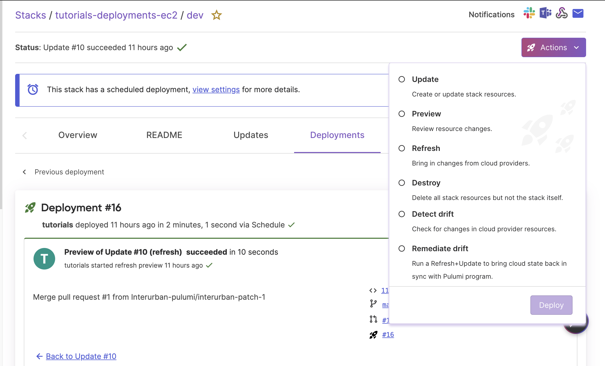

## What is Pulumi Deployments?

[Pulumi Deployments](/docs/pulumi-cloud/deployments/) is a fully managed service designed to automate cloud infrastructure. Pulumi Deployments provides the building blocks designed for scaling your cloud infrastructure, with tools to power public and private cloud platforms, APIs, and self-service infrastructure portals. These options provide flexibility to incorporate Pulumi Deployments into your existing workflows.

Deployments can be triggered through multiple methods: using the [REST API](/docs/pulumi-cloud/deployments/reference/#deployments-rest-api), integrating with GitHub via [push-to-deploy](/docs/pulumi-cloud/deployments/reference/#github-app-installation), or initiating directly from the [Pulumi Cloud console](/docs/pulumi-cloud/deployments/reference/#pulumi-console).

## Set up a new Pulumi Deployment

First sign in to Pulumi Cloud via the [Pulumi sign in page](https://app.pulumi.com).

## Install and configure the GitHub App

Next, the [Pulumi GitHub App](/docs/iac/using-pulumi/continuous-delivery/github-app/) is required to enable Pulumi Deployment's [New Project Wizard](/docs/pulumi-cloud/developer-portals/new-project-wizard/) and push-to-deploy functionality. Follow the GitHub app [installation instructions](/docs/iac/using-pulumi/continuous-delivery/github-app/#installation-and-configuration) to ensure your Pulumi organization is set up to work seamlessly with Pulumi Deployments.

## Create a New Project with the New Project Wizard

To create a new Pulumi project, commit its code, and deploy it entirely from your browser, you will use the [New Project Wizard](/docs/pulumi-cloud/developer-portals/new-project-wizard/). The wizard allows you to start from one of Pulumi’s public templates, your [Organization Templates](/docs/pulumi-cloud/developer-portals/templates), or even generate a custom project using the cloud resources and your preferred language of choice with [Pulumi AI](/ai).

First, navigate to the **New Project** tab in the Pulumi Cloud console. Choose your source template from Pulumi, then you can optionally choose your cloud and language to filter the results or search all templates.

{}
If your Pulumi administrator has configured [custom templates](/docs/pulumi-cloud/developer-portals/templates) for your organization, you will be able to choose from your organization's custom templates from your own image source.
If you select "Use a template" but your organization doesn't have custom templates, you can choose one of Pulumi's public templates to get started.
{}

Type `aws-python` or `aws-typescript`, choose one of the two, and click **Next**.

### Project details

Provide a name for the project, an optional description, and a name for the project's first stack. The project name will be written to the project file (`Pulumi.yaml`) and the stack name will be used to name the stack-configuration file (`Pulumi.<stack>.yaml`).

### Configuration

Provide any values required for the configuration declared in the [template](/docs/pulumi-cloud/developer-portals/templates). In this example, you can set the `aws:region` you would like to deploy into.

These values populate the `config` section in the `Pulumi.<stack>.yaml` file, specifying the necessary settings for your project.

### Environment

If you've configured [environments](/docs/pulumi-cloud/esc) with your organization, you can specify one to use with the resulting stack. Environments enable teams to define and share collections of configuration and secrets across multiple Pulumi projects and stacks, such as your `AWS_SECRET_ACCESS_KEY` which will be needed to configure your deployment settings.

### Repository

Configure the repository and optional subdirectory to use when committing your new project code.

{}
If the Pulumi GitHub app only has access to certain repositories, you can only create new projects with Deployments enabled in those existing repositories. Additionally, the GitHub organization must match the Pulumi organization's GitHub app installation for Deployments to work correctly.

If the GitHub organization you want to write to isn’t the one currently shown, you’ll need to switch to a different Pulumi organization that is linked to the correct GitHub organization. This is because Pulumi organizations and GitHub app installations have a 1:1 relationship, meaning each Pulumi organization is tied to a specific GitHub organization through the app installation.
{}

### Deployment settings

Configure the behavior of Deployments, including when to trigger new Deployments and any environment variables required for the Pulumi program to run. Unless you have configured this project to use an Environment, you will need to add variables for `AWS_ACCESS_KEY_ID' and `AWS_SECRET_ACCESS_KEY`.

{}
Secret environment variables, such as `AWS_SECRET_ACCESS_KEY`, are encrypted end-to-end with Pulumi and can be set on each stack. However, by creating an [environment](/docs/pulumi-cloud/esc) with Pulumi ESC, you can centralize secrets and set up OIDC for secure authentication. This allows you to manage and share sensitive configuration data across multiple stacks efficiently.
{}

A full description of each setting is available on the [deployment settings](/docs/pulumi-cloud/deployments/reference/#deployment-settings) docs page.

### Deployment method

Finally, select Pulumi Deployments as the deployment method and **Create project** to finish the wizard and trigger an initial deployment. You will see the deployment start in the **Deployments** tab.

When your deployment is complete, you can manage and deploy your infrastructure from the Pulumi Cloud console. For example, in the stack's **Actions** tab, you can use the **[Click to Deploy](https://www.pulumi.com/docs/pulumi-cloud/deployments/reference/#click-to-deploy)** button to trigger another deployment.

This feature is useful for day-to-day operational tasks, such as debugging a stuck stack or rectifying drift by performing a refresh. With click to deploy, you can execute these actions without needing to pull the stack and its source code onto your local machine.

### Destroy all stack resources

After you are finished exploring your new stack, you can begin to clean up the resources created. In the **Actions** tab, select the **Destroy** option to remove all resources associated with the stack. Confirm by clicking the **Delete resources?** confirmation box, then click **Deploy**. Pulumi will begin tearing down the resources, and you can track the progress directly in the console.

If you no longer need the stack itself, you can also delete it. In the **Settings** tab, choose **Delete stack** to remove the stack, including all its deployment history and state files from Pulumi Cloud.

## Cleanup

To clean up, delete any additional resources you created:

1. Delete the GitHub repository created.

## Next steps

In this tutorial, you set up a basic click to deploy stack using Pulumi’s new project wizard. You configured your stack to use the GitHub app, deployed resources, and explored the fundamental Pulumi Deployment browser workflow.

To learn more about creating and managing deployments with Pulumi Cloud, take a look at the following resources:

- **Deployment Triggers**: Understand the different methods to trigger a deployment, such as using the REST API, clicking a button in the Pulumi Console, or using GitHub push-to-deploy. Check out the [Pulumi documentation](https://www.pulumi.com/docs/pulumi-cloud/deployments/reference/#deployment-triggers).

- **Deployment permissions**: Configure and manage deployment permissions to control access and ensure security. Detailed information is available in the [Pulumi documentation](https://www.pulumi.com/docs/pulumi-cloud/deployments/reference/#deployment-permissions).
