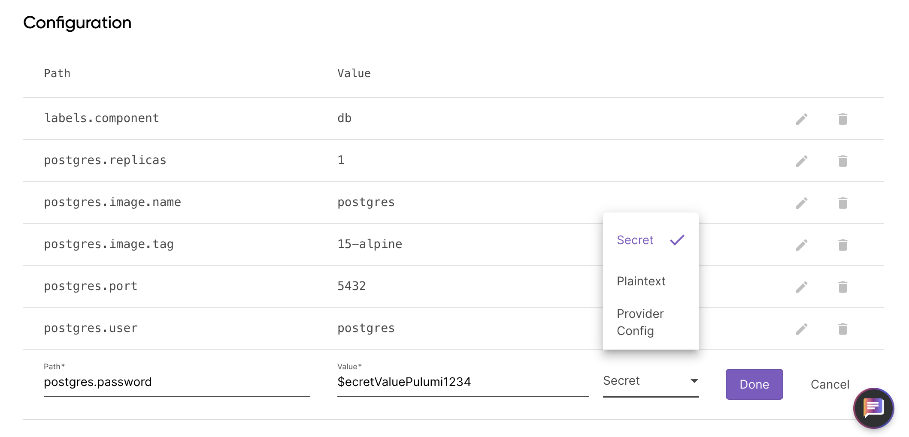
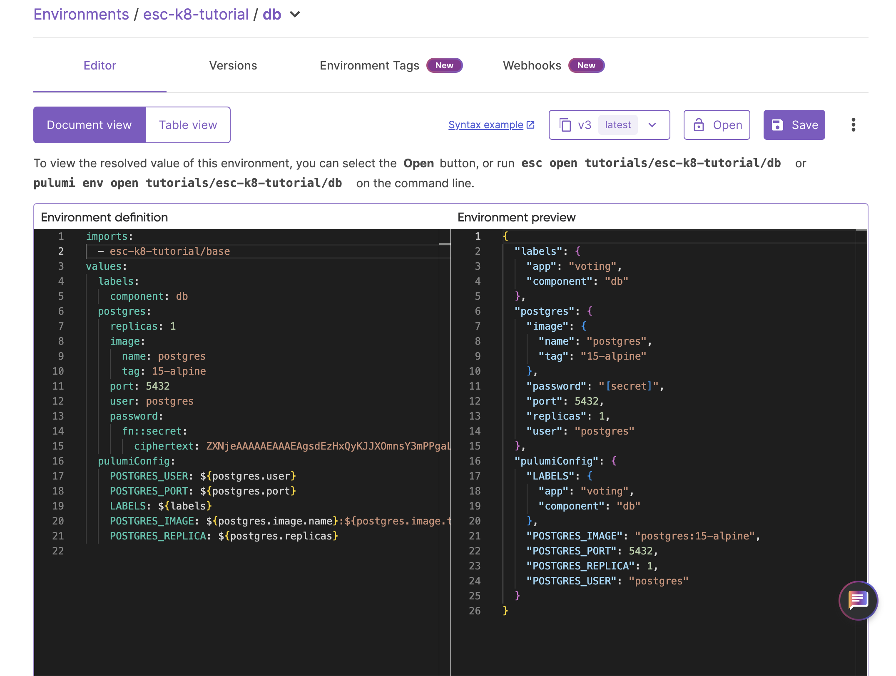
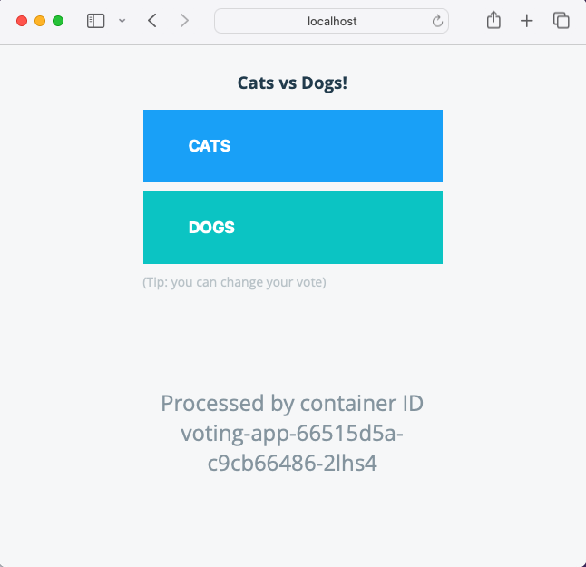

Pulumi ESC helps you manage different environments (like development, staging, and production) while securely handling secrets and configurations. In this tutorial, you’ll create two environments: one for managing the Kubernetes infrastructure and one for application-specific configurations.

## Initialize your Pulumi project

Start by creating a new Pulumi project named `esc-k8-tutorial`. Open your terminal and use the following command to initialize your new Pulumi project:

```bash
pulumi new kubernetes-typescript
```

Follow the prompts, and use `esc-k8-tutorial` as the project name.

## Install the Pulumi ESC CLI

Now, you will install the Pulumi ESC CLI. Use an option below to install based on your operating system.



{}

```bash
$ brew update && brew install pulumi/tap/esc
```

{}

{}

```bash
$ curl -fsSL https://get.pulumi.com/esc/install.sh | sh
```

{}

{}

<div class="mb-6 border-solid border-b-2 border-gray-200">
<div class="w-full">
<h3 class="no-anchor pt-4"><i class="fas fa-download pr-2"></i>Windows Binary Download</h3>
<p>
<a class="btn btn-secondary mx-2" href="https://get.pulumi.com/esc/releases/esc-v-windows-x64.zip">amd64</a>
</p>
</div>
</div>

{}

{}

For more installation options, visit the [ESC installation docs](/docs/esc/download-install/).

## Create your first environment

Next, use the Pulumi ESC CLI to [create the first environment](/docs/esc/environments/working-with-environments/), which will manage the Kubernetes infrastructure. To create an environment named base, run the following command, adding [<org-name>/] with your organization name if applicable:

```bash
esc env init esc-k8-tutorial/base
esc env init esc-k8-tutorial/db
```

These environments will handle Kubernetes cluster configuration and database specific secrets and configuration.

## Add secrets and configuration to the db environment

Now that your base environment is created, you'll securely store the necessary secrets and configurations for the voting app through Pulumi Cloud UI. Follow these steps to add secrets and configuration values using the Pulumi Cloud.



1. Open your browser and log in to [Pulumi Cloud](https://app.pulumi.com/).
2. Select **Environments** from the ESC section of the console.
3. Find and select the `db` environment under the `project: esc-k8-tutorial`.

Using the **Document view**, remove the example environment definition add the following:

```yaml
values:
  labels:
    component: db
  postgres:
    replicas: 1
    image:
      name: postgres
      tag: 15-alpine
    port: 5432
    user: postgres
  pulumiConfig:
    POSTGRES_USER: ${postgres.user}
    POSTGRES_PORT: ${postgres.port}
    LABELS: ${labels}
    POSTGRES_IMAGE: ${postgres.image.name}:${postgres.image.tag}
    POSTGRES_REPLICA: ${postgres.replicas}

```

Click **Save**.

Now, you can add your `postgres.password` as a secret by:

1. Selecting the **Table view** button
2. Click on **+Secret/config**
3. Add `postgres.password` as the **Path**, enter your desired password as the **Value**, then change from **Plaintext**, to **Secret** in the drop-down.



Click **Done** and then click **Save**.

Your password is now stored securely in Pulumi Cloud as a secret.

## Composing and importing environments

Pulumi ESC enables you to compose different environments for modularity and reusability via [importing](/docs/esc/environments/imports/). In this scenario, your `base` environment might define Kubernetes cluster details across multiple environments. For example in a real-world application, environments can be set by a central DevOps team to maintain constancy, security and cost-control.

To import settings from the `base` environment into the `app` environment select the `base` environment and using the **Document view**, remove the example environment definition and copy in the following:

```yaml
values:
  labels:
    app: voting
```

Click **Save**.

Return to your `db` environment and add the following to the top of your environment definition:

```yaml
imports:
  - esc-k8-tutorial/base
```

Click **Save**.

## Verify the environment import

To confirm that the `base` environment has been imported successfully, you can see this reflected in the see an **Environment preview** of your `db` environment:



## Deploying the voting app to Kubernetes

With your Pulumi ESC environments set up and secrets configured, you’re ready to add and deploy the voting app to a Kubernetes cluster using Minikube.

Add the following code to the `index.ts` file located in your Pulumi project directory:

```typescript
import * as k8s from "@pulumi/kubernetes";

// Define the voting app deployment
const appLabels = { app: "voting-app" };

const deployment = new k8s.apps.v1.Deployment("voting-app", {
    spec: {
        selector: { matchLabels: appLabels },
        replicas: 1,
        template: {
            metadata: { labels: appLabels },
            spec: {
                containers: [
                    {
                        name: "voting-app",
                        image: "dockersamples/examplevotingapp_vote:latest",
                        ports: [{ containerPort: 80 }],
                    },
                ],
            },
        },
    },
});

// Define a Kubernetes service to expose the app
const service = new k8s.core.v1.Service("voting-app-service", {
    metadata: {
        labels: appLabels,
    },
    spec: {
        type: "ClusterIP",
        ports: [{ port: 80, targetPort: 80 }],
        selector: appLabels,
    },
});
```

This code defines and deploys a simple TypeScript voting application on a Kubernetes cluster using Pulumi that creates and defines:

1. **Deployment Definition**: The code creates a Kubernetes `Deployment`. It specifies that the app should use the `dockersamples/examplevotingapp_vote:latest` Docker image. The deployment has:
   - One replica (or instance) of the voting app running.
   - The app listens on port 80 inside the container.

2. **Service Definition**: The code also defines a Kubernetes `Service` of type `ClusterIP`. This service exposes the voting app inside the cluster and forwards traffic to the app's container, which listens on port 80.

## Deploy the app with Pulumi

Once the Kubernetes resources are defined, deploy the voting app with Pulumi by running:

```bash
pulumi up
```

Pulumi will ask for confirmation before deploying the voting app to your Kubernetes cluster.

## Access the application

After the app is deployed, access it locally by forwarding the Kubernetes service to a local port:

Run the following command to see all services across namespaces:

```bash
kubectl get svc --all-namespaces
```

Note your voting app name in the output.

```bash
❯ kubectl get svc --all-namespaces
NAMESPACE     NAME                          TYPE        CLUSTER-IP      EXTERNAL-IP   PORT(S)                  AGE
default       db                            ClusterIP   10.97.4.236     <none>        5432/TCP                 18h
default       kubernetes                    ClusterIP   10.96.0.1       <none>        443/TCP                  363d
default       redis                         ClusterIP   10.100.7.66     <none>        6379/TCP                 23h
default       result                        NodePort    10.106.91.25    <none>        5001:31001/TCP           23h
default       vote                          NodePort    10.103.1.134    <none>        5000:31002/TCP           23h
default       voting-app-service-c7f2a549   ClusterIP   10.104.116.64   <none>        80/TCP                   2m15s
kube-system   kube-dns                      ClusterIP   10.96.0.10      <none>        53/UDP,53/TCP,9153/TCP   363d
```

Run `kubectl port-forward svc/voting-app-service-<id> 8080:80` adding your unique `voting-app-service-<id>`.

```bash
kubectl port-forward svc/voting-app-service-c7f2a549 8080:80
```

Open your browser and go to `http://localhost:8080` to view the voting app.



## Cleanup

To remove the resources and clean up your local environment, follow these steps:

1. Destroy the Pulumi stack by running:

    ```bash
    pulumi destroy
    ```

2. If you no longer need the project, remove it from your local machine by deleting the project folder:

    ```bash
    rm -rf esc-k8-tutorial
    ```

This ensures that all resources are properly cleaned up, and your local environment remains organized.

## Next steps

In this tutorial, you secured Kubernetes application secrets using Pulumi Environments, Secrets, and Configuration (ESC). You set up environments, securely stored sensitive data, and deployed a sample voting app to a Kubernetes cluster.

To dive deeper into using Pulumi ESC for advanced scenarios, check out the following resources:

- **Environment Composition**: Learn more about to effectively compose multiple environments to manage configurations across your infrastructure. Explore the [Pulumi documentation on environment imports](/docs/esc/environments/imports/).

- **Managing Secrets**: Learn how to securely manage and adopt dynamic, short-lived secrets on demand using Pulumi ESC, ensuring sensitive information is protected across different environments. Read more in the [Pulumi ESC documentation](/docs/esc/).
