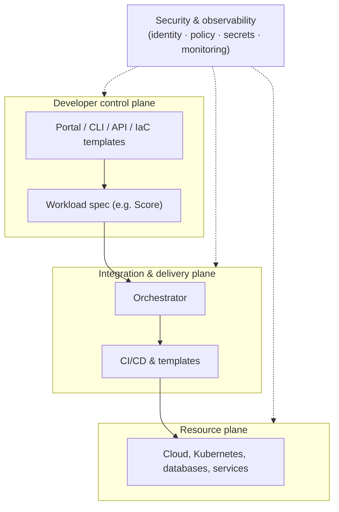

An Internal Developer Platform (IDP) is the self-service layer that sits on top of an organization's infrastructure and tools, letting developers provision environments, deploy applications, and manage resources on their own—without needing to understand every detail of the underlying systems. A platform engineering team builds and maintains the IDP, encoding the organization's standards into "golden paths" so developers can move fast while staying within the guardrails.



## What is an Internal Developer Platform?

An Internal Developer Platform is a curated set of tools, services, and workflows that a [platform engineering](/what-is/what-is-platform-engineering/) team assembles to give application developers a paved road from code to production. Instead of every team wiring up its own approach to servers, networking, secrets, and deployment, developers follow ready-made golden paths that already satisfy the company's security, compliance, and reliability requirements.

The central goal is to reduce **cognitive load**—a term from the [Team Topologies](https://teamtopologies.com/) framework describing the total mental effort a developer must carry to ship software. When infrastructure complexity spills onto every team, that load balloons and delivery slows. An IDP absorbs the complexity behind self-service interfaces so developers can stay focused on building features.

The most effective IDPs are run as an internal product, not a one-time project. The platform team treats developers as customers, ships a minimum viable platform first, and improves it based on real usage and feedback. Organizations can build an IDP entirely in-house, assemble one from open source components, or adopt a flexible foundation like [Pulumi IDP](/product/internal-developer-platforms/); the [right approach](/blog/announcing-pulumi-idp) depends on your team's size, constraints, and existing tooling.

## Internal Developer Platform vs. internal developer portal

The two terms are constantly confused, and the distinction is the single most important thing to get right.

- An **internal developer platform** is the entire self-service system: the interfaces developers use, the automation that fulfills their requests, and the underlying infrastructure it provisions.
- An **internal developer portal** is one part of that system—the user-facing interface. It's the dashboard or "front door" through which developers discover services, trigger golden paths, and view the state of their software. [Backstage](https://backstage.io/), the open source project Spotify created and donated to the CNCF, is the best-known portal.

A useful analogy: the portal is the dashboard; the platform is the engine, transmission, and wheels behind it. A portal with no platform underneath is just a catalog with buttons that don't do anything. This is why "buy a portal and you're done" is a common and costly misconception—the portal is only as useful as the platform it fronts. Not every IDP even needs a portal; some expose golden paths purely through a CLI, an API, a Git workflow, or infrastructure-as-code templates.

## Key components of an Internal Developer Platform

An IDP typically brings together the following capabilities. Few teams need all of them on day one—most start with self-service provisioning and add the rest as the platform matures.

- **Self-service infrastructure provisioning**: Lets developers create and manage the infrastructure they need through simplified interfaces, APIs, or code templates, without filing a ticket.
- **Golden path templates and scaffolding**: Pre-built, opinionated starting points ("create a new microservice," "add a Postgres database") that encode best practices by default.
- **An orchestration layer**: The engine at the heart of the IDP. It sits after continuous integration, matches a developer's request to the right template, resolves configuration for the target environment, and hands off to the deployment system. This glue is what turns a request into running infrastructure.
- **Application configuration management**: Standardized ways to manage app configuration and secrets across environments.
- **Environment management**: Consistent, on-demand development, preview, staging, and production environments.
- **Observability and monitoring**: Integrated logging, metrics, tracing, and alerting so developers can understand how their applications behave.
- **Security and compliance guardrails**: [Policy as code](/what-is/what-is-policy-as-code/) and RBAC that enforce organizational rules automatically, so doing the right thing is the default.
- **Service catalog and documentation**: A central inventory of services, ownership, and knowledge so teams can discover and reuse what already exists.

## Internal Developer Platform architecture

Most reference architectures—including the [CNCF Platform Engineering Maturity Model](https://tag-app-delivery.cncf.io/whitepapers/platform-eng-maturity-model/) and community models—describe an IDP as a set of layers, often called *planes*, each with a clear separation of concerns:

- **Developer control plane**: The interfaces developers actually touch—portal, CLI, API, or IaC templates—plus the workload specifications (like the open source [Score](https://score.dev/) spec) that describe what an application needs.
- **Integration and delivery plane**: The orchestration engine, CI/CD pipelines, image registries, and templating that turn a request into a deployment.
- **Resource plane**: The clouds, Kubernetes clusters, databases, and services where workloads actually run—provisioned and managed with [infrastructure as code](/what-is/what-is-infrastructure-as-code/).
- **Security and observability**: Cross-cutting concerns—identity, policy, secrets, monitoring—that span every other plane rather than sitting in one.

Keeping these planes distinct is what lets a platform team change the underlying infrastructure—swap a cloud service, tighten a policy—without forcing every application team to change how they work.

## How an Internal Developer Platform works: a golden path example

The value of an IDP is clearest in a before-and-after comparison. Say a developer needs to launch a new microservice with a database and a deployment pipeline.

**Without an IDP**, they open a ticket (or a wiki), wait for the platform or ops team, hand-write cloud configuration, wire up CI/CD, request credentials, and hope they matched the last team's conventions. Elapsed time: days to weeks, and every team does it slightly differently.

**With an IDP**, they select the "new service" golden path. Behind the scenes the orchestrator provisions the database and networking with infrastructure as code, applies the organization's security policy, generates a starter repository and pipeline, and injects short-lived credentials—returning a running environment in minutes. Because the golden path is defined as code, it's versioned, reviewed, and identical for every team.

A code-first IDP built on infrastructure as code has a further advantage in the AI era: because golden paths and resources are expressed in real, general-purpose languages rather than a bespoke UI, both developers *and* AI coding agents can read, generate, and extend them. The same walkthrough can run from a developer's prompt to an agent.

## Why are Internal Developer Platforms important?

IDPs have become essential as organizations confront several compounding challenges.

### Growing infrastructure complexity

Cloud-native architectures, microservices, and containerization have multiplied the moving parts developers must reason about. That complexity turns into a bottleneck when teams wait on a central group to provision resources or untangle problems.

### Developer cognitive load and productivity gaps

Every hour a developer spends on infrastructure plumbing, deployment mechanics, and operational context-switching is an hour not spent building the product. High cognitive load slows delivery and erodes flow—the deep-focus state where the best engineering happens.

### Inconsistent development practices

Without a shared platform, teams drift toward different tools and patterns, making knowledge sharing hard and multiplying maintenance and security surface area.

### Scale and speed requirements

As organizations grow, they need to onboard developers quickly and keep them productive without turning everyone into an infrastructure expert.

## Benefits of implementing an Internal Developer Platform

- **Increased developer productivity**: Less time on infrastructure, more on application logic.
- **Faster onboarding**: New engineers become productive by following established golden paths.
- **Standardized, repeatable workflows**: One consistent path to production across teams.
- **Improved reliability**: Best practices baked in reduce production incidents.
- **Better governance**: Centralized, automated policy enforcement for security and compliance.
- **Reduced cognitive load**: Developers no longer need to be experts in every technology in the stack.
- **Improved collaboration**: Shared interfaces align application and platform teams.

## When do you need an Internal Developer Platform?

An IDP is an investment, not a default. The signals that it's time to consider one include:

- Developers routinely wait on a central team to provision infrastructure or environments.
- Every team has reinvented its own deployment and configuration approach.
- Onboarding a new engineer to a service takes weeks.
- Security and compliance are enforced by review and tribal knowledge rather than automation.
- The operations or platform team is a constant bottleneck and on-call is dominated by repetitive requests.
- You're scaling headcount or services faster than your current process can absorb.

If none of these describe you—say, a small team on a single, well-understood stack—a full IDP may be premature. Start with the friction you actually have.

## Platform engineering vs. IDPs

Platform engineering and internal developer platforms are related but distinct:

- **[Platform engineering](/what-is/what-is-platform-engineering/)** is the discipline—the people, practices, and product thinking involved in designing and running developer platforms.
- **An internal developer platform** is the product that discipline produces—the thing developers actually use.

Think of platform engineering as the *how* and the IDP as the *what*. Successful platform engineering teams treat the IDP as a product with real internal customers, gather feedback from developers, security, and operations stakeholders, and prioritize the platform's roadmap accordingly.

## How to build or adopt an IDP: build vs. buy

Organizations reach an IDP along different paths, and most blend more than one.

### Custom-built platforms

Building from scratch offers maximum fit for unique requirements but demands significant, ongoing engineering investment—you are now maintaining a product.

### Open source foundations

Many IDPs assemble open source building blocks—Kubernetes, Backstage, Argo CD, Crossplane, and infrastructure-as-code tools—into a coherent whole. Flexible and avoids lock-in, but integration is your responsibility.

### Commercial solutions

Commercial platforms provide much of the plumbing out of the box, trading some flexibility for faster time to value and vendor support.

### Hybrid approaches

The most common outcome: a mix of commercial products, open source components, and custom glue tailored to the organization.

When evaluating an approach, weigh developer experience, extensibility, integration with tools your teams already use, total cost of ownership (including maintenance), and how well it fits an increasingly AI-assisted workflow.

## The Internal Developer Platform tooling landscape

No single product is "the IDP"—an IDP is assembled from layers. The ecosystem is broad and vendor-neutral by nature; these are representative examples, not endorsements.

| Layer | What it does | Representative tools |
|---|---|---|
| Developer portal | The user-facing catalog and interface | Backstage, Port, Cortex |
| Orchestration & workflows | Matches requests to templates, coordinates delivery | Humanitec, Kratix, Argo Workflows |
| Infrastructure provisioning (IaC) | Provisions and manages cloud resources as code | Pulumi, Terraform/OpenTofu, Crossplane |
| CI/CD & GitOps | Builds and deploys applications | GitHub Actions, GitLab CI, Argo CD, Flux |
| Observability | Logging, metrics, tracing, alerting | Prometheus, Grafana, OpenTelemetry |
| Policy & security | Guardrails and compliance as code | Pulumi Policies, OPA, Kyverno |

Pulumi typically serves as the provisioning and orchestration layer—defining golden paths and infrastructure in general-purpose languages—while integrating with whatever portal, CI/CD, and observability tooling a team already uses.

## Internal Developer Platforms and AI agents

AI coding agents are becoming active participants in software delivery, and IDPs are where that plays out for infrastructure. A well-designed platform gives agents the same golden paths, guardrails, and service catalog that developers use—so an agent can propose and provision infrastructure within policy rather than inventing one-off configurations.

Code-first platforms have an edge here: agents reason far better about real programming languages than about bespoke DSLs or click-through UIs. Standards like the [Model Context Protocol (MCP)](/docs/ai/mcp-server/) and [Agent Skills](/docs/ai/skills/) let agents such as Claude Code, Cursor, and others discover and safely operate a platform's capabilities. The goal isn't to replace the platform team—it's to let both humans and agents travel the same paved roads.

## Common pitfalls to avoid

Several patterns repeatedly derail IDP efforts:

### Building a portal before a platform

A shiny catalog with no working automation underneath frustrates developers fast. Deliver a real golden path before polishing the interface.

### Treating the IDP as a one-time project

An IDP is a product. Without ongoing ownership, feedback loops, and iteration, it stagnates and developers route around it.

### Boiling the ocean

Trying to onboard every application and capability at once stalls. Start with the teams drowning in infrastructure friction and expand from proven wins.

### Over-standardizing

Too rigid, and developers build shadow workarounds; too loose, and you lose the benefits. Golden paths should be the easy default, not the only road.

An IDP also does not eliminate the need for infrastructure specialists—it changes their focus from repetitive manual work to building and improving the platform itself.

## Frequently asked questions

### What is the difference between an internal developer platform and an internal developer portal?

The platform is the entire self-service system—interfaces, orchestration, and the infrastructure it provisions. The portal is just the user-facing interface layer, like Backstage. The portal is the dashboard; the platform is the engine behind it. A portal without a platform underneath has nothing to actually execute.

### Is Backstage an internal developer platform?

Not on its own. Backstage is an internal developer *portal* framework—it provides the catalog and interface. It becomes part of an IDP only when connected to the orchestration, provisioning, and CI/CD systems that fulfill the requests developers make through it.

### What is the difference between an IDP and platform engineering?

Platform engineering is the discipline of building and running developer platforms; the IDP is the product that discipline creates. Platform engineering is the practice; the IDP is the result.

### What is the difference between an IDP and DevOps?

DevOps is a culture and set of practices for collaboration between development and operations. An IDP is a concrete product that operationalizes those practices at scale through self-service, letting every team follow DevOps principles without each one building the tooling from scratch.

### What are golden paths?

Golden paths (also called paved paths or paved roads) are pre-built, opinionated, well-supported workflows for common tasks—like creating a service or provisioning a database—that already follow the organization's standards. They make the right way the easy way, popularized by Spotify's engineering culture.

### Do I need to build an IDP or can I buy one?

Both are valid. Building offers maximum fit at high ongoing cost; buying or adopting a commercial or open source foundation gets you there faster with less maintenance. Most organizations blend commercial products, open source components, and custom integration.

### Does an IDP replace Kubernetes, Terraform, or my existing tools?

No. An IDP integrates and orchestrates the tools you already use rather than replacing them. It provides a self-service layer on top of Kubernetes, your infrastructure-as-code tooling, CI/CD, and observability—hiding their complexity from developers without removing them.

### How do AI coding agents fit with an IDP?

An IDP gives agents the same golden paths and guardrails developers use, so agents can provision infrastructure within policy. Code-first platforms and standards like MCP and Agent Skills make it possible for agents to discover and operate platform capabilities safely.

## Conclusion

An IDP is not a product you buy or a portal you stand up once. It's the encoding of your organization's golden paths into self-service workflows, which means the platform is only as good as the standards and feedback loops behind it. That's why the IDPs that work start narrow, on the teams drowning in infrastructure friction, and earn the right to expand. Treat it as a product with real users rather than a one-time migration, and it keeps paying back as your infrastructure—and the mix of humans and agents building on it—grows more complex.

[Get started with Pulumi](/docs/get-started) when you're ready to build one.
