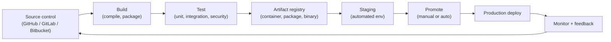

**Continuous integration and continuous delivery (CI/CD) is the practice of automating the path from a developer's code change to a production-ready release.** Continuous integration (CI) merges code into a shared mainline many times a day, with every merge gated by automated builds and tests. Continuous delivery (CD) takes every CI-passing artifact and prepares it for release, so the codebase is always in a deployable state.

CI/CD is the engineering substrate of modern [DevOps](/what-is/what-is-devops/). It replaces the long, manual release cycles that once produced quarterly "big bang" deployments with a continuous flow of small, tested, reversible changes. With CI/CD in place, teams ship more often, recover faster, and treat every commit as a candidate for production.

In this article, we'll cover the key questions about CI/CD:

* Why does CI/CD matter?
* What is continuous integration (CI)?
* What is continuous delivery (CD)?
* What is continuous deployment, and how is it different from continuous delivery?
* What does a CI/CD pipeline look like?
* What are the key stages of a CI/CD pipeline?
* What are the most popular CI/CD tools?
* What are CI/CD best practices?
* How does infrastructure as code fit into CI/CD?
* Frequently asked questions about CI/CD

## Why does CI/CD matter?

For most engineering teams, CI/CD is now a baseline requirement rather than an aspirational practice. Three forces drive that shift.

### Releases moved from quarterly to continuous

DORA's "State of DevOps" research has consistently found elite-performing engineering teams deploying on demand (often multiple times a day) while the lowest-performing teams release between once a month and once every six months. The gap is large enough to be a competitive moat: faster teams learn from production faster and respond to customers faster.

### Small, frequent changes are easier to recover from

Big-bang releases concentrate risk. Hundreds of changes ship at once, and when something breaks, root-causing the failure is a forensic exercise. CI/CD breaks that monolithic deploy into a stream of small, isolated changes that are easier to test, easier to revert, and easier to attribute when they go wrong.

### Engineering throughput depends on it

Manual integration and release work doesn't scale. A team of five engineers can hand-coordinate a release; a team of fifty cannot, and they certainly can't do it weekly. CI/CD is what lets growing engineering organizations keep their per-developer throughput from collapsing.

## What is continuous integration (CI)?

**Continuous integration** is the practice of merging code changes into a shared mainline branch frequently — typically multiple times a day per developer — with every merge gated by an automated build and test suite. The goal is to catch integration issues immediately, when they are still small and cheap to fix, rather than discovering them weeks later during a "merge week."

A typical CI pipeline:

1. A developer commits to a feature branch and opens a pull request.
1. The CI system checks out the code, restores dependencies, and builds an artifact.
1. Unit tests, integration tests, linters, and security scans run against the build.
1. Results are reported back to the pull request; the merge is gated by a green pipeline.

CI is the technical practice that makes trunk-based development viable: many small commits, frequent merges, and a mainline that is always (or almost always) green.

## What is continuous delivery (CD)?

**Continuous delivery** extends CI: every commit that passes the CI pipeline is automatically prepared for release. The build is packaged, dependencies are vendored, artifacts are signed, and the release candidate is staged in a way that a human (or an automated gate) can promote to production at any moment.

The defining property of continuous delivery is that the answer to "can we ship right now?" is always yes. Releases happen on the team's schedule rather than on a build engineer's queue, and the decision to deploy is decoupled from the work of producing a deployable artifact.

## What is continuous deployment, and how is it different from continuous delivery?

The two terms sound interchangeable, but they're not. **Continuous deployment** is continuous delivery taken one step further: every change that passes the automated pipeline is *also automatically deployed to production*, with no human in the loop.

| Practice | What's automated | Who decides to ship |
|---|---|---|
| Continuous integration | Build, test on every commit | Humans manually deploy |
| Continuous delivery | Build, test, package, stage a release candidate | Humans approve and trigger production deploy |
| Continuous deployment | All of the above, plus production deploy itself | Pipeline ships every green change automatically |

Continuous deployment requires very high confidence in tests, monitoring, and automated rollback. Many teams stay at continuous delivery for compliance or product reasons (feature timing, regulated industries, change-management windows) while still getting most of the value.

## What does a CI/CD pipeline look like?

A CI/CD pipeline is the automated workflow that takes a commit from source control to a deployable (and optionally deployed) artifact. Conceptually:

In practice each stage often has multiple jobs running in parallel — different test suites, different security scanners, different target environments — but the linear flow above captures the shape that most pipelines share.

## What are the key stages of a CI/CD pipeline?

A production-grade pipeline typically includes the following stages:

1. **Source.** A commit or pull request to a Git repository (GitHub, GitLab, Bitbucket) triggers the pipeline through a webhook.
1. **Build.** The CI system checks out the code, restores dependencies, compiles, and produces immutable artifacts (a container image, a JAR, a Wheel, a binary).
1. **Test.** Unit tests, integration tests, contract tests, and security scans run in parallel. Results gate the pipeline. This is where [infrastructure tests](/docs/iac/guides/testing/) and [policy as code](/docs/insights/policy/) belong.
1. **Package and sign.** Artifacts are tagged, signed (Cosign, Sigstore), and pushed to a registry along with provenance metadata.
1. **Deploy to staging.** The pipeline applies the change to a staging environment that mirrors production, often using [infrastructure as code](/what-is/what-is-infrastructure-as-code/) to keep the two environments in sync.
1. **Smoke and acceptance tests.** Lightweight tests confirm the staged release is healthy before it's eligible for promotion.
1. **Promote to production.** Either manually approved or automated, often using progressive techniques like canary or blue/green deploys.
1. **Monitor.** Metrics, logs, and traces feed back into the next iteration. Failed deploys trigger automated rollback.

## What are the most popular CI/CD tools?

The CI/CD landscape is large. Most teams pick one tool from each of a few categories.

| Category | Representative tools |
|---|---|
| Source control | GitHub, GitLab, Bitbucket |
| CI/CD platforms | GitHub Actions, GitLab CI/CD, CircleCI, Jenkins, Buildkite, Azure DevOps, Travis CI |
| Container registries | Docker Hub, GitHub Container Registry, Amazon ECR, Google Artifact Registry, Azure Container Registry |
| Continuous delivery / GitOps | Argo CD, Flux CD, Spinnaker, Harness |
| Infrastructure as code | [Pulumi](/), Terraform, OpenTofu, AWS CloudFormation |
| Policy as code | [Pulumi Policies](/docs/insights/policy/), Open Policy Agent (OPA), HashiCorp Sentinel |
| Secrets and configuration | [Pulumi ESC](/product/esc/), HashiCorp Vault, AWS Secrets Manager, Azure Key Vault |
| Security scanning | Snyk, Dependabot, Trivy, GitHub Advanced Security, Aqua |
| Feature flags | LaunchDarkly, Split.io, Unleash, Flagsmith |
| Observability | Datadog, New Relic, Honeycomb, Grafana, Prometheus, OpenTelemetry |
| Incident management | PagerDuty, Opsgenie, FireHydrant, Rootly |

The choice of tools matters less than how cleanly they integrate. A pipeline that hops between five tools with manual copy-paste between them is no better than a manually-run release. The goal is one continuous flow from commit to production with policy and observability layered in at every stage.

## What are CI/CD best practices?

A practical baseline that holds up across team sizes and stacks:

* **Use a single source of truth.** Application code, infrastructure code, pipeline definitions, and policies all live in the same Git repository (or a small set of them) with the same review process.
* **Adopt trunk-based development.** Merge to a single mainline branch many times a day. Long-lived feature branches are where integration debt accumulates.
* **Build once, promote everywhere.** Produce a single artifact and promote the *same* artifact across staging and production. Re-building per environment introduces drift.
* **Automate testing at every level.** Unit, integration, contract, and security tests in CI. Smoke and acceptance tests against staging. Synthetic monitoring in production.
* **Treat infrastructure as code.** Define dev, staging, and production with [infrastructure as code](/what-is/what-is-infrastructure-as-code/) so environments stay aligned and rollbacks are deterministic.
* **Enforce policy as code in the pipeline.** Block insecure or non-compliant changes with [Pulumi Policies](/docs/insights/policy/) or Open Policy Agent before they reach production.
* **Keep secrets out of code and logs.** Pull secrets at runtime from a centralized store like [Pulumi ESC](/product/esc/), HashiCorp Vault, or a cloud-native secrets manager.
* **Deploy small and often.** Smaller changes are easier to test, easier to review, and easier to revert. Frequent practice keeps the muscle strong.
* **Make rollback the default response.** A failed deploy should trigger automated rollback long before the on-call engineer is paged.
* **Measure the four DORA metrics.** Deployment frequency, lead time for changes, change-failure rate, and mean time to recover. Use them to prove the pipeline is actually helping.

## How does infrastructure as code fit into CI/CD?

[Infrastructure as code](/what-is/what-is-infrastructure-as-code/) is what makes a CI/CD pipeline cover the whole stack instead of just the application. The same pull-request, preview, test, and promote loop that ships your application now also ships the network, the cluster, the IAM roles, and the managed databases the application depends on.

With Pulumi:

* **Every infrastructure change is a pull request.** Reviewers see a `pulumi preview` diff before anything lands.
* **CI runs policy as code on every change.** [Pulumi Policies](/docs/insights/policy/) block public buckets, overly broad IAM, and missing encryption before merge.
* **Secrets stay out of pipelines.** [Pulumi ESC](/product/esc/) pulls dynamic, short-lived credentials at runtime instead of pasting long-lived keys into CI variables.
* **[Pulumi Deployments](/docs/pulumi-cloud/deployments/)** runs `pulumi up` on managed runners triggered by Git events, schedules, or REST calls — a turnkey CD option for teams that don't want to maintain their own runners.
* **Reusable components carry secure defaults.** Platform teams ship [Pulumi components](/docs/iac/concepts/components/) that bake in encryption, logging, and IAM, so product teams consume secure infrastructure by default.

For details on wiring Pulumi into specific CI systems, see the [CI/CD integration guide](/docs/iac/packages-and-automation/continuous-delivery/).

## Frequently asked questions about CI/CD

### What is the difference between CI, CD, and continuous deployment?

CI (continuous integration) automates build and test on every commit. CD (continuous delivery) extends that by automatically packaging and staging a release candidate, leaving the production deploy as a one-click step. Continuous deployment goes one step further and ships every green change to production automatically.

### Do I need both CI and CD?

Almost always, yes. CI without CD produces well-tested code that still has to be released by hand, which is where most release pain lives. CD without CI is unsafe — you'd be auto-releasing untested code. The two are designed to compose.

### Is CI/CD only for application code?

No. The most leveraged CI/CD pipelines cover application code, infrastructure code, configuration, and policy together. [Infrastructure as code](/what-is/what-is-infrastructure-as-code/) is what makes that possible: the same pipeline that ships a microservice can also ship a new Kubernetes cluster, a managed database, or an IAM role change.

### How do CI/CD and GitOps relate?

GitOps is a deployment pattern in which a controller continuously reconciles a live environment with a declared state stored in Git. CI/CD is the broader pipeline that produces, tests, and promotes those declarations. GitOps tools (Argo CD, Flux) are typically the *CD* half of a CI/CD pipeline whose CI half runs in GitHub Actions, GitLab CI, or another platform.

### What's the difference between CI/CD and DevOps?

[DevOps](/what-is/what-is-devops/) is a broader culture and set of practices for delivering software with shared ownership across Dev, Ops, and Security. CI/CD is the technical backbone that makes DevOps work in practice. A team can have CI/CD without all of DevOps, but DevOps without CI/CD is mostly aspirational.

### How does CI/CD work with Kubernetes?

Most Kubernetes teams use a CI system (GitHub Actions, GitLab CI, etc.) to build and test container images, push them to a registry, and update either Helm charts, Kustomize overlays, or Pulumi programs that describe the cluster state. A GitOps controller like Argo CD or Flux then reconciles the cluster with the declared state. Pulumi can drive the same workflow without GitOps if you'd rather have the engine push changes directly.

### Are CI/CD pipelines secure by default?

No. A pipeline with broad cloud credentials, weak secret handling, or no policy checks is a serious attack vector. Best practices include least-privilege deployment credentials (ideally short-lived OIDC tokens), centralized secret management, signed and provenance-tracked artifacts, and policy as code that runs against every change.

### What metrics should I track for CI/CD?

The DORA four: **deployment frequency**, **lead time for changes**, **change-failure rate**, and **mean time to recover**. Together they capture both speed and stability. Many teams also track pipeline duration, queue time, and flaky-test rate, since slow or noisy pipelines erode all the other metrics.

### How long should a CI/CD pipeline take?

Most high-performing teams target under 10 minutes from commit to a deployable artifact, and under 30 minutes end-to-end including staging. Longer pipelines push developers to batch changes, which undermines the whole reason for adopting CI/CD in the first place.

### What's the easiest way to get started with CI/CD?

Pick one service, set up a hosted CI system (GitHub Actions is a low-friction choice for most teams), and add a single workflow that runs your tests on every pull request. Once that's green and trusted, add build, package, and deploy steps for a single environment. Expand from there. Trying to build a five-environment, multi-cloud, policy-enforced pipeline on day one is a common way to never ship anything.

## Learn more

Pulumi treats infrastructure as software, which lets you put your entire cloud platform through the same CI/CD pipeline that ships your application code. Every change is a reviewable pull request, [policy as code](/docs/insights/policy/) blocks unsafe configurations in CI, and [Pulumi ESC](/product/esc/) keeps secrets out of pipelines. [Get started today](/docs/iac/get-started/), or see the [CI/CD integration guide](/docs/iac/packages-and-automation/continuous-delivery/) for specifics on GitHub Actions, GitLab, CircleCI, Jenkins, and more.

Related reading:

* [What is DevOps?](/what-is/what-is-devops/)
* [What is Infrastructure as Code (IaC)?](/what-is/what-is-infrastructure-as-code/)
* [What is Platform Engineering?](/what-is/what-is-platform-engineering/)
* [What is Pulumi?](/what-is/what-is-pulumi/)
* [What is Configuration Management?](/what-is/what-is-configuration-management/)
* [What is Secrets Management?](/what-is/what-is-secrets-management/)
