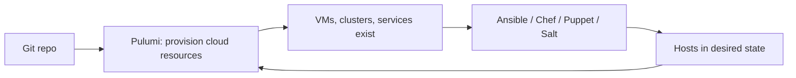

**Configuration management is the practice of defining, applying, and continuously enforcing the desired state of a system — its packages, files, services, settings, and dependencies — through code rather than manual changes.** It is the discipline that keeps fleets of servers, network devices, and operating system installations consistent, auditable, and reproducible at scale.

Configuration management originated in systems engineering long before the cloud era, but the term is now used most often for software tooling that automates the configuration of servers, network devices, operating systems, and applications. Adjacent terms (server orchestration, IT automation, server configuration management, network configuration management) typically refer to the same core idea applied to different layers of the stack.

In this article, we'll cover the key questions about configuration management:

* Why does configuration management matter?
* How does configuration management work?
* What are the most common configuration management tools?
* What are the benefits of configuration management?
* What are the practical use cases for configuration management?
* What are the limitations of configuration management?
* How does configuration management relate to infrastructure as code?
* Frequently asked questions about configuration management

## Why does configuration management matter?

Modern teams run far more systems than they can configure by hand. Three forces make automated configuration management non-negotiable.

### Snowflake servers are an incident factory

When servers are configured manually, no two end up exactly alike. A missing hotfix here, a forgotten kernel parameter there, a one-off `sudo` change someone made during an incident and never undid. That drift is the most common root cause in postmortems: "it worked on the other host." Configuration management collapses that variance by making a single source of truth the definitive answer to "how is this machine supposed to be set up?"

### Compliance demands evidence, not assertions

SOC 2, HIPAA, PCI DSS, FedRAMP, and most other frameworks require that critical systems be configured to specific baselines (CIS benchmarks, DISA STIGs, vendor hardening guides). Demonstrating that hundreds or thousands of machines actually match those baselines, on demand, is only feasible if the configuration lives in code that an auditor can inspect.

### Recovery time is bounded by automation

When a node fails, an availability zone goes dark, or a region is lost, the time-to-restore is dominated by how quickly you can rebuild systems to a known good state. Manually rebuilt systems take days; configuration-managed systems take minutes.

## How does configuration management work?

Most configuration management tools share the same operating model, regardless of the syntax they use.

### Declare a desired state

You describe what the system should look like — packages installed, files in place with specific contents and ownership, services enabled and running, users created, kernel parameters set — typically in YAML, a DSL, or a programming language.

### Identify what's out of compliance

The tool inspects the target system, compares the actual state with the declared state, and produces a diff. This is the identification stage.

### Remediate the drift

The tool then applies the changes needed to bring the system into compliance: installing or removing packages, rewriting files, restarting services, applying patches. Remediation is **idempotent** — running the same configuration twice produces the same result, so safe to re-run continuously.

### Repeat continuously

Most tools run on a schedule (every 15–30 minutes for Puppet, on-demand or via push for Ansible, via Chef Client interval for Chef). That's what keeps the system on the rails after a one-off manual change drifts it off.

Behind the model, every popular tool shares four properties:

* **Declarative.** You describe the desired end state, not the steps to get there.
* **Idempotent.** Running the configuration repeatedly converges on the same result.
* **Automated.** No human required for the routine apply.
* **Mostly stateless on the agent.** The desired state lives in the repository, not on the managed node.

## What are the most common configuration management tools?

There are a few mainstream options, each with different operating models.

| Tool | Language | Architecture | Strengths |
|---|---|---|---|
| **[Ansible](https://www.ansible.com/)** | YAML playbooks | Agentless (SSH/WinRM) | Easy to start, no agents to manage, broad community |
| **[Chef](https://www.chef.io/)** | Ruby DSL | Agent-based (chef-client) | Strong testing story (InSpec, Test Kitchen), complex but powerful |
| **[Puppet](https://www.puppet.com/)** | Puppet DSL | Agent-based (puppet agent) | Mature enterprise tooling, strong drift correction model |
| **[Salt](https://saltproject.io/)** | YAML + Jinja | Agent or agentless | Event-driven, scales to very large fleets, real-time orchestration |

A few notes on choosing:

* **Ansible** is the most common starting point because there are no agents to install and the YAML is easy to read. It's typically pushed from a control node over SSH.
* **Puppet** and **Chef** have agents that pull configuration on a schedule, which makes continuous drift correction trivial.
* **Salt** is event-driven and excels at very large fleets and reactive operations.

The differences between them are smaller than partisans claim. Pick what your team is willing to learn and stick with it.

## What are the benefits of configuration management?

The payoff shows up across reliability, security, and cost.

* **Consistency.** Every system in a tier looks the same, so production behavior matches staging and the next box you provision matches the last.
* **Reliability.** Drift is the source of most "works on one host" bugs. Removing the drift removes the bugs.
* **Faster recovery.** Rebuilding a failed node from configuration is minutes, not hours. The same automation that provisions a host re-provisions it.
* **Auditability.** Every change is a commit. Compliance evidence is a `git log` and a passing pipeline run, not a meeting.
* **Lower cost.** Engineers don't spend evenings hand-configuring servers, and on-call doesn't get paged for routine config drift.
* **Easier patching.** Security updates roll across a fleet on the next configuration run instead of via a multi-week ticket cycle.

## What are the practical use cases for configuration management?

Configuration management shows up across operations:

* **Standardized server provisioning.** A freshly-imaged VM gets brought to a known baseline (users, packages, hardening, monitoring agents) before it joins the fleet.
* **Continuous hardening.** CIS benchmarks, STIGs, and internal baselines are codified and re-applied on every run.
* **Patch and update rollouts.** Operating system, kernel, and package updates are applied uniformly with the same blast-radius controls each time.
* **Application deployment.** Lay down application binaries, write config files, start services, and roll back on failure.
* **Recovery and rebuild.** A failed node is replaced from automation rather than recreated by hand.
* **Network and security device configuration.** Routers, switches, firewalls, and load balancers managed the same way as servers.

Immutable infrastructure and containers replace some of these use cases — instead of mutating a server in place, you bake the desired state into an image and replace the entire host. That model coexists with configuration management; teams typically use both.

## What are the limitations of configuration management?

A few real downsides worth knowing before you adopt:

* **Learning curve.** DSL-based tools (Chef, Puppet) take time to become proficient with. YAML-based tools (Ansible, Salt) are easier to start with but get awkward at scale.
* **Complexity at scale.** Roles, modules, and dependencies can produce a tangle that's hard to refactor.
* **Initial overhead.** Codifying configuration is upfront work that doesn't pay back until the second or tenth re-apply.
* **Mutable-by-default model.** Configuration management converges existing hosts toward a desired state. For workloads where immutable replacement (containers, golden images) fits better, the model can be the wrong tool.
* **Doesn't replace provisioning.** Configuration management runs on hosts and devices that already exist; it doesn't create them. That's the job of [infrastructure as code](/what-is/what-is-infrastructure-as-code/).

## How does configuration management relate to infrastructure as code?

The two are often confused because they overlap, but they solve different problems.

| Dimension | Configuration management | Infrastructure as code |
|---|---|---|
| Primary unit | A running host or device | A cloud resource |
| Operation | Mutate state in place | Provision, update, destroy |
| Lifecycle | Long-lived hosts | Often ephemeral resources |
| Typical target | OS, packages, files, services | VMs, networks, IAM, databases, queues, clusters |
| Idempotence | Convergence over time | Deterministic plan/apply |
| State model | Mostly stateless agents | Explicit state file or service |
| Example tools | Ansible, Chef, Puppet, Salt | [Pulumi](/), Terraform, CloudFormation |

In practice, the two are complementary. Pulumi provisions the VPC, the subnets, the IAM roles, the EC2 instances, the EKS cluster, and the managed database. Ansible (or Chef, Puppet, Salt) then takes the EC2 instances and gets the operating system into the right state — installed packages, hardened settings, application binaries, monitoring agents.

A typical pattern:

For a worked example, see [Deploy WordPress on AWS with Pulumi and Ansible](/blog/deploy-wordpress-aws-pulumi-ansible/).

### Where the line is moving

As container-based and serverless workloads have grown, the share of configuration that lives "inside a host" has shrunk. Many teams now use [infrastructure as code](/what-is/what-is-infrastructure-as-code/) to provision Kubernetes clusters and managed services, and let container images plus declarative manifests handle what configuration management used to do for VMs. The line is moving toward IaC for that reason — but for any team with long-lived VMs, network devices, or on-prem systems, configuration management is still the right tool.

## Frequently asked questions about configuration management

### What is configuration management in simple terms?

It's the practice of keeping computers configured the way you want them to be, automatically, by describing the desired state in code that a tool can apply and re-apply. The point is to eliminate hand-configured "snowflake" systems and the inconsistency they cause.

### What is the difference between configuration management and infrastructure as code?

Configuration management mutates the state of existing systems (operating system, packages, services). Infrastructure as code provisions and destroys cloud resources themselves (VMs, networks, IAM, managed services). They're complementary: IaC creates the host, configuration management gets the OS inside it into the desired state.

### Is Ansible considered configuration management or infrastructure as code?

Both, depending on how you use it. Ansible's core strength is configuration management — converging hosts to a declared state. Its cloud modules can also provision resources, though most teams use Ansible alongside a dedicated IaC tool like Pulumi or Terraform rather than relying on Ansible for provisioning at scale.

### Do you need configuration management if you use containers?

Less of it, but not zero. Containers replace much of what configuration management used to do for application VMs (the image is the desired state). Configuration management still matters for the hosts running the container runtime, for non-containerized legacy systems, and for network and security devices.

### Which configuration management tool is best?

There is no objectively best tool. Ansible has the lowest barrier to entry; Puppet and Chef have the strongest enterprise drift-correction models; Salt scales to extremely large fleets and reactive workflows. Pick what your team is willing to maintain.

### Can configuration management replace manual change tickets?

For routine changes, yes. Every change becomes a commit reviewed in Git, applied by automation, with a clear audit trail. The few changes that still need a ticket (emergency vendor support, hardware replacement) become the exception rather than the default.

### How do configuration management tools handle secrets?

Most tools have a secrets backend (Ansible Vault, Chef encrypted data bags, Puppet hiera-eyaml), but production teams typically integrate with a dedicated secrets store like HashiCorp Vault, AWS Secrets Manager, or [Pulumi ESC](/product/esc/) so secrets aren't duplicated across tools.

### Is configuration management still relevant for cloud-native teams?

Yes, for the parts of the stack that aren't immutable. Hosts running Kubernetes, on-prem systems, network devices, and any long-lived VM still benefit from the discipline. The share of total infrastructure that fits the model has shrunk, but the value per managed host is higher than ever.

### How do configuration management and policy as code differ?

Configuration management makes systems match a desired state. [Policy as code](/docs/insights/policy/) makes the desired state itself meet rules: no public storage, encryption required, allowed regions, mandatory tags. The two work together — policy as code in CI blocks bad declarations before they apply, configuration management ensures the running system matches what's declared.

## Learn more

Pulumi is the infrastructure as code half of this picture: it provisions and manages cloud resources in TypeScript, Python, Go, C#, Java, or YAML, and integrates cleanly with configuration management tools like Ansible, Chef, and Puppet for the host-level work. [Get started today](/docs/get-started/).

Related reading:

* [What is Infrastructure as Code (IaC)?](/what-is/what-is-infrastructure-as-code/)
* [What is DevOps?](/what-is/what-is-devops/)
* [What is DevOps Automation?](/what-is/what-is-devops-automation/)
* [What is Secrets Management?](/what-is/what-is-secrets-management/)
* [Deploy WordPress on AWS with Pulumi and Ansible](/blog/deploy-wordpress-aws-pulumi-ansible/)
