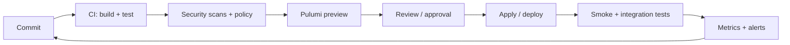

**DevOps automation is the practice of replacing manual, repeatable steps in the software delivery lifecycle (build, test, deploy, configure, operate, monitor) with code that runs the same way every time.** It is the engine that makes [DevOps](/what-is/what-is-devops/) work at scale: without it, the cultural and process changes DevOps prescribes can't actually keep pace with the rate of cloud-native change.

Automation in a DevOps program covers far more than just CI/CD. It spans source control and code review, infrastructure provisioning, configuration management, secrets handling, security and compliance checks, deployment, observability, and incident response. Each of those stages is encoded as software (pipeline definitions, [infrastructure as code](/what-is/what-is-infrastructure-as-code/), [policies](/docs/insights/policy/), runbooks) so that every change moves through the same reviewed, tested, audited path.

In this article, we'll cover the key questions about DevOps automation:

* Why does DevOps automation matter?
* What gets automated in DevOps?
* What does the automated DevOps pipeline look like?
* What are the benefits of DevOps automation?
* How do you measure DevOps automation?
* What are the best practices for DevOps automation?
* What are the most common DevOps automation tools?
* How do I get started with DevOps automation?
* Frequently asked questions about DevOps automation

## Why does DevOps automation matter?

Software delivery has outgrown the pace that manual processes can sustain. Three forces make automation a requirement rather than an option.

### Cloud-native systems change too fast for humans

A modern application is composed of hundreds or thousands of resources — containers, serverless functions, managed databases, queues, networks, IAM roles, secrets — spread across multiple clouds. Those resources change daily, sometimes hourly. Click-ops in a console can't keep up, and the gap between what's documented and what's running widens every week.

### Manual steps are the main source of incidents

Post-incident reviews consistently land on the same root causes: an undocumented manual step skipped, a config file mistyped, a credential rotated in one place but not another. Automation removes the human as a single point of failure in the routine path, leaving them free to handle the genuinely novel work.

### Speed and stability are no longer a tradeoff

DORA's annual "State of DevOps" research has repeatedly found that the top-performing engineering teams ship more frequently *and* fail less often than lower-performing ones. The mechanism is automation: small batches, automated tests, automated deploys, automated rollback. Teams that try to choose between speed and reliability typically have neither.

## What gets automated in DevOps?

A mature DevOps program automates every stage that humans repeat. Here is the standard catalog.

| Stage | What automation looks like |
|---|---|
| **Source control and code review** | Branch protection, required reviewers, status checks, signed commits |
| **Build** | CI pipelines that compile, package, and sign artifacts on every commit |
| **Test** | Unit, integration, end-to-end, performance, security, and infrastructure tests in CI |
| **Infrastructure provisioning** | [Infrastructure as code](/what-is/what-is-infrastructure-as-code/) with preview, apply, and rollback |
| **Configuration management** | Declarative configuration, secrets pulled at runtime from a central store |
| **Security and policy** | SAST, DAST, dependency scanning, [policy as code](/docs/insights/policy/), image signing |
| **Release** | Promotion across environments with gates, canaries, blue/green, and feature flags |
| **Deploy** | Continuous deployment with automatic rollback on failure |
| **Observability** | Metrics, structured logs, traces, and SLO-based alerts |
| **Incident response** | Automated runbooks, auto-remediation for known failure modes, postmortem templates |

The point of this list isn't to automate everything on day one. It's to surface where manual work still happens so you can pick the highest-impact step to convert next.

## What does the automated DevOps pipeline look like?

A useful mental model is a single, observable path from a developer's commit to production:

A few properties that make this loop work:

* **Every box is code.** Pipeline definitions, IaC programs, policies, and test suites all live in Git.
* **Every box can fail loudly.** A failing test, a blocking policy violation, a failing health check, or a drifting metric stops the line.
* **Every box leaves an audit trail.** The same Git history that records the change records the review, the test results, the deploy, and the rollback if one happened.
* **No state lives only in a human's head.** Anyone on the team can run the same loop with the same outcomes.

## What are the benefits of DevOps automation?

The benefits compound, but they show up in roughly this order:

* **Faster delivery.** Lead time from commit to production drops from days or weeks to hours. DORA Elite teams measure lead time in hours; the lowest-performing cohort measures it in months.
* **Higher reliability.** Smaller, more frequent changes are easier to test and easier to revert. Change-failure rates and recovery times improve in lockstep.
* **Lower toil.** Engineers stop spending evenings on manual deployments, ticket-driven environment setup, and patching.
* **Stronger security posture.** Security and compliance checks run on every change instead of in periodic audits, so insecure defaults are caught at PR time rather than after deploy.
* **Better operability.** Auto-scaling, auto-remediation, and SLO-based alerts mean fewer pages and faster recovery.
* **More predictable cost.** Resources are provisioned and torn down by code, so unused capacity stops compounding.

The cumulative effect is that small teams can run large, multi-cloud footprints without proportionally growing headcount.

## How do you measure DevOps automation?

The standard scorecard is the **four DORA metrics**, plus a handful of supporting KPIs:

| Metric | What it tells you | Elite benchmark |
|---|---|---|
| **Deployment frequency** | How often you ship | On demand (multiple per day) |
| **Lead time for changes** | Commit to production | Less than a day |
| **Change-failure rate** | Percent of changes causing incident or rollback | 0–15% |
| **Mean time to recover** | Time to restore service after a failed change | Less than an hour |

The DORA metrics are the speed-and-stability headline. Most teams also track:

* **Automated test coverage** and **test pass rate** — proxy for confidence in CI.
* **Infrastructure automation rate** — percentage of provisioning and configuration tasks driven by code.
* **Mean time to detect (MTTD)** — how fast the system surfaces a problem.
* **Toil percentage** — share of engineering time spent on manual, repetitive work. SRE practice targets below 50%.

The metrics are not the goal; they're the feedback loop. If you can't measure them today, that's the first piece of automation to build.

## What are the best practices for DevOps automation?

A short list of practices that consistently separate high-performing automation programs from low-performing ones:

* **Version-control everything.** Application code, IaC, pipeline definitions, policies, dashboards, runbooks. Anything that controls the system lives in Git.
* **Make every environment reproducible.** Dev, staging, and prod should differ only in scale and configuration, not in how they were built. [Infrastructure as code](/what-is/what-is-infrastructure-as-code/) is what makes this possible.
* **Test infrastructure like application code.** Run unit tests, integration tests, and policy tests against your IaC in CI. Pulumi supports [testing infrastructure](/docs/iac/guides/testing/) in the same languages as the program itself.
* **Encode policy as code, not PDFs.** Compliance, security, and cost rules belong in CI gates, not in human review checklists. [Pulumi Policies](/docs/insights/policy/) and Open Policy Agent are the common tools.
* **Centralize secrets and configuration.** Never embed secrets in code, CI logs, or container images. Pull them at runtime from a dedicated store. [Pulumi ESC](/product/esc/) provides hierarchical environments and dynamic secrets across teams and clouds.
* **Build a paved road.** Wrap common patterns (a vetted Kubernetes namespace, a hardened database, a standard CI/CD template) into reusable [components](/docs/iac/concepts/components/) so product teams don't reinvent them.
* **Automate the boring failures.** Restart a stuck worker, drain a bad node, expire stale credentials, recycle a misbehaving pod. Auto-remediation removes the routine pages.
* **Measure, then improve.** Pick one DORA metric per quarter and one automation that moves it. Trying to "do DevOps" across the entire org at once is how transformations die.
* **Practice blameless postmortems.** Every incident produces concrete corrective actions — new tests, new automation, new policy — that are tracked to completion.

## What are the most common DevOps automation tools?

There is no single DevOps automation tool. A real toolchain stitches one tool from each of these categories together.

| Category | Representative tools |
|---|---|
| Source control | GitHub, GitLab, Bitbucket |
| CI/CD | GitHub Actions, GitLab CI, CircleCI, Jenkins, Buildkite, Argo CD |
| Infrastructure as code | [Pulumi](/), Terraform, OpenTofu, AWS CloudFormation, Bicep |
| Configuration management | Ansible, Chef, Puppet, SaltStack |
| Containers and orchestration | Docker, Podman, Kubernetes, Amazon ECS |
| Secrets and configuration | [Pulumi ESC](/product/esc/), HashiCorp Vault, AWS Secrets Manager, Azure Key Vault |
| Policy as code | [Pulumi Policies](/docs/insights/policy/), Open Policy Agent, HashiCorp Sentinel |
| Observability | Prometheus, Grafana, Datadog, New Relic, Honeycomb, OpenTelemetry |
| Incident management | PagerDuty, Opsgenie, FireHydrant, Rootly |
| Internal developer platforms | [Pulumi IDP](/product/internal-developer-platforms/), Backstage, Port, Cortex |

The category doesn't matter as much as the connections between them. A change in Git should flow through CI, IaC, policy, deploy, and observability without anyone manually copying state between systems.

## How do I get started with DevOps automation?

You almost certainly aren't starting from a blank slate. The practical path is incremental.

### Pick one value stream

Choose a single product or service and trace its path from commit to production. That value stream is what you'll automate first. Doing this across an entire org in one go is how DevOps initiatives die in steering-committee meetings.

### Establish a baseline

Measure deployment frequency, lead time, change-failure rate, and mean time to recover for that value stream before you change anything. Without a baseline, you can't tell whether your "transformation" is working.

### Replace the slowest manual step with code

Look at where the value stream stalls. For most teams that's environment provisioning, release approval, or production deploy. Replace it with code — typically by introducing or expanding [infrastructure as code](/what-is/what-is-infrastructure-as-code/) and a CI/CD pipeline. The Pulumi [getting started guide](/docs/get-started/) is a quick entry point.

### Shift testing and security left

Move tests and security scans that used to run after deploy into CI. Add dependency scanning, SAST, and policy checks to the same pipeline so "is this safe to ship?" is already answered by the time a change reaches main.

### Build the paved road as patterns emerge

When the same recipe shows up in three places (a standard Kubernetes namespace, a standard database stack, a standard CI/CD template), package it as a reusable [Pulumi component](/docs/iac/concepts/components/) or an [internal developer platform](/what-is/what-is-an-internal-developer-platform/) module. That's how automation scales without each team reinventing it.

### Iterate against the metrics

Re-measure DORA metrics each quarter. Use the deltas to choose the next investment. Automation programs that don't measure tend to drift toward whatever's most fun rather than what's most valuable.

## Frequently asked questions about DevOps automation

### What is DevOps automation in simple terms?

DevOps automation is the practice of running the steps that get software from a developer's commit to production — building, testing, provisioning, deploying, monitoring — as code rather than as manual checklists. The goal is faster, more reliable, more auditable delivery.

### What is the difference between DevOps and DevOps automation?

DevOps is the broader culture and set of practices that joins software development and IT operations. DevOps automation is the engineering work that makes those practices actually run at scale: CI/CD pipelines, infrastructure as code, policy as code, monitoring, and incident response automation.

### Do you need infrastructure as code for DevOps automation?

For any team managing more than a handful of cloud resources, yes. Reproducible, reviewable environments are the substrate that everything else (testing, policy, deployment, recovery) runs on. See [infrastructure as code for DevOps](/what-is/infrastructure-as-code-for-devops/).

### What is the difference between CI/CD and DevOps automation?

CI/CD is one slice of DevOps automation focused on building, testing, and deploying application code. DevOps automation is the broader program that also covers infrastructure provisioning, configuration management, security scanning, policy enforcement, observability, and incident response.

### How does DevOps automation relate to AIOps?

AIOps applies machine learning to the operational data DevOps automation produces — logs, metrics, traces, alerts — to find anomalies, suppress noise, and recommend remediations. AIOps depends on DevOps automation: without the automated observability stack, there's nothing for AIOps to analyze.

### Can small teams benefit from DevOps automation?

Yes. Small teams benefit most, because every hour saved on toil is a meaningful fraction of capacity. Start with CI/CD and a small amount of infrastructure as code; you don't need a platform team to get the first 10x improvement.

### Is DevOps automation only for cloud-native workloads?

No, but cloud APIs make it dramatically easier. Anything with a programmable interface can be automated — bare metal, VMs, network gear, SaaS configuration — though the tooling is richer for cloud-native stacks.

### How do you secure a fully automated pipeline?

Treat the pipeline itself as a high-value target. Sign commits, sign artifacts, scope CI credentials, run dependency and image scans, enforce branch protection, and use [policy as code](/docs/insights/policy/) to block insecure configurations before they deploy. Pull secrets at runtime from a centralized vault via [Pulumi ESC](/product/esc/) rather than baking them into pipelines or images.

### How long does DevOps automation take to pay off?

The first wins (faster builds, automated deploys for one service) appear in weeks. Broader gains (lower change-failure rates, faster recovery, smaller on-call burden) compound over quarters. Full platform-level transformations are measured in years and never really "finish" — automation is an ongoing investment, not a project.

## Learn more

Pulumi is built for the teams responsible for DevOps automation: platform engineers, SREs, and infrastructure teams who want a single pipeline that provisions, configures, secures, and operates cloud infrastructure as code. Pulumi works in the languages your team already uses (TypeScript, Python, Go, C#, Java, or YAML), integrates with your existing CI/CD, and ships with policy as code, secrets management, and a Cloud-native control plane. [Get started today](/docs/get-started/).

Related reading:

* [What is DevOps?](/what-is/what-is-devops/)
* [What is Infrastructure as Code (IaC)?](/what-is/what-is-infrastructure-as-code/)
* [What is CI/CD?](/what-is/what-is-ci-cd/)
* [What is Configuration Management?](/what-is/what-is-configuration-management/)
* [What is an Internal Developer Platform (IDP)?](/what-is/what-is-an-internal-developer-platform/)
* [Infrastructure as code for DevOps](/what-is/infrastructure-as-code-for-devops/)
