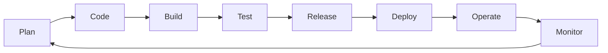

**DevOps is a set of practices, cultural philosophies, and tools that combines software development (Dev) and IT operations (Ops) so teams can deliver applications and services faster, more reliably, and at greater scale than traditional siloed processes allow.** DevOps teams automate the full software delivery lifecycle (plan, code, build, test, release, deploy, operate, monitor) and apply the same engineering discipline to infrastructure that they already apply to application code.

The point is to dissolve the wall between the people who write software and the people who run it in production. Instead of throwing a release "over the fence" from Dev to Ops, DevOps teams share ownership of the entire lifecycle, automate the slow manual steps that used to live between them, and use [infrastructure as code](/what-is/what-is-infrastructure-as-code/) so the platform that runs the app evolves through the same pull-request workflow as the app itself. Tools like [Pulumi](/) make that workable in practice by treating infrastructure as software written in TypeScript, Python, Go, C#, Java, or YAML, then shipping it through your existing CI/CD pipelines.

In this article, we'll cover the key questions about DevOps:

* Why does DevOps matter?
* How did DevOps evolve?
* What is the DevOps lifecycle?
* What are the core principles of DevOps (CALMS)?
* What are the key DevOps practices?
* What are the benefits of DevOps?
* How is DevOps different from Agile, SRE, DevSecOps, and platform engineering?
* What are the most popular DevOps tools?
* How do I adopt DevOps?
* Frequently asked questions about DevOps

## Why does DevOps matter?

For most companies, software is now the product, and the pace it has to change at has outgrown the way most organizations were built to deliver it. DevOps addresses three pressures every engineering org is under.

### Delivery speed has become a competitive requirement

Customers expect new features, fixes, and security patches in days, not quarters. The best-performing engineering teams deploy multiple times per day with change-failure rates in the low single digits, while teams at the other end of the curve release once a month and spend days recovering from a bad change. That gap shows up in the business: faster teams ship more, learn more, and respond to the market more quickly.

### Cloud infrastructure changes constantly

A modern stack isn't a couple of VMs and a database. It's hundreds or thousands of cloud resources (containers, serverless functions, managed databases, queues, networks, secrets, IAM policies) spread across multiple clouds and SaaS providers. That infrastructure changes daily or hourly. Managing it by hand through cloud consoles doesn't scale; it has to be automated, versioned, and reviewed like code.

### Reliability and security can't be bolted on at the end

When Dev and Ops were separate, reliability and security stayed someone else's problem until a release went sideways. DevOps moves both "left" into design, code review, and CI, so resilience, observability, and compliance are built into the pipeline rather than chased down after an incident. The same shift produced [DevSecOps](#how-is-devops-different-from-agile-sre-devsecops-and-platform-engineering), which folds security testing and policy enforcement into the same automated workflow.

## How did DevOps evolve?

DevOps didn't appear overnight. It's the product of about two decades of overlapping shifts in how software is built, deployed, and run.

### From waterfall to Agile (2001–2007)

The Agile Manifesto in 2001 reorganized how teams built software: short iterations, working software over documentation, close collaboration with the business. But Agile mostly stopped at the developer's commit. Operations still received releases on a fixed cadence, often via ticket and runbook, which created a chronic mismatch: development moved in weeks, operations in months.

### The birth of DevOps (2007–2009)

In 2007, Belgian engineer Patrick Debois grew frustrated with the gulf between developers and sysadmins on a government project and started organizing what would become DevOpsDays — the first event was held in Ghent in 2009. The same year, John Allspaw and Paul Hammond gave their famous "10+ Deploys Per Day: Dev and Ops Cooperation at Flickr" talk at Velocity, showing that high deploy frequency and stability could co-exist if Dev and Ops actually worked together.

### Cloud, containers, and CI/CD (2010s)

The 2010s gave DevOps the tooling it needed. Public cloud APIs made infrastructure programmable. Docker (2013) and Kubernetes (2014) made application packaging and orchestration uniform. CI/CD systems like Jenkins, CircleCI, GitHub Actions, and GitLab matured. Infrastructure as code tools followed: first Chef, Puppet, and CFEngine for configuring servers, then Terraform, AWS CloudFormation, and [Pulumi](/) for provisioning whole cloud environments. The platform itself became something you could ship through a pull request.

### Platform engineering and DevSecOps (2020s)

As cloud-native architectures grew, the cognitive load on individual product teams exploded. The 2020s brought two responses. [Platform engineering](/what-is/what-is-platform-engineering/) emerged as internal teams started packaging vetted infrastructure, CI/CD, and policy into golden-path services that product teams could consume off the shelf. DevSecOps moved security into every stage of the same pipeline. Both extend the idea Debois started with: stop optimizing handoffs between silos, and remove the silos instead.

## What is the DevOps lifecycle?

The DevOps lifecycle is the continuous loop a team runs through to turn an idea into running production software and feed real-world feedback back into the next iteration. It's usually drawn as an infinity loop because there is no "done." Every change re-enters the cycle.

The eight stages, in order:

1. **Plan.** Decide what to build next. Backlog grooming, design, threat modeling, and breaking work into small batches that can ship independently.
1. **Code.** Write application and infrastructure code together, in the same repositories where possible, with version control, code review, and a shared definition of "done."
1. **Build.** Compile, package, and produce immutable artifacts (binaries, container images, IaC programs) on every commit, with reproducible builds and signed provenance.
1. **Test.** Run unit, integration, security, performance, and infrastructure tests automatically in CI so problems surface before merge, not after deploy.
1. **Release.** Promote a tested artifact toward production through environment gates (dev, staging, prod), often using progressive techniques like canary or blue/green.
1. **Deploy.** Push the artifact and its infrastructure changes to the target environment with one-click or auto-merge automation, including rollback plans.
1. **Operate.** Run the system in production with on-call rotations, runbooks, capacity management, and well-defined SLOs.
1. **Monitor.** Collect metrics, logs, traces, and user feedback; convert incidents and trends into the next planning cycle.

The same loop runs whether you're shipping a microservice, a database migration, or a Kubernetes change. That uniformity is what makes DevOps work at scale.

## What are the core principles of DevOps (CALMS)?

The most widely cited framework for what makes a DevOps culture is **CALMS**, coined by Jez Humble: **C**ulture, **A**utomation, **L**ean, **M**easurement, and **S**haring.

| Pillar | What it means | What it looks like in practice |
|--------|---------------|--------------------------------|
| **Culture** | Shared ownership across Dev, Ops, and Security; blameless postmortems; outcomes over output. | Teams own services from commit to production. Incidents produce action items, not scapegoats. |
| **Automation** | Eliminate manual, repeatable work in the path from idea to production. | CI/CD pipelines, infrastructure as code, policy as code, automated testing, automated rollback. |
| **Lean** | Optimize for small batch sizes and short feedback loops; remove waste. | Trunk-based development, feature flags, frequent small releases instead of quarterly big ones. |
| **Measurement** | Decisions and improvements are driven by data, not opinion. | Track DORA metrics: deployment frequency, lead time, change-failure rate, mean time to recover. |
| **Sharing** | Knowledge, tools, and learnings flow freely across teams. | Internal docs, paved-road platforms, open ChatOps channels, shared dashboards, shared on-call. |

CALMS is useful because it makes clear that DevOps doesn't come out of a single procurement decision or a single org-chart change. All five dimensions have to be reinforced together. Strong automation paired with a punitive culture, for example, just produces faster failures.

## What are the key DevOps practices?

These are the concrete engineering practices that turn the CALMS pillars into day-to-day work.

* **[Infrastructure as code (IaC)](/what-is/what-is-infrastructure-as-code/).** Define cloud resources (networks, clusters, databases, IAM, DNS) as code, check that code into Git, and let a deterministic engine reconcile the real world with what you've declared. With Pulumi, you can write IaC in the same general-purpose languages as your application code, so the same testing, refactoring, and abstraction tools apply on both sides. See [infrastructure as code for DevOps](/what-is/infrastructure-as-code-for-devops/).
* **[Continuous integration and continuous delivery (CI/CD)](/what-is/what-is-ci-cd/).** CI merges code changes into a shared mainline many times a day, with every merge gated by automated builds and tests. CD takes every CI-passing artifact and prepares it for release, so "is this deployable?" is always answered yes. Pulumi integrates with the major CI/CD systems via [Pulumi's CI/CD integration](/docs/iac/guides/continuous-delivery/).
* **Version control for everything.** Application code, infrastructure code, pipeline definitions, dashboards, runbooks, and policies all live in Git. The platform gets the same review, history, and rollback story as the product.
* **[Configuration management](/what-is/what-is-configuration-management/) and secrets.** Keep environment-specific configuration and secrets out of code, and manage them centrally with auditing, rotation, and least-privilege access. [Pulumi ESC](/product/esc/) provides hierarchical configuration and dynamic secrets across environments.
* **Automated testing.** Beyond unit tests, DevOps teams run integration tests, [infrastructure tests](/docs/iac/guides/testing/), security tests (SAST, DAST, dependency scanning), and load tests in CI so regressions are caught before deploy.
* **Microservices and containers.** Splitting applications into independently deployable services, packaged in containers and orchestrated by Kubernetes, frees teams from waiting on each other. The tradeoff is needing strong automation to manage the resulting complexity.
* **Policy as code.** Encode security, compliance, and cost rules as code that runs against every change. Pulumi [CrossGuard](/docs/insights/policy/) policies can be written in the same language as your infrastructure and enforced in CI.
* **Observability.** Metrics, structured logs, distributed traces, and SLOs make production behavior legible. When something breaks, you can see what changed and roll it back instead of guessing.
* **Continuous feedback.** User analytics, error budgets, and incident reviews flow back into planning so the next iteration is shaped by what actually happened in production.

## What are the benefits of DevOps?

Once the practices above are in place, the payoff shows up in measurable ways.

* **Faster time to market.** Teams release in hours or days instead of weeks. DORA's "State of DevOps" reports have consistently shown elite performers deploying on demand (multiple times per day) while the lowest-performing group deploys between once a month and once every six months.
* **Higher reliability.** Smaller, more frequent changes are easier to test and easier to revert. Elite DevOps teams report change-failure rates of 5% or less and mean times to recover measured in minutes, not days.
* **Better security and compliance.** Security tests, dependency scanning, and policy checks run on every change. Compliance audits become a query against version control rather than a fire drill.
* **Improved collaboration.** Shared ownership of the lifecycle removes the "throw it over the wall" handoff and the political friction that came with it.
* **Scalability.** Automated provisioning, configuration, and deployment let small teams operate large, multi-cloud footprints without proportionally growing headcount.
* **Higher developer productivity.** Developers spend more time shipping features and less time chasing tickets, waiting on environments, or fighting flaky deploys.

## How is DevOps different from Agile, SRE, DevSecOps, and platform engineering?

DevOps overlaps with several adjacent practices, and people often use the terms interchangeably. They're not the same thing.

| Practice | Focus | Relationship to DevOps |
|----------|-------|------------------------|
| **Agile** | Iterative software development; close collaboration with the business; short cycles. | Agile sits upstream of DevOps. Agile delivers working code in short iterations; DevOps gets that code reliably into production and keeps it running. |
| **DevOps** | The full lifecycle from idea to production, with Dev and Ops sharing ownership. | The umbrella practice the others sit inside or alongside. |
| **DevSecOps** | DevOps with security folded into every stage of the lifecycle. | A specialization of DevOps. Same loop, same tools, with security tests, policy as code, and threat modeling moved left. |
| **SRE (site reliability engineering)** | Apply software-engineering practices to operations: SLOs, error budgets, toil reduction, automated remediation. | One way to implement the "Ops" half of DevOps. Google popularized SRE as a concrete operating model that lives well inside a DevOps culture. |
| **[Platform engineering](/what-is/what-is-platform-engineering/)** | Build an internal developer platform (IDP) that paves the road for product teams. | An organizational pattern for scaling DevOps. A central platform team productizes the toolchain so every product team doesn't reinvent it. |

A useful way to keep them straight: Agile is about how the software gets built, DevOps is about how it gets delivered and run, SRE is a specific operating model for the running part, DevSecOps is the security-first variant of the whole picture, and platform engineering is the organizational pattern for offering it as a service inside the company.

## What are the most popular DevOps tools?

There is no single "DevOps tool." A real DevOps toolchain stitches together a tool from each of these categories.

| Category | Representative tools |
|----------|----------------------|
| Source control | GitHub, GitLab, Bitbucket |
| CI/CD | GitHub Actions, GitLab CI, CircleCI, Jenkins, Buildkite, Argo CD |
| Infrastructure as code | [Pulumi](/), Terraform, OpenTofu, AWS CloudFormation, Bicep |
| Configuration management | Ansible, Chef, Puppet, SaltStack |
| Containers and orchestration | Docker, Podman, Kubernetes, Amazon ECS |
| Secrets and config | [Pulumi ESC](/product/esc/), HashiCorp Vault, AWS Secrets Manager, Azure Key Vault |
| Policy as code | [Pulumi CrossGuard](/docs/insights/policy/), Open Policy Agent (OPA), HashiCorp Sentinel |
| Observability | Prometheus, Grafana, Datadog, New Relic, Honeycomb, OpenTelemetry |
| Incident management | PagerDuty, Opsgenie, FireHydrant, Rootly |
| Collaboration / ChatOps | Slack, Microsoft Teams, GitHub Discussions |

A good DevOps toolchain covers every stage of the lifecycle so changes flow from a developer's branch to production without anyone manually copying state between systems. The category doesn't matter as much as the connection.

## How do I adopt DevOps?

Most teams aren't starting from a blank slate. They have legacy services, hand-built environments, half-automated pipelines, and a culture shaped by years of incidents. Adopting DevOps doesn't have to be a big-bang reorg; it's an incremental change in how you build, run, and measure software.

### Pick a value stream, not the whole org

Choose one product or service and trace its full path from idea to production. That value stream is what you're going to optimize first. Trying to "do DevOps" across an entire engineering org in one go is how transformations die in steering-committee meetings.

### Establish a baseline using DORA metrics

Before you change anything, measure deployment frequency, lead time for changes, change-failure rate, and mean time to recover for the value stream you picked. Without a baseline you can't tell whether your "DevOps transformation" is actually working.

### Automate the slowest manual step first

Look at where the value stream stalls. For most teams that's environment provisioning, release approval, or production deploys. Replace that step with code, typically by introducing or expanding [infrastructure as code](/what-is/what-is-infrastructure-as-code/) and CI/CD. Pulumi's [getting started guide](/docs/get-started/) is a good entry point.

### Shift testing and security left

Move tests that used to run after deploy into CI. Add static analysis, dependency scanning, and policy checks to the same pipeline. By the time a change reaches main, "is this safe to ship?" should already be answered.

### Build the platform as you go

As patterns emerge across teams (a standard way to spin up a Kubernetes namespace, a standard CI/CD template, a standard set of policies), package them as reusable [Pulumi components](/docs/iac/concepts/components/) and a paved-road internal platform. That's how DevOps scales without each team reinventing the toolchain.

### Run blameless postmortems

When something breaks, study the failure as a system problem, not a people problem. The artifacts of a good postmortem (corrective actions, new tests, better runbooks, automation that wasn't there before) are how the culture half of CALMS compounds over time.

## Frequently asked questions about DevOps

### What is DevOps in simple terms?

DevOps is the combination of culture, practices, and tools that lets the people who build software and the people who run it work as one team and ship changes quickly, safely, and continuously.

### Is DevOps a job, a methodology, or a culture?

Primarily a culture and a set of practices, supported by tools. "DevOps engineer" is a real job title, but it usually refers to someone who builds and operates the automation, infrastructure, and pipelines that the whole team uses, not a single person who is "doing DevOps" on behalf of everyone else.

### What does a DevOps engineer do?

A DevOps engineer builds the systems that let developers ship software safely and quickly: CI/CD pipelines, infrastructure as code, observability, secrets management, and the policies that keep all of it secure and compliant. In larger organizations, much of this work has been rebranded as [platform engineering](/what-is/what-is-platform-engineering/).

### What is the difference between DevOps and Agile?

Agile covers how software gets planned and built in short iterations, with close customer collaboration. DevOps picks up where Agile leaves off and covers how the software gets delivered, run, and operated. Most Agile processes treat "the code is merged" as the finish line; DevOps treats it as the halfway point.

### What is the difference between DevOps and DevSecOps?

DevSecOps is DevOps with security treated as a first-class concern at every stage of the lifecycle: security tests in CI, policy as code in deployment, threat modeling during planning. Most mature DevOps teams already work this way; the DevSecOps label just makes the security emphasis explicit.

### What is the difference between DevOps and SRE?

DevOps is the culture and lifecycle; site reliability engineering is one concrete way to implement the operations side of it, using software-engineering practices like SLOs, error budgets, and toil reduction. SRE fits inside a DevOps organization.

### How does DevOps relate to the cloud?

DevOps is what makes cloud usable at scale. The cloud gives you programmable APIs for nearly everything (compute, storage, networking, identity, SaaS); DevOps gives you the automation, version control, and review process to manage what would otherwise be an unmanageable amount of resource churn.

### Is infrastructure as code required for DevOps?

For any team managing more than a handful of cloud resources, yes. Keeping environments consistent, auditable, and reproducible by hand stops being feasible past that point, so [infrastructure as code](/what-is/what-is-infrastructure-as-code/) becomes the substrate that DevOps automation runs on.

### What are the four key metrics of DevOps?

The four DORA metrics: **deployment frequency**, **lead time for changes**, **change-failure rate**, and **mean time to recover**. Together they capture both the speed and the stability of a delivery pipeline, which is why they've become the standard scorecard for DevOps performance.

### How long does it take to adopt DevOps?

Serious transformations are measured in quarters and years, not weeks. Most teams see meaningful improvements in deployment frequency and lead time within the first few months of focused work on one value stream. The cultural and platform changes that compound the benefits play out over the next several years.

## Learn more

Pulumi is built for DevOps teams that want to manage infrastructure with the same languages, tools, and practices they already use for application code. With Pulumi, you can provision and update infrastructure on any cloud, integrate it into your existing CI/CD pipelines, enforce policy as code, and manage secrets and configuration across every environment. [Get started today](/docs/get-started/).

Related reading:

* [What is Infrastructure as Code (IaC)?](/what-is/what-is-infrastructure-as-code/)
* [What is CI/CD?](/what-is/what-is-ci-cd/)
* [What is Platform Engineering?](/what-is/what-is-platform-engineering/)
* [What is DevOps Automation?](/what-is/what-is-devops-automation/)
* [Infrastructure as code for DevOps](/what-is/infrastructure-as-code-for-devops/)
* [What is Configuration Management?](/what-is/what-is-configuration-management/)
