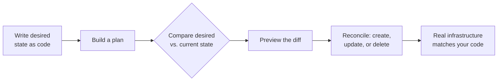

**Infrastructure as code (IaC) is the practice of provisioning and managing computing infrastructure with machine-readable configuration files instead of clicking through a console or running one-off scripts.** You write code that describes the infrastructure you want, check it into Git, and let an IaC engine make the real world match what you've declared.

The idea is to treat infrastructure the way software engineers already treat application code. Version control, code review, testing, and CI/CD all become available to whoever is provisioning a VPC or a Kubernetes cluster. Modern platforms like [Pulumi](/) take it a step further by letting you write that code in TypeScript, Python, Go, C#, Java, or YAML rather than a custom configuration language.

In this article, we'll cover the key questions about infrastructure as code:

* Why is infrastructure as code important?
* How does infrastructure as code work?
* How did infrastructure as code evolve?
* What is the difference between declarative and imperative IaC?
* What are the key elements of infrastructure as code?
* What benefits does infrastructure as code provide?
* What are common use cases for infrastructure as code?
* What are the most popular infrastructure as code tools?
* How do you get started with infrastructure as code?
* Frequently asked questions about IaC

Let's start with why infrastructure as code matters.

## Why is infrastructure as code important?

IaC is important because of three significant trends, all of them happening at the same time.

### The transition to the cloud

One trend, of course, is the ongoing transition to the cloud. More and more companies are shifting workloads from on-premises infrastructure to cloud environments.

It's worth mentioning the scope of this transition. The term "cloud environments" is more far-reaching than many may realize. Hyperscaler clouds like AWS or Microsoft Azure may be the first to come to mind, but there is so much more to cloud infrastructure:

* Regional clouds, like Alibaba Cloud
* Specialized cloud providers
* Private cloud technologies running in on-premises data centers, such as VMware vSphere
* Modern SaaS infrastructure companies such as Cloudflare, Snowflake, Confluent, Datadog, New Relic, and many others
* Other cloud-based assets like Auth0, GitLab, or GitHub

All these cloud environments can be provisioned or managed via APIs, and, as a result, can be managed with infrastructure as code tools.

### Cloud modernization

The second trend is cloud modernization. At first glance this may seem redundant with the first trend, which is the ongoing transition to the cloud. However, after organizations transition to the cloud, they tend to look for opportunities to maximize the value they get from their cloud environment. This frequently involves adopting technologies such as serverless, containers and Kubernetes. In some cases, cloud modernization involves using managed services to offload some of the heavy lifting to the cloud provider. In other cases, cloud modernization means more use of ephemeral, stateless workloads that exist only for a short while, and then need to be decommissioned. When applied correctly, all these approaches enable teams to deliver value more quickly. These technologies and services generally require a more granular management of infrastructure. Stitching together all the primitives that the cloud provider offers into solutions that serve the business is a great fit for IaC.

### Frequent infrastructure changes

Finally, the rate of change for a company's infrastructure is increasing. Part of this increase in the rate of change is due to cloud adoption and cloud modernization. There is a third reason, though: organizations are finding that they can move faster if they take advantage of the fundamental elasticity of the cloud.

For teams managing tens or hundreds of cloud resources that change once every few months, managing infrastructure using scripts or via interactive means (such as using a UI or a CLI) might still be possible. More commonly, teams are finding themselves managing thousands or tens of thousands of resources that change daily or even hourly. Embracing automation via infrastructure as code is the only way to take control of that kind of complexity.

## How does infrastructure as code work?

At its core, infrastructure as code follows a single loop: you describe the infrastructure you want, and an engine makes the real world match that description. You don't write the step-by-step instructions to get there. You declare the end state, and the tool figures out the rest.

A typical workflow looks like this:

1. **Write the desired state as code.** Describe the resources you want (a network, a Kubernetes cluster, a database, an IAM policy) in a configuration file or program.
1. **Build a plan.** The IaC tool reads your code and constructs a model of the desired state.
1. **Compare against reality.** The tool compares that desired state against a record of what already exists, usually kept in a *state file* that tracks the resources it manages.
1. **Preview the changes.** Before anything happens, you get a diff showing exactly what will be created, updated, replaced, or deleted.
1. **Reconcile.** Once approved, the engine calls the cloud provider APIs to make the real infrastructure match your code, handling ordering and dependencies along the way.



For example, here's all it takes to declare an AWS S3 bucket. You state that the bucket should exist; the engine decides whether to create it, leave it alone, or update it to match:



{}

```typescript
import * as aws from "@pulumi/aws";

// Declare a bucket. Pulumi creates, updates, or replaces it to match.
const bucket = new aws.s3.BucketV2("my-bucket");

export const bucketName = bucket.bucket;
```

{}

{}

```python
import pulumi
import pulumi_aws as aws

# Declare a bucket. Pulumi creates, updates, or replaces it to match.
bucket = aws.s3.BucketV2("my-bucket")

pulumi.export("bucket_name", bucket.bucket)
```

{}

Two properties make this model reliable. Because the engine works from desired state rather than a fixed list of steps, IaC is *idempotent*: applying the same code repeatedly always produces the same result, whether you're deploying into an empty account or reconciling one that already has resources. And because the tool keeps a model of what it manages, it can detect *drift* (changes someone made out of band, such as editing a setting directly in the cloud console) and bring the real world back in line with the code. Without IaC, environments tend to become "snowflakes," each one configured slightly differently by hand and impossible to reproduce reliably.

## How did infrastructure as code evolve?

Infrastructure as code didn't emerge all at once. It's the latest step in a long arc of automation maturity, and the patterns that dominate today reflect lessons learned from earlier approaches.

### From manual clicks to declarative code

Most teams have moved through some or all of the following stages of automation as their infrastructure footprint has grown:

1. **Manual point-and-click in a UI console.** Quick to start with and useful for exploration, but completely manual: every recovery, scale-up, or environment clone repeats the same painful sequence of clicks.
1. **CLI commands or direct API calls.** Each UI step can be translated into a CLI invocation or HTTP request. Procedures become easier to document, but they remain step-based and brittle.
1. **Shell scripts.** Capturing those commands in a script is a real jump in repeatability: scripts can be checked into version control. The downside is fragility: a failure halfway through a script often leaves infrastructure in an unknown state, and every upgrade path has to be reasoned about by hand.
1. **SDK-driven code.** Using a cloud provider's SDK in a general-purpose language adds first-class error handling, logging, and debugging. It still suffers from the same partial-failure and combinatorial-upgrade problems as scripting.
1. **Infrastructure as code.** Instead of describing the steps required to reach a desired state, you declare the state itself, and an engine figures out how to get there. The engine understands resource lifetime, computes a plan, and reconciles the real world with the declared state, recovering from partial failures along the way.

This last step is what makes IaC qualitatively different from the approaches that came before it. Earlier tools described _how_ to change infrastructure; IaC tools describe _what_ the infrastructure should look like and let a deterministic engine handle the rest.

### From pets to cattle

Two parallel shifts changed the kind of infrastructure that IaC needed to manage. The first was the move from mutable to immutable infrastructure, popularly described as the move ["from pets to cattle"](https://www.engineyard.com/blog/pets-vs-cattle/). In the early cloud era, each server was special: it was patched in place, mourned when it failed, and treated like a pet. Today, most infrastructure is managed as fleets of interchangeable resources that are replaced rather than upgraded, with cluster managers and serverless control planes handling scaling, fault tolerance, and traffic routing automatically.

### From configuration to provisioning

The second shift was a change in what IaC tools were _for_. Early tools such as CFEngine, Puppet, Chef, Ansible, and SaltStack were built for the "two VMs and a database" world, where the central problem was configuring and patching long-lived servers after they had been created (often manually). Modern provisioning-oriented tools like [Pulumi](/) target a wider range of cloud resources (containers, serverless functions, managed databases, queues, networks, and identity) and treat the creation, update, and replacement of those resources as the primary workflow. Configuration-style work still happens, but mostly inside immutable images and container builds rather than against running servers.

### From a couple of VMs to thousands of resources

Older "infrastructure" was static and slow-moving: an N-tier app on a couple of VMs and a database, with new capacity requested through a ticket and delivered weeks later. Modern systems routinely span dozens or hundreds of cloud resources (microservices, clusters, registries, networks, security policies, secrets, load balancers, serverless functions, queues, data stores, hosted AI/ML services) across many environments. That growth in moving pieces is what makes infrastructure as code essential rather than optional: at this scale, no team can manage the cloud safely by clicking through a console.

## Declarative vs. imperative infrastructure as code

Most IaC tools fall into one of two camps: declarative or imperative.

**Declarative IaC** asks you to describe the end state you want. You say which resources should exist and how they should be configured, and a deployment engine works out the steps. It compares your declared state against what's actually running and then creates, updates, replaces, or deletes resources as needed. Pulumi, Terraform, OpenTofu, AWS CloudFormation, Azure Resource Manager (ARM and Bicep), and Google Cloud Deployment Manager all work this way.

**Imperative IaC** asks you to write the steps. Create this VM, attach that disk, open this port. The tool runs your steps in order but usually doesn't keep a model of what it built, so it can't easily detect drift or reconcile it. Shell scripts, cloud provider SDKs, and Ansible playbooks (when used procedurally) are typical examples.

| Aspect | Declarative IaC | Imperative IaC |
|--------|-----------------|----------------|
| You specify | The desired end state | The steps to reach the state |
| Drift handling | Engine reconciles automatically | Manual or re-run scripts |
| Idempotency | Built-in | Must be implemented by hand |
| Best for | Cloud resource lifecycle management | One-off automation, glue scripts |
| Examples | Pulumi, Terraform, CloudFormation, Bicep | Bash, cloud SDKs, Ansible playbooks |

Declarative is the more common style for cloud infrastructure because the lifecycle is messy. Changes happen constantly, deployments fail halfway through, multiple teams update the same resources, and drift creeps in. Solving those problems imperatively means writing a lot of bookkeeping code that the tool ought to handle for you. Pulumi is declarative under the hood but lets you write the declarations in a real programming language, so loops, conditionals, abstractions, and unit tests are all available without giving up the deterministic deployment engine. For a side-by-side, see [how Pulumi compares to other IaC tools](/docs/iac/comparisons/).

## What are the key elements of infrastructure as code?

The key elements of infrastructure as code are the same key elements you'd find in the majority of software engineering environments. These include:

1. **An infrastructure as code mechanism:** For all practical purposes, in order to do infrastructure as code you need a tool or engine that is responsible for translating the IaC instructions into something the cloud provider APIs understand and can use. Infrastructure as code tools may be provided by and limited to a single cloud provider (AWS CloudFormation is one example), or may support multiple cloud providers. Tools may be limited to supporting YAML or JSON; may require a purpose-built domain-specific language (DSL); or may support general-purpose programming languages such as TypeScript/JavaScript, C#, Go, Python, and Java.
1. **Version control:** When infrastructure is described as code, it can be checked into source control, versioned and code-reviewed using existing software engineering practices. Version control systems, like [GitHub](https://github.com/), [GitLab](https://about.gitlab.com/), or [BitBucket](https://bitbucket.org/), enable you to see _what_ changes were made, _when_ the changes were made, and _who_ made the changes.
1. **Tests:** As any critical system grows in complexity, people can start to feel nervous about making changes. With infrastructure as code, teams can write tests for their infrastructure to ensure its correctness. They can encode policies so that all provisioned infrastructure and its configurations [are compliant](/docs/iac/guides/testing/property-testing/). Once they're tested, infrastructure components can be reusable pieces of code that capture best practices and that can be shared across teams. No more reinventing the wheel.
1. **CI/CD pipelines:** Assuming the infrastructure as code tool supports the functionality (most do), changes to infrastructure (found in changes to the code that defines the infrastructure) can be deployed using existing CI/CD tools, much in the same way CI/CD pipelines automatically build and deploy other forms of software.

## What benefits does infrastructure as code provide?

Infrastructure as code tames the complexity of cloud infrastructure because it uses the same software engineering principles, approaches, and tools that have enabled other software-based systems to scale up. Here are some of the benefits infrastructure as code provides.

* **Repeatability and consistency**: Infrastructure that is defined via IaC can be deployed in a highly repeatable fashion. Do you need a development environment that is a high fidelity copy of the production environment? Or do you need to ensure that infrastructure is deployed the same across multiple regions? This is easily accomplished with infrastructure as code.
* **Accountability**: Changes to the infrastructure can be easily tracked via the use of version control with your infrastructure as code files.
* **Improved productivity**: Most developers have an integrated development environment (IDE) that they use all the time. When infrastructure is code, you can take advantage of all the features that an IDE offers, such as autocompletion and the ability to look up methods and their parameters.
* **Better alignment among teams**: Infrastructure as code enables infrastructure teams and software development teams to adopt DevOps principles and work together more closely. When infrastructure is code and is integrated into your company's software lifecycle, there's a common language and a common set of practices that stakeholders already understand. That common understanding fosters cross-team collaboration, which is fundamental to DevOps.

## What are common use cases for infrastructure as code?

IaC shows up across a lot of cloud workflows, but a few patterns account for most of the adoption:

1. **Provisioning cloud environments.** Stand up identical development, staging, and production environments from the same code, varying only config values and sizing. A fresh AWS or Azure account can go from empty to fully provisioned in minutes.
1. **Multi-cloud and hybrid setups.** Manage AWS, Azure, Google Cloud, on-premises VMware, and SaaS providers like Cloudflare, Snowflake, or Datadog through one workflow instead of juggling separate consoles.
1. **Kubernetes and container platforms.** Define a cluster alongside the workloads, ingress, IAM, and managed databases the app depends on, so the platform and the application ship as a single unit. See [infrastructure as code for Kubernetes](/what-is/infrastructure-as-code-for-kubernetes/) for how this works in practice.
1. **CI/CD pipelines.** Infrastructure changes go through the same pull-request workflow as application code, with a preview step so reviewers can see what's about to change before it lands.
1. **Disaster recovery.** Re-provision a complete environment in a different region or account from versioned code, rather than rebuilding individual resources by hand.
1. **Policy and compliance.** Encode security, cost, and architectural rules as [policy as code](/docs/insights/policy/) and have every deployment checked against them automatically.
1. **Platform engineering.** Platform teams package vetted infrastructure patterns as reusable [components](/docs/iac/concepts/components/) that product teams consume through a standard interface.
1. **Ephemeral environments.** Spin up short-lived environments for pull request previews, load tests, or customer demos, then tear them down when you're done.

## What are the most popular infrastructure as code tools?

The IaC tooling landscape has grown a lot since CFEngine kicked off the category back in 1993. The tools you're most likely to encounter today:

* **[Pulumi](/)** is declarative IaC written in general-purpose programming languages: TypeScript, Python, Go, C#, Java, or YAML. It supports [200+ cloud and SaaS providers](/registry/), including AWS, Azure, Google Cloud, Kubernetes, Cloudflare, Snowflake, and Datadog.
* **Terraform** is HashiCorp's tool. It uses the HashiCorp Configuration Language (HCL) and moved to a source-available BUSL license in 2023.
* **OpenTofu** is an open-source fork of Terraform under the Linux Foundation, started in response to that license change.
* **AWS CloudFormation** is AWS's native IaC service. It's declarative, written in YAML or JSON, and is focused on AWS resources.
* **AWS CDK** sits on top of CloudFormation and lets you generate templates from TypeScript, Python, Java, C#, or Go.
* **Azure Resource Manager (ARM) and Bicep** are Azure's native equivalents. Bicep is the modern DSL that compiles down to ARM JSON.
* **Google Cloud Deployment Manager** is Google Cloud's native option, using YAML and Python templates.
* **Ansible** started life as a configuration management tool and is often used procedurally to manage long-lived servers. It's owned by Red Hat.
* **Chef and Puppet** are earlier-generation configuration management tools focused on the state of running servers.

For a closer look at each of these options and how to choose between them, see our guide to the [top infrastructure as code tools](/what-is/top-iac-tools/). To see how Pulumi compares head-to-head, take a look at [Pulumi vs. Terraform](/docs/iac/comparisons/terraform/), [Pulumi vs. CloudFormation](/docs/iac/comparisons/cloudformation/), or the full [comparisons index](/docs/iac/comparisons/).

## How do I get started with infrastructure as code?

Bringing IaC into a startup or a company with many greenfield applications may not be difficult. For most companies, however, it's not so straightforward. Many companies, both large and small, have a lot of infrastructure that was created by "pointing and clicking" in the console of a cloud provider. Perhaps, over time, someone wrote a run book or created a wiki that describes how to use a cloud provider's console to perform some common task. Maybe even there are Bash or PowerShell scripts, used to manage infrastructure, that are floating around that only one or two people know about (and possibly aren't even being maintained!). What do you do if that's your situation?

Here are steps you can take to get started adopting infrastructure as code.

### Define "good"

The first step, even before you begin to [evaluate tools and approaches](/blog/configuring-your-dev-environment/), is to define what "good" looks like to your company. Achieving that ideal doesn't depend on which technology you use. It depends on understanding your company's requirements and what assumptions will remain true regardless of the tools you use. For many companies those assumptions are:

* The amount of infrastructure is going to be high.
* The number of interconnections between managed services will be high.
* The rate of change should be high, in order to take maximum advantage of what your cloud provider(s) offer.
* The number of people who have access to your cloud's capabilities should grow.
* Infrastructure code should be integrated into your continuous delivery system.

A team made up of all the stakeholders is one way to define what your company wants to achieve with its cloud infrastructure.

### Import existing infrastructure

You probably already have a lot of existing infrastructure. Make sure you can [import that existing infrastructure](/docs/iac/adopting-pulumi/) into your new world. For example, you might have a production database that you want to manage as infrastructure as code. Your tool should let you reliably manage state changes, let you make changes without any downtime, let you test and version those changes, preview the changes, and get pull requests.

### Integrate with existing engineering practices

Assuming your infrastructure code is integrated with your continuous delivery pipeline, you can start instituting the same best practices you use with your application software. For example, to understand your infrastructure's correctness, [you'll need tests](/docs/iac/guides/testing/). Some tests should run before delivering the infrastructure to ensure that the program is logically correct and that it provisions the infrastructure correctly. Other tests should run when you deploy your infrastructure to ensure that the deployment was successful. For a tour of the options, see how to [step up your cloud infrastructure testing](/what-is/how-to-step-up-cloud-infrastructure-testing/).

### Think about policies and security

Next, you'll want to enforce policy for the entire organization. That way, you'll have a standard that applies to everyone who builds infrastructure. [Those policies should run against everything anyone does](/blog/benefits-of-policy-as-code/).

It's important to plan policies and security because one of the goals of infrastructure as code is to empower the development teams and give them as much flexibility as possible. Without planning, you may find that you'll create an interface that's so restrictive, teams find ways to go around the platforms. It's a balancing act that requires input from everyone.

### Start small

Any time you make a significant change in technology, you want to do it incrementally. You might start with a new service so you don't disrupt existing ones. Once you've figured out what successful patterns look like, go back and figure out how to transform some existing infrastructure. Pick a project where you'll start seeing value early and then iterate.

The throughline is consistent across all of these steps: once your infrastructure changes faster than people can safely manage by hand, declaring it as code and letting an engine reconcile it stops being optional. Doing that in a language and workflow your team already knows is what keeps the practice working as your footprint grows.

## Frequently asked questions about infrastructure as code

### What is infrastructure as code in simple terms?

It's the practice of describing your cloud setup, such as servers, networks, databases, and security policies, in files that a tool can read and apply. You check those files into version control, and the tool keeps your real infrastructure in sync with what's described.

### What is the difference between infrastructure as code and configuration management?

IaC provisions and manages the lifecycle of cloud resources themselves: a VM, a Kubernetes cluster, a load balancer. Configuration management tools like Chef, Puppet, and Ansible were originally about configuring software *inside* servers that already existed. As more workloads have moved into immutable images and containers, most of that configuration work has shifted into the image build, leaving IaC as the primary discipline for runtime infrastructure.

### Is infrastructure as code the same as DevOps?

No. DevOps is a broader culture and set of practices for delivering software; IaC is one of the technical practices that makes DevOps work. What IaC contributes specifically is bringing infrastructure into the same pull-request, code-review, and CI/CD workflows that developers already use for application code. For more on how the two fit together, see [infrastructure as code for DevOps](/what-is/infrastructure-as-code-for-devops/).

### What languages are used for infrastructure as code?

Most tools have their own. Terraform and OpenTofu use HCL, CloudFormation uses YAML or JSON, and Bicep is a DSL for Azure. Pulumi is the outlier in supporting general-purpose languages: TypeScript, Python, Go, C#, Java, or YAML.

### Which infrastructure as code tool should I use?

The right answer usually comes down to three things: what languages your team is comfortable in, which clouds you're targeting, and how much you care about testing and abstraction. Pulumi tends to be the best fit when you want general-purpose languages, multi-cloud support, and the ability to unit-test your infrastructure. Terraform and OpenTofu have the largest install base and a mature module ecosystem. CloudFormation, ARM/Bicep, and Deployment Manager make the most sense when you're committed to a single cloud and want the deepest native integration.

### Can I use infrastructure as code with my existing infrastructure?

Yes. Every major IaC tool supports importing resources that already exist, so you don't have to tear anything down and rebuild it. Pulumi's [`pulumi import`](/docs/iac/adopting-pulumi/import/) command can pull in individual resources, or import many resources at once from a JSON file that lists them.

### Is infrastructure as code only for the cloud?

No. IaC works against anything with an API, which includes public cloud (AWS, Azure, Google Cloud), private cloud (VMware vSphere, OpenStack), Kubernetes, and SaaS platforms like Cloudflare, Snowflake, Datadog, or GitHub.

## Another look at infrastructure as code

Pulumi's YouTube series, A Quick Bite of Cloud Engineering, tackled the topic of infrastructure as code (IaC) in this video. Have a look!



## Learn more

With Pulumi, you can create, deploy, and manage infrastructure on any cloud using the programming languages and tools you already know, with a declarative engine, unit testing, and policy as code built in. [Get started today](/docs/get-started/).

There are many other practices related to infrastructure as code, read more:

* [Infrastructure as Code for DevOps](/what-is/infrastructure-as-code-for-devops)
* [Infrastructure as Code for Kubernetes](/what-is/infrastructure-as-code-for-kubernetes)
* [Top Infrastructure as Code Tools](/what-is/top-iac-tools)
* [How to Step Up Cloud Infrastructure Testing](/what-is/how-to-step-up-cloud-infrastructure-testing)
* [What is Infrastructure as Software?](/what-is/what-is-infrastructure-as-software)
* [What is Platform Engineering?](/what-is/what-is-platform-engineering)
* [What is Secrets Management?](/what-is/what-is-secrets-management)
