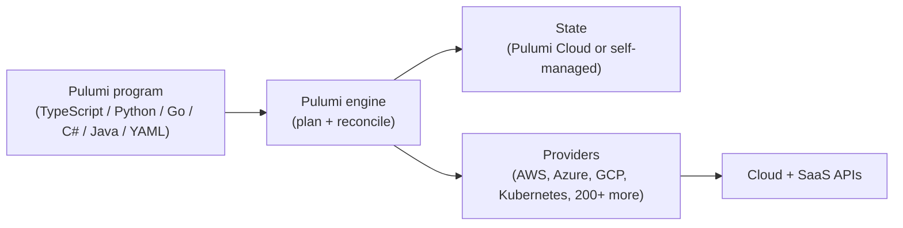

**Pulumi is an open-source infrastructure as code (IaC) platform that lets engineering teams define, deploy, and manage cloud resources on any cloud using general-purpose programming languages (TypeScript, JavaScript, Python, Go, C#, Java) or YAML.** It combines a deployment engine, a multi-language SDK, a registry of more than 200 providers, and a managed control plane (Pulumi Cloud) for state, policy, secrets, and team collaboration.

Pulumi replaces clicking through cloud consoles and one-off scripts with code that you check into Git, review in pull requests, and ship through your existing CI/CD pipeline. Unlike tools built around a custom configuration language, Pulumi lets you use the languages, package managers, IDEs, and testing frameworks your team already knows, while still running on a deterministic, declarative deployment engine.

In this article, we'll cover the key questions about Pulumi:

* Why does Pulumi matter?
* How does Pulumi work?
* What are Pulumi's core components?
* How is Pulumi different from Terraform and CloudFormation?
* What languages and clouds does Pulumi support?
* What are the main Pulumi products?
* Who uses Pulumi?
* How do I get started with Pulumi?
* Frequently asked questions about Pulumi

## Why does Pulumi matter?

Most cloud teams have outgrown the tooling they started with. Console clicks and shell scripts can't keep up with hundreds of resources changing daily, and configuration-language IaC tools force teams to learn a parallel ecosystem alongside the languages they already use. Pulumi exists to close that gap.

### Real languages for real infrastructure

When infrastructure is written in TypeScript, Python, Go, C#, or Java, every feature of the language and its ecosystem comes with it: loops and conditionals, functions, classes, package managers, IDE autocompletion, unit tests, linters, and the wider open-source library catalog. Teams that already write software stop maintaining a second mental model just to manage their cloud.

### A unified workflow across clouds and SaaS

A typical modern application doesn't live in one cloud anymore. It runs on AWS or Azure or Google Cloud, talks to managed databases like Snowflake or MongoDB Atlas, uses Cloudflare or Fastly for edge, sends telemetry to Datadog, and pulls identity from Auth0 or Okta. Pulumi manages all of these through one workflow and one state model, instead of forcing a different tool for each.

### Built for governance from day one

Pulumi was designed for the platform-engineering and security teams who have to keep ahead of a fast-moving cloud footprint. [Policy as code](/docs/insights/policy/), [reusable components](/docs/iac/concepts/components/), encrypted secrets via [Pulumi ESC](/product/esc/), and detailed audit trails are first-class capabilities rather than add-ons.

## How does Pulumi work?

Pulumi follows a declarative model. You write code that describes the desired state of your infrastructure. The Pulumi engine reads that code, compares the result to the current state, and computes the minimal set of cloud API calls needed to reconcile reality with the declaration.



The basic loop:

1. **Write a Pulumi program** in your language of choice. Each resource is an object: an `aws.s3.Bucket`, a `kubernetes.core.v1.Service`, an `azure_native.web.WebApp`.
1. **Run `pulumi preview`** to see exactly what will change. The engine prints a diff of resources to create, update, replace, or delete.
1. **Run `pulumi up`** to apply the changes. The engine drives the cloud APIs in dependency order, handles partial failures, and records the result in state.
1. **Iterate.** Edit the program, send a pull request, let CI run preview and policy checks, merge, deploy.

State (the record of what exists and how it's configured) is stored by default in [Pulumi Cloud](/product/pulumi-cloud/), with encryption, history, and team access controls included. Teams that need a different backend can self-host or use S3, Azure Blob, or Google Cloud Storage instead.

## What are Pulumi's core components?

Pulumi is more than a CLI. The platform is organized into a handful of components that fit together.

| Component | What it does |
|---|---|
| **[Pulumi CLI](/docs/iac/cli/)** | Drives previews, deployments, stack management, and state operations from a developer machine or CI runner. |
| **Language SDKs** | TypeScript, JavaScript, Python, Go, C#, Java, and YAML libraries that expose every supported resource as a strongly-typed object. |
| **[Pulumi Registry](/registry/)** | The catalog of 200+ providers (AWS, Azure, Google Cloud, Kubernetes, Cloudflare, Datadog, Snowflake, GitHub, and more), plus reusable components published by Pulumi and the community. |
| **Pulumi engine** | The declarative reconciler. Computes plans, drives cloud APIs, handles dependencies, and records state. |
| **[Pulumi Cloud](/product/pulumi-cloud/)** | Managed state backend, team collaboration, RBAC, audit logs, deployment runs, and the integration surface for the rest of the products. |
| **[Pulumi IaC](/product/pulumi-iac/)** | The core infrastructure-as-code product: write a program, run `pulumi up`, manage cloud resources. |
| **[Pulumi ESC](/product/esc/)** | Environments, Secrets, and Configuration. Centralized, hierarchical secrets and config that any application, CI job, or Pulumi program can pull from with audit trails. |
| **[Pulumi Insights](/product/pulumi-insights/)** | Search, analytics, and AI over every resource Pulumi manages, across stacks and clouds. |
| **[Pulumi Policies](/docs/insights/policy/)** | Policy as code. Block insecure or non-compliant changes in CI before they deploy. |
| **[Pulumi Deployments](/docs/pulumi-cloud/deployments/)** | Managed CI/CD for Pulumi programs: run `pulumi up` on Pulumi-hosted runners triggered by Git, schedules, or REST API. |
| **[Automation API](/docs/iac/packages-and-automation/automation-api/)** | A programmable interface to the Pulumi engine so you can embed IaC directly inside applications, internal portals, or higher-level platforms. |
| **[Pulumi Neo](/product/neo/)** | A purpose-built AI infrastructure agent that provisions, debugs, and remediates inside the same Pulumi setup, governed by your existing policies. |

Most teams adopt the CLI and one of the language SDKs first, then add Pulumi Cloud for state and collaboration, then layer on ESC, Policies, and Deployments as their footprint grows.

## How is Pulumi different from Terraform and CloudFormation?

Pulumi, Terraform, and AWS CloudFormation are all declarative IaC tools, but they make different choices about language, cloud coverage, and the surrounding platform. A side-by-side:

| Capability | Pulumi | Terraform / OpenTofu | AWS CloudFormation |
|---|---|---|---|
| Languages | TypeScript, JavaScript, Python, Go, C#, Java, YAML | HCL (Terraform's DSL) | YAML or JSON |
| Cloud coverage | 200+ providers, multi-cloud and SaaS | Large provider ecosystem, multi-cloud | AWS only |
| Testing | Native to each language (Jest, Pytest, Go test, xUnit, JUnit) | Limited; mostly via Terratest in Go | Limited |
| Reusable abstractions | Classes, functions, packages — full language features and [components](/docs/iac/concepts/components/) | HCL modules | Nested stacks |
| State backend | Pulumi Cloud (default), S3, Azure Blob, GCS, self-hosted, local | Terraform Cloud, S3, etc. | Managed by AWS |
| Secrets | Encrypted in state; [Pulumi ESC](/product/esc/) for centralized secrets and config | Plaintext in state by default (unless explicitly configured) | Plaintext in templates and stack parameters |
| Policy as code | [Pulumi Policies](/docs/insights/policy/) in Python, JS/TS, or OPA, included | Sentinel (HCP paid tier) or OPA | AWS-specific (Service Control Policies, IAM, Config rules) |
| Licensing | Apache 2.0 (open source) | BUSL 1.1 (source-available, Terraform); MPL (OpenTofu) | Closed, AWS-managed service |

For deeper, capability-by-capability comparisons see [Pulumi vs. Terraform](/docs/iac/concepts/vs/terraform/), [Pulumi vs. CloudFormation](/docs/iac/concepts/vs/cloudformation/), and the full [comparisons index](/docs/iac/concepts/vs/).

## What languages and clouds does Pulumi support?

Pulumi is unusual in giving you a real choice of language *and* cloud.

**Supported languages:**

* TypeScript and JavaScript (Node.js)
* Python
* Go
* C# and other .NET languages
* Java
* YAML (for simple, declarative scenarios or generated code)

**Supported clouds and platforms (selected):**

* AWS, Azure, and Google Cloud (with first-party native providers that map the full provider API)
* Kubernetes (any conformant cluster, including EKS, AKS, GKE, OpenShift, and self-hosted)
* Oracle Cloud, IBM Cloud, Alibaba Cloud, DigitalOcean, Linode, Vultr, Civo
* Private cloud: VMware vSphere, Nutanix, OpenStack, Proxmox
* Edge and SaaS: Cloudflare, Fastly, Datadog, New Relic, Splunk, Snowflake, MongoDB Atlas, Confluent Cloud, Auth0, Okta, GitHub, GitLab, PagerDuty, Stripe, and many more

A full list lives in the [Pulumi Registry](/registry/). Because every provider is exposed through the same SDK shape, a team that already uses Pulumi for AWS can pick up Cloudflare or Datadog without learning a new tool.

## What are the main Pulumi products?

Pulumi's surface area is built around a small set of products that fit together. The platform is anchored on three:

* **[Pulumi IaC](/product/pulumi-iac/)** — the core infrastructure as code product. Write infrastructure in your language, run `pulumi up`, manage any cloud.
* **[Pulumi ESC](/product/esc/)** — Environments, Secrets, and Configuration. Pull configuration and dynamic, short-lived secrets at runtime from a single, audited source. Usable with or without Pulumi IaC.
* **[Pulumi Insights](/product/pulumi-insights/)** — search and AI-driven analytics across every resource you manage, regardless of cloud.

Built on top of those, several capabilities address specific workflows:

* **[Pulumi Cloud](/product/pulumi-cloud/)** — managed state, team collaboration, RBAC, audit logs, and the control plane the other products plug into.
* **[Pulumi Policies](/docs/insights/policy/)** — policy as code that runs in CI to block non-compliant changes before they ship.
* **[Pulumi Deployments](/docs/pulumi-cloud/deployments/)** — managed runners that execute `pulumi up` on Pulumi-hosted infrastructure, triggered by Git events, schedules, or the REST API.
* **[Automation API](/docs/iac/packages-and-automation/automation-api/)** — embed the Pulumi engine inside applications, internal developer platforms, or self-service portals.
* **[Pulumi Neo](/product/neo/)** — an AI agent that operates inside the same Pulumi setup, governed by the same policies, to provision, debug, and remediate infrastructure.

Pulumi IaC is open source under Apache 2.0. Pulumi Cloud and the products built on it have a free tier and paid Team, Enterprise, and Business Critical plans documented on the [pricing page](/pricing/).

## Who uses Pulumi?

Pulumi is used by thousands of teams from early-stage startups to global enterprises. A few public examples:

* **Snowflake** uses Pulumi to manage cloud infrastructure across multiple environments and accelerated deployments significantly after migration.
* **BMW** manages infrastructure for thousands of developers on Pulumi, using shared components and policy as code to enforce consistency across a global engineering organization.
* **Mercedes-Benz, Atlassian, Panasonic, NextEra Energy, and CrowdStrike** all run Pulumi in production for parts of their cloud footprint.

The full list of public stories is on the [case studies](/case-studies/) page.

## How do I get started with Pulumi?

You can have a working Pulumi program deploying real cloud resources in a few minutes.

1. **Install the Pulumi CLI.**

   ```bash
   curl -fsSL https://get.pulumi.com | sh
   ```

1. **Log in to Pulumi Cloud (or pick a different backend).**

   ```bash
   pulumi login
   ```

1. **Create a new project from a template.**

   ```bash
   pulumi new aws-typescript
   ```

   Pick the cloud (AWS, Azure, GCP, Kubernetes, etc.) and language combination that matches your team.

1. **Preview the deployment.**

   ```bash
   pulumi preview
   ```

1. **Deploy.**

   ```bash
   pulumi up
   ```

The full walkthrough — including importing existing resources, wiring up CI/CD, and adding policy as code — lives in the [Get started guide](/docs/iac/get-started/). Teams migrating from other tools can use the converters described in the [adopting Pulumi](/docs/iac/adopting-pulumi/) guide for Terraform HCL, CloudFormation, ARM, and Kubernetes YAML.

## Frequently asked questions about Pulumi

### Is Pulumi open source?

Yes. Pulumi IaC (the engine, CLI, SDKs, and providers) is licensed under Apache 2.0 and developed in the open on [GitHub](https://github.com/pulumi/pulumi). Pulumi Cloud is a separate managed service with a free individual tier and paid plans for teams and enterprises.

### Is Pulumi free?

The Pulumi IaC engine, CLI, SDKs, and providers are free and open source. Pulumi Cloud has a free Individual tier with generous limits for personal and small-project use, and paid plans (Team, Enterprise, Business Critical) for larger teams. See the [pricing page](/pricing/) for current details.

### Which language should I use with Pulumi?

The one your team is most fluent in. TypeScript and Python are the most popular Pulumi languages and have the largest tutorial and example library, but Go, C#, and Java are fully supported. YAML is available for simple cases where a real language is overkill. The choice doesn't lock you in: providers and components are generated for every supported language.

### Can I use Pulumi with my existing Terraform code?

Yes. Pulumi can [convert Terraform HCL](/docs/iac/using-pulumi/adopting-pulumi/migrating-from-terraform/) into a Pulumi program in any supported language, and can also consume existing Terraform modules directly through the [terraform-module](/registry/packages/terraform-module/) provider. Many teams adopt Pulumi gradually, leaving older Terraform stacks in place while writing new infrastructure in Pulumi.

### How does Pulumi handle state?

Pulumi stores a state file that describes the resources it manages. By default, state is held in Pulumi Cloud with encryption, versioning, and team access controls. Self-managed backends — S3, Azure Blob, Google Cloud Storage, or a local file — are also supported. Secrets in state are always encrypted at rest with a key you control.

### Does Pulumi work with Kubernetes?

Yes. Pulumi has a first-class Kubernetes provider that supports raw manifests, Helm charts, kustomize directories, and CRDs. You can also use Pulumi to provision the cluster itself (EKS, AKS, GKE, or self-hosted) and then deploy workloads onto it from the same program. See the [Kubernetes guide](/docs/iac/clouds/kubernetes/) for examples.

### How does Pulumi integrate with CI/CD?

Pulumi integrates with every major CI/CD system (GitHub Actions, GitLab CI, CircleCI, Jenkins, Azure DevOps, Buildkite, Argo, and more) through CLI invocations gated by automated tests and policy checks. Teams that don't want to manage their own runners can use [Pulumi Deployments](/docs/pulumi-cloud/deployments/), which runs `pulumi up` on managed infrastructure triggered by Git events, schedules, or REST calls. See the [CI/CD guide](/docs/iac/packages-and-automation/continuous-delivery/) for details.

### Is Pulumi SOC 2 compliant?

Yes. Pulumi Cloud maintains SOC 2 Type II compliance, and the [Trust Center](https://trust.pulumi.com/) documents the company's broader security and compliance posture, including encryption, access control, and incident response.

### How does Pulumi handle secrets?

Secrets in Pulumi state are encrypted by default with a key you control (Pulumi Cloud-managed by default, or your own KMS/HSM if you prefer). For centralized, cross-environment secret and config management, [Pulumi ESC](/product/esc/) lets applications, CI jobs, and Pulumi programs pull dynamic, short-lived secrets from a single audited source instead of embedding long-lived credentials in code or pipeline variables.

### Can I self-host Pulumi?

Yes. The Pulumi engine, CLI, SDKs, and providers run anywhere. State can be kept in a self-managed backend (S3, Azure Blob, GCS, or local), and a self-hosted version of [Pulumi Cloud](/product/pulumi-cloud/) is available for customers with strict data-residency or air-gap requirements.

## Learn more

Pulumi is built for engineering teams that want to manage cloud infrastructure with the same languages, tools, and engineering discipline they already use for application code. [Get started today](/docs/iac/get-started/), explore the [Pulumi Registry](/registry/), or [request a demo](/contact?form=demo) of the platform.

Related reading:

* [What is Infrastructure as Code (IaC)?](/what-is/what-is-infrastructure-as-code/)
* [What is DevOps?](/what-is/what-is-devops/)
* [What is Platform Engineering?](/what-is/what-is-platform-engineering/)
* [What is CI/CD?](/what-is/what-is-ci-cd/)
* [What is Secrets Management?](/what-is/what-is-secrets-management/)
* [What is Cloud Security?](/what-is/what-is-cloud-security/)
