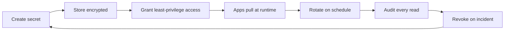

**Secrets management is the practice of securely storing, distributing, rotating, and auditing the credentials (passwords, API keys, certificates, tokens, and encryption keys) that applications and infrastructure need to operate.** Done well, it keeps those credentials out of source code, CI logs, and developer laptops, and brokers them to the systems that actually need them through a single audited interface.

The discipline exists because every non-trivial system needs credentials to do its job, and every leaked credential is a breach waiting to happen. Modern teams centralize secrets in a dedicated vault (HashiCorp Vault, AWS Secrets Manager, Azure Key Vault, Google Cloud Secret Manager), pull them at runtime instead of baking them into images or config files, rotate them on a schedule, and log every read. [Pulumi ESC](/product/esc/) sits one layer above those vaults, composing environments and brokering secrets to Pulumi programs, CI jobs, and applications from whichever vault each team already uses.

In this article, we'll cover the key questions about secrets management:

* Why does secrets management matter?
* What counts as a secret?
* What are the biggest risks of poor secrets management?
* What does a secrets management workflow look like?
* What are the leading secrets management tools?
* How do the major vault tools compare?
* What are secrets management best practices?
* How does secrets management work in CI/CD?
* How does secrets management support compliance?
* How does Pulumi ESC fit into secrets management?
* Frequently asked questions about secrets management

## Why does secrets management matter?

Credentials are the single most common target in modern breaches. Verizon's annual *Data Breach Investigations Report* has consistently found stolen credentials in the top three initial-access vectors, and GitGuardian's *State of Secrets Sprawl* reports continue to find millions of new secrets leaked into public repositories every year. Three forces make this an engineering-leadership concern, not a back-office one.

### Credentials are everywhere

A typical cloud-native app pulls dozens of secrets at runtime: database passwords, cloud IAM keys, API tokens for third-party services, TLS private keys, signing keys, OIDC client secrets, encryption keys. Multiply that by every environment (dev, staging, prod, per-tenant) and every team, and the number quickly reaches the thousands.

### A single leak can compromise everything

Most secrets are gates to something larger: a cloud account, a customer database, a deploy pipeline. Attackers who acquire one credential typically pivot to others. Long-lived, broadly-scoped credentials make that pivot trivial.

### Regulators and customers now ask

SOC 2, ISO 27001, HIPAA, PCI DSS, and FedRAMP all require demonstrable controls over how secrets are stored, accessed, rotated, and audited. Enterprise procurement teams now routinely ask SaaS vendors to describe their secrets management program before signing.

## What counts as a secret?

A secret is any value that an attacker could use to impersonate, decrypt, or escalate. The common categories:

* **Passwords and service-account credentials.** Database logins, admin accounts, machine-to-machine credentials.
* **API keys and tokens.** Long-lived API keys for third-party SaaS, OAuth refresh tokens, PATs.
* **Cloud provider credentials.** AWS access keys, Azure service principal secrets, GCP service account keys.
* **SSH keys.** Private keys used to access servers or sign Git commits.
* **TLS and code-signing certificates.** Private keys for serving HTTPS or signing release artifacts.
* **Encryption keys.** Symmetric keys for application-layer encryption, KMS data keys, customer-managed keys (CMEK).
* **Database connection strings.** Frequently embed both endpoint and credential in a single string.
* **OIDC client secrets and webhook signing secrets.** Used in federation and inbound API verification.

Configuration values that look like secrets (e.g. internal hostnames) usually aren't — but they're often stored in the same system because the access-control and rotation needs overlap.

## What are the biggest risks of poor secrets management?

The recurring incident patterns:

1. **Secrets committed to source control.** A developer pastes an API key into a config file, commits, and pushes. Even after rewriting Git history, the key is considered compromised. GitGuardian's research consistently finds millions of secrets newly exposed in public repos each year.
1. **Plaintext secrets in CI logs.** A misconfigured pipeline echoes a token into a build log that's retained, indexed, and visible to anyone with repo access.
1. **Long-lived, broad-scope credentials.** A single AWS access key with `*` permissions that's been valid for years. When it leaks, the blast radius is the entire account.
1. **Shared credentials.** "The production database password" used by ten services and two dozen engineers. Rotation becomes a coordinated outage; revocation gets put off.
1. **No audit trail.** No one can answer "who read this secret last Tuesday?" Compliance frameworks and incident response both fail at that question.
1. **No rotation.** Credentials that were created in 2019 and have never been changed. Each year of age increases the probability of compromise.
1. **Insecure distribution.** Secrets shared over Slack, email, or unencrypted config files because there's no better path.

A serious secrets program addresses all seven.

## What does a secrets management workflow look like?

A mature secrets workflow has the same shape regardless of which vault you use.

The seven stages:

1. **Create.** Generate a strong, unique credential. Prefer dynamic, short-lived credentials over static ones.
1. **Store.** Encrypt at rest using a KMS- or HSM-backed key. Never store in plain text.
1. **Grant access.** Use identity-based, least-privilege access control (RBAC or ABAC). Prefer workload identity over long-lived API keys.
1. **Consume.** Applications and Pulumi programs fetch secrets at runtime from the vault — not from environment files baked into images.
1. **Rotate.** Replace credentials on a regular schedule (or on demand after suspicion of compromise). Automate so rotation doesn't require a maintenance window.
1. **Audit.** Log every read with identity, timestamp, and source IP. Ship logs to a SIEM.
1. **Revoke.** When a credential is compromised or an employee leaves, the vault is the single place to cut access.

## What are the leading secrets management tools?

The market has consolidated around five categories of tool. Most organizations use more than one.

* **[HashiCorp Vault](/what-is/what-is-hashicorp-vault/).** Open source and enterprise editions. Strongest dynamic-secrets story (database credentials, cloud IAM, PKI generated on demand and short-lived). Common in multi-cloud and hybrid environments.
* **[AWS Secrets Manager](/what-is/what-is-aws-secrets-manager/).** KMS-backed, with built-in Lambda-driven rotation for RDS, Redshift, and DocumentDB. The default in AWS-centric organizations.
* **[Azure Key Vault](/what-is/what-is-azure-key-vault/).** Managed HSM and Standard tiers. Tight integration with Microsoft Entra ID and Managed Identity. The default in Azure-centric organizations.
* **[Google Cloud Secret Manager](/what-is/what-is-google-cloud-secret-manager/).** IAM-based access, automatic or user-managed replication, CMEK support. The default in Google Cloud-centric organizations.
* **[Pulumi ESC](/product/esc/).** Environments, Secrets, and Configuration. Composes secrets and config across vaults and providers, brokers dynamic OIDC credentials, and exposes a single interface to applications, CI, and Pulumi programs. Sits *above* the cloud-native vaults rather than replacing them.

Kubernetes ships with built-in [Kubernetes Secrets](/what-is/what-are-kubernetes-secrets/), and Docker has [Docker Secrets](/what-is/what-are-docker-secrets/) for Swarm. Both are useful primitives but neither is a substitute for a real vault. See how [different secrets managers compare](/docs/esc/vs).

## How do the major vault tools compare?

| Capability | HashiCorp Vault | AWS Secrets Manager | Azure Key Vault | Google Cloud Secret Manager |
|---|---|---|---|---|
| Deployment model | Self-hosted or HCP managed | Fully managed (AWS) | Fully managed (Azure) | Fully managed (GCP) |
| Dynamic secrets | Yes (databases, cloud IAM, PKI, SSH) | Limited (Lambda rotation) | Limited (via Functions) | No (manual rotation) |
| Built-in rotation | Yes | Yes (RDS, Redshift, DocumentDB, others via Lambda) | Yes (certificates; secrets via Functions) | Not built-in |
| HSM-backed keys | Vault Enterprise / HCP | KMS Custom Key Stores | Managed HSM (Premium) | Cloud HSM via CMEK |
| Multi-region replication | Performance and DR replicas | Multi-Region replication | Geo-redundant pairs | Automatic or user-managed |
| Primary auth model | Tokens, AppRole, cloud IAM, OIDC, K8s, more | AWS IAM | Microsoft Entra ID + RBAC | Google Cloud IAM |
| Pricing model | OSS free; Enterprise per-cluster; HCP per-hour | Per secret/month + API calls | Per operation; HSM per key | Per active secret version + access ops |

For a deeper breakdown of vendor differences and how Pulumi ESC sits above them, see the [ESC comparison docs](/docs/esc/vs).

## What are secrets management best practices?

A short list that holds up across every vault:

* **Never commit secrets to source control.** Use a pre-commit hook (gitleaks, trufflehog) and GitHub's push-protection feature to enforce it.
* **Centralize in a dedicated vault.** Pick one cloud-native vault per cloud, and use [Pulumi ESC](/product/esc/) to compose them if you span more than one.
* **Pull at runtime, don't bake at build.** Container images and IaC artifacts should never contain plaintext secrets.
* **Prefer short-lived, dynamic credentials.** Use OIDC federation to issue short-lived cloud credentials to CI jobs instead of long-lived access keys.
* **Enforce least privilege.** Each app, pipeline, or service identity gets only the secrets it needs.
* **Rotate on a schedule.** Automate rotation; don't rely on humans remembering.
* **Audit every read.** Ship vault audit logs to a SIEM and alert on unusual patterns.
* **Separate environments.** Dev, staging, and production secrets live in different vaults or different paths with different ACLs.
* **Plan for break-glass.** A documented, audited process for emergency access when the normal path fails.
* **Encrypt in transit and at rest.** TLS for every API call to the vault; KMS- or HSM-backed encryption for storage.

## How does secrets management work in CI/CD?

CI/CD pipelines are the single most common place secrets get exposed, because they need real production credentials to do their job. The modern pattern:

1. **The pipeline authenticates with workload identity, not a long-lived key.** GitHub Actions, GitLab CI, and CircleCI all support OIDC federation: the pipeline presents a short-lived JWT to AWS, Azure, or GCP, and gets back a short-lived cloud credential. No static cloud keys live in the CI system.
1. **The pipeline pulls secrets from the vault at runtime.** Not from CI-level secret stores when avoidable. The vault is the single source of truth.
1. **Secrets are masked in logs.** Most CI systems auto-mask values that came from their secret store, but values fetched at runtime have to be explicitly registered for masking.
1. **The pipeline uses ephemeral credentials wherever possible.** Database credentials generated on-demand by Vault, cloud credentials federated through OIDC, signing tokens scoped to a single deployment.

[Pulumi ESC](/product/esc/) directly addresses this: a pipeline opens a Pulumi ESC environment, which dynamically generates cloud credentials via OIDC and exports the relevant secrets as environment variables — no long-lived keys to manage.

## How does secrets management support compliance?

Almost every compliance framework includes secrets-relevant controls.

| Framework | Secrets-relevant requirement |
|---|---|
| SOC 2 (Trust Services Criteria) | Logical access controls, encryption of sensitive information, audit logging |
| ISO/IEC 27001 (Annex A) | Access control (A.9), cryptography (A.10), operational security (A.12) |
| HIPAA Security Rule | Access controls (164.312(a)), audit controls (164.312(b)), transmission security (164.312(e)) |
| PCI DSS 4.0 | Requirement 3 (protect stored data), 8 (identify and authenticate users) |
| FedRAMP / NIST 800-53 | AC-2, AC-3, AC-6, AU-2, AU-3, IA-2, IA-5, SC-12, SC-13 |

A real secrets management program produces the artifacts auditors want: who can read what, who did read what, when secrets were last rotated, and where the encryption keys live. See [What is SOC 2?](/what-is/what-is-soc-2/) for how that maps to the most common SaaS-vendor attestation.

## How does Pulumi ESC fit into secrets management?

Pulumi ESC (Environments, Secrets, and Configuration) is a layer that sits *above* your existing vaults and pulls them together into composable, hierarchical environments. It doesn't replace HashiCorp Vault, AWS Secrets Manager, Azure Key Vault, or Google Cloud Secret Manager — it brokers access to them.

Concrete patterns:

* **Compose secrets across vaults.** A single Pulumi ESC environment can pull database credentials from HashiCorp Vault, cloud IAM credentials from AWS via OIDC, an API key from Azure Key Vault, and a CMEK reference from GCP Secret Manager.
* **Generate dynamic cloud credentials.** ESC mints short-lived AWS, Azure, or GCP credentials via OIDC at the moment they're needed, with no long-lived keys in any system.
* **Hierarchical environments.** Compose a `production-base` environment, then layer `production-us-east` on top of it. Changes to base flow through.
* **Single consumption interface.** Pulumi programs, CI jobs, application runtimes, and the `esc` CLI all see the same audited interface, regardless of which vault each secret actually lives in.
* **End-to-end audit.** Every read of an ESC environment is logged with identity, timestamp, and which downstream provider was called.

Pulumi ESC works hand-in-hand with [Pulumi IaC](/docs/iac/) but also stands alone — many teams use it purely as a secrets broker, with no Pulumi-managed infrastructure at all. See the [ESC documentation](/docs/pulumi-cloud/esc/) for setup and provider catalog.

## Frequently asked questions about secrets management

### What is secrets management in simple terms?

The discipline of keeping the passwords, keys, and tokens that systems need to run somewhere safer than a config file, and giving them out only to the right identity at the right time, with a record of every access.

### What is the difference between secrets management and key management?

Key management (e.g. AWS KMS, Azure Key Vault keys, Google Cloud KMS) is about cryptographic keys used for encryption and signing. Secrets management covers the broader category of credentials. The two overlap because secrets managers usually rely on key managers under the hood — the master key that encrypts the secrets is itself a key managed by a KMS.

### What is a dynamic secret?

A credential generated on demand for a specific consumer, with a short lifetime and automatic revocation. HashiCorp Vault generates dynamic database credentials, cloud IAM credentials, and PKI certificates. The point is to remove long-lived static credentials from the system entirely.

### How often should secrets be rotated?

It depends on the credential. Best practice ranges from continuous rotation (dynamic credentials, valid for minutes or hours) to 30–90 days for service-account passwords and API keys, to annual for TLS certificates (or whatever the issuer enforces). Rotation should always happen on confirmed or suspected compromise, regardless of schedule.

### How does Pulumi ESC integrate with HashiCorp Vault and the cloud vaults?

ESC ships first-party providers for HashiCorp Vault, AWS Secrets Manager, Azure Key Vault, and Google Cloud Secret Manager. You point an ESC environment at one or more of those vaults; ESC fetches secrets on demand, applies access policy, logs the read, and exposes the result to whatever's consuming the environment (a Pulumi program, a CI job, an application). See the [ESC providers list](/docs/pulumi-cloud/esc/providers/).

### Can I use secrets management without using Pulumi for infrastructure?

Yes. Pulumi ESC is useful on its own as a centralized secrets and configuration broker. Many teams use it to drive CI jobs, Kubernetes workloads, and applications without using Pulumi IaC at all.

### What's the difference between AWS Secrets Manager and AWS Systems Manager Parameter Store?

Both store values. Secrets Manager adds automatic rotation, cross-region replication, and (slightly) higher per-secret cost; it's the right home for genuine secrets. Parameter Store is cheaper and a better fit for general configuration values, including SecureString parameters when occasional encrypted storage is all you need.

### Should I use environment variables for secrets?

For local development, sometimes. For production, only as the transport mechanism into a process — and only if the process exits without writing the variables to logs. Environment variables are visible to anyone who can `inspect` the container or read `/proc`, so they're a delivery channel, not a storage layer.

### Are Kubernetes Secrets actually secure?

Out of the box, they're base64-encoded, not encrypted, and stored in etcd. They become real secrets once you enable encryption at rest with a KMS provider (AWS KMS, Azure Key Vault, Google Cloud KMS) and lock down RBAC. Many teams use external-secrets-operator or similar tooling to populate Kubernetes Secrets from a real vault.

### How do I migrate from an existing secrets manager to Pulumi ESC?

ESC's import providers let you read existing secrets from HashiCorp Vault, AWS Secrets Manager, Azure Key Vault, or Google Cloud Secret Manager without copying them. You can adopt ESC incrementally by pointing it at the vaults you already have, then layer additional environments and rotation policies on top. See the [ESC providers catalog](/docs/pulumi-cloud/esc/providers/).

## Learn more

Pulumi helps engineering teams put secrets management on a defensible footing: every credential lives in a vault, every read goes through an audited interface, and dynamic credentials replace long-lived keys wherever possible. [Get started with Pulumi ESC](/docs/pulumi-cloud/esc/) to compose secrets across HashiCorp Vault, AWS, Azure, and GCP from a single environment definition.

Related reading:

* [What is HashiCorp Vault?](/what-is/what-is-hashicorp-vault/)
* [What is AWS Secrets Manager?](/what-is/what-is-aws-secrets-manager/)
* [What is Azure Key Vault?](/what-is/what-is-azure-key-vault/)
* [What is Google Cloud Secret Manager?](/what-is/what-is-google-cloud-secret-manager/)
* [What is Cloud Security?](/what-is/what-is-cloud-security/)
* [What is SOC 2?](/what-is/what-is-soc-2/)
* [What are Kubernetes Secrets?](/what-is/what-are-kubernetes-secrets/)
