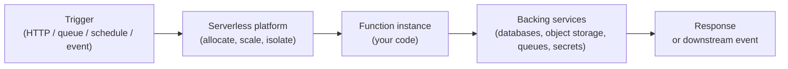

**Serverless is a cloud computing execution model in which the cloud provider runs, scales, and patches the underlying servers on demand, so developers deploy code (typically as functions or containers) and pay only for the resources their code actually uses while it runs.** The name doesn't mean servers are gone; it means you no longer provision, capacity-plan, or operate them.

Serverless platforms (AWS Lambda, Azure Functions, Google Cloud Functions and Cloud Run, Cloudflare Workers, Netlify Functions, Vercel Functions) handle scale, fault tolerance, and capacity automatically. You write the code, configure the trigger, and the platform takes care of the rest. The trade-off is less control over the runtime environment and a different cost model than long-running VMs or containers.

In this article, we'll cover the key questions about serverless:

* Why does serverless matter?
* How does serverless work?
* What is the difference between serverless and functions as a service (FaaS)?
* How is serverless different from containers and VMs?
* What are the benefits of serverless?
* What are the trade-offs and limits of serverless?
* What are common serverless use cases?
* How should I design a serverless application?
* How do I deploy serverless infrastructure with Pulumi?
* Frequently asked questions about serverless

## Why does serverless matter?

Serverless changes the unit of cloud consumption from "a machine that's always running" to "a function that runs on demand." Three things make that shift important.

### You pay only for what you use

Long-running VMs and containers cost money even when idle. Serverless platforms typically bill per request and per millisecond of compute, so workloads that are bursty, infrequent, or event-driven cost a fraction of what an equivalent always-on instance would.

### Scale is the platform's problem

Serverless functions scale horizontally without configuration — from zero to thousands of concurrent executions and back to zero. There is no capacity plan to maintain, no autoscaling group to tune, and no warm pool to babysit.

### Operations move to the provider

Patching the operating system, hardening the runtime, replacing failed hosts, and load-balancing requests are no longer your problem. That moves a non-trivial amount of work off the customer side of the [shared responsibility model](/what-is/what-is-cloud-security/) and onto the cloud provider.

## How does serverless work?

A serverless function lives as code in a deployment package and a configuration that describes when it should run. The platform stores the code, listens for the configured trigger, and spins up an isolated execution environment on demand.



The basic lifecycle:

1. A trigger fires (an HTTP request, a queue message, a scheduled timer, an object-storage event, an IoT message).
1. The platform allocates an isolated execution environment, often a lightweight VM or microVM, and loads your code (the *cold start* if no instance is already warm).
1. Your function runs with the event payload, executes its logic, and returns a response or emits downstream events.
1. The platform may keep the instance warm to handle additional invocations or shut it down to reclaim resources.
1. You're billed for the request count and the milliseconds of compute that actually ran.

State that has to survive between invocations belongs in an external service: object storage, a managed database, a cache, or a queue. The function itself is treated as stateless.

## What is the difference between serverless and functions as a service (FaaS)?

The two terms overlap, but they're not synonyms.

**Functions as a service (FaaS)** describes the specific execution model where you upload a function, the platform runs it in response to events, and you pay per invocation. AWS Lambda, Azure Functions, Google Cloud Functions, Cloudflare Workers, and Netlify Functions are FaaS platforms.

**Serverless** is the broader category. FaaS is one kind of serverless service, but serverless also includes managed databases (DynamoDB on-demand, Aurora Serverless, Firestore), serverless containers (AWS Fargate, Google Cloud Run, Azure Container Apps), and serverless event/messaging (EventBridge, Pub/Sub, SQS). What unifies them is the no-provisioning, pay-per-use, scale-to-zero operating model.

| Concept | Scope | Examples |
|---|---|---|
| FaaS | Function-level execution, event-driven, short-lived | AWS Lambda, Azure Functions, Google Cloud Functions, Cloudflare Workers |
| Serverless containers | Long-lived processes, no host management | AWS Fargate, Google Cloud Run, Azure Container Apps |
| Serverless data | Managed storage and databases with on-demand scale | DynamoDB, Aurora Serverless, Firestore, S3, Cosmos DB serverless |
| Serverless integration | Event routing, queues, workflows | EventBridge, Step Functions, Pub/Sub, SNS, SQS |

Most modern "serverless applications" combine all four.

## How is serverless different from containers and VMs?

Serverless, containers, and VMs sit on a spectrum of how much of the stack the provider manages and how much you do.

| Concern | VMs (IaaS) | Containers / Kubernetes | Serverless |
|---|---|---|---|
| Server provisioning | Customer | Customer (control plane) | Provider |
| OS patching | Customer | Customer or managed | Provider |
| Capacity planning | Customer | Customer | Provider |
| Scaling | Manual or autoscaling group | HPA / cluster autoscaler | Automatic, per request |
| Pricing model | Per-hour/instance | Per-node + workload | Per-request, per-ms |
| Startup time | Minutes | Seconds | Milliseconds to seconds (with possible cold starts) |
| Workload fit | Anything | Most stateless and many stateful workloads | Event-driven, bursty, stateless |

The point isn't that one is universally better. Each model trades control for managed-ness. Most production architectures end up combining all three.

## What are the benefits of serverless?

* **Cost-efficiency.** Pay only for the milliseconds your code runs. For bursty or infrequent workloads, this can be 10x cheaper than an equivalent always-on container or VM.
* **Automatic scaling.** From zero to thousands of concurrent executions and back to zero, with no configuration.
* **Reduced operational overhead.** No OS patching, no autoscaling tuning, no capacity planning. Developers spend more time on application logic.
* **Faster time to market.** A new endpoint or background job is a function plus a trigger, not a deployment pipeline plus a cluster plus an autoscaling policy.
* **Built-in high availability.** Major serverless platforms run across multiple availability zones by default.
* **Natural fit for event-driven architectures.** Functions plus managed event sources (queues, streams, schedules, object-storage events) compose cleanly.

## What are the trade-offs and limits of serverless?

Serverless isn't free of trade-offs. The ones that catch teams most often:

* **Cold starts.** A function that hasn't run recently needs an execution environment spun up, which adds latency (typically tens to hundreds of milliseconds, sometimes more for JVM or .NET runtimes). Provisioned concurrency mitigates this at a cost.
* **Execution time and resource limits.** FaaS platforms cap maximum execution time (AWS Lambda is 15 minutes, Cloudflare Workers is much less, Cloud Run is hours), memory, payload size, and concurrent invocations.
* **Statelessness.** Functions are designed to be stateless. Anything that needs to persist between invocations belongs in an external service.
* **Cost surprises at scale.** Per-invocation pricing wins at low and medium volumes but can be more expensive than a containerized service at sustained high throughput.
* **Vendor coupling.** Triggers and integrations differ between providers, and porting a serverless application from one cloud to another usually requires non-trivial rework.
* **Observability and debugging.** Distributed event-driven systems are harder to trace end-to-end than monolithic services. Tools like OpenTelemetry, AWS X-Ray, Datadog APM, and Honeycomb help, but the discipline is its own learning curve.
* **Cold-path security still applies.** IAM, secrets management, dependency hygiene, and least-privilege configuration are still your responsibility. The provider's defaults are not always the safest ones.

## What are common serverless use cases?

Serverless is a good fit when workloads are event-driven, spiky, or short-lived. Typical patterns:

1. **HTTP APIs and webhooks.** Serverless functions behind an API gateway or HTTP trigger handle requests at any scale without managing servers.
1. **Background processing.** Image processing, file conversion, report generation, and other queue-driven jobs run efficiently when the workload is bursty.
1. **Event-driven pipelines.** React to object-storage uploads, database changes, queue messages, or IoT events with chained functions.
1. **Scheduled tasks.** Replace traditional cron jobs with serverless schedules that don't require a host to run on.
1. **Real-time data processing.** Stream processors fed by Kinesis, Kafka, Pub/Sub, or Event Hubs scale per shard.
1. **Edge computing.** Cloudflare Workers, AWS Lambda@Edge, and Fastly Compute@Edge run code close to users for low-latency personalization, authentication, and rendering.
1. **Glue between SaaS systems.** Webhooks from Stripe, GitHub, Auth0, Slack, and similar services trigger functions that translate and route the data.
1. **Backends for static sites and JAMstack apps.** Pair static hosting with serverless functions for forms, authentication, and dynamic features.

## How should I design a serverless application?

Serverless rewards a few design principles that don't always match how monoliths were built.

### Keep functions focused

A function should do one thing. If it has multiple responsibilities, split it. Smaller functions are easier to test, easier to scale independently, and faster to cold start.

```go
// The 'date' function returns the current date
mux.HandleFunc("/api/date", func(w http.ResponseWriter, r *http.Request) {
    w.Header().Set("Content-Type", "application/json")
    w.Write([]byte(fmt.Sprintf(`{ "now": %d }`, time.Now().UnixNano()/1000000)))
})

// The 'weather' function returns the weather
mux.HandleFunc("/api/weather", func(w http.ResponseWriter, r *http.Request) {
    weather := getWeatherData()
    responseJSON, _ := json.Marshal(weather)
    w.Header().Set("Content-Type", "application/json")
    w.Write(responseJSON)
})
```

### Embrace statelessness

Functions should not depend on local state between invocations. Persist anything that has to survive in object storage, a database, or a cache.


The stateless model is also why HTTP-based APIs are a natural fit for serverless: each request is already independent.

### Pick the right trigger

Common triggers include HTTP requests, queue messages, scheduled timers, and object-storage events. Each has different latency, retry, and ordering semantics. Pick the one whose guarantees match your workload, not whichever is easiest.

### Avoid direct cross-function references

Functions that call other functions synchronously create tight coupling and amplified blast radius when one breaks. Prefer asynchronous communication through queues, topics, or event buses. The decoupling improves flexibility, scalability, and resilience.

### Build with least privilege

Give each function a dedicated IAM role with only the permissions it actually needs. Pull secrets at runtime from a centralized store like [Pulumi ESC](/product/esc/), AWS Secrets Manager, or HashiCorp Vault rather than embedding them in environment variables.

### Plan for observability

Add structured logging, metrics, and distributed tracing (OpenTelemetry, AWS X-Ray, Datadog) from the start. Debugging a serverless event chain after the fact without traces is painful.

## How do I deploy serverless infrastructure with Pulumi?

Pulumi treats serverless resources (functions, triggers, queues, event buses, API gateways, IAM roles) the same way it treats any other cloud resource: as code in TypeScript, JavaScript, Python, Go, C#, or Java. A typical Pulumi program defines the function, its IAM role, the trigger, and any backing services in one place.

A minimal AWS Lambda example in TypeScript:

```typescript
import * as pulumi from "@pulumi/pulumi";
import * as aws from "@pulumi/aws";

const role = new aws.iam.Role("lambda-role", {
    assumeRolePolicy: aws.iam.assumeRolePolicyForPrincipal({ Service: "lambda.amazonaws.com" }),
});

new aws.iam.RolePolicyAttachment("lambda-basic", {
    role: role.name,
    policyArn: aws.iam.ManagedPolicy.AWSLambdaBasicExecutionRole,
});

const fn = new aws.lambda.Function("hello", {
    runtime: aws.lambda.Runtime.NodeJS20dX,
    role: role.arn,
    handler: "index.handler",
    code: new pulumi.asset.AssetArchive({
        "index.js": new pulumi.asset.StringAsset(
            "exports.handler = async () => ({ statusCode: 200, body: 'hello' });",
        ),
    }),
}, {
    dependsOn: [role],
});

export const functionArn = fn.arn;
```

Pulumi has serverless coverage across every major cloud:

* **AWS:** Lambda, API Gateway, EventBridge, SQS, SNS, Step Functions, Fargate.
* **Azure:** Functions, Event Grid, Service Bus, Logic Apps, Container Apps.
* **Google Cloud:** Cloud Functions, Cloud Run, Pub/Sub, Eventarc, Workflows.
* **Cloudflare:** Workers, Durable Objects, Queues, R2.

Browse [serverless templates](/templates/?language=typescript) or follow the [getting started guide](/docs/iac/get-started/) for a full walkthrough.

## Frequently asked questions about serverless

### Is serverless really "serverless"?

No. The servers still exist; the cloud provider operates them so you don't have to. "Serverless" is a developer-experience claim — no provisioning, no patching, no capacity planning on your side — not a literal claim about hardware.

### What's the difference between serverless and FaaS?

FaaS (functions as a service) is one kind of serverless. Serverless is the broader category and also includes serverless containers (Cloud Run, Fargate), serverless databases (DynamoDB on-demand, Aurora Serverless), and serverless event services (EventBridge, Pub/Sub). All share the no-provisioning, pay-per-use model.

### What is a cold start?

A cold start happens when the platform has to spin up a new execution environment because no warm instance is available. The added latency ranges from tens of milliseconds (Cloudflare Workers, Node.js Lambda) to several seconds (JVM- or .NET-based runtimes). Provisioned concurrency and lightweight runtimes can mitigate it.

### When should I not use serverless?

Workloads with sustained high throughput, very long execution times, GPU requirements, low-latency requirements that can't tolerate cold starts, or strict data-residency rules that don't match the provider's footprint may be better served by containers or VMs. Serverless is a great fit for event-driven, bursty, and short-lived workloads; less so for steady-state compute.

### How does serverless pricing work?

Most FaaS platforms bill per invocation plus per gigabyte-second of compute. Cloud Run and similar serverless container platforms typically bill per vCPU-second and per gigabyte-second of memory. Storage, network, and event-service costs are separate. Modeling these for a given workload is worth doing before committing.

### Is serverless secure?

It can be, but you still own a lot. The provider handles physical security, host patching, and hypervisor isolation. You still configure IAM, manage secrets, hardening dependencies, and apply [policy as code](/docs/insights/policy/). See [What is Cloud Security?](/what-is/what-is-cloud-security/) for the broader picture.

### How do I test serverless code?

Unit-test your handler functions like any other code. For integration tests, use the cloud's local emulators (LocalStack, the Azure Functions Core Tools, the Functions Framework) or deploy to a dedicated test environment with Pulumi and run real tests against it. Avoid mocking the cloud SDK too aggressively — integration bugs are where serverless apps usually break.

### How do I avoid vendor lock-in with serverless?

Pure portability across serverless platforms is hard because triggers and integrations differ. The realistic options are: keep handler logic separate from platform glue, use container-based serverless (Cloud Run, Container Apps, Fargate) which is more portable than FaaS, or accept lock-in for the parts of the stack where it pays for itself and avoid it elsewhere.

### Can serverless run long-running jobs?

Most FaaS platforms cap execution at a few minutes (AWS Lambda is 15 minutes). For longer jobs, use serverless containers (Cloud Run, Container Apps, Fargate), chain functions via queues or Step Functions, or schedule the long-running portion on a different runtime.

### How does serverless work with Kubernetes?

Knative, OpenFaaS, and Kubeless bring a serverless programming model to Kubernetes clusters, scaling pods to zero and back. Many managed services (Cloud Run, Azure Container Apps) are built on top of Knative. For teams already invested in Kubernetes, a Knative-based platform combines familiar tooling with serverless economics.

## Learn more

Pulumi treats serverless resources the same as any other cloud infrastructure: as code in TypeScript, Python, Go, C#, or Java, with deterministic deploys, encrypted state, and policy as code on every change. Whether you're shipping a single Lambda or a multi-cloud event-driven application, the workflow is the same: write the program, preview it, deploy it.

[Get started with Pulumi today](/docs/iac/get-started/), explore the [Pulumi Registry](/registry/) for serverless providers, or browse the [serverless templates](/templates/?language=typescript).

Related reading:

* [What is Infrastructure as Code (IaC)?](/what-is/what-is-infrastructure-as-code/)
* [What is Pulumi?](/what-is/what-is-pulumi/)
* [What is CI/CD?](/what-is/what-is-ci-cd/)
* [What is DevOps?](/what-is/what-is-devops/)
* [What is Platform Engineering?](/what-is/what-is-platform-engineering/)
* [What is Cloud Security?](/what-is/what-is-cloud-security/)
