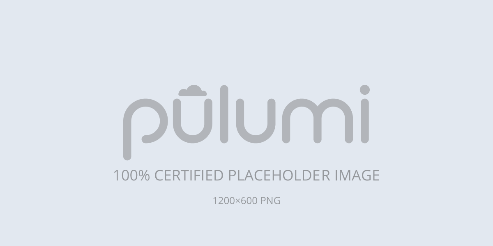

The $CLOUD $ARCHITECTURE template creates an infrastructure as code project that deploys a $THING to $CLOUD with Pulumi. It uses this resource, this other resource, and probably some other awesome resource to accomplish some particular desirable outcome. The template generates a complete Pulumi program, including $INCLUDED_STUFF, to give you a working project out of the box that you can customize easily and extend to suit your needs.



## Using this template

To use this template to deploy your own $THING, make sure you've [installed Pulumi]() and [configured your $CLOUD credentials](), then create a new [project]() using the template in your language of choice:

{}

{}

```bash
$ mkdir my-site && cd my-site
$ pulumi new architecture-cloud-typescript
```

{}

{}

```bash
$ mkdir my-site && cd my-site
$ pulumi new architecture-cloud-python
```

{}

{}

```bash
$ mkdir my-site && cd my-site
$ pulumi new architecture-cloud-go
```

{}

{}

```bash
$ mkdir my-site && cd my-site
$ pulumi new architecture-cloud-csharp
```

{}

{}

```bash
$ mkdir my-site && cd my-site
$ pulumi new architecture-cloud-yaml
```

{}

Follow the prompts to complete the new-project wizard. When it's done, you'll have a complete Pulumi project that's ready to deploy and configured with the most common settings. Feel free to inspect the code in  for a closer look.

## Deploying the project

The template requires no additional configuration. Once the new project is created, you can deploy it immediately with [`pulumi up`]():

```bash
$ pulumi up
```

When the deployment completes, Pulumi exports the following [stack output]() values:

someOutput
: The provider-assigned property of the widget resource.

someOtherOutput
: The fully-qualified HTTP URL of the widget resource.

Output values like these are useful in many ways, most commonly as inputs for other stacks or related cloud resources. The computed `someOutput`, for example, can be used from the command line to open the newly deployed website in your favorite web browser:

```bash
$ open $(pulumi stack output cdnURL)
```

## Customizing the project

Projects created with the $ARCHITECTURE template expose the following [configuration]() settings:

someProp
: The description of the property. Defaults to `someValue`.

otherProp
: The file to use for top-level pages. Defaults to `otherValue`.

All of these settings are optional and may be adjusted either by editing the stack configuration file directly (by default, `Pulumi.dev.yaml`) or by changing their values with [`pulumi config set`]() as shown below.

### Changing a config value

If you already have a $THING you'd like to deploy on $CLOUD with Pulumi, you can do so either by replacing placeholder content in the `foo` folder or by configuring the stack to point to another folder on your computer with the `someProp` setting:

```bash
$ pulumi config set someProp ../some/value
$ pulumi up
```

### Adjusting the code somehow

By default, the generated program configures some resource in a particular way, which may or may not be the best fit for your project. You can adjust these settings by changing the code in :

{}

{}

```diff
const cdn = new aws.cloudfront.Distribution("cdn", {
    defaultCacheBehavior: {
-       minTtl: 600,
+       minTtl: 3600,
```

{}

{}

```diff
cdn = aws.cloudfront.Distribution(
    default_cache_behavior=aws.cloudfront.DistributionDefaultCacheBehaviorArgs(
-       min_ttl=600,
+       min_ttl=3600,
```

{}

{}

```diff
cdn, err := cloudfront.NewDistribution(ctx, "cdn", &cloudfront.DistributionArgs{
    DefaultCacheBehavior: &cloudfront.DistributionDefaultCacheBehaviorArgs{
-       MinTtl:     pulumi.Int(600),
+       MinTtl:     pulumi.Int(3600),
```

{}

{}

```diff
var cdn = new Aws.CloudFront.Distribution("cdn", new()
{
    DefaultCacheBehavior = new Aws.CloudFront.Inputs.DistributionDefaultCacheBehaviorArgs
    {
-       MinTtl = 600,
+       MinTtl = 3600,
```

{}

{}

```diff
cdn:
  type: aws:cloudfront:Distribution
  properties:
    defaultCacheBehavior:
-     minTtl: 600
+     minTtl: 600
```

{}

Alternatively, you could make these settings configurable as well, which would allow them to vary between other stacks in your project.

## Next steps

This section is optional, but strongly encouraged.

### Some next step

A description of the next step.

### Some other next step

A description of the other next step.

## Tidying up

You can cleanly destroy the stack and all of its infrastructure with [`pulumi destroy`]():

```bash
$ pulumi destroy
```

## Learn more

Congratulations! You're now well on your way to managing a production-grade $THING on $CLOUD with Pulumi --- and there's lots more you can do from here:

* Discover more architecture templates in [Templates &rarr;]()
* Dive into the $CLOUD package by exploring the [API docs in the Registry &rarr;]()
* Expand your understanding of how Pulumi works in [Pulumi Learn &rarr;]()
* Read up on the latest new features [in the Pulumi Blog &rarr;]()
