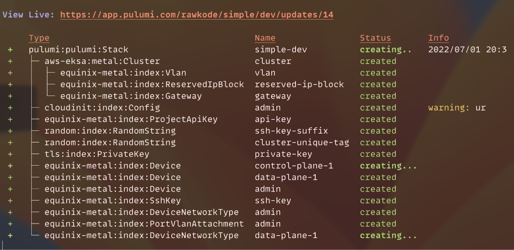

Some of the largest and most complex deployments that teams manage are hybrid and multi-cloud deployments. Kubernetes is a common component in these deployments because it enables platform teams to provide a common set of services across cloud and on-premises infrastructure and simplifies the process of migrating and scaling workloads as demand fluctuates. Pulumi simplifies these deployment scenarios but teams often need to manage different flavors of Kubernetes for on-premises deployments versus cloud deployments.

We were excited to [support the launch of the Amazon EKS Distro]() in 2020 as it promised to help customers standardize their Kubernetes version and its dependencies. When [EKS Anywhere](https://aws.amazon.com/blogs/aws/amazon-eks-anywhere-now-generally-available-to-create-and-manage-kubernetes-clusters-on-premises/) launched last year, the pieces were starting to fall into place to enable consistent tooling for managing Kubernetes across your datacenter and in any cloud.

## How it works (the short version)

AWS has now announced the latest innovation for EKS: [Amazon EKS Anywhere Bare Metal](https://aws.amazon.com/eks/eks-anywhere/) and allows EKS Anywhere to be run without the need for VMWare vSphere. EKS Anywhere Bare Metal now enables an automated process to bootstrap provisioning and create the EKS-A control plane and worker nodes. Bare metal servers then PXE boot and run the OS provisioning process by communicating with a [Tinkerbell Infrastructure Services Stack](https://tinkerbell.org). At launch, bare metal servers are provisioned with [AWS Bottlerocket](https://aws.amazon.com/bottlerocket/) with support for [Ubuntu OS 20.04](https://releases.ubuntu.com/20.04) also available.

Here are the current system requirements to run EKS Anywhere Bare Metal:

* Cluster Hardware Requirements
    * 4 GB of RAM for OSIE/Hook boot and operation
    * Capability to netboot using iPXE

* Tinkerbell Infrastructure Services Stack Requirements
    * CPU - 2vCPUs, RAM - 4 GB, Disk - 20 GB (includes the OS)
    * Network - L2 networking is required for the ability to run a DHCP server
    * Operating System: Ubuntu 16.04+ and CentOS 7

* Operating Systems Supported
    * Ubuntu 20.04
    * AWS Bottlerocket

## Setting up your bare metal servers

As a "born in the cloud" company, Pulumi does not have a data center lying around for testing, so we’ll walk through the process of setting up EKS Anywhere Bare Metal using servers hosted by [Equinix Metal](https://www.equinix.com/metal). This really shows off the power of running EKS Anywhere and the great lengths the AWS team has gone to in enabling EKS Anywhere for a variety of scenarios.

The process to setup bare metal clusters involves the following steps:

1. Equinix Metal configuration
1. eks-a generate hardware config
1. eks-a generate cluster config
1. Create a bootstrap cluster on the admin machine
1. Provision and create control plane bare metal servers
1. Provision and create bare metal worker nodes
1. Move cluster management to the workload cluster
1. Delete the bootstrap cluster

Fortunately, Pulumi components make it easy to automate most of these steps. For example:

```typescript
import * as eksa from "@pulumiverse/aws-eksa";

const page = new eksa.metal.Cluster("cluster", {
    clusterName: "rawkode",
    metro: "am",
    projectId: "someProjectID",
});
```

To use the component, take the following steps:

1. Make sure you’ve followed the steps to [setup Pulumi and AWS]()

1. Grab the EKS-A component and example code [on Pulumiverse](https://github.com/pulumiverse/pulumi-aws-eksa).

1. Set your Equinix Metal Auth token as a Pulumi secret:

    ```bash
    pulumi config set --secret equinix-metal:authToken
    ```

1. Run `pulumi up`.

Your output should look similar to the example below:



## Give it a try!

These steps will vary depending on the actual hardware and/or bare metal service you decide to use. Check out our [example repo](https://github.com/pulumiverse/pulumi-aws-eksa) and give it a try for yourself. If you run into any issues, you can reach out to us on [Community Slack](https://slack.pulumi.com) with your questions on the #aws channel.
