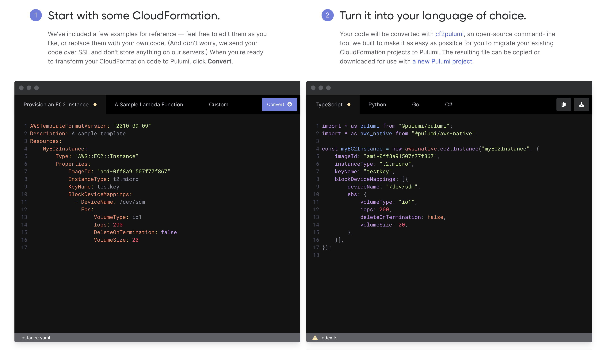

We are excited to announce the release of the new [AWS Native]() provider for Pulumi, which is available today in preview. AWS is the most-used cloud provider across the Pulumi ecosystem, and with the new AWS Native provider, we are focused on delivering the best possible support for the AWS platform to all Pulumi users.

Pulumi Native Providers like AWS Native are a new type of Pulumi Package that give you the most complete and consistent interface for the modern cloud. Pulumi native providers bring the full power of the top cloud providers to the Pulumi Cloud Engineering Platform, with faster updates and more complete coverage than any other infrastructure as code offering.

The AWS Native provider offers same-day support for all new AWS features and releases covered by the newly released [AWS Cloud Control API](https://aws.amazon.com/blogs/aws/announcing-aws-cloud-control-api), which typically supports new AWS features on the day of launch. By building on the AWS Cloud Control API, the AWS Native provider offers a robust, reliable and well-defined resource model for AWS that’s available to Pulumi users in all Pulumi languages, including TypeScript, Python, Go and C#.  By leveraging the AWS Cloud Control API, the AWS Native provider builds on the work done by service teams at AWS to define the resource model for their services. This ensures a rock solid provisioning lifecycle for resources deployed with the AWS Native provider.

<!--more-->

This release also includes a new tool for migrating existing CloudFormation templates into Pulumi programs in your favorite language, powered by the new AWS Native provider and AWS Cloud Control API, as well as the ability to deploy any 3rd party resources in the CloudFormation Registry, including resources from Atlassian, Datadog, Densify, Dynatrace, Fortinet, New Relic, and Spot by NetApp.

{}
To learn how AWS built the Cloud Control API, and many other great topics, join us for the upcoming [Cloud Engineering Summit]() where we’re excited to host speakers from each of the major cloud providers as well as 40+ leaders and practitioners from across the industry.
{}



## API Coverage  

Resources available in the Pulumi AWS Native provider are based on the resources defined in the [AWS CloudFormation Registry](https://docs.aws.amazon.com/AWSCloudFormation/latest/UserGuide/registry.html). Today, hundreds of AWS resources are available from this registry via Cloud Control API and the Pulumi AWS Native provider. This list will continue to grow as additional resources are added to the AWS Cloud Control API. In addition, all new features and services that are released by AWS will be supported in AWS Native, typically on the same day as the release.

The Pulumi AWS Native provider can be used in combination with the classic Pulumi AWS provider, as well as the 60+ additional Pulumi resource providers which cover a wide variety of other cloud and SaaS platforms.  While in preview, the Pulumi AWS Native provider may not yet have support for every feature of AWS that you need in your Pulumi applications, but can always be used along with the classic Pulumi AWS provider to cover both existing use cases and brand new supported features.  

In this example, we can see how the new AWS S3 Object Lambda feature can be used via the AWS Native provider, with access to the full API defined by the S3 team at AWS:



{}

```typescript
const bucket = new awsnative.s3.Bucket("source");

const accessPoint = new awsnative.s3.AccessPoint("ap", {
   bucket: bucket.id,
});

const objectlambda = new awsnative.s3objectlambda.AccessPoint("objectlambda-ap", {
   objectLambdaConfiguration: {
       supportingAccessPoint: accessPoint.arn,
       transformationConfigurations: [{
           actions: ["GetObject"],
           contentTransformation: {
               AwsLambda: {
                   FunctionArn: fn.arn,
               },
           },
       }]
   }
});
```

{}

{}

```python
import pulumi
import pulumi_aws_native as aws_native

my_bucket = aws_native.s3.Bucket("myBucket")

ap = aws_native.s3.AccessPoint("ap", bucket=my_bucket.id)

objectlambdaap = aws_native.s3objectlambda.AccessPoint("objectlambdaap", object_lambda_configuration=aws_native.s3objectlambda.AccessPointObjectLambdaConfigurationArgs(
    supporting_access_point=ap.arn,
    transformation_configurations=[aws_native.s3objectlambda.AccessPointTransformationConfigurationArgs(
        actions=["GetObject"],
        content_transformation={
            "AwsLambda": {
                "FunctionArn": fn.arn,
            },
        },
    )],
))
```

{}

{}

```csharp
var bucket = new AwsNative.S3.Bucket("my-bucket");

var accessPoint = new AwsNative.S3.AccessPoint("ap", new AwsNative.S3.AccessPointArgs
{
    Bucket = bucket.Id
});

var objectLambda = new AwsNative.S3ObjectLambda.AccessPoint("objectlambda-ap", new AwsNative.S3ObjectLambda.AccessPointArgs
{
    ObjectLambdaConfiguration = new AwsNative.S3ObjectLambda.Inputs.AccessPointObjectLambdaConfigurationArgs
    {
        SupportingAccessPoint = accessPoint.Arn,
        TransformationConfigurations =
        {
            new AwsNative.S3ObjectLambda.Inputs.AccessPointTransformationConfigurationArgs
            {
                Actions = { "GetObject" },
                ContentTransformation = fn.Arn.Apply(arn => new Dictionary<string, object>
                {
                    ["AwsLambda"] = new Dictionary<string, object>
                    {
                        ["FunctionArn"] = arn
                    }
                }
            }
        }
    }
});
```

{}

{}

```go
func main() {
    pulumi.Run(func(ctx *pulumi.Context) error {
        myBucket, err := s3.NewBucket(ctx, "myBucket", nil)
        if err != nil {
            return err
        }
        ap, err := s3.NewAccessPoint(ctx, "ap", &s3.AccessPointArgs{
            Bucket: myBucket.ID(),
        })
        if err != nil {
            return err
        }

        _, err = s3objectlambda.NewAccessPoint(ctx, "objectlambdaap", &s3objectlambda.AccessPointArgs{
            ObjectLambdaConfiguration: &s3objectlambda.AccessPointObjectLambdaConfigurationArgs{
                SupportingAccessPoint: ap.Arn,
                TransformationConfigurations: s3objectlambda.AccessPointTransformationConfigurationArray{
                    &s3objectlambda.AccessPointTransformationConfigurationArgs{
                        Actions: pulumi.StringArray{
                            pulumi.String("GetObject"),
                        },
                        ContentTransformation: pulumi.Map{
                            "AwsLambda": pulumi.Map{
                                "FunctionArn": fn.Arn,
                            },
                        },
                    },
                },
            },
        })
        if err != nil {
            return err
        }
        return nil
    })
}
```

{}

{}

## Always Up-To-Date

The Pulumi AWS Native provider is built automatically from the resources and specifications provided by the CloudFormation Registry.  Those specifications are updated frequently whenever new resources and features are shipped by service teams at AWS. The AWS Native provider is rebuilt and released nightly directly from the latest specifications, ensuring that Pulumi users have access to rich Pulumi SDKs for working with new features the same day they are added to Cloud Control API, typically on the day of launch.

## Interoperability with CloudFormation

Although the AWS Native provider leverages the CloudFormation Registry and AWS Cloud Control API, it does not depend on deploying CloudFormation templates. You can write your programs in Pulumi, and Pulumi is responsible for managing the lifecycle and deployment of all resources in your stack. You get the same lightning-fast deployments you expect with Pulumi, along with the same rich infrastructure as code fundamentals like secrets, aliases, components, testing, policy, management console, and more.  There is no CloudFormation stack artifact in the AWS console, since the resource definitions and deployment are handled entirely by Pulumi".

<!-- < gif of a fast deployment > -->

Along with the release of the new AWS Native provider, we’ve also released cf2pulumi, a tool for migrating your existing CloudFormation templates to Pulumi programs in your favorite languages. cf2pulumi is available as both a web-based converter at [https://www.pulumi.com/cf2pulumi/](https://www.pulumi.com/cf2pulumi/), and as a [CLI tool](https://github.com/pulumi/pulumi-aws-native/tree/master/provider/cmd/cf2pulumi).

[](https://www.pulumi.com/cf2pulumi/)

## Access to 3rd Party Resources from the CloudFormation Registry

In addition to all of the AWS resources available in AWS Native, we are also making it possible to create any of the 3rd-party resources available in the CloudFormation Registry, including resources from Atlassian, MongoDB, Snyk, and Spot by NetApp. You can read more about the 3rd party resources available in the CloudFormation registry in the [AWS launch post](https://aws.amazon.com/blogs/aws/introducing-a-public-registry-for-aws-cloudformation/) from earlier this year. The `aws.ExtensionResource` resource can be used to construct any 3rd party resource based on its resource type name. In the following example, we create a MongoDB Atlas project via the AWS Native provider:



{}

```typescript
var project = new aws.ExtensionResource("atlas-project",  {
   type: "MongoDB::Atlas::Project",
   properties: {
       Name: "test",
       OrgId: "org123",
   },
});
```

{}

{}

```python
project = ExtensionResource(
    "atlas-project",  {
    type="MongoDB::Atlas::Project",
    properties={
        Name: "test",
        OrgId: "org123",
    }
)
```

{}

{}

```csharp
var project = new AwsNative.ExtensionResource("atlas-project", new AwsNative.ExtensionResourceArgs
{
    Type = "MongoDB::Atlas::Project",
    Properties =
    {
        "Name": "test",
        "OrgId": "org123",
    }
});
```

{}

{}

```go
_, err = aws.ExtensionResource(ctx, "atlas-project", &aws.ExtensionResourceArgs{
    Type: pulumi.String("MongoDB::Atlas::Project"),
    Properties: []map[string]interface{}{
        "Name": "test",
        "OrgId": "org123",
    },
})
```

{}

{}

## Conclusion

Pulumi’s Native Providers offer the very best support for each of the major cloud providers. Since we launched our first native provider, users have been asking when they could get access to a truly native provider for AWS, with same-day support for new features, high quality, and the familiar APIs documented by AWS service teams. To deliver this, we’ve worked with the AWS Cloud Control API team to ensure that we can provide a great experience for AWS users of Pulumi, and we’re extremely excited by what this will enable for AWS developers. Today’s release is just a starting point. We are working on increased resource coverage, higher-level APIs, and integrations with additional AWS services that will be delivered over the coming months as we prepare AWS Native for general availability next year.

Get started with the AWS Native provider today:

* [Docs](https://www.pulumi.com/registry/packages/aws-native/)
* [Examples](https://github.com/pulumi/examples)
* [NPM](https://www.npmjs.com/package/@pulumi/aws-native)
* [PyPI](https://pypi.org/project/pulumi-aws-native/)
* [NuGet](https://www.nuget.org/packages/Pulumi.AwsNative/)
* [Go](https://pkg.go.dev/github.com/pulumi/pulumi-aws-native/sdk/go/aws)
