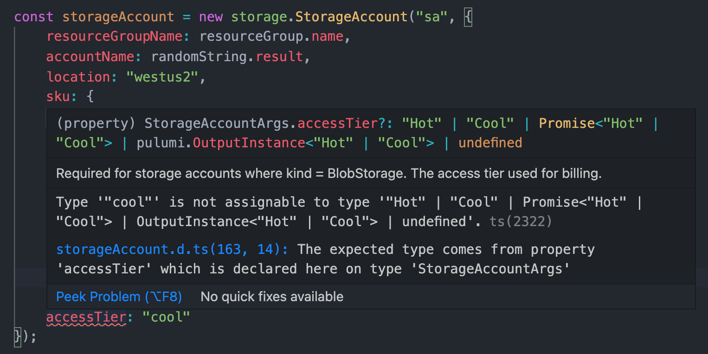

Here at Pulumi, we believe in leveraging the best features of programming languages to create a delightful development experience for our users. Today, we continue our contributions in this area by announcing cross-language support for `enum` types in our provider SDKs, available in all Pulumi languages - Python, TypeScript, .NET and Go.

<!--more-->

## Enum types explained

An enum (short for enumerated) type is a data type consisting of a set of named values. In the Pulumi resource model, a property is an enum type when its value can only be set to a finite number of predetermined values.

For instance, consider a simple S3 bucket.



{}

```typescript
import * as pulumi from "@pulumi/pulumi";
import { s3 } from "@pulumi/aws";

const myBucket = new s3.Bucket("myBucket", { acl: "private" });
```

{}
{}

```python
import pulumi
from pulumi_aws import s3

my_bucket = s3.Bucket("myBucket", acl="private")
```

{}
{}

```csharp
using Pulumi;
using S3 = Pulumi.Aws.S3;

class MyStack : Stack
{
    public MyStack()
    {
        var myBucket = new S3.Bucket("myBucket", new S3.BucketArgs
        {
            Acl = "private",
        });
    }
}
```

{}
{}

```go
package main

import (
    "github.com/pulumi/pulumi-aws/sdk/v3/go/aws/s3"
    "github.com/pulumi/pulumi/sdk/v2/go/pulumi"
)

func main() {
    pulumi.Run(func(ctx *pulumi.Context) error {
        myBucket, err := s3.NewBucket(ctx, "myBucket", &s3.BucketArgs{
            Acl: pulumi.String("private"),
        })
        if err != nil {
            return err
        }
        return nil
    })
}
```

{}


In the above code, the S3 `Bucket` resource has a property called `acl`, where we pass in the string `private` to indicate that this is a private bucket.

If we look at the [resource docs](https://www.pulumi.com/docs/reference/pkg/aws/s3/bucket/#acl_nodejs), we can see that the `acl` property can only be set to one of a few different values: `private`, `public-read`, `public-read-write`, `aws-exec-read`, `authenticated-read`, and `log-delivery-write`. The `acl` property is the perfect candidate for an enum type and is emitted as one, so you can use the following code instead.


{}

```typescript
import * as pulumi from "@pulumi/pulumi";
import { s3 } from "@pulumi/aws";

const myBucket = new s3.Bucket("myBucket", { acl: s3.CannedAcl.Private });
```

{}
{}

```python
import pulumi
from pulumi_aws import s3

my_bucket = s3.Bucket("myBucket", acl=s3.CannedAcl.PRIVATE)
```

{}
{}

```csharp
using Pulumi;
using S3 = Pulumi.Aws.S3;

class MyStack : Stack
{
    public MyStack()
    {
        var myBucket = new S3.Bucket("myBucket", new S3.BucketArgs
        {
            Acl = S3.CannedAcl.Private,
        });
    }
}
```

{}
{}

```go
package main

import (
    "github.com/pulumi/pulumi-aws/sdk/v3/go/aws/s3"
    "github.com/pulumi/pulumi/sdk/v2/go/pulumi"
)

func main() {
    pulumi.Run(func(ctx *pulumi.Context) error {
        myBucket, err := s3.NewBucket(ctx, "myBucket", &s3.BucketArgs{
            Acl: s3.CannedAclPrivate,
        })
        if err != nil {
            return err
        }
        return nil
    })
}
```

{}


## IDE Superpowers

Enum properties provide discoverable and normalized constants that can be used in place of raw strings, allowing you to move faster with the added boosts of IDE tooling like type hints and autocomplete.

Using the provided constants, you can avoid referring back to the documentation to remember the valid values and save precious moments in the development cycle that would be lost to debugging errors caused by typos.

{}


{}
{}


{}
{}


{}
{}


{}

## Optimized for flexibility

While some properties make sense as "strict" enums (i.e., the input value **must** be one of the enumerated values), there are times when it would be beneficial to have constants for commonly used values without restricting the input to **only** those values. We call this second category "relaxed" enums, and we model them a little differently in our SDKs.

### "Strict" enums

A property is a "strict" enum when the input value **must** be one of the enumerated values. In this case, the property type is specified as the enum type.

We will use "strict" enums when we are sure that the enum will include all legal values, such as when a provider is auto-generated from a cloud provider specification (like our [Azure-Native]() or [Kubernetes](https://www.pulumi.com/registry/packages/kubernetes/#pulumi-kubernetes-provider) providers).


{}

```typescript
export class StorageAccount extends pulumi.CustomResource {
    constructor(name: string, args: StorageAccountArgs, opts?: pulumi.CustomResourceOptions) {...}
}

export interface StorageAccountArgs {
    readonly accessTier?: pulumi.Input<enums.storage.latest.AccessTier>;
    ...
}
```

{}
{}

```python
class StorageAccount(pulumi.CustomResource):
    def __init__(__self__,
                 resource_name: str,
                 access_tier: Optional[pulumi.Input['AccessTier']] = None,
                ...):
        ...
```

{}
{}

```csharp
namespace Pulumi.AzureNative.Storage
{
    public partial class StorageAccount : Pulumi.CustomResource
    {
        public StorageAccount(string name, StorageAccountArgs args, ...)
        {
        }
    }

    public sealed class StorageAccountArgs : Pulumi.ResourceArgs
    {
        [Input("accessTier")]
        public Input<Pulumi.AzureNative.Storage.AccessTier>? AccessTier { get; set; }

        ...
    }
}
```

{}
{}

```go
func NewStorageAccount(ctx *pulumi.Context,
name string, args *StorageAccountArgs, ...) (*StorageAccount, error) {
    ...
}

type StorageAccountArgs struct {
    AccessTier AccessTier
    ...
}
```

{}


{}


When using TypeScript, "strict" enums will accept both the constant (`AccessTier.Cool`) or the literal string (`"Cool"`). If there is an accidental spelling error in the literal, you are *immediately* alerted to the issue rather than having to wait until runtime.




{}

### "Relaxed" enums

When a property is a "relaxed" enum, the property type is specified as the `Union` of the enum type and the underlying primitive type. This means that you have the convenience of using the enum constants (i.e., `s3.CannedAcl.Private`), but you may also pass in the raw string (i.e., `"private"`).

In the AWS provider (and other Terraform-based providers), we have opted for **only** using "relaxed" enums. The reasoning is twofold. Allowing the primitive type maintains backward compatibility and also allows users to use values that may not yet be represented in the Pulumi schema (e.g., a new Managed Policy ARN, EC2 Instance type, etc.).


{}

```typescript
export class Bucket extends pulumi.CustomResource {
    constructor(name: string, args?: BucketArgs, opts?: pulumi.CustomResourceOptions) {...}
}

export interface BucketArgs {
    readonly acl?: pulumi.Input<string | enums.s3.CannedAcl>;
    ...
}
```

{}
{}

```python
class Bucket(pulumi.CustomResource):
    def __init__(__self__,
                 resource_name: str,
                 acl: Optional[pulumi.Input[Union[str, 'CannedAcl']]] = None,
                 ...):
        ...

```

{}
{}

```csharp
namespace Pulumi.Aws.S3
{
    public partial class Bucket : Pulumi.CustomResource
    {
        public Bucket(string name, BucketArgs? args = null, ...)
        {
        }
    }

    public sealed class BucketArgs : Pulumi.ResourceArgs
    {
        [Input("acl")]
        public InputUnion<string, Pulumi.Aws.S3.CannedAcl>? Acl { get; set; }

        ...
    }
}
```

{}
{}

```go
func NewBucket(ctx *pulumi.Context,
name string, args *BucketArgs, ...) (*Bucket, error) {
    ...
}

// In Go, relaxed enums retain the type of the underlying primitive.
// However, the CannedAcl constants may still be passed in, as they are
// of the same underlying type.
type BucketArgs struct {
    Acl pulumi.StringPtrInput
    ...
}
```

{}


## Try them out!

You can find enum types integrated into `v3.19.0` of the [AWS provider](https://www.pulumi.com/docs/reference/pkg/aws/) and `v0.7.1` of the [Azure-Native provider](https://www.pulumi.com/docs/reference/pkg/azure-native/), and we will be adding enums to other providers in the coming weeks and months.

**Azure-Native**: In the native Azure provider, all properties labeled as enums in the OpenAPI spec are represented as such. In all, there are over 1300 enums provided in the SDKs. The native Azure provider uses both "strict" and "relaxed" enums since the OpenAPI specification explicitly defines its properties as such.

**AWS**: The AWS provider enums are manually identified and maintained as part of the [provider schema](https://github.com/pulumi/pulumi-aws/blob/master/provider/resources.go#L2392-L3375). We've already added many that you might find useful, such as Lambda Runtimes, EC2 Instance Types, and IAM Managed Policies, and will continue to add more in the coming months.

Take the new providers for a spin and let us know what you think in the [Community Slack](https://slack.pulumi.com/)! If there are properties that you would like to see represented as enums, let us know. Or even better, submit a PR like [this one](https://github.com/pulumi/pulumi-kubernetes/pull/1408) to add them to the schema!
