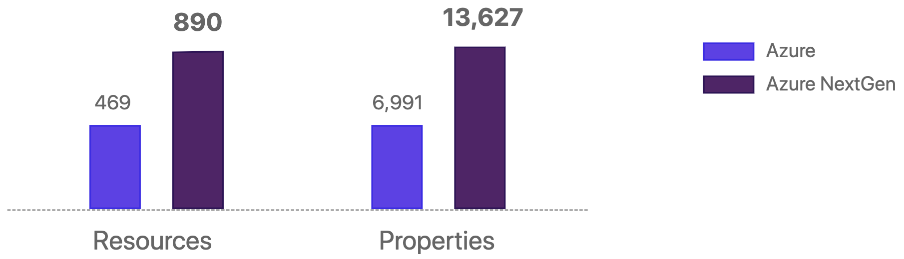
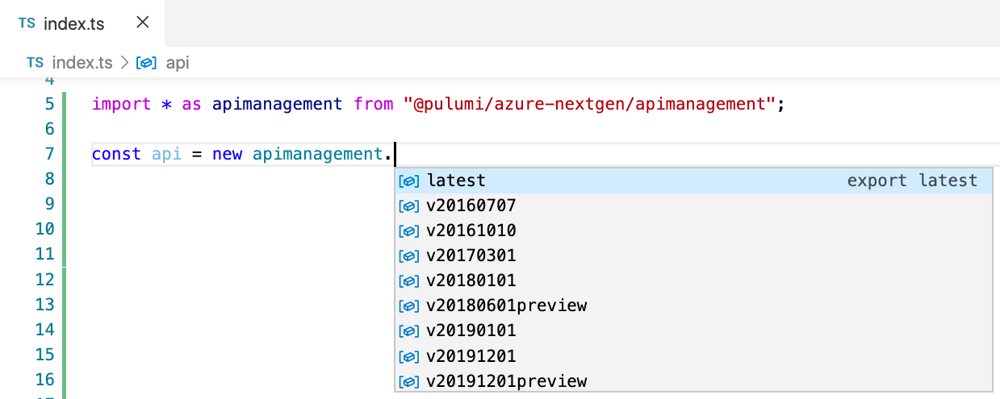

{}
The next-generation Azure provider is now [Azure-Native](/blog/full-coverage-of-azure-resources-with-azure-native/).
{}

We are excited to announce the beta release of a next generation Microsoft Azure provider for Pulumi. Azure has been a rapidly growing cloud platform among Pulumi users over the last year, and with the next generation Azure provider, we are doubling down on providing the best support possible for the Azure platform in Pulumi. We designed the new provider to expose the entire API surface of Azure to developers and operators, now and forever.

The new Azure provider for Pulumi (`azure-nextgen`) works directly with the Azure Resource Manager (ARM) platform instead of depending on a handwritten layer as with the previous provider. This approach ensures higher quality and higher fidelity with the Azure platform.

<!--more-->

## Full API Coverage

The next generation Pulumi Azure provider covers 100% of the resources available in Azure Resource Manager. The new provider supports 890 resource types at launch, nearly double the number supported by the previous Pulumi Azure Provider. Every property of each resource is always represented in the SDKs.



The provider also contains functions to retrieve keys, secrets, and connection strings from all resources that expose them.

The new SDKs include full coverage for Azure services, including Azure Static Web Apps, Azure Synapse Analytics, Azure Logic Apps, Azure Service Fabric, Azure Blockchain Service, Azure API Management, and dozens of other services.

If you can deploy a resource with ARM Templates, you can deploy it with the next Generation Pulumi Azure provider!

## Always Up-to-Date

Unlike the original Azure provider, which requires manual work to keep updated, the new provider is designed to be always up-to-date with additions and changes to Azure APIs.

We generate Pulumi SDKs for `azure-nextgen` automatically from Azure API specifications published by Microsoft. An automated pipeline releases updated resources within hours after any current API specifications are merged. We publish daily updates via automated builds and cut minor SDK versions every two weeks.

By generating the SDKs directly from the Azure Resource Manager resource model specifications maintained by Azure service teams, the Azure NextGen provider is robust and reliable, with fewer moving parts involved and fewer sources of potential bugs and incompatibilities.

Excited about a new service announced by Microsoft? Chances are it’s already in the latest Azure NextGen package!

## API Versions

The Azure Resource Manager API is structured around Resource Providers&mdash;high-level groups like "storage", "compute", or "web". We map Resource Providers to top-level modules or namespaces in Pulumi SDKs.

Each resource provider defines one or more API versions, for example, "2015-05-01", "2020-09-01", or "2020-08-01-preview". Every version of every ARM API is available in Pulumi SDKs, and each version has its own module or namespace.



In addition, a `latest` version  in the Pulumi SDK maps to the latest stable API version as determined by the Azure SDK teams. Using a specific version ensures full compatibility, while using the `latest` version is a quick way to start, but does not guarantee compatibility between minor versions of the provider.

Now, you always have access to the latest and greatest, but at the same time, we don't force you to upgrade your production resources unless you are ready.

## Every Language

The next generation Azure provider is available in preview today for all Pulumi languages. The new `azure-nextgen` SDKs are open source on GitHub and available in NPM, NuGet, PyPI, and Go Modules.



{}

```typescript
import * as resources from "@pulumi/azure-nextgen/resources/latest";
import * as storage from "@pulumi/azure-nextgen/storage/latest";

const resourceGroup = new resources.ResourceGroup("resourceGroup", {
    resourceGroupName: "my-rg",
    location: "WestUS",
});

const storageAccount = new storage.StorageAccount("sa", {
    resourceGroupName: resourceGroup.name,
    accountName: "mystorageaccount",
    location: resourceGroup.location,
    sku: {
        name: "Standard_LRS",
        tier: "Standard",
    },
    kind: "StorageV2",
});
```

{}

{}

```python
from pulumi_azure_nextgen.storage import latest as storage
from pulumi_azure_nextgen.resources import latest as resources

resource_group = resources.ResourceGroup('resource_group',
    resource_group_name='my-rg',
    location='WestUS')

account = storage.StorageAccount('sa',
    account_name='mystorageaccount',
    resource_group_name=resource_group.name,
    location=resource_group.location,
    sku=storage.SkuArgs(
        name='Standard_LRS',
        tier='Standard',
    ),
    kind='StorageV2')
```

{}

{}

```csharp
using Pulumi;
using Pulumi.AzureNextGen.Resources.Latest;
using Pulumi.AzureNextGen.Storage.Latest;
using Pulumi.AzureNextGen.Storage.Latest.Inputs;

class MyStack : Stack
{
    public MyStack()
    {
        var resourceGroup = new ResourceGroup("resourceGroup", new ResourceGroupArgs
        {
            ResourceGroupName = "my-rg",
            Location = "WestUS"
        });

        var storageAccount = new StorageAccount("sa", new StorageAccountArgs
        {
            ResourceGroupName = resourceGroup.Name,
            AccountName = "mystorageaccount",
            Location = resourceGroup.Location,
            Sku = new SkuArgs
            {
                Name = "Standard_LRS",
                Tier = "Standard"
            },
            Kind = "StorageV2"
        });
    }
}
```

{}

{}

```go
package main

import (
	resources "github.com/pulumi/pulumi-azure-nextgen/sdk/go/azure/resources/latest"
	storage "github.com/pulumi/pulumi-azure-nextgen/sdk/go/azure/storage/latest"
	"github.com/pulumi/pulumi/sdk/v2/go/pulumi"
)

func main() {
	pulumi.Run(func(ctx *pulumi.Context) error {
		resourceGroup, err := resources.NewResourceGroup(ctx, "resourceGroup", &resources.ResourceGroupArgs{
			ResourceGroupName: pulumi.String("my-rg"),
			Location:          pulumi.String("WestUS"),
		})
		if err != nil {
			return err
		}

		account, err := storage.NewStorageAccount(ctx, "sa", &storage.StorageAccountArgs{
			ResourceGroupName: resourceGroup.Name,
			AccountName:       pulumi.String("mystorageaccount"),
			Location:          resourceGroup.Location,
			Sku: &storage.SkuArgs{
				Name: pulumi.String("Standard_LRS"),
				Tier: pulumi.String("Standard"),
			},
			Kind: pulumi.String("StorageV2"),
		})

		return err
	})
}
```

{}

{}

API documentation is available at [Azure NextGen API Reference](/docs/reference/pkg/azure-nextgen/) and includes more than 1,000 resource examples.

## Integrated with Azure Ecosystem

Relying on the shape of the Azure API, we can integrate the NextGen provider into the broader Azure ecosystem. In the coming weeks, we will release several capabilities to simplify the adoption of the new provider:

- Command-line and web-based tools to convert Azure Resource Manager Templates to Pulumi programs in the language of your choice
- A flow to import an existing Azure Resource Group and all its resources to your Pulumi project
- A multi-language component resource to embed ARM Templates in Pulumi programs, including per-resource previews
- Integrations with ARM Template generation tools like Project Bicep and Farmer

Bring your existing resources and assets and start managing them with the NextGen Azure provider!

## Provider Coexistence

We will continue to invest in the existing `azure` provider, and Pulumi users can use either provider or both, side-by-side, in their applications.

A single Pulumi project can use both providers. Each provider must be configured independently, but they accept mostly the same configuration options. The outputs of a resource from one provider can flow to inputs of a resource from the other provider. In both cases, they are the values available from Azure itself, such as the name or id of an Azure resource.

Pulumi has a separate `azuread` provider, which will continue to manage Azure Active Directory resources.

If you have existing projects using the current Pulumi Azure provider, you can continue to use that provider, and it will be updated indefinitely. You can add new cloud resources using the existing provider or start creating new infrastructure with the new provider.

New Pulumi Azure projects will default to use the `azure-nextgen` provider once the provider reaches general availability.

## Getting Started

New Pulumi templates are available for the new `azure-nextgen` provider:



{}

```sh
$ pulumi new azure-nextgen-typescript
```

{}
{}

```sh
$ pulumi new azure-nextgen-python
```

{}
{}

```sh
$ pulumi new azure-nextgen-csharp
```

{}
{}

```sh
$ pulumi new azure-nextgen-go
```

{}
{}

Several larger examples are available in the Pulumi Examples repo:

- Web Applications with Azure App Service and Docker: [TypeScript](https://github.com/pulumi/examples/tree/master/azure-ts-appservice-docker), [C#](https://github.com/pulumi/examples/tree/master/azure-cs-appservice-docker), [Python](https://github.com/pulumi/examples/tree/master/azure-py-appservice-docker), [Go](https://github.com/pulumi/examples/tree/master/azure-go-appservice-docker)
- Azure AKS cluster: [TypeScript](https://github.com/pulumi/examples/tree/master/azure-ts-aks), [C#](https://github.com/pulumi/examples/tree/master/azure-cs-aks), [Python](https://github.com/pulumi/examples/tree/master/azure-py-aks), [Go](https://github.com/pulumi/examples/tree/master/azure-go-aks)
- Web Application with Azure Container Instances: [TypeScript](https://github.com/pulumi/examples/tree/master/azure-ts-aci), [C#](https://github.com/pulumi/examples/tree/master/azure-cs-aci), [Python](https://github.com/pulumi/examples/tree/master/azure-py-aci), [Go](https://github.com/pulumi/examples/tree/master/azure-go-aci)
- Web Server Using Azure Virtual Machine: [TypeScript](https://github.com/pulumi/examples/tree/master/azure-ts-webserver), [Python](https://github.com/pulumi/examples/tree/master/azure-py-webserver)

You can browse [API reference docs](https://www.pulumi.com/docs/reference/pkg/azure-nextgen/) with inline examples or explore the [Pulumi Azure NextGen SDKs](https://github.com/pulumi/pulumi-azure-nextgen) repository.
