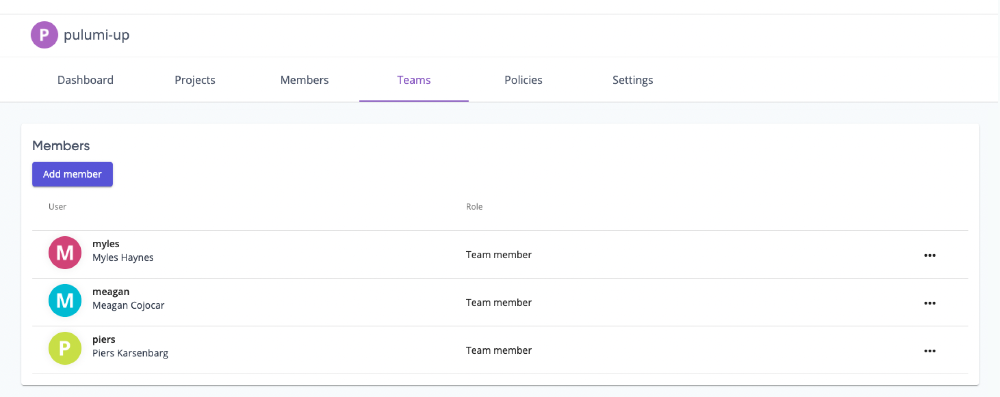

One of the advantages of having a large and vocal community like we have, is the quantity and quality of product feedback we receive. This was highlighted by a GitHub issue submitted by a community member for a Pulumi Service Provider:

> It’s a bit funny that a service that is all about configuration as code can’t be configured with code.

The rest of the community agreed too, as this is one of our top customer product requests. Luckily Piers Karsenbarg, one of the Solutions Engineers at Pulumi, saw this and decided to build a Pulumi Provider for the Pulumi Service during a recent company hackathon. Once we saw the demo we knew we had to get in the hands of our customers! Over the last couple months, we've added a number of additional features, and polished some of the APIs for managing the Pulumi Service via Pulumi Infrastructure as Code. As a result, starting today, Pulumi’s users can manage *all* of their cloud infrastructure using Pulumi, including managing the state of the [Pulumi Service]() itself!

The Pulumi Service Provider builds on top of the [Pulumi Service REST API]() which is another feature available to our customers to programmatically configuring the Pulumi Service. The Pulumi Service REST API is includes functionality to interact with and manipulate any kind of metadata managed by Pulumi. That includes Projects and Stacks, Previews and Updates, Organizations and Audit Logs. We have already seen Cloud Engineering teams using the Pulumi REST API to build all sorts of custom functionality. These new capabilities are especially powerful when used in combination with the [Automation API]().

The [Pulumi Service Provider](/registry/packages/pulumiservice) can be used in any Pulumi language, TypeScript, Python, Go, .NET, Java and YAML. It supports configuration of [Teams](), [Access Tokens](), [Stack Tags]() and [Webhooks]() using infrastructure as code.

## What resources are available?

Based on feedback from customers, we've picked the following resources to support at launch:

* [Webhooks]()
* [Teams]()
* [StackTags]()
* [AccessTokens]()

## How do I get started?

If you aren't already familiar with Pulumi, you'll want to head over to [Pulumi's getting started guide]() first.

The Pulumi Service Provider requires an access token to authenticate with the Pulumi Service. You can set it in a few ways:

1. Via the `PULUMI_ACCESS_TOKEN` environment variable.
1. Via the `pulumiservice:accessToken` configuration value.
1. Directly via the provider's constructor

Once your access token is set up, you are ready to use the provider.

{}
The provider will only have access to resources that your token has access to.
{}

**Here's a sample of what you can do:**

{}

```yaml
name: pulumi-service-teams-example-yaml
runtime: yaml
description: An example of using yaml to create a team
resources:
  team:
    type: pulumiservice:index:Team
    properties:
      name: pulumi-up-team
      description: This was created with Pulumi
      displayName: PulumiUP Team
      organizationName: pulumi-up
      teamType: pulumi
      members:
        - piers
        - myles
        - meagan
outputs:
    members: ${team.members}
```

{}
{}

```typescript
import * as pulumi from "@pulumi/pulumi";
import * as service from "@pulumi/pulumiservice";

const team = new service.Team("team", {
    name: "pulumi-up-team",
    displayName: "PulumiUP Team",
    description: "This was created with Pulumi",
    organizationName: "pulumi-up",
    teamType: "pulumi",
    members: [
        "piers",
        "myles",
        "meagan"
    ],
});

export const members = team.members;
```

{}
{}

```go
package main

import (
	"github.com/pulumi/pulumi-pulumiservice/sdk/go/pulumiservice"
	"github.com/pulumi/pulumi/sdk/v3/go/pulumi"
)

func main() {
	pulumi.Run(func(ctx *pulumi.Context) error {
		team, err := pulumiservice.NewTeam(ctx, "team", &pulumiservice.TeamArgs{
			Name:             pulumi.String("pulumi-up-team"),
			Description:      pulumi.String("This was created with Pulumi"),
			DisplayName:      pulumi.String("PulumiUP Team"),
			OrganizationName: pulumi.String("pulumi-up"),
			TeamType:         pulumi.String("pulumi"),
			Members:          pulumi.ToStringArray([]string{"piers", "myles", "meagan"}),
		})
		if err != nil {
			return err
		}
		ctx.Export("members", team.Members)
		return nil
	})
}
```

{}
{}

```python
import pulumi
from pulumi_pulumiservice import Team

team = Team("team",
    name="pulumi-up-team",
    description="This was created with Pulumi",
    display_name="PulumiUP Team",
    organization_name="pulumi-up",
    team_type="pulumi",
    members=["piers", "myles", "meagan"])

pulumi.export("members", team.members)
```

{}

{}

```csharp
using Pulumi;
using Pulumi.PulumiService;
class ExampleTeam: Stack {
    public ExampleTeam()
    {
        var team = new Team("team", new TeamArgs
        {
            Name = "pulumi-up-team",
            Description = "This was created with Pulumi",
            DisplayName = "PulumiUP Team",
            OrganizationName = "pulumi-up",
            TeamType = "pulumi",
            Members = {"piers", "myles", "meagan"}
        });

        this.Members = team.Members;
    }

    [Output] public Output<string> Members { get; set; }
}
```

{}

{}

Once you've created your team, you can navigate to the Pulumi Service in your browser and view your team:



## Can Self Hosted customers use the Pulumi Service Provider?

Yes! You will be able to use the Pulumi Service Provider. You can configure the URL via the following methods:

1. Via the `PULUMI_BACKEND_URL` environment variable. You'll want to set it to the API URL of the service.
2. Via the `pulumiservice:apiUrl` configuration value.

The default URL for the provider is: <https://api.pulumi.com>.

## What's next?

We’re excited to be able to offer Pulumi Infrastructure as Code users the ability to manage the Pulumi Service with IaC.  Over the coming months, we have plans to add more resources, and to build on the Pulumi Service Provider functionality as we see what our customers use it for. As always, please feel free to submit feature requests and bug reports to [Pulumi Service Provider GitHub Repo](https://github.com/pulumi/pulumi-pulumiservice).
We look forward to seeing what you build with the Pulumi Service Provider!
