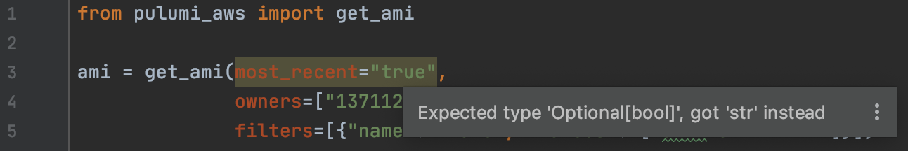
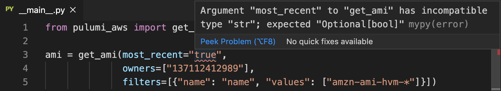
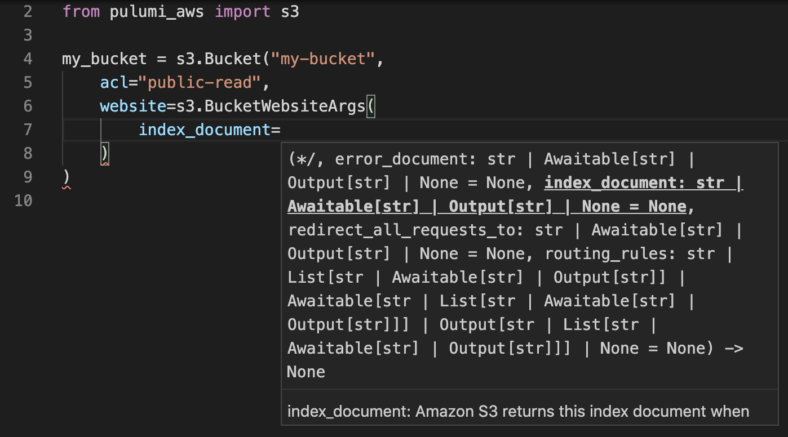
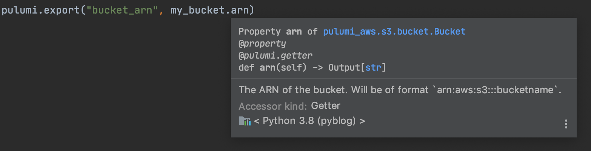

Today we're excited to announce some fairly significant improvements to the experience of writing Pulumi programs in Python. We've added type annotations to APIs and now allow passing nested data as strongly typed classes instead of raw `dict`s. This provides a much better editing experience in IDEs, improved type checking, and overall consistency.

<!--more-->

## Type Annotations

[PEP 484](https://www.python.org/dev/peps/pep-0484/) type annotations have been added to all Python APIs, allowing IDEs like [PyCharm](https://www.jetbrains.com/pycharm/) and [VS Code](https://code.visualstudio.com) and tools like [mypy](http://mypy-lang.org) to catch errors earlier.

Consider the following example for retrieving an AMI, with an incorrect `most_recent` argument:

```python
from pulumi_aws import get_ami

ami = get_ami(most_recent="true",
              owners=["137112412989"],
              filters=[{"name": "name", "values": ["amzn-ami-hvm-*"]}])
```

PyCharm shows the error:



As does VS Code with mypy:



And running `mypy` manually also reports the issue:

```sh
$ mypy __main__.py
__main__.py:3: error: Argument "most_recent" to "get_ami" has incompatible type "str"; expected "Optional[bool]"
Found 1 error in 1 file (checked 1 source file)
```

## Data Classes

Consider an AWS bucket hosting a static website. Previously, the `website` and `cors_rules` inputs needed to be specified as raw `dict`s:

```python
from pulumi_aws import s3

my_bucket = s3.Bucket("my-bucket",
    acl="public-read",
    website={
        "indexDocument": "index.html",
        "errorDocument": "error.html",
    },
    cors_rules=[{
        "allowedHeaders": ["*"],
        "allowedMethods": ["PUT", "POST"],
        "allowedOrigins": ["https://s3-website-test.mydomain.com"],
        "exposeHeaders": ["ETag"],
        "maxAgeSeconds": 3000,
    }],
)
```

You would likely have several questions if writing the above example from scratch. What keys can be set for `website` and `cors_rules`? Should the keys be camelCase or snake_case? Which keys are required? What are the types of values? To answer these questions, you'd need to refer to [`Bucket`]()'s documentation.

We now allow optionally passing nested values using data classes:

```python
from pulumi_aws import s3

my_bucket = s3.Bucket("my-bucket",
    acl="public-read",
    website=s3.BucketWebsiteArgs(
        index_document="index.html",
        error_document="error.html",
    ),
    cors_rules=[s3.BucketCorsRuleArgs(
        allowed_headers=["*"],
        allowed_methods=["PUT", "POST"],
        allowed_origins=["https://s3-website-test.mydomain.com"],
        expose_headers=["ETag"],
        max_age_seconds=3000,
    )],
)
```

IDEs can display argument names and types, reducing the need to refer to documentation. If a required argument is missing, or a value isn't the right type, IDEs will immediately show the problem, allowing errors to be caught earlier.

The use of data classes makes setting nested values consistent with top-level values, with arguments that are always snake_case, for a more Pythonic feel.

Here's what this looks like in VS Code using the new [Pylance](https://devblogs.microsoft.com/python/announcing-pylance-fast-feature-rich-language-support-for-python-in-visual-studio-code/) language server for Python:



Support for passing data classes is a fully compatible change. Nested data are passed as either raw `dict`s or data classes, so existing programs using `dict`s will continue to work as-is without modification.

## Accessing Outputs

Nested outputs can now be accessed in a more strongly-typed way as well.

Consider accessing one of the website settings from the bucket. Previously, nested outputs were returned as raw `dict`s, and you'd get the value by looking it up in the `dict` by its key:

```python
index_document = my_bucket.website.apply(lambda w: w["indexDocument"])
```

Now, nested outputs are returned as data classes, and values can be accessed via properties.

```python
index_document = my_bucket.website.apply(lambda w: w.index_document)
```

Existing programs that lookup the values in the `dict` continue to work as-is because the new output data classes are subclasses of `dict` and continue to return the same data with the same keys as before.

## Other improvements

Another improvement we've made is to hover tooltips in IDEs. Hovering over members in PyCharm and VS Code with Pylance now shows the member's associated documentation:



We've additionally made some changes to reduce the amount of noise in IDE completion lists when "dotting" into individual modules.

## Conclusion

All considered, these changes provide a major improvement to the Python experience.

The improvements are available in the latest releases of the [AWS](https://pypi.org/project/pulumi-aws/), [Azure](https://pypi.org/project/pulumi-azure/), [AzureAD](https://pypi.org/project/pulumi-azuread/), [Google Cloud](https://pypi.org/project/pulumi-gcp/), and [Random](https://pypi.org/project/pulumi-random/) providers. They will be rolling out to the rest of the providers this week, along with updates to examples and documentation.

Take the new providers for a spin and let us know what you think in the [Community Slack](https://slack.pulumi.com/)!
