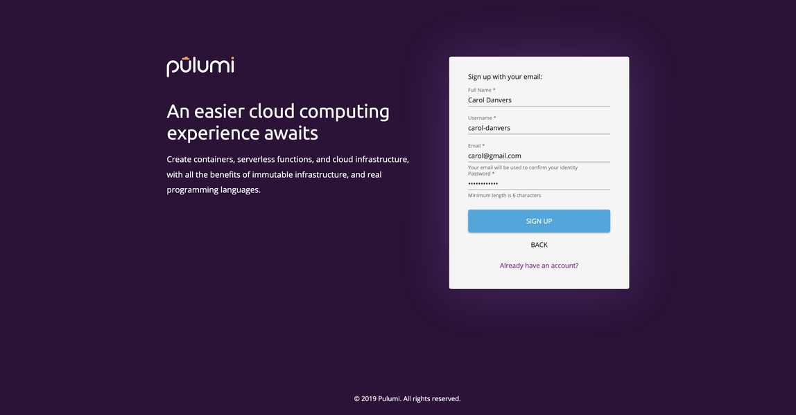

We have been hard at work the past few months providing our users with
more ways to connect to Pulumi. Here are some our past announcements
related to identities:

- [Support for Atlassian identity]()
- [Connecting multiple identities to an existing Pulumi account]()
- [Support for GitLab identity]()

**Today**, we are pleased to announce that we are launching support for
email-based identities. You no longer need to use a social identity to
sign-up for an account on Pulumi. Just fill out
the [signup](https://app.pulumi.com/signup/email) form, and you are
ready to go.

## Quickstart

Get started quickly by creating a new [template-based project](https://app.pulumi.com/site/new-project).
This creates a project, and a [stack]() ready to be used by the Pulumi CLI.
The wizard also shows you the commands you need to run in the CLI.

Haven't setup your CLI for a specific cloud yet? Check out this docs page on how to do that.

Once you've deployed your first stack, the next step is up to you. You can refer to our documentation on integrating Pulumi into your CI/CD pipeline, setting up chat-ops workflows via Webhooks, or taking your Kubernetes solutions to the next level!

We'd love to hear what you're up to. Say 👋 in the [Pulumi Community Slack](https://slack.pulumi.io/)
or [drop us a line]().
