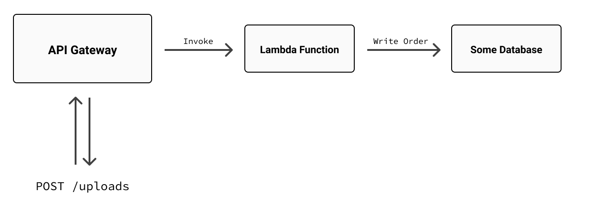
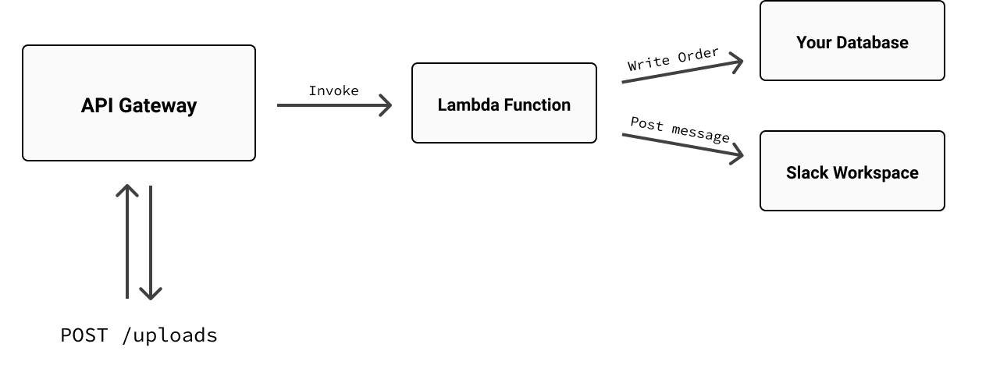
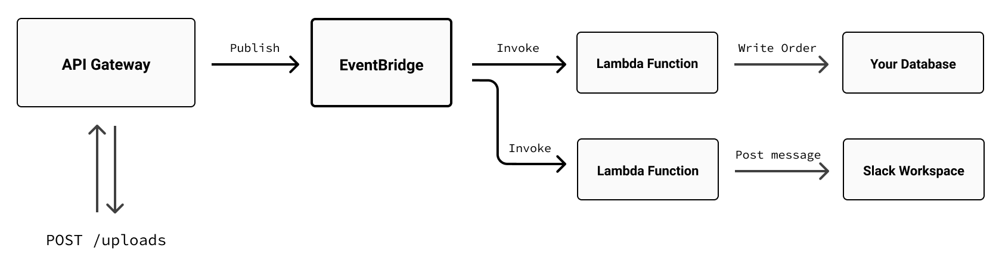

If you're familiar with [Amazon API Gateway](https://aws.amazon.com/api-gateway/), you know it's all about making it easier to provision and manage a web API. Maybe you've used it, as I have, with [Crosswalk](), our AWS extension library, to stand up a REST API and handle requests with AWS Lambda functions:

```typescript
import * as awsx from "@pulumi/awsx";

// Create a new API Gateway instance.
const api = new awsx.apigateway.API("my-api", {
    routes: [
        {
            // Define an HTTP endpoint.
            method: "GET",
            path: "/things",

            // Handle requests with an AWS Lambda function.
            eventHandler: async (apiGatewayEvent) => {
                return {
                    statusCode: 200,
                    body: JSON.stringify([
                        "thingOne",
                        "thingTwo",
                    ]),
                };
            },
        },
    ],
});

// Export the API's public URL. 🎉
export const apiUrl = api.url;
```

I love this abstraction, and I use it all the time; it's an incredibly convenient way to solve a really common problem. But if you examine the code, you'll notice that it's making a fairly strong assumption about how you'll be handling HTTP requests---namely, that you'll do so with a single Lambda function, and that that function will always return a JavaScript object [of a particular shape](https://docs.aws.amazon.com/apigateway/latest/developerguide/api-gateway-integration-settings-integration-response.html).

Indeed, this arrangement is the API contract of a [Lambda _proxy_ integration](https://docs.aws.amazon.com/apigateway/latest/developerguide/http-api-develop-integrations-lambda.html)---API Gateway integrations come in [many shapes and sizes](https://docs.aws.amazon.com/apigateway/latest/developerguide/http-api-develop-integrations.html); Lambda integrations just happen to be one of the more popular---and much of the time, an approach like this one works out just fine. But depending on the needs of the application, it might not always be the best fit.

Imagine you were building a print-on-demand service, for example, and you wanted to expose an API to let your customers upload  documents and have them converted into orders. On AWS, you might reach for API Gateway, as above, to define an HTTP method and route (`POST /uploads`, say), wire it up to an AWS Lambda, and have the Lambda parse the upload, write the order to a database, and return a response. Visually, such a design might look something like this:



It'd definitely work, and again, it's quite common. But at some point, you might find this tight coupling between API Gateway and Lambda too limiting. Say you wanted to be notified whenever a new order was received, with a Slack message, maybe, in one of your team's shared workspace channels. Under the current design, you'd probably add a few lines of code to the Lambda function to import an HTTP library and make a call to the Slack API to post the message:



That'd work, too---but it'd be less than ideal for a number of reasons. For one, that Lambda would now have two jobs: taking orders and sending Slack notifications. That might be fine for today (it’s only a few lines of code, after all), but over time, those two jobs could easily become three, and then four, and soon enough, that poor Lambda could wind up becoming a lot more difficult to maintain. And given the importance of its main job---capturing orders---it's not something you'd want to risk failing at runtime because of a random Slack outage or other transient internet mishap. Moreover, with every bit of extra work you tack on to that function, you take a tiny step closer to hitting API Gateway's [30-second limit](https://docs.aws.amazon.com/apigateway/latest/developerguide/limits.html).

What you really need, then, is to be able to take multiple independent, possibly long-running actions based on a single API Gateway request. And one way to do that is with [Amazon EventBridge](https://aws.amazon.com/eventbridge).

## Hello, EventBridge

Amazon EventBridge (formerly CloudWatch Events) is as a serverless [_event bus_](https://docs.aws.amazon.com/eventbridge/latest/userguide/eb-event-bus.html) whose job is to receive structured [_event data_](https://docs.aws.amazon.com/eventbridge/latest/userguide/eb-events.html)---from your own applications, from other AWS Services---and use that data to notify other applications or services using event-handling [_rules_](https://docs.aws.amazon.com/eventbridge/latest/userguide/eb-rules.html) that you specify. With EventBridge, you can build loosely coupled, event-driven systems that take advantage of AWS's rich support for serverless architectures and that scale gracefully as the needs of those systems change over time.

For this particular application, EventBridge would let you address the multiple-handler problem in a more scalable and easily maintainable way. Rather than have API Gateway invoke Lambda directly, leaving one Lambda responsible for handling multiple tasks, you could have API Gateway publish to EventBridge instead, and let EventBridge invoke as many Lambdas (or other AWS services) as you like, all serverlessly and in parallel---and of course, all easily managed with Pulumi.

Let's see how. Here's a revised architecture diagram showing how you might approach building an application like this one with EventBridge positioned between API Gateway and Lambda:



Now let's have a look at what it'd be like to build it with Pulumi. We won't build _everything_ in this diagram---things like writing to the database or messaging Slack are left for you to explore---but we will build enough to give you clear picture and a working example of how to connect all of these parts into a working application. Specifically:

* an API Gateway [instance](https://docs.aws.amazon.com/apigateway/latest/developerguide/http-api-vs-rest.html) to act as a container for your public API, along with a [_stage_](https://docs.aws.amazon.com/apigateway/latest/developerguide/http-api-stages.html) and a [_route_](https://docs.aws.amazon.com/apigateway/latest/developerguide/http-api-develop-routes.html) to handle inbound HTTP requests;
* an EventBridge [integration](https://docs.aws.amazon.com/apigateway/latest/developerguide/http-api-develop-integrations.html) (comprised of an event bus and event rule) to handle notifications from API Gateway; and finally,
* one or more Lambda functions to be invoked in response to event-rule matches.

Let's get started.

## Create a new project and stack

As always, it’s good practice to begin with a new project and stack:



{}

```bash
$ pulumi new aws-typescript
```

{}

{}

```bash
$ pulumi new aws-python
```

{}

Make sure you [configure your AWS credentials]() as well, and when prompted, choose whatever stack name and AWS region work best for you.

{}

In this post, we'll be using [API Gateway V2](https://docs.aws.amazon.com/apigatewayv2/latest/api-reference/api-reference.html) as it's newer and has a few features (like [auto-deploy](https://docs.aws.amazon.com/AWSCloudFormation/latest/UserGuide/aws-resource-apigatewayv2-stage.html#aws-resource-apigatewayv2-stage-properties)) that make it easier to work with in this context. The same ideas apply to both V1 and V2, though, so while V2 still lacks full feature parity with V1, the underlying resources we'll be using---methods, routes, integrations---are the same. You'll find links to examples of both at the end of this post.

{}

## Create the API gateway and stage

Start by replacing the contents of {} with the following code to declare a new API Gateway [API]():



{}

```typescript
import * as pulumi from "@pulumi/pulumi";
import * as aws from "@pulumi/aws";

// Create an HTTP API.
const api = new aws.apigatewayv2.Api("api", {
    protocolType: "HTTP",
});
```

{}

{}

```python
import json
import pulumi
import pulumi_aws as aws

# Create an HTTP API.
api = aws.apigatewayv2.Api("example",
    protocol_type="HTTP"
)
```

{}

Next, add a stage (feel free to name it whatever you like; I usually use the current stack name for convenience), and set it to deploy automatically whenever a change is made to the API:

{}

```typescript
// ...

// Create a stage and set it to deploy automatically.
const stage = new aws.apigatewayv2.Stage("stage", {
    apiId: api.id,
    name: pulumi.getStack(),
    autoDeploy: true,
});
```

{}

{}

```python
# Create a stage and set it to deploy automatically.
stage = aws.apigatewayv2.Stage("stage",
    api_id=api.id,
    name=pulumi.get_stack(),
    auto_deploy=True
);
```

{}

The next thing to do is register a route on the gateway to give your users a publicly accessible endpoint to upload to. But in order to do _that_, you'll need to tell API Gateway what to do when an upload happens. Since the plan of record is to notify EventBridge (using API Gateway’s built-in support for it), you’ll need to declare a few EventBridge things first.

## Add an event bus and event rule

Every AWS account gets an event bus by default (one that's aptly named `default`), but given how easy it is to create one, we might as well do that for this application. You'll also need to define an event rule---a resource that watches a specific event bus for events that conform to a particular pattern or shape, and then routes those events to one or more targets (e.g., Lambda functions). Add the following lines to your program for both:



{}

```typescript
// ...

// Create an event bus.
const bus = new aws.cloudwatch.EventBus("bus");

// Create an event rule to watch for events.
const rule = new aws.cloudwatch.EventRule("rule", {
    eventBusName: bus.name,

    // Specify the event pattern to watch for.
    eventPattern: JSON.stringify({
        source: ["my-event-source"],
    }),
});
```

{}

{}

```python
# ...

# Create an event bus.
bus = aws.cloudwatch.EventBus("bus")

# Create an event rule to watch for events.
rule = aws.cloudwatch.EventRule("rule",
    event_bus_name=bus.name,
    event_pattern=json.dumps({"source": ["my-event-source"]})
)
```

{}

The most noteworthy property of the `EventRule` resource is probably the `eventPattern`. EventBridge events all conform to a certain schema, and in this case, we’re expressing that this particular event rule should take action on any event that originates from `my-event-source`. (The `source` property is just a free-form string that by convention identifies the application or service responsible for the event.)

With the event bus and event rule in place, you’re ready to define the integration itself---the resource responsible for connecting the gateway route (which we’ll get back to shortly) to your newly created event bus. As I mentioned earlier, there are several types of API Gateway integration to choose from, each one suited to a particular purpose. For this example, the `AWS_PROXY` type is good fit, as it’s simple and requires very little code; it doesn't give you quite as much control over the API Gateway response as you might like---as a proxy, it just returns to the caller whatever is returned by the backend, in this case EventBridge---but it's more than enough for the task at hand.

Add the following lines for the integration and route. The comments should explain what each block is doing:



{}

```typescript
// ...

// Define a policy granting API Gateway permission to publish to EventBridge.
const apiGatewayRole = new aws.iam.Role("api-gateway-role",
    {
        assumeRolePolicy: {
            Version: "2012-10-17",
            Statement: [
                {
                    Action: "sts:AssumeRole",
                    Effect: "Allow",
                    Principal: {
                        Service: "apigateway.amazonaws.com",
                    },
                },
            ],
        },
        managedPolicyArns: [
            "arn:aws:iam::aws:policy/AmazonEventBridgeFullAccess",
        ],
    },
);

// Create an API Gateway integration to forward requests to EventBridge.
const integration = new aws.apigatewayv2.Integration("integration", {
    apiId: api.id,

    // The integration type and subtype.
    integrationType: "AWS_PROXY",
    integrationSubtype: "EventBridge-PutEvents",
    credentialsArn: apiGatewayRole.arn,

    // The body of the request to be sent to EventBridge. Note the
    // event source matches pattern defined on the EventRule, and the
    // Detail expression, which just forwards the body of the original
    // API Gateway request (i.e., the uploaded document).
    requestParameters: {
        EventBusName: bus.name,
        Source: "my-event-source",
        DetailType: "my-detail-type",
        Detail: "$request.body",
    },
});

// Finally, define the route.
const route = new aws.apigatewayv2.Route("route", {
    apiId: api.id,
    routeKey: "POST /uploads",
    target: pulumi.interpolate`integrations/${integration.id}`,
});
```

{}

{}

```python
# ...

# Define a policy granting API Gateway permission to publish to EventBridge.
api_gateway_role = aws.iam.Role("api-gateway-role",
    assume_role_policy=json.dumps({
        "Version": "2012-10-17",
        "Statement": [
            {
                "Action": "sts:AssumeRole",
                "Effect": "Allow",
                "Principal": {
                    "Service": "apigateway.amazonaws.com",
                },
            },
        ],
    }),
    managed_policy_arns=[
        "arn:aws:iam::aws:policy/AmazonEventBridgeFullAccess",
    ],
);

# Create an API Gateway integration to forward requests to EventBridge.
integration = aws.apigatewayv2.Integration("integration",
    api_id=api.id,

    # The integration type and subtype.
    integration_type="AWS_PROXY",
    integration_subtype="EventBridge-PutEvents",
    credentials_arn=api_gateway_role.arn,

    # The body of the request to be sent to EventBridge. Note the
    # event source matches pattern defined on the EventRule, and the
    # Detail expression, which just forwards the body of the original
    # API Gateway request (i.e., the uploaded document).
    request_parameters={
        "EventBusName": bus.name.apply(lambda name: name),
        "Source": "my-event-source",
        "DetailType": "my-detail-type",
        "Detail": "$request.body",
    },
);

# Finally, define the route.
route = aws.apigatewayv2.Route("route",
    api_id=api.id,
    route_key="POST /uploads",
    target=integration.id.apply(lambda id: f"integrations/{id}"),
);
```

{}

With that, you’re ready to configure the Lambda.

## Add a Lambda function handler

The hard part’s done: you’ve declared an API and route, mapped that route to an integration, configured the integration to publish events to an event bus, and defined an event rule to respond to those events. All that's left now is to tell the rule _how_ to respond.

So to finish things off, you need:

* a Lambda function to handle uploads,
* an EventBridge [_target_](https://docs.aws.amazon.com/eventbridge/latest/userguide/eb-targets.html) to bind your event rule to that function, and
* an IAM policy granting EventBridge permission to invoke the function.

{}

Add the following lines to your program to complete it:

{}

{}

First, make a new folder and file alongside your Pulumi program, at `./api/handlers.py`, and add a Python function to act as your function handler:

{}



{}

```typescript
// ...

// Create a Lambda function handler with permission to log to CloudWatch.
const lambda = new aws.lambda.CallbackFunction("lambda", {
    policies: [aws.iam.ManagedPolicies.CloudWatchLogsFullAccess],
    callback: async (event: any) => {

        // For now, just log the event, including the uploaded document.
        // That'll be enough to verify everything's working.
        console.log({ source: event.source, detail: event.detail });
    },
});

// Create an EventBridge target associating the event rule with the function.
const lambdaTarget = new aws.cloudwatch.EventTarget("lambda-target", {
    arn: lambda.arn,
    rule: rule.name,
    eventBusName: bus.name,
});

// Give EventBridge permission to invoke the function.
const lambdaPermission = new aws.lambda.Permission("lambda-permission", {
    action: "lambda:InvokeFunction",
    principal: "events.amazonaws.com",
    function: lambda.arn,
    sourceArn: rule.arn,
});

// Export the API Gateway URL to give us something to POST to.
export const url = pulumi.interpolate`${api.apiEndpoint}/${stage.name}`;
```

{}

{}

```python
# In ./api/handlers.py:
import json

def capture_order(event, context):
    # For now, just log the event, including the uploaded document.
    # That'll be enough to verify everything's working.
    print(json.dumps({ "source": event["source"], "detail": event["detail"] }))
```

Now, back in , add the following lines to your program to complete it:

```python
# ...

# Define a role and policy allowing Lambda functions to log to CloudWatch.
lambda_role = aws.iam.Role("lambda-role",
    assume_role_policy=json.dumps({
        "Version": "2012-10-17",
        "Statement": [
            {
                "Action": "sts:AssumeRole",
                "Principal": {
                    "Service": "lambda.amazonaws.com"
                },
                "Effect": "Allow"
            }
        ]
    })
)
lambda_role_policy = aws.iam.RolePolicy("lambda-role-policy",
    role=lambda_role.id,
    policy=json.dumps({
        "Version": "2012-10-17",
        "Statement": [{
            "Effect": "Allow",
            "Action": [
                "logs:CreateLogGroup",
                "logs:CreateLogStream",
                "logs:PutLogEvents"
            ],
            "Resource": "arn:aws:logs:*:*:*"
        }]
    })
)

# Create a Lambda function handler.
lambda_function = aws.lambda_.Function("lambda",
    role=lambda_role.arn,
    runtime="python3.7",
    handler="handlers.capture_order",
    code=pulumi.AssetArchive({
        ".": pulumi.FileArchive('./api')
    })
)

# Create an EventBridge target associating the event rule with the function.
lambda_target = aws.cloudwatch.EventTarget("lambda-target",
    arn=lambda_function.arn,
    rule=rule.name,
    event_bus_name=bus.name,
);

# Give EventBridge permission to invoke the function.
lambda_permission = aws.lambda_.Permission("lambda-permission",
    action="lambda:InvokeFunction",
    principal="events.amazonaws.com",
    function=lambda_function.arn,
    source_arn=rule.arn,
);

# Export the API Gateway URL to give us something to POST to.
pulumi.export("url", pulumi.Output.concat(api.api_endpoint, "/", stage.name))
```

{}

## All Together, Now

Now that the program's complete, you can run Pulumi to bring it to life:

```bash
$ pulumi up
...

Updating (dev)
...

     Type                             Name                      Status
 +   pulumi:pulumi:Stack              eventbridge-v2-dev        created
 +   ├─ aws:apigatewayv2:Api          api                       created
 +   ├─ aws:apigatewayv2:Stage        stage                     created
 +   ├─ aws:cloudwatch:EventBus       bus                       created
 ...

Outputs:
    apiURL: "https://geqfietbcl.execute-api.us-west-2.amazonaws.com/dev"

Resources:
    + 15 created

Duration: 31s
```

When the update finishes, you'll have a fully functioning API Gateway-EventBridge integration that you can verify with `curl`:

```bash
$ curl --data '{"some-key": "some-value"}' --header "Content-Type: application/json" \
     "$(pulumi stack output url)/uploads"

{"Entries":[{"EventId":"cdc44763-6976-286c-9378-7cce674dff81"}],"FailedEntryCount":0}
```

Note the response, which comes directly from EventBridge (courtesy of the `AWS_PROXY` integration), confirming the event was received and written to the event bus.

The final step is to confirm that the request made it all the way to Lambda, which you can easily do by tailing its output with `pulumi logs`:

```bash
$ pulumi logs --follow

Collecting logs for stack dev since 2022-01-06T16:18:48.000-08:00.
...

{
    source: 'my-event-source',
    detail: { 'some-key': 'some-value' }
}
```

When you're happy, be sure to tidy up with a `pulumi destroy`.

## What's next?

There's a lot more you can do with integrations like this that we didn't cover: add more Lambda function handlers, have EventBridge target [other AWS services](https://docs.aws.amazon.com/eventbridge/latest/userguide/eb-targets.html) ([Step Functions](https://aws.amazon.com/step-functions) might be a good one to try next), validate HTTP request bodies (with API Gateway [models](https://docs.aws.amazon.com/apigateway/latest/developerguide/models-mappings.html), to keep bad data from ever reaching EventBridge), and more. Hopefully this gives you sense of what's possible, though. And as promised, you'll find examples that use both versions of API Gateway in our [examples repository on GitHub](https://github.com/pulumi/examples):

* [API Gateway V2 to EventBridge](https://github.com/pulumi/examples/tree/master/aws-ts-apigatewayv2-eventbridge) in TypeScript
* [API Gateway V2 to EventBridge](https://github.com/pulumi/examples/tree/master/aws-py-apigatewayv2-eventbridge) in Python
* [API Gateway V1 to EventBridge](https://github.com/pulumi/examples/tree/master/aws-ts-apigateway-eventbridge) in TypeScript, with request validation and custom HTTP response mapping
