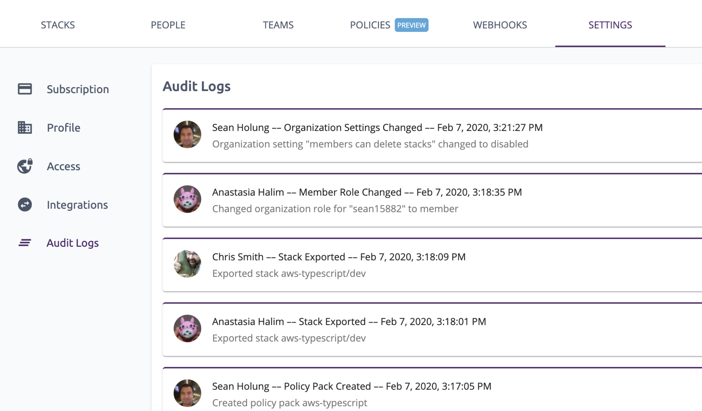

We are excited to announce the release of Audit Logs on
[Pulumi](https://app.pulumi.com) for Enterprise organizations.
Audit logs enable you to track the activity of users within an
organization. They attempt to answer what a user did, when
they did it and where. They help answer these questions
by recording user actions.

Pulumi's audit logs allow you to account for the activity your
users are taking within your organization. These logs are available to
organizations with an Enterprise level subscription. The logs are immutable and
and record all user actions. Auditing makes the activity
of members in an organization attributable.
The logs capture the UNIX timestamp of the event, the user
who invoked the action, the event that took place, and the source IP
of the call the user made.

## Using Pulumi Audit Logs

Audit logs are available to organizations with an Enterprise level subscription
only. If you are an organization administrator, you can view your organization's audit logs,
by selecting your organization from the organization drop down. Then click on the settings tab.
On the left nav-bar you should see a tab called Audit Logs. Clicking here will allow you to view
the most recent audit logs for your organization.

This will show the most recent events in decending order. You can
also filter logs by a particular user by clicking on the user's avatar. Doing so will
filter out the events performed by the user you selected.

We are excited to make this feature available to our users.
Get started with audit logs on [Pulumi](https://app.pulumi.com) today.
