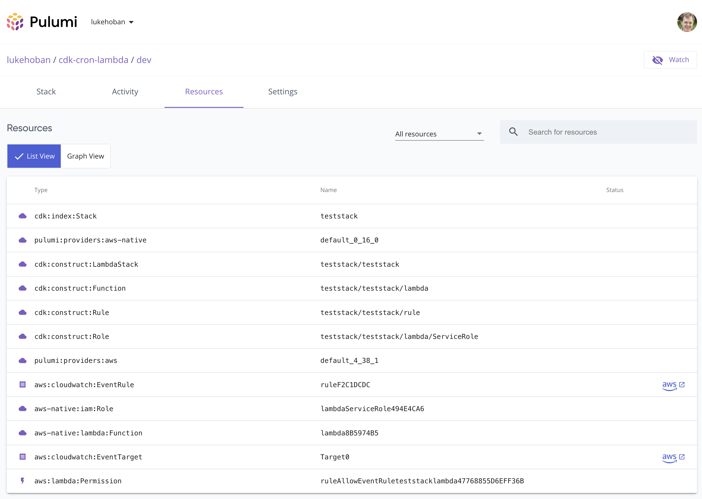

One of our key goals with Pulumi’s Universal Infrastructure as Code platform is to offer access to the widest range of cloud infrastructure building blocks for use within your cloud engineering projects. Over the years, that has led us to support interoperating seamlessly with a variety of alternative infrastructure definition formats, like Helm, CloudFormation, Azure Resource Manager and Kubernetes YAML. Today we’re really excited to add support for AWS CDK constructs to the list!

The AWS Cloud Development Kit (CDK) offers a large collection of higher-level libraries (“constructs”) for working with the AWS platform, built by service teams at AWS and by the AWS CDK community. These libraries are available in the same set of general purpose programming languages that Pulumi supports, with the primary difference being that AWS CDK compiles infrastructure programs into CloudFormation. This dependence on CloudFormation limits AWS CDK to being deployed via the CloudFormation deployment service which can slow down deployments and introduce some developer productivity friction due to the impedance mismatch between the program you write and the YAML it gets transpiled into.

With the new [AWS CDK on Pulumi](https://github.com/pulumi/pulumi-cdk) project, available in public preview today, we are opening up the ability to use AWS CDK constructs from within a Pulumi deployment. For users already using AWS CDK, this provides Pulumi as a new option for orchestrating deployments in place of CloudFormation, offering improved deployment speed, integration with the full set of features of the Pulumi Cloud Engineering Platform (like [Policy as Code](), [Audit Logs](), Secrets, and much more). And for Pulumi users, they are now able to leverage and benefit from the decades of experience AWS teams and the AWS CDK community have invested in designing well-architected infrastructure patterns through these constructs.

<!--more-->

Even better, you can also now combine AWS CDK and Pulumi resources in a single Pulumi infrastructure as code project - passing outputs from Pulumi resources into AWS CDK constructs, and outputs from AWS CDK constructs into Pulumi resources. This allows you to work across the more than 80 cloud and SaaS providers that Pulumi offers access to, while still benefiting from high level libraries from the AWS CDK project, and without the hassles of a transpiler.

## Deploying AWS CDK Constructs with Pulumi

To deploy existing AWS CDK Constructs using Pulumi, simply do the following:

1. Create a class that derives from `pulumicdk.Stack` (which itself is derived from `awscdk.Stack`).
2. In the constructor, use any AWS CDK constructs from existing libraries such as [`aws-cdk-lib`](https://docs.aws.amazon.com/cdk/api/v2/docs/aws-cdk-lib-readme.html)
3. Call `this.synth()` to finalize the stack and deploy its resources.

Constructing an instance of this `pulumicdk.Stack` from within your Pulumi program will then deploy all of the infrastructure defined by the CDK constructs in the Stack using Pulumi.

For example, the following program deploys two AWS CDK Constructs using Pulumi.

```ts
import * as fs from 'fs';
import * as events from 'aws-cdk-lib/aws-events';
import * as events_targets from 'aws-cdk-lib/aws-events-targets';
import * as lambda from 'aws-cdk-lib/aws-lambda';
import { Duration } from 'aws-cdk-lib';
import * as pulumicdk from '@pulumi/cdk';
import { remapCloudControlResource } from './adapter';

class LambdaStack extends pulumicdk.Stack {
   constructor(id: string, options?: pulumicdk.StackOptions) {
       super(id, { ...options, remapCloudControlResource });

       // Use the AWS CDK Lambda Function API directly.
       const lambdaFn = new lambda.Function(this, 'lambda', {
           code: new lambda.InlineCode(fs.readFileSync('lambda-handler.py', { encoding: 'utf-8' })),
           handler: 'index.main',
           timeout: Duration.seconds(300),
           runtime: lambda.Runtime.PYTHON_3_6,
       });

       // Use the AWS CDK Rule API directly.
       const rule = new events.Rule(this, 'rule', {
           // Run 6:00 PM UTC every Monday through Friday
           schedule: events.Schedule.expression('cron(0 18 ? * MON-FRI *)'),
       });

       // Use the AWS CDK to add a Rule target to trigger the Function.
       rule.addTarget(new events_targets.LambdaFunction(lambdaFn));

       // Finalize the stack and deploy its resources.
       this.synth();
   }
}

const stack = new LambdaStack('teststack');
```

This can be deployed with the `pulumi` CLI just like any other Pulumi program.

```
> pulumi up

Updating (dev)

View Live: https://app.pulumi.com/lukehoban/cdk-cron-lambda/dev/updates/37

     Type                                    Name                                               Status
 +   pulumi:pulumi:Stack                     cdk-cron-lambda-dev                                created
 +   └─ cdk:index:Stack                      teststack                                          created
 +      └─ cdk:construct:LambdaStack         teststack/teststack                                created
 +         ├─ cdk:construct:Function         teststack/teststack/lambda                         created
 +         │  ├─ cdk:construct:Role          teststack/teststack/lambda/ServiceRole             created
 +         │  │  └─ aws-native:iam:Role      lambdaServiceRole494E4CA6                          created
 +         │  └─ aws-native:lambda:Function  lambda8B5974B5                                     created
 +         └─ cdk:construct:Rule             teststack/teststack/rule                           created
 +            ├─ aws:cloudwatch:EventRule    ruleF2C1DCDC                                       created
 +            ├─ aws:cloudwatch:EventTarget  Target0                                            created
 +            └─ aws:lambda:Permission       ruleAllowEventRuleteststacklambda47768855D6EFF36B  created

Resources:
    + 11 created

Duration: 48s
```

We can see that each CDK Construct is shown in the Pulumi resource tree, and the leaf nodes of the deployment are the underlying AWS resources needed for this cloud infrastructure. Note that they are deployed via Pulumi, not via CloudFormation.  This enables faster deployments, because Pulumi coordinates directly with AWS instead of going through CloudFormation, as well as the ability to use Pulumi features like `pulumi logs`, Policy as Code, and the features of the Pulumi Service.



## Using AWS CDK Constructs Within Pulumi Programs

We can also combine the best of AWS CDK with the best of Pulumi, by using both Pulumi resources and AWS CDK Constructs in the same deployment.  This enables combining rich AWS CDK Constructs with the breadth of the Pulumi ecosystem, including support for multiple cloud and SaaS providers.

The following example shows creating an AWS Lambda Function with the Pulumi AWS SDK, and then using an output of that Function (the `arn`) as an input to an AWS Events Rule CDK Construct.  An output from the AWS CDK Construct is then converted to a Pulumi Output value which can be used in the rest of the Pulumi program - and in particular as a Pulumi Stack Output.

```ts
import * as events from 'aws-cdk-lib/aws-events';
import * as events_targets from 'aws-cdk-lib/aws-events-targets';
import * as lambda from 'aws-cdk-lib/aws-lambda';
import * as pulumi from '@pulumi/pulumi';
import * as pulumicdk from '@pulumi/cdk';
import * as aws from '@pulumi/aws';
import { remapCloudControlResource } from './adapter';

// Create a resource in Pulumi
const fn = new aws.lambda.CallbackFunction('lambda', {
   callback: (ev, ctx) => console.log(JSON.stringify(ev)),
});

class LambdaStack extends pulumicdk.Stack {
   ruleArn: pulumi.Output<string>;

   constructor(id: string, options?: pulumicdk.StackOptions) {
       super(id, { ...options, remapCloudControlResource });

       // Use the AWS CDK Rule API directly.
       const rule = new events.Rule(this, 'rule', {
           // Run 6:00 PM UTC every Monday through Friday
           schedule: events.Schedule.expression('cron(0 18 ? * MON-FRI *)'),
       });

       // Get an AWS CDK Function instance from the Pulumi Lambda ARN.
       const lambdaFn = lambda.Function.fromFunctionArn(this, 'lambdaFn', pulumicdk.asString(fn.arn));

       // Use the AWS CDK to add a Rule target to trigger the Function.
       rule.addTarget(new events_targets.LambdaFunction(lambdaFn));

       // Export the Lambda function's ARN as an output.
       this.ruleArn = this.asOutput(rule.ruleArn);

       this.synth();
   }
}

const stack = new LambdaStack('teststack');
export const ruleArn = stack.ruleArn;
```

Note how the `pulumicdk.asString` and `asOutput` functions are used to convert Pulumi [Outputs]() to AWS CDK [Tokens](https://docs.aws.amazon.com/cdk/v2/guide/tokens.html) and vice-versa to map values out of and into Pulumi.

## Building on AWS Native and the AWS Cloud Control API

Last year we released a new [AWS Native]() Pulumi provider in preview.  The AWS Native provider builds on the new [AWS Cloud Control API](https://aws.amazon.com/blogs/aws/announcing-aws-cloud-control-api/), which offers direct provisioning support for the same resource model supported by AWS CloudFormation.

The new AWS CDK on Pulumi builds upon AWS Native by converting the CloudFormation resource tree into the corresponding resource definitions from the AWS Native provider.  This provides a high fidelity mapping of each resource into Pulumi.  The coverage provided by AWS Cloud Control API (and thus AWS Native) is not yet complete across the entire breadth of the CloudFormation resource model though, so for some resources, it may be necessary to map them to a resource definition to use via the AWS Classic provider.  This is handled via the `remapCloudControlResource` API which allows providing a custom mapping for a given CloudFormation resource type which is not yet supported in Pulumi AWS Native and AWS Cloud Control.

For example, to provide a mapping for the `AWS::Lambda::Permission` resource type, define a function like the following:

```ts
export function remapCloudControlResource(
   element: CfnElement,
   logicalId: string,
   typeName: string,
   rawProps: any,
   options: pulumi.ResourceOptions,
): pulumi.CustomResource | undefined {
   const props = pulumicdk.interop.normalize(rawProps);
   switch (typeName) {
       case 'AWS::Lambda::Permission':
           return new aws.lambda.Permission(
               logicalId,
               {
                   action: props['action'],
                   function: props['functionName'],
                   principal: props['principal'],
                   sourceArn: props['sourceArn'] ?? undefined,
               },
               options,
           );
   }

   return undefined;
}
```

In many cases, this is not needed, as AWS CDK on Pulumi offers builtin support for remapping many common resources. Over the coming months, as AWS Cloud Control API support expands to cover more of the CloudFormation resource model, these remappings will become less necessary in practice, with almost all resources being supported directly via Pulumi AWS Native.

## Using High-Level "L3" Constructs

AWS CDK offers a mix of relatively low level (unopinionated) constructs, as well as high level (more opinionated) constructs.  With AWS CDK on Pulumi, we can use any of these.  This includes libraries like [`aws-ecs-patterns`](https://docs.aws.amazon.com/cdk/api/v1/docs/aws-ecs-patterns-readme.html) and [AWS Solutions Constructs](https://aws.amazon.com/solutions/constructs/patterns/).

For example, to deploy a load balanced and auto-scaled Fargate service to a dedicated VPC, we can use the following program:

```ts
import * as ec2 from 'aws-cdk-lib/aws-ec2';
import * as pulumi from '@pulumi/pulumi';
import * as pulumicdk from '@pulumi/cdk';
import * as ecs from 'aws-cdk-lib/aws-ecs';
import * as ecs_patterns from 'aws-cdk-lib/aws-ecs-patterns';
import { Construct } from 'constructs';
import { Stack, Duration, CfnOutput } from 'aws-cdk-lib';
import {remapCloudControlResource } from './adapter';

class FargateStack extends pulumicdk.Stack {

    loadBalancerDNS: pulumi.Output<string>;

    constructor(id: string, options?: pulumicdk.StackOptions) {
        super(id, { ...options, remapCloudControlResource });

        // Create VPC and Fargate Cluster
        const vpc = new ec2.Vpc(this, 'MyVpc', { maxAzs: 2 });
        const cluster = new ecs.Cluster(this, 'fargate-service-autoscaling', { vpc });

        // Create Fargate Service
        const fargateService = new ecs_patterns.NetworkLoadBalancedFargateService(this, 'sample-app', {
            cluster,
            taskImageOptions: {
                image: ecs.ContainerImage.fromRegistry("amazon/amazon-ecs-sample")
            },
        });

        // Setup AutoScaling policy
        const scaling = fargateService.service.autoScaleTaskCount({ maxCapacity: 2 });
        scaling.scaleOnCpuUtilization('CpuScaling', {
            targetUtilizationPercent: 50,
            scaleInCooldown: Duration.seconds(60),
            scaleOutCooldown: Duration.seconds(60)
        });

        this.loadBalancerDNS = this.asOutput(fargateService.loadBalancer.loadBalancerDnsName);

        // Finalize the stack and deploy its resources.
        this.synth();
    }
};

const stack = new FargateStack('fargatestack');
export const loadBalancerURL = stack.loadBalancerDNS;
```

Deploying this with `pulumi up` builds a few dozen AWS resources to construct the various building blocks necessary to capture this in raw AWS infrastructure:

```
> pulumi up

Updating (dev)

View Live: https://app.pulumi.com/lukehoban/pulumi-aws-cdk-fargate/dev/updates/1

     Type                                                            Name                                                                      Status
 +   pulumi:pulumi:Stack                                             pulumi-aws-cdk-fargate-dev                                                created
 +   └─ cdk:index:Stack                                              fargatestack                                                              created
 +      └─ cdk:construct:FargateStack                                fargatestack/fargatestack                                                 created
 +         ├─ cdk:construct:Cluster                                  fargatestack/fargatestack/fargate-service-autoscaling                     created
 +         │  └─ aws-native:ecs:Cluster                              fargateserviceautoscalingD107CF93                                         created
 +         ├─ cdk:construct:NetworkLoadBalancedFargateService        fargatestack/fargatestack/sample-app                                      created
 +         │  ├─ cdk:construct:FargateTaskDefinition                 fargatestack/fargatestack/sample-app/TaskDef                              created
 +         │  │  ├─ cdk:construct:ContainerDefinition                fargatestack/fargatestack/sample-app/TaskDef/web                          created
 +         │  │  │  └─ cdk:construct:LogGroup                        fargatestack/fargatestack/sample-app/TaskDef/web/LogGroup                 created
 +         │  │  │     └─ aws-native:logs:LogGroup                   sampleappTaskDefwebLogGroup34BE8C79                                       created
 +         │  │  ├─ cdk:construct:Role                               fargatestack/fargatestack/sample-app/TaskDef/ExecutionRole                created
 +         │  │  │  ├─ cdk:construct:Policy                          fargatestack/fargatestack/sample-app/TaskDef/ExecutionRole/DefaultPolicy  created
 +         │  │  │  │  ├─ aws:iam:Policy                             sampleappTaskDefExecutionRoleDefaultPolicy0AD15374                        created
 +         │  │  │  │  └─ aws:iam:RolePolicyAttachment               sampleappTaskDefExecutionRoleDefaultPolicy0AD15374-0                      created
 +         │  │  │  └─ aws-native:iam:Role                           sampleappTaskDefExecutionRoleAD6F4C40                                     created
 +         │  │  ├─ cdk:construct:Role                               fargatestack/fargatestack/sample-app/TaskDef/TaskRole                     created
 +         │  │  │  └─ aws-native:iam:Role                           sampleappTaskDefTaskRoleB530CAC0                                          created
 +         │  │  └─ aws-native:ecs:TaskDefinition                    sampleappTaskDef6BF75736                                                  created
 +         │  ├─ cdk:construct:NetworkLoadBalancer                   fargatestack/fargatestack/sample-app/LB                                   created
 +         │  │  ├─ cdk:construct:NetworkListener                    fargatestack/fargatestack/sample-app/LB/PublicListener                    created
 +         │  │  │  ├─ cdk:construct:NetworkTargetGroup              fargatestack/fargatestack/sample-app/LB/PublicListener/ECSGroup           created
 +         │  │  │  │  └─ aws:lb:TargetGroup                         sampleappLBPublicListenerECSGroup525A567D                                 created
 +         │  │  │  └─ aws-native:elasticloadbalancingv2:Listener    sampleappLBPublicListenerC4DF6480                                         created
 +         │  │  └─ aws:lb:LoadBalancer                              sampleappLBBDE1D276                                                       created
 +         │  └─ cdk:construct:FargateService                        fargatestack/fargatestack/sample-app/Service                              created
 +         │     ├─ cdk:construct:ScalableTaskCount                  fargatestack/fargatestack/sample-app/Service/TaskCount                    created
 +         │     │  └─ cdk:construct:ScalableTarget                  fargatestack/fargatestack/sample-app/Service/TaskCount/Target             created
 +         │     │     ├─ cdk:construct:TargetTrackingScalingPolicy  fargatestack/fargatestack/sample-app/Service/TaskCount/Target/CpuScaling  created
 +         │     │     │  └─ aws:appautoscaling:Policy               sampleappServiceTaskCountTargetCpuScalingF4452F80                         created
 +         │     │     └─ aws:appautoscaling:Target                  sampleappServiceTaskCountTargetE827DC30                                   created
 +         │     ├─ cdk:construct:SecurityGroup                      fargatestack/fargatestack/sample-app/Service/SecurityGroup                created
 +         │     │  └─ aws:ec2:SecurityGroup                         sampleappServiceSecurityGroup0ABF0D21                                     created
 +         │     └─ aws-native:ecs:Service                           sampleappServiceE7504FDB                                                  created
 +         └─ cdk:construct:Vpc                                      fargatestack/fargatestack/MyVpc                                           created
 +            ├─ cdk:construct:PublicSubnet                          fargatestack/fargatestack/MyVpc/PublicSubnet2                             created
 +            │  ├─ aws:ec2:Eip                                      MyVpcPublicSubnet2EIP8CCBA239                                             created
 +            │  ├─ aws-native:ec2:Subnet                            MyVpcPublicSubnet2Subnet492B6BFB                                          created
 +            │  ├─ aws-native:ec2:RouteTable                        MyVpcPublicSubnet2RouteTable1DF17386                                      created
 +            │  ├─ aws:ec2:NatGateway                               MyVpcPublicSubnet2NATGateway91BFBEC9                                      created
 +            │  ├─ aws:ec2:Route                                    MyVpcPublicSubnet2DefaultRoute052936F6                                    created
 +            │  └─ aws-native:ec2:SubnetRouteTableAssociation       MyVpcPublicSubnet2RouteTableAssociation227DE78D                           created
 +            ├─ cdk:construct:PublicSubnet                          fargatestack/fargatestack/MyVpc/PublicSubnet1                             created
 +            │  ├─ aws:ec2:Eip                                      MyVpcPublicSubnet1EIP096967CB                                             created
 +            │  ├─ aws-native:ec2:Subnet                            MyVpcPublicSubnet1SubnetF6608456                                          created
 +            │  ├─ aws-native:ec2:RouteTable                        MyVpcPublicSubnet1RouteTableC46AB2F4                                      created
 +            │  ├─ aws:ec2:NatGateway                               MyVpcPublicSubnet1NATGatewayAD3400C1                                      created
 +            │  ├─ aws-native:ec2:SubnetRouteTableAssociation       MyVpcPublicSubnet1RouteTableAssociation2ECEE1CB                           created
 +            │  └─ aws:ec2:Route                                    MyVpcPublicSubnet1DefaultRoute95FDF9EB                                    created
 +            ├─ cdk:construct:PrivateSubnet                         fargatestack/fargatestack/MyVpc/PrivateSubnet2                            created
 +            │  ├─ aws-native:ec2:RouteTable                        MyVpcPrivateSubnet2RouteTableCEDCEECE                                     created
 +            │  ├─ aws-native:ec2:Subnet                            MyVpcPrivateSubnet2Subnet0040C983                                         created
 +            │  ├─ aws-native:ec2:SubnetRouteTableAssociation       MyVpcPrivateSubnet2RouteTableAssociation86A610DA                          created
 +            │  └─ aws:ec2:Route                                    MyVpcPrivateSubnet2DefaultRoute9CE96294                                   created
 +            ├─ cdk:construct:PrivateSubnet                         fargatestack/fargatestack/MyVpc/PrivateSubnet1                            created
 +            │  ├─ aws-native:ec2:RouteTable                        MyVpcPrivateSubnet1RouteTable8819E6E2                                     created
 +            │  ├─ aws-native:ec2:Subnet                            MyVpcPrivateSubnet1Subnet5057CF7E                                         created
 +            │  ├─ aws-native:ec2:SubnetRouteTableAssociation       MyVpcPrivateSubnet1RouteTableAssociation56D38C7E                          created
 +            │  └─ aws:ec2:Route                                    MyVpcPrivateSubnet1DefaultRouteA8CDE2FA                                   created
 +            ├─ aws-native:ec2:InternetGateway                      MyVpcIGW5C4A4F63                                                          created
 +            ├─ aws-native:ec2:VPC                                  MyVpcF9F0CA6F                                                             created
 +            └─ aws:ec2:InternetGatewayAttachment                   MyVpcVPCGW488ACE0D                                                        created

Outputs:
    loadBalancerURL: "sampleappLBBDE1D276-f412396-b0bebc132ad72c07.elb.us-west-2.amazonaws.com"

Resources:
    + 61 created

Duration: 4m51s
```

## Future Directions

Currently AWS CDK on Pulumi is supported only for TypeScript users, due to how the AWS CDK synthesis process (implemented in TypeScript) must be invoked from within the Pulumi program. We are exploring ways to bring this support into other Pulumi (and CDK) languages as part of future updates to the library.

In the meantime, AWS CDK on Pulumi can be used within Component Packages implemented in TypeScript, and exposed to any Pulumi language (including newly supported [Java]() and [YAML]()).

## Summary

Support for deploying AWS CDK constructs from within Pulumi programs opens up a wide range of new opportunities to interoperate between the AWS CDK and Pulumi ecosystems.For existing AWS CDK users, this provides new ways to deploy your CDK infrastructure and constructs. For existing Pulumi users, this opens up new higher-level libraries from the AWS CDK to use from within your Pulumi programs. We’re excited to be bringing these two communities closer together, and can’t wait to see what cloud builders can do with these two great cloud technologies together.

The AWS CDK on Pulumi project is open source at [https://github.com/pulumi/pulumi-cdk](https://github.com/pulumi/pulumi-cdk) and on NPM at [https://www.npmjs.com/package/@pulumi/cdk](https://www.npmjs.com/package/@pulumi/cdk). Get started today!
