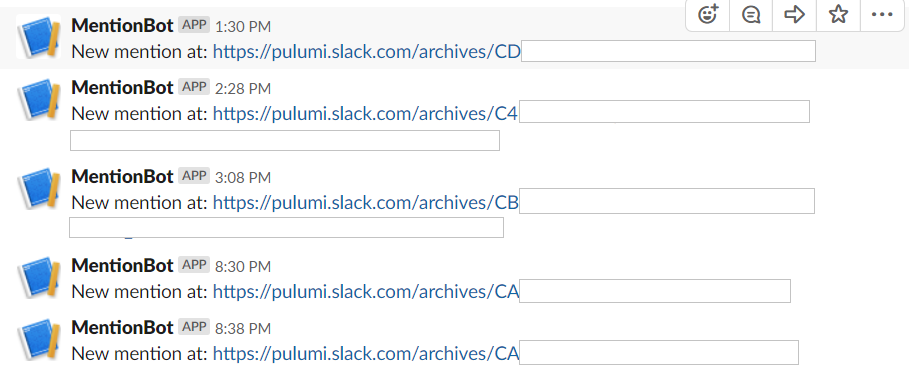
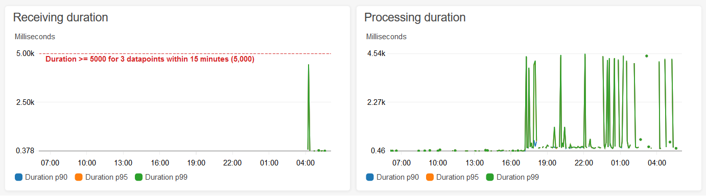

Pulumi Crosswalk for AWS modules can be used to get first class insights
and visualizations directly inside your Pulumi application.

As cloud applications tend to be long-lived, we think it's vital that it
be possible to get regular insights on the performance of the
application at all times. Using
[Crosswalk for AWS]() Pulumi applications
allow you to easily define and visualize the appropriate
[metrics](https://docs.aws.amazon.com/AmazonCloudWatch/latest/monitoring/working_with_metrics.html)
that show the health of your services, create
[alarms](https://docs.aws.amazon.com/AmazonCloudWatch/latest/monitoring/AlarmThatSendsEmail.html)
to let you know when something is wrong, and easily create
[dashboards](https://docs.aws.amazon.com/AmazonCloudWatch/latest/monitoring/CloudWatch_Dashboards.html)
to get live visualization of what is happening in the cloud. Because
this is vital to the health of the application, we think this should be
something built in from the start, and not something added after the
fact as an out of band artifact.
<!--more-->

Let's see what that means in practice! I'm going to use a recent
hackathon project I created where I built a [Slack bot](https://api.slack.com/bot-users) to notify me about all the
`@mentions` I'd received. Using this, I'd have a place I could go back
to to look at, to find messages I knew had come in, but maybe I wanted
to take a second glance at. The bot just sends me messages in a private
channel we share like so:

I intend to add more functionality to this bot over time to help me out.
If you'd like to create something similar, the code and instructions are
[here](https://github.com/pulumi/examples/tree/master/aws-ts-slackbot).
The bot works by hearing about incoming events (pushed to
it from Slack's servers), looking for mentions of my name, then pushing
requests back to Slack's server to update our private channel.

Now the bot I wrote has to do something interesting due to restrictions
in the Slack messaging system. Slack will only give you a few seconds to
deal with a message they send you. If you don't complete the request in
a timely fashion then they'll assume something has gone wrong, and
they'll resend. This will happen a few times before they just give up.
This means that we don't really want to try to process a message, and
then also make an outgoing network call to Slack all in the same
request. That outgoing call could take far too long, causing Slack to
think there was a problem. So, instead, we simply receive the request,
and push it right away to an [SNS](https://aws.amazon.com/sns/) topic.
We can then process that topic message later with another Lambda.

The skeleton of the code basically looks like this:

    // Location to store the incoming slack messages to.
    const messageTopic = new aws.sns.Topic("messages");
    // Create an API endpoint that slack will use to push events to us with.
    const endpoint = new awsx.apigateway.API("mentionbot", {
        routes: [{
            path: "/events",
            method: "POST",
            eventHandler: async (event) => {
                // process the different types of messages. Push normal messages to 'messageTopic'
                // ...
                // Return success quickly so that Slack doesn't just immediately resend this message to us.
                return { statusCode: 200, body: "" };
            },
        }],
    });
    // Hook up a lambda that will then process the topic when possible.
    const subscription = messageTopic.onEvent("processTopicMessage", async ev => {
         // process the messages in here. Look for mentions, then notify slack to post a message in
         // right channel if we find one.
    });

Overall, this is a very simple app. But how do we know if the app is
actually doing well? What if something starts to go wrong and the
`endpoint` is no longer responding in a timely fashion. How would we
find out? It turns out to be pretty simple to add this functionality
here! Let's see how that would look.

First, we want to be profiling the [Lambda Functions](https://aws.amazon.com/lambda/) that were created by those
two resources. That's very simple to do:

    const endpointFunc = endpoint.getFunction("/events");
    const topicFunc = subscription.func;

Then, we want to get information about how long these functions are
taking. With Pulumi's
[Crosswalk]() APIs it's simple
to get at this information. Inside all the main "Crosswalk for AWS"
modules are exposed
[Metrics]()
for almost anything you might ever need. In this case, we want to know
how long those Functions are taking so we can get that information as
follows:

    const endpointFuncDuration = awsx.lambda.metrics.duration({ function: endpointFunc });
    const topicProcessDuration = awsx.lambda.metrics.duration({ function: topicFunc });

Metrics are very customizable. But for now we'll just use the defaults
returned for those functions by AWS. Now that we have the metrics, it's
simple to create an CloudWatch alarm that will alert us when things take
too long:

    // Notify us if takes us longer than 5 seconds to process a Slack message. But only notify if this
    // happened at least once every 5 minutes in a 15 minute period. We're ok with the occasional
    // random network hiccup causing delays.
    const alarm = endpointFuncDuration.withUnit("Seconds")
                                      .withPeriod(300)
                                      .createAlarm("TooLong", {
        threshold: 5,
        evaluationPeriods: 3,
    });

Finally, we can use both those metrics *and* the alarm we just created
to make a great looking dashboard that we can use to get an overall view
of the health of this app:

    const dashboard = new awsx.cloudwatch.Dashboard("mentionbot", {
        widgets: [
            new awsx.cloudwatch.LineGraphMetricWidget({
                width: 12,
                title: "Receiving duration",
                metrics: [ endpointFuncDuration.with({ extendedStatistic: 99, label: "Duration p99" }) ],
                annotations: new awsx.cloudwatch.HorizontalAnnotation(alarm),
            }),
            new awsx.cloudwatch.LineGraphMetricWidget({
                width: 12,
                title: "Processing duration",
                metrics: [ topicProcessDuration.with({ extendedStatistic: 99, label: "Duration p99" }) ],
            }),
        ],
    });

The [Crosswalk for AWS API for dashboards](https://github.com/pulumi/pulumi-awsx/tree/master/nodejs/awsx/cloudwatch#dashboards)
gives a lot of options for building up a dashboard programmatically.
There are a wealth of Widgets and Annotations to expose the full power
of Cloudwatch's dashboards to your app in a simple to use manner.

With the above Dashboard code we get this useful chart:

We can see that things look healthy, and the chart shows us both the
information about our p99 latencies, as well as the threshold point that
would cause our alarm to trigger.

With these facilities I now have an app that does what I need, but also
directly exposes mechanisms to track and get insights to its health.
What's great is that if I now change my app (for example, in a way that
causes new Lambda Functions to be created), I don't need to do anything
to keep these alarms and dashboards working. Because they're directly
referencing the real Cloud resources they will be kept up to date
automatically as my app grows and changes over time. That's really
powerful, and much simpler than having to manage all these different
parts independently!

We hope these new Crosswalk for AWS APIs will be just as useful for you!
For more information on Pulumi Crosswalk for AWS checkout other related
content:

1.  [Pulumi Crosswalk for AWS Announcement]()
2.  [Mapbox IOT-as-Code with Pulumi Crosswalk for AWS]()
3.  [Pulumi Crosswalk for AWS Documentation]()
