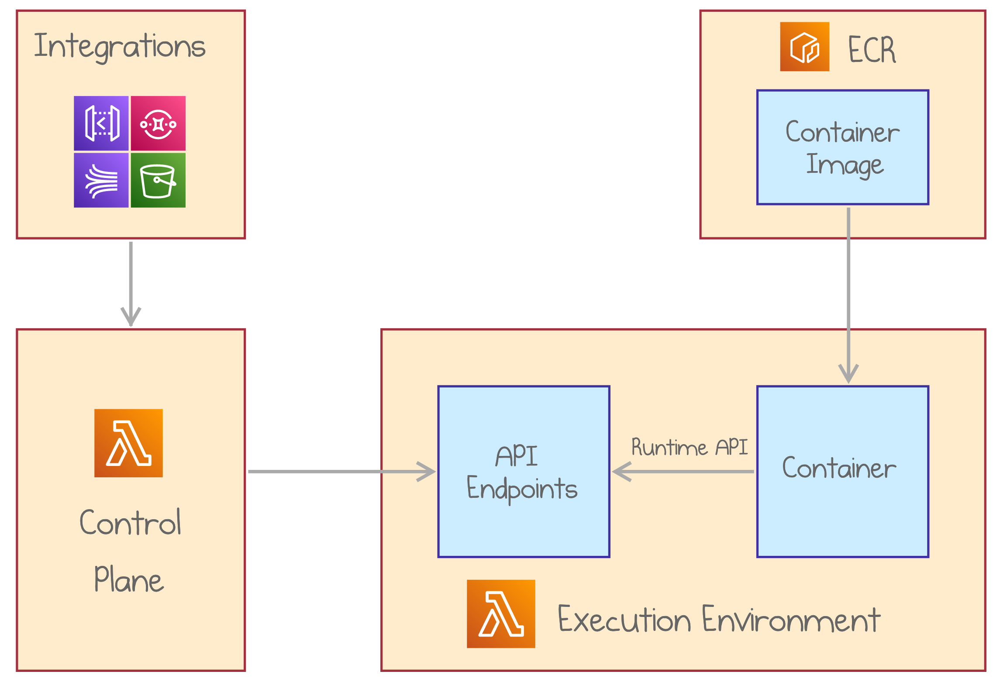

When AWS Lambda launched in 2014, it pioneered the concept of Function-as-a-Service. Developers could write a function in one of the supported programming languages, upload it to AWS, and Lambda executes the function on every invocation.

Ever since then, a zip archive of application code or binaries has been the only supported deployment option. Even AWS Lambda Layers&mdash;reusable components automatically merged into the application code&mdash;used the zip packaging format.

Today, AWS announced that AWS Lambda now supports packaging serverless functions as container images. This means that you can deploy a custom Docker or OCI image as an AWS Lambda function.

<!--more-->

<div class="bg-purple-100 text-sm rounded-lg py-1 px-4">

#### AWS Lambda Containers QuickStart

Ready to get up and running quickly right away?

1. Bootstrap a project `$ pulumi new https://github.com/pulumi/apps/lambda-containers`.
2. Add your Lambda's logic to `./app/Dockerfile` and `./app/index.js`.
3. Deploy with `$ pulumi up`.
4. Test with `$ curl $(pulumi stack output invokeUrl)`.

For additional information on how Lambda Containers work, and more advanced options, please read on.

</div>

## Why Use Container Images for AWS Lambda?

The first production-ready version of Docker was released in October 2014, just one month before the announcement of AWS Lambda. Container images are now the de-facto standard of application packaging. Containers run in local development loops, in Kubernetes clusters, including Amazon EKS, as well as in Amazon ECS and AWS Fargate. Docker is embraced across the cloud industry, for instance, Google Cloud Run is a serverless offering centered around container images.

With today's launch, AWS Lambda can run functions packaged as container images, enabling customers to build serverless applications using familiar tools, preferred languages, and required dependencies.

Here are essential scenarios enabled and improved by container image deployments:

- **Package binaries and libraries** that may not be available as a NPM (or another package manager) module. Our video processing example below demonstrates this capability.
- **Code in an arbitrary programming language**. While already possible with Lambda Layers and Runtime API, container images will streamline the experience of developing functions in languages not native to AWS Lambda.
- **Use custom OS and custom runtime versions** to match requirements and standard practices in a given company.
- **Deploy large files and packages**. Container images up to 10 GB are supported, as opposed to the previous hard limit of 250 MB of unzipped files.
- **Reuse existing base images** to bring reliable and battle-tested implementations from the broad community or domain-specific scenarios.
- **Apply centralized container image building and packaging governance and security requirements** to AWS Lambda deployments. This provides Enterprise customers with a higher level of control.

AWS Lambda functions packaged as container images will continue to benefit from the event-driven execution model, consumption-based billing, automatic scaling, high availability, fast start-up, and native integrations with numerous AWS services.

## How It Works

You can get started with deploying containers to AWS Lambda in three steps:

1. **Prepare a container definition** that implements the Lambda Runtime Interface as explained below.
2. **Build** the container image and **publish** it to Amazon Elastic Container Registry (ECR).
3. **Deploy an AWS Lambda**, grant it access to the ECR, and point it to the container image.



Your container image has to implement AWS Lambda runtime API. Runtime API is a simple HTTP-based protocol with operations to retrieve invocation data, submit responses, and report errors.

Therefore, not every container image may be deployed to AWS Lambda. You have two main options:

- **Choose a base image provided by AWS**, which already includes the Runtime Interface Client (RIC). AWS provides base images for Node.js, Python, Java, Go, .NET Core, and Ruby.
- **Use an arbitrary base image** and implement the API with an AWS Lambda runtime client SDK. Using a custom base image, you can leverage open-source AWS Lambda Runtime Interface Client to make the image compatible with Lambda’s runtime API.

## Container Images in AWS Lambda vs. AWS Fargate

Lambda Container image support further blurs the lines between Lambda and Fargate. It’s important to understand the remaining differences to decide which service to use in a given scenario:

- **Cost structure**. Lambda is charged per execution, while Fargate has a fixed cost per vCPU per hour regardless of the actual workload. Depending on requests per second served by a single CPU, one model can be much more frugal than the other.
- **Scale to zero**. Consequently, an idle Lambda function costs nothing while Fargate still incurs fixed minimal running costs. Therefore, breaking an application down to many small specialized Lambda functions is much more practical and common than micro Fargate instances.
- **Burst workloads**. Lambda scales on a per-request basis and can go from zero to a thousand instances in seconds. It’s a great fit for applications with bursty workloads that need to switch from idle to full capacity and back.
- **Performance**. Fargate runs on more dedicated resources, so overall performance will likely be better than on Lambda. For time-sensitive and critical APIs, Fargate may offer a fast and consistent experience superior to Lambda, especially on high percentiles.
- **Integration with AWS services**. Lambda comes with native integration with 100+ AWS services. It’s straightforward to trigger a function for incoming SQS messages or new files in an S3 bucket, which requires more wiring for Fargate tasks.
- **Resource limits**. Lambda executions are limited to 15 minutes and may only consume up to 10 GB of RAM. Fargate may be the only option for long-running resource-demanding jobs.

Overall, Lambda shines for unpredictable or inconsistent workloads and applications easily expressed as isolated functions triggered by events in other AWS services.

## Example: Serverless Video Thumbnailer with AWS Lambda and Pulumi

Let's walk through the steps to build an example application with container-based AWS Lambda using [infrastructure as code](). In this scenario, a function runs every time a new video is uploaded to an Amazon S3 bucket. It relies on FFmpeg tools to produce a thumbnail of the uploaded video and uploads the thumbnail back to the same S3 bucket.

We'll use Pulumi to provision the necessary resources. You can check out the [full source code](https://github.com/pulumi/examples/tree/master/aws-ts-lambda-thumbnailer) in the Pulumi Examples.

### Define a Dockerfile

Here are the key features of the container image for our Thumbnailer:

- Based on the `amazon/aws-lambda-nodejs:12` image
- Installs AWS CLI to copy objects to and from S3
- Installs FFmpeg to process video files
- Copies the `index.js` with function implementation
- Points the `index.handler` command

You can find the full Dockerfile [here](https://github.com/pulumi/examples/blob/master/aws-ts-lambda-thumbnailer/docker-ffmpeg-thumb/Dockerfile).

### Create an S3 Bucket

Now, let's start composing our Pulumi program in TypeScript. The first step is to define an S3 bucket.

```ts
import * as aws from "@pulumi/aws";

// A bucket to store videos and thumbnails.
const bucket = new aws.s3.Bucket("bucket");
```

### Build the container image and publish it to ECR

We can use [Pulumi Crosswalk for AWS](https://www.pulumi.com/docs/guides/crosswalk/aws/) to build the Docker image and publish it to a new ECR repository with just three lines of code.

```ts
import * as awsx from "@pulumi/awsx";

const image = awsx.ecr.buildAndPushImage("image", {
   context: "./docker-ffmpeg-thumb",
});
```

The local `docker-ffmpeg-thumb` folder contains the application files (`Dockerfile` and `index.js`).

### Setup a role

Next, we define an IAM role and a policy attachment to grant AWS Lambda access to S3 and CloudWatch.

```ts
const role = new aws.iam.Role("thumbnailerRole", {
   assumeRolePolicy: aws.iam.assumeRolePolicyForPrincipal({ Service: "lambda.amazonaws.com" }),
});
new aws.iam.RolePolicyAttachment("lambdaFullAccess", {
   role: role.name,
   policyArn: aws.iam.ManagedPolicy.AWSLambdaExecute,
});
```

### Configure your AWS Lambda function

It's time to define the AWS Lambda function itself! It's as simple as giving it a name and pointing to the image URI returned from the ECR. Also, we assign the role and increase the timeout to 15 minutes, as video processing may take a while.

```ts
const thumbnailer = new aws.lambda.Function("thumbnailer", {
   packageType: "Image",
   imageUri: image.imageValue,
   role: role.arn,
   timeout: 900,
});
```

### Trigger on new videos

Finally, we can assign a trigger to the function using the `bucket.onObjectCreated` helper method. We want to limit the function to only process `mp4` files.

```ts
// When a new video is uploaded, run the FFMPEG task on the video file.
bucket.onObjectCreated("onNewVideo", thumbnailer, { filterSuffix: ".mp4" });
```

And that is it! We run `pulumi up` to get the thumbnailed service up and running.

## Conclusion

Support for container images in AWS Lambda brings the power and usability of industry-standard packaging to serverless functions. It becomes easy to reuse application components packaged with the ubiquitous deployment format.

In this post, we’ve shown how to use Pulumi to build a container image and configure an AWS Lambda to run it. Pulumi makes it easy to create artifacts and provision and manage cloud infrastructure on any cloud using familiar programming languages, including TypeScript, Python, Go and .NET. Docker images, ECR registries, and Lambda functions can be managed within the same infrastructure definition.

Check out the video below for a demo of packaging AWS Lambda functions as containers.



Further steps:

- Check out the full [Lambda + Docker example](https://github.com/pulumi/examples/tree/master/aws-ts-lambda-thumbnailer) in the Pulumi Examples.
- [Sign-up](https://www.pulumi.com/resources/deplying-microservices-with-pulumi-and-aws-lambda/) for a hands-on Pulumi AWS Lambda Workshop.
- [Get Started](https://www.pulumi.com/docs/get-started/aws/) with Pulumi for AWS today.
