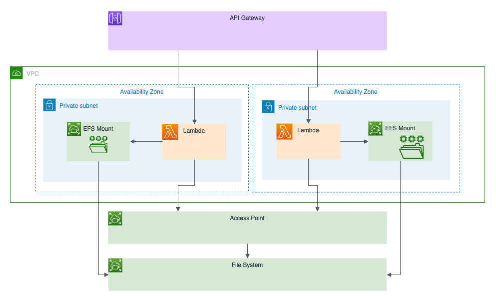

Ever since AWS Lambda was released in 2015, users have wanted persistent file storage beyond the small 512MB `/tmp` disk allocated to each Lambda function.  The following year, Amazon launched EFS,  offering a simple managed file system service for AWS, but initially only available to mount onto Amazon EC2 instances. Over the last few months, AWS has been extending access to EFS to all of the modern compute offerings.  First [EKS](https://aws.amazon.com/about-aws/whats-new/2019/09/amazon-eks-announces-beta-release-of-amazon-efs-csi-driver/) for Kubernetes, then [ECS and Fargate](https://aws.amazon.com/about-aws/whats-new/2020/04/amazon-ecs-aws-fargate-support-amazon-efs-filesystems-generally-available/) for containers.  Today, AWS announced that [EFS is now also supported in Lambda](https://aws.amazon.com/blogs/aws/new-a-shared-file-system-for-your-lambda-functions/), providing easy access to network file systems from your serverless functions.

<!--more-->

In this post, we’ll show you how to get started using EFS with Lambda and Pulumi.

Why would you *want* to use EFS from Lambda?  There are a few common reasons:

1. You need more local disk than the 512MB of `/tmp` space available to a single Lambda Function.
1. You want to share persistent storage across various functions and would prefer to use file system storage instead of blob storage or a database.
1. You want to share persistent storage between Lambda and other compute (like containers or ECS), and would prefer to use file storage over blob storage or a database.

Storing data to the file system is particularly natural for the kind of small functions common in Lambda - no need to use the AWS SDK - just call `fs.writeFileSync()` (or equivalent for your language of choice).

## EFS + Lambda Concepts

To use an EFS file system from Lambda, we need a few things:

1. A VPC
1. An EFS File System in the VPC
1. EFS mount points in each of the subnets of our VPC
1. An EFS Access Point specifying how Lambda should mount the EFS volume
1. An AWS Lambda Function running in the same VPC and private subnets and referencing the EFS Access Point



Let's walk through how to build the required infrastructure.  We'll use Pulumi to provision the necessary resources.  You can check out the [full source code](https://github.com/pulumi/examples/tree/master/aws-ts-lambda-efs) in the Pulumi Examples.

Because EFS is tied to a VPC, we can only access it from a Lambda running inside a VPC.  We should create a VPC with both public and private subnets to ensure the Lambda function can reach the internet (since Lambda functions inside VPCs are not assigned public IPs).  We could use an existing VPC or create a new one for our application.

```ts
const vpc = new awsx.ec2.Vpc("vpc", { subnets: [{ type: "private" }, { type: "public" }] });
const subnetIds = await vpc.publicSubnetIds;
```

An EFS FileSystem is a regional service, but accessing it requires adding mount points to a VPC.  We can add those to the private subnets where our Functions will run.  Each mount target has a security group, and we can use the default security group to allow access only from other compute resources in the same security group in our VPC.  We could also use an existing FileSystem and mount targets if they have already been provisioned for another application.

```ts
const filesystem = new aws.efs.FileSystem("filesystem");
const targets = [];
for (let i = 0; i < subnetIds.length; i++) {
    targets.push(new aws.efs.MountTarget(`fs-mount-${i}`, {
        fileSystemId: filesystem.id,
        subnetId: subnetIds[i],
        securityGroups: [vpc.vpc.defaultSecurityGroupId],
    }));
}
```

To use EFS from our Lambda Function, we need to tell Lambda how to mount the NFS volume.  Specifically, we must specify the Unix user and group to use to enable access, and the location and permission scheme to use as the root folder of the mount.  This is done using an EFS AccessPoint.

```ts
const ap = new aws.efs.AccessPoint("ap", {
    fileSystemId: filesystem.id,
    posixUser: { uid: 1000, gid: 1000 },
    rootDirectory: { path: "/www", creationInfo: { ownerGid: 1000, ownerUid: 1000, permissions: "755" } },
}, { dependsOn: targets });
```

Finally, each Lambda Function we want to run will need to be in our VPC, use our default security group, and mount the EFS file system via our AccessPoint.  We can write a small function that creates Lambda Functions with this configuration and we can specify where we want to mount this into the Lambda Function, though we must mount it underneath `/mnt/`.

```ts
function efsvpcCallback(name: string, f: aws.lambda.Callback<awsx.apigateway.Request, awsx.apigateway.Response>) {
    return new aws.lambda.CallbackFunction(name, {
        policies: [aws.iam.ManagedPolicy.AWSLambdaVPCAccessExecutionRole, aws.iam.ManagedPolicy.LambdaFullAccess],
        vpcConfig: {
            subnetIds: vpc.privateSubnetIds,
            securityGroupIds: [vpc.vpc.defaultSecurityGroupId],
        },
        fileSystemConfig: { arn: ap.arn, localMountPath: "/mnt/storage" },
        callback: f,
    });
}
```

We now have our infrastructure all set up to start using Lambda with EFS.  Let’s build an app!

## Interact with EFS from an HTTP API

For a first simple Lambda application, we'll expose an HTTP API that GETs files from, and POSTs files to, our EFS file system.  We'll implement this with API Gateway and two routes.  Using the helper we defined above, each of these is just a few lines of code.

Note that we can use our normal Node.js `fs.readFileSync` and `fs.writeFileSync` APIs to interact with the EFS file system - no need for an AWS SDK to talk to EFS. This makes it easy to take existing software and libraries that can interact with the filesystem and run them inside Lambda.

```ts
const api = new awsx.apigateway.API("api", {
    routes: [
        {
            method: "GET", path: "/files/{filename+}", eventHandler: efsvpcCallback("getHandler", async (ev, ctx) => {
                try {
                    const f = "/mnt/storage/" + ev.pathParameters!.filename;
                    const data = fs.readFileSync(f)
                    return {
                        statusCode: 200,
                        body: data.toString(),
                    };
                } catch {
                    return { statusCode: 500, body: "" }
                }
            }),
        },
        {
            method: "POST", path: "/files/{filename+}", eventHandler: efsvpcCallback("uploadHandler", async (ev, ctx) => {
                try {
                    const f = "/mnt/storage/" + ev.pathParameters!.filename;
                    const data = new Buffer(ev.body!, 'base64');
                    fs.writeFileSync(f, data)
                    return {
                        statusCode: 200,
                        body: "",
                    };
                } catch {
                    return { statusCode: 500, body: "" }
                }
            }),
        },
    ]
});
```

Once this is deployed, we can interact with the API to add files to our file system:

```
$ curl -X POST -d 'Hello world' $(pulumi stack output url)files/file.txt
$ curl -X GET $(pulumi stack output url)files/file.txt
Hello, world
```

Easy as that - our two Lambda functions are sharing data via EFS!

We can get more insight into what the file system looks like inside Lambda by exposing a REST endpoint to run commands inside the a Lambda function.  This will allow us to run `curl` to run commands to populate and read the contents of the file system.

```ts
...
        {
            method: "POST", path: "/", eventHandler: efsvpcCallback("postHandler", async (ev, ctx) => {
                const cmd = new Buffer(ev.body!, 'base64').toString()
                const buf = cp.execSync(cmd);
                return {
                    statusCode: 200,
                    body: buf.toString(),
                };
            }),
        },
...
```

We can now interact with our EFS file system by just running shell commands.  Since it’s a normal file system mount, all our standard Unix tools work as we expect.  Note that the files are owned by uid/gid `1000`/`1000`, and have the 755 permissions specified by our Access Point.

```bash
$ curl -X POST -d 'ls -la /mnt/storage' $(pulumi stack output url)
total 8
drwxr-xr-x 2 1000 1000 6144 Jun 10 05:37 .
drwxr-xr-x 3 root root 4096 Jun 10 05:35 ..
-rw-rw-r-- 1 1000 1000   21 Jun 10 05:37 file.txt

$ curl -X POST -d 'echo "<h1>Hello World</h1>" > /mnt/storage/index.html' $(pulumi stack output url)
$ curl -X POST -d 'ls -la /mnt/storage' $(pulumi stack output url)
total 12
drwxr-xr-x 2 1000 1000 6144 Jun 10 05:38 .
drwxr-xr-x 3 root root 4096 Jun 10 05:35 ..
-rw-rw-r-- 1 1000 1000   21 Jun 10 05:37 file.txt
-rw-rw-r-- 1 1000 1000   21 Jun 10 05:38 index.html
```

## Sharing a File System between Fargate and Lambda

Now that we can read and write to our file system from Lambda, what about sharing it between Lambda and other compute services?  We could mount our volume to EC2, EKS, ECS, or Fargate.  Let’s try out Fargate by running a small `nginx` server that serves from the same file system we just used.

First, we create an EFS volume configuration that describes the volume we want to mount in our Fargate Task.  This is similar to Lambda - we use the same AccessPoint and root directory.

```ts
const efsVolumeConfiguration: aws.types.input.ecs.TaskDefinitionVolumeEfsVolumeConfiguration = {
    fileSystemId: filesystem.id,
    authorizationConfig: { accessPointId: ap.id, },
    rootDirectory: "/www",
};
```

Then we can launch our `nginx` task.  We use our EFS volume configuration to define a volume named `efs` in the task, and then mount that volume into the `/usr/share/nginx/html` path in the `nginx` container so it can serve content directly from the EFS file system.  Note that we also have to explicitly set the `platformVersion` to `1.4.0` so that we can use EFS since `1.4.0` is not yet the default.  We ensure that we are using the same security group that can access the file system and that we’ve opened up access to port 80 for our nginx server.

```ts
const nginx = new awsx.ecs.FargateService("nginx", {
    cluster: cluster,
    taskDefinitionArgs: {
        container: {
            image: "nginx",
            memory: 128,
            portMappings: [{ containerPort: 80, hostPort: 80, protocol: "tcp" }],
            mountPoints: [{ containerPath: "/usr/share/nginx/html", sourceVolume: "efs" }],
        },
        volumes: [{ name: "efs", efsVolumeConfiguration }],
    },
    securityGroups: [vpc.vpc.defaultSecurityGroupId, ...cluster.securityGroups],
    subnets: vpc.publicSubnetIds,
    platformVersion: "1.4.0",
});
```

Navigating to our Task’s public IP - we see the contents of the file we stored in our file system.


## Conclusion

Support for EFS in Lambda opens up a lot of new options for managing persistent data inside serverless functions.  And even more importantly, makes it easy to share data in a format that existing applications in VM instances or containers can natively work with.

In this post, we've shown how you can use Pulumi to manage Lambda + EFS. Pulumi makes it easy to provision and manage cloud infrastructure on any cloud, using programming languages you are familiar with, including TypeScript, Python, Go and .NET.  This is a great fit for EFS and Lambda, which combine managed infrastructure with small serverless function code.

Check out the [full Lambda + EFS example above](https://github.com/pulumi/examples/tree/master/aws-ts-lambda-efs) in the Pulumi Examples, learn more about [Lambda support for EFS in the AWS docs](https://docs.aws.amazon.com/lambda/latest/dg/configuration-filesystem.html), and [get started with Pulumi for AWS](https://www.pulumi.com/docs/get-started/aws/) today.


