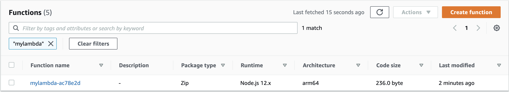

In late 2018, [AWS launched their first EC2 instances](https://aws.amazon.com/blogs/aws/new-ec2-instances-a1-powered-by-arm-based-aws-graviton-processors/)
powered by ARM-based AWS Graviton Processors. These instances had been optimized for performance and cost. Since that initial launch,
Amazon has continued to innovate in the Graviton space. In June 2021, they launched the [Graviton Challenge](https://amzn.to/GravitonChallenge)
for users to move their applications to [AWS Graviton2](https://aws.amazon.com/ec2/graviton/). AWS Graviton2 processor instance types are up to 20%
lower cost than x86 based instance types and see up to 40% better price performance.

Today, [AWS launched Graviton2 support for AWS Lambda Functions](https://aws.amazon.com/blogs/aws/aws-lambda-functions-powered-by-aws-graviton2-processor-run-your-functions-on-arm-and-get-up-to-34-better-price-performance), which means that your Lambda Functions can now
execute on Graviton2 processors and take advantage of the improved price performance of that architecture.

## Deploying a Lambda Function with Graviton2 Support

Let's use Pulumi to deploy a new AWS Lambda Function using a Graviton2 architecture. First, let's create the IAM role
and policies required to create a Lambda Function:



{}

```typescript
import * as aws from "@pulumi/aws";

const role = new aws.iam.Role("lambda-role", {
    assumeRolePolicy: aws.iam.assumeRolePolicyForPrincipal({
        Service: "lambda.amazonaws.com"
    }),
});

const fullAccess = new aws.iam.RolePolicyAttachment("mylambda-access", {
    role: role,
    policyArn: aws.iam.ManagedPolicy.LambdaFullAccess,
});
```

{}
{}

```python
import pulumi
import json
import pulumi_aws as aws

test_role = aws.iam.Role("lambda-role",
    assume_role_policy=json.dumps({
        "Version": "2012-10-17",
        "Statement": [{
            "Action": "sts:AssumeRole",
            "Effect": "Allow",
            "Sid": "",
            "Principal": {
                "Service": "lambda.amazonaws.com",
            },
        }],
    }))

full_access = aws.iam.RolePolicyAttachment("mylambda-access",
                                           role=role.name,
                                           policy_arn=aws.iam.ManagedPolicy.LAMBDA_FULL_ACCESS)
```

{}
{}

```go
package main

import (
	"encoding/json"

	"github.com/pulumi/pulumi-aws/sdk/v4/go/aws/iam"
	"github.com/pulumi/pulumi/sdk/v3/go/pulumi"
)

func main() {
	pulumi.Run(func(ctx *pulumi.Context) error {
		// create IAM role and policy wiring
		assumeRolePolicyJSON, err := json.Marshal(map[string]interface{}{
			"Version": "2012-10-17",
			"Statement": []interface{}{
				map[string]interface{}{
					"Action": "sts:AssumeRole",
					"Principal": map[string]interface{}{
						"Service": "lambda.amazonaws.com",
					},
					"Effect": "Allow",
				},
			},
		})
		if err != nil {
			return err
		}
		role, err := iam.NewRole(ctx, "lambda-role", &iam.RoleArgs{
			AssumeRolePolicy: pulumi.String(assumeRolePolicyJSON),
		})
		if err != nil {
			return err
		}

		_, err = iam.NewRolePolicyAttachment(ctx, "mylambda-access", &iam.RolePolicyAttachmentArgs{
			Role:      role.Name,
			PolicyArn: pulumi.String("arn:aws:iam::aws:policy/AWSLambda_FullAccess"),
		})
		if err != nil {
			return err
		}

		return nil
	})
}
```

{}
{}

```csharp
using Pulumi;
using Pulumi.Aws.Iam;
using Pulumi.Aws.Lambda;

class LambdaStack : Stack
{
    public LambdaStack()
    {
        var role = new Role("lambda-role", new RoleArgs
        {
            AssumeRolePolicy =
                @"{
                ""Version"": ""2012-10-17"",
                ""Statement"": [
                    {
                        ""Action"": ""sts:AssumeRole"",
                        ""Principal"": {
                            ""Service"": ""lambda.amazonaws.com""
                        },
                        ""Effect"": ""Allow"",
                        ""Sid"": """"
                    }
                ]
            }"
        });

        var fullAccess = new Aws.Iam.RolePolicyAttachment("mylambda-access", new Aws.Iam.RolePolicyAttachmentArgs
        {
            Role = role.Name,
            PolicyArn = "arn:aws:iam::aws:policy/AWSLambda_FullAccess",
        });  
    }
}
```

{}



This IAM role can then be used when deploying the Lambda Function:



{}

```typescript
const lambda = new aws.lambda.Function("mylambda", {
    code: new pulumi.asset.AssetArchive({
        ".": new pulumi.asset.FileArchive("./app"),
    }),
    role: role.arn,
    handler: "index.handler",
    runtime: aws.lambda.NodeJS12dXRuntime,
    architectures: ["arm64"],
});
```

{}
{}

```python
function = aws.lambda_.Function("mylambda",
                                   role=role.arn,
                                   runtime="nodejs12.x",
                                   handler="index.handler",
                                   code=pulumi.AssetArchive({
                                       '.': pulumi.FileArchive('./app')
                                   }),
                                   architectures=["arm64"],
                                   )
```

{}
{}

```go
function, err := lambda.NewFunction(ctx, "mylambda", &lambda.FunctionArgs{
    Handler:       pulumi.String("index.handler"),
    Role:          role.Arn,
    Runtime:       pulumi.String("nodejs12.x"),
    Code:          pulumi.NewFileArchive("./app"),
    Architectures: pulumi.StringArray{pulumi.String("arm64")},
})
if err != nil {
	return nil
}
```

{}
{}

```csharp
    var lambda = new Function("mylambda", new FunctionArgs
    {
        Runtime = "nodejs12.x",
        Code = new FileArchive("./app"),
        Handler = "index.handler",
        Role = role.Arn
        Architectures = {"arm64"}
    });
```

{}



The only new thing we need to do to deploy our Lambda function to Graviton2-based infrastructure is to provide the  `architectures` input,
specifying a value of `arm64`.  With that small change, our Lambda Function will execute on an Arm-based instance.

When we deploy this via Pulumi, we can see that the Function has been deployed with the correct architecture in AWS:

```bash
$ pulumi up
Previewing update (dev)

View Live: https://app.pulumi.com/stack72/lambda-graviton-function/dev/previews/ed6a2b10-d0a8-4c08-ba2d-c749f216db67

     Type                             Name                          Plan
 +   pulumi:pulumi:Stack              lambda-graviton-function-dev  create
 +   ├─ aws:iam:Role                  lambda-role                   create
 +   ├─ aws:iam:RolePolicyAttachment  mylambda-access               create
 +   └─ aws:lambda:Function           mylambda                      create

Resources:
    + 4 to create

Do you want to perform this update? yes
Updating (dev)

View Live: https://app.pulumi.com/stack72/lambda-graviton-function/dev/updates/1

     Type                             Name                          Status
 +   pulumi:pulumi:Stack              lambda-graviton-function-dev  created
 +   ├─ aws:iam:Role                  lambda-role                   created
 +   ├─ aws:lambda:Function           mylambda                      created
 +   └─ aws:iam:RolePolicyAttachment  mylambda-access               created

Resources:
    + 4 created

Duration: 25s
```



If the `architectures` input is not specified, AWS will set the value by default to `x86_64`.

Since we are running our application code on ARM, we need to ensure that the code in the archive we use for our
Lambda function can run natively on the ARM-based infrastructure. For interpreted languages like Node.js and Python, most applications
will work as is.  For compiled languages like Go, we need to ensure that our Go code is cross-compiled for
`GOARCH=arm64`, and that the resulting ARM64 binary is included in our Lambda source archive.

## Creating a Lambda Layer with Graviton2 Support

To create a [Lambda Layer](https://docs.aws.amazon.com/lambda/latest/dg/configuration-layers.html) with Graviton2
support, we can extend our example above. Firstly, let's create a lambda layer:



{}

```typescript
const layer = new aws.lambda.LayerVersion("my-layer-version", {
    code: new pulumi.asset.AssetArchive({
        ".": new pulumi.asset.FileArchive("./base-layer"),
    }),
    compatibleRuntimes: [
        aws.lambda.Runtime.NodeJS14dX,
    ],
    layerName: "my-base-layer",
    compatibleArchitectures: ["arm64", "x86_64"]
});

```

{}
{}

```python
layer = aws.lambda_.LayerVersion("my-layer-version",
                                        compatible_runtimes=["nodejs12.x"],
                                        code=pulumi.FileArchive("./base-layer"),
                                        layer_name="my-base-layer",
                                        compatible_architectures=["arm64", "x86_64"])
```

{}
{}

```go
layer, err := lambda.NewLayerVersion(ctx, "my-layer-version", &lambda.LayerVersionArgs{
    LayerName:               pulumi.String("my-base-layer"),
    Code:                    pulumi.NewFileArchive("./base-layer"),
    CompatibleRuntimes:      pulumi.StringArray{pulumi.String("nodejs12.x")},
    CompatibleArchitectures: pulumi.StringArray{pulumi.String("nodejs12.x")},
})
if err != nil {
	return nil
}
```

{}
{}

```csharp
    var layer = new LayerVersion("my-layer-version", new LayerVersionArgs
    {
        CompatibleRuntimes =
        {
            "nodejs12.x",
        },
        CompatibleArchitectures =
        {
            "arm64",
            "x86_64",
        },
        Code = new FileArchive("./base-layer"),
        LayerName = "my-base-layer",
    });
```

{}



This will create a Lambda layer that is compatible with NodeJS 12.x and ARM64 & X86_64. Layers can be created that are compatible
with ARM64, X86_64 or both architectures. We can then build a new lambda based on this Lambda layer:



{}

```typescript
const lambda = new aws.lambda.Function("mylambda", {
    code: new pulumi.asset.AssetArchive({
        ".": new pulumi.asset.FileArchive("./app"),
    }),
    role: role.arn,
    handler: "index.handler",
    runtime: aws.lambda.NodeJS12dXRuntime,
    architectures: ["arm64"],
    layers: [layer.arn]
});
```

{}
{}

```python
function = aws.lambda_.Function("mylambda",
                                   role=role.arn,
                                   runtime="nodejs12.x",
                                   handler="index.handler",
                                   code=pulumi.AssetArchive({
                                       '.': pulumi.FileArchive('./app')
                                   }),
                                   architectures=["arm64"],
                                   layers=[layer.arn]
                                   )
```

{}
{}

```go
function, err := lambda.NewFunction(ctx, "mylambda", &lambda.FunctionArgs{
    Handler:       pulumi.String("index.handler"),
    Role:          role.Arn,
    Runtime:       pulumi.String("nodejs12.x"),
    Code:          pulumi.NewFileArchive("./app"),
    Architectures: pulumi.StringArray{pulumi.String("arm64")},
    Layers:        pulumi.StringArray{layer.Arn},
})
if err != nil {
	return nil
}
```

{}
{}

```csharp
    var lambda = new Function("mylambda", new FunctionArgs
    {
        Runtime = "nodejs12.x",
        Code = new FileArchive("./app"),
        Handler = "index.handler",
        Role = role.Arn
        Architectures = {"arm64"}
        Layers =
        {
            lambdaLayer.Arn,
        },
    });
```

{}



This will deploy a function built on top of the Lambda layer targeting the Graviton2 architecture and NodeJS 12.x runtime.

## Summary

AWS support for Lambda Functions powered by AWS Graviton2 offers users the ability to get better price performance for
their workloads. We've shown how you can build your Functions using this ability. You can read more about AWS Lambda functions
on the [AWS Documentation website](https://docs.aws.amazon.com/lambda/latest/dg/welcome.html) and getting started
with AWS Graviton on [GitHub](https://github.com/aws/aws-graviton-getting-started).
