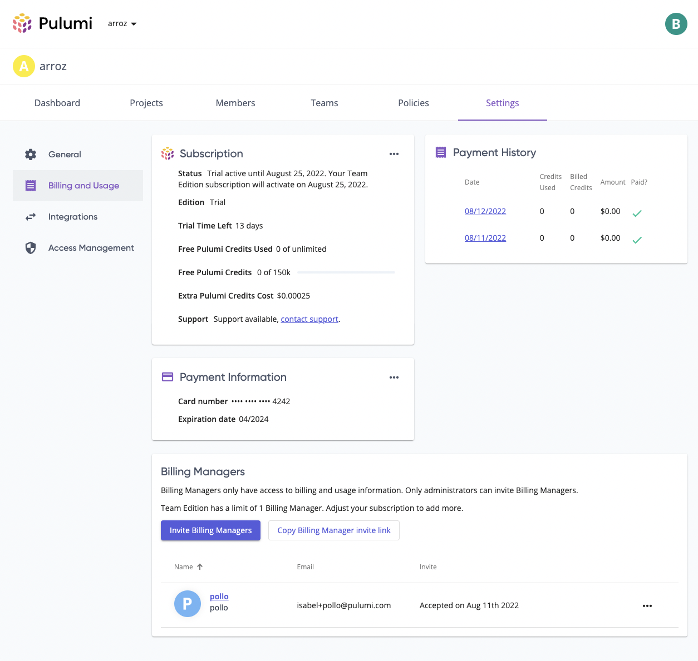

We are excited to announce that starting today Pulumi customers can create a Billing Manager role for their organization on the [Pulumi Service](https://app.pulumi.com). We have heard from our customers that having a Billing Manager would solve internal process challenges and are aiming to solve these pain points with the new Billing Manager role.

<!--more-->

## Feature overview

The Billing Manager role gives the user permissions to access and edit only billing information, with no read or write permissions for stacks. This role is for when you need  someone in your Organization to manage billing operations but you do not want them to have any permissions beyond that. Billing Managers can only be invited or added to the Organization by Organization Admins. Once added, the only information a Billing Manager will see is metrics about the Organization and the Billing and Usage page. Learn more about the permissions in the [Billing Manager documentation](/docs/pulumi-cloud/access-management/billing-managers/).

Billing Managers can be used for different purposes depending on the [Pulumi Service Edition](/pricing/) you are on, let's walk through them.

### Pulumi Team Growth Edition

If you are using the Pulumi Team Growth or the legacy Team Pro Edition of the Pulumi Service the Billing Manager role in your Pulumi Organization can do the following:

- Add or update credit card information for the Organization (this was the top reported pain point for the customers on Team Editions!)
- View the Pulumi Service Edition your Organization is on
- View your invoices and the frequency you are invoiced
- Update the number of seats your Organization is using (for legacy Editions only)

Team Editions of the Pulumi Service can have 1 Billing Manager at a time.

### Pulumi Enterprise Growth and Business Critical Editions

If you are using the Pulumi Enterprise Growth (or the legacy Enterprise per seat Edition) or the Business Critical Edition of the Pulumi Service the Billing Manager role in your Pulumi Organization can do the following:

- View the billing period and the renewal date for your Organization
- View the number of pre-paid credits
- View the amount of pre-paid credits that have been consumed in the billing period
- View the Pulumi Service Edition your Organization is on
- Update the number of seats your Organization is using (for legacy Editions only)

Enterprise and Business Critical Editions can have unlimited Billing Managers in their Organization.

### Let's see it

## Getting started

To add a Billing Manager, make sure you are an Organization Administrator and then follow these steps:

1. Log in to the [Pulumi Service](https://app.pulumi.com)
2. Navigate to the *Billing and Usage* page under *Organization Settings*
3. In the 'Billing Managers' section either invite a Billing Manager by entering their email or copy the Billing Manager invite link and send it to them directly
4. Once signed up, the Billing Manager will be able to see usage metrics on the *Dashboard* and navigate to the *Billing and Usage* page to perform actions and view billing information

This feature is available to all Pulumi Organizations today. Please let us know if you have any feedback on this feature, either by raising an issue in our [Pulumi Service GitHub repository](https://github.com/pulumi/service-requests) or by posting it in our [Community Slack](https://slack.pulumi.com). We hope it solves some friction for your organization!
