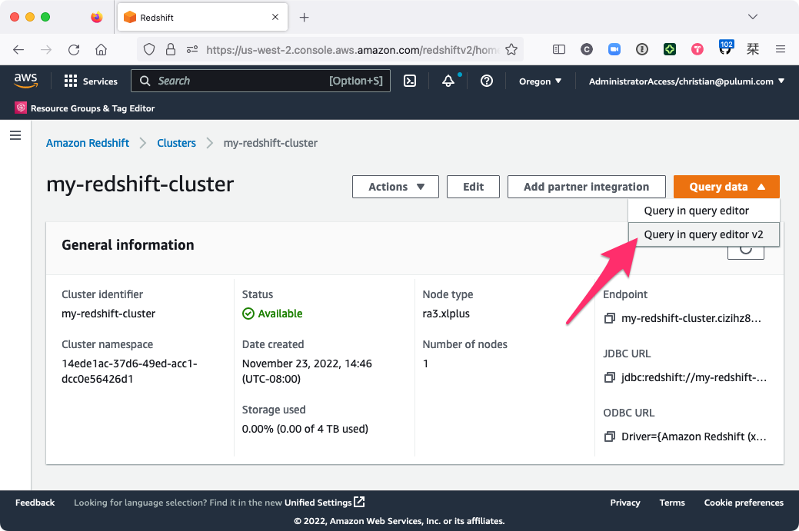
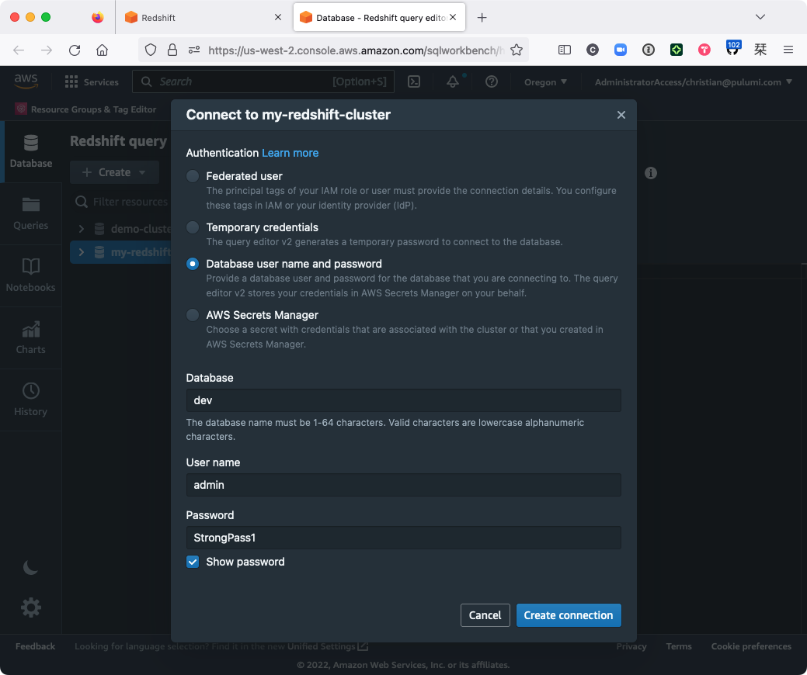
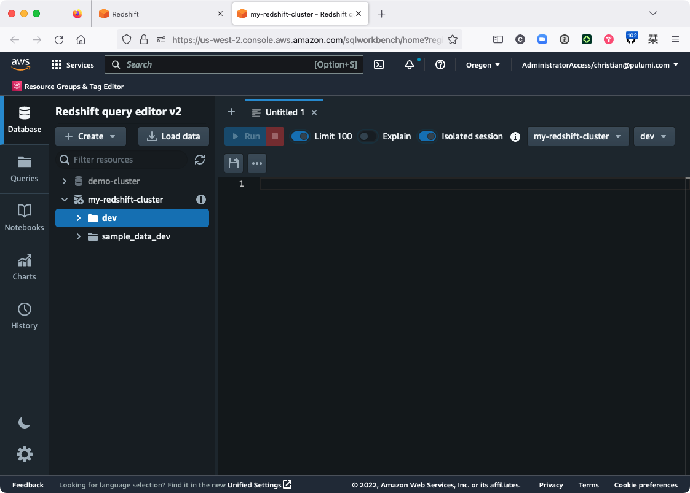
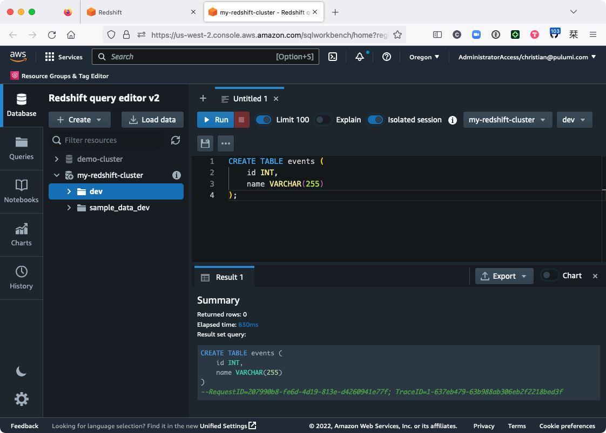
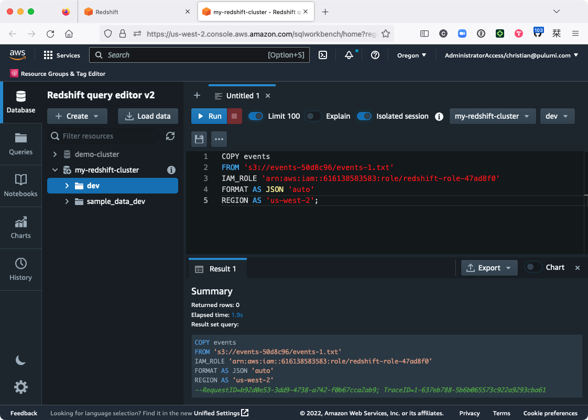
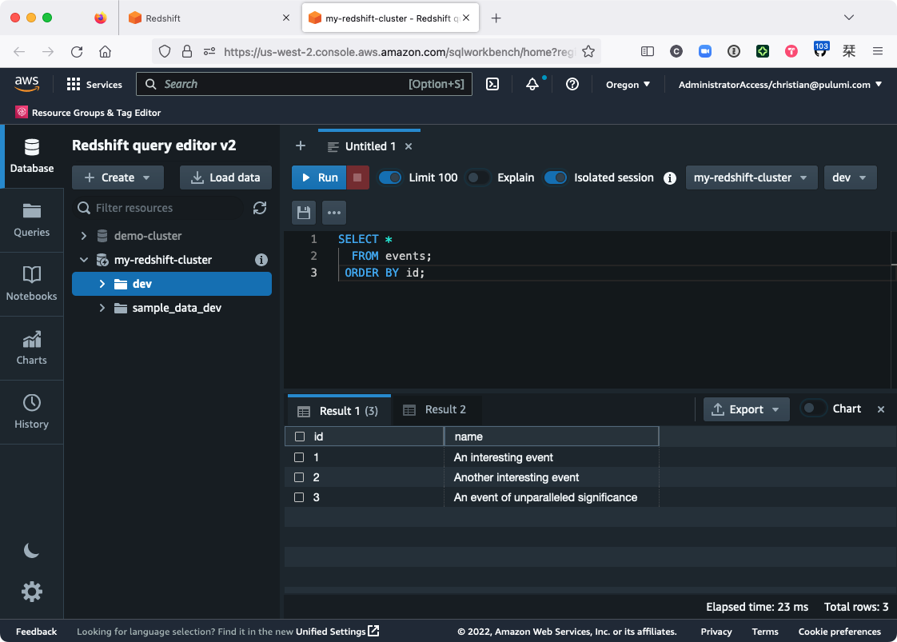
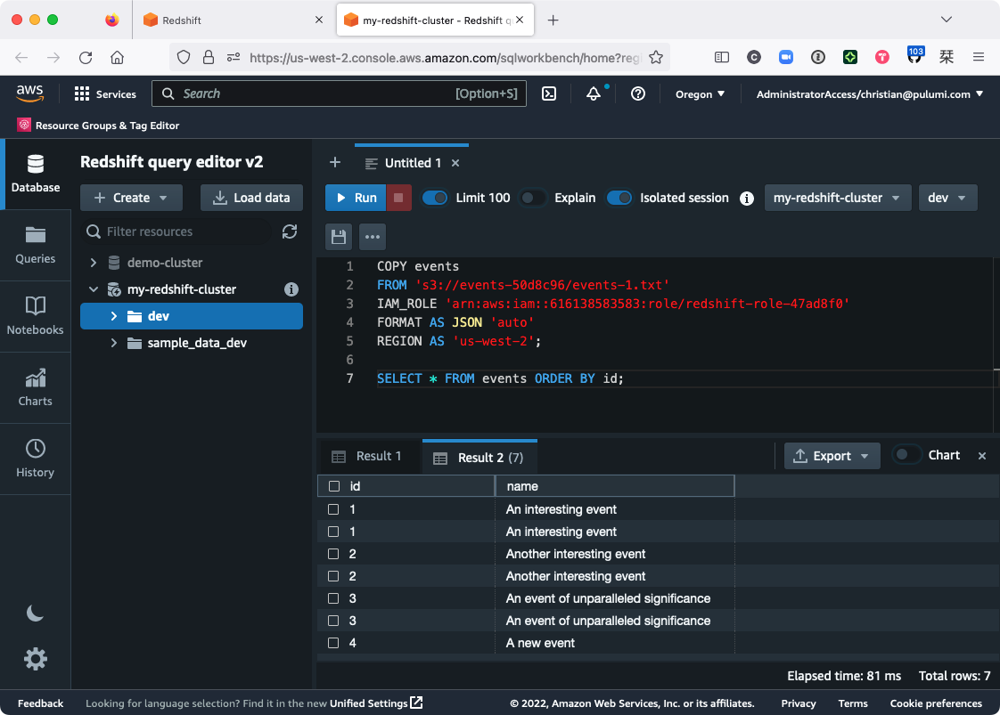

It's fun to think about how much data there is swirling around in the global datasphere these days. However you choose to measure it (and there are various ways), it's a quantity so massive --- [hundreds of zettabytes](https://en.wikipedia.org/wiki/Zettabyte_Era), by some estimates --- that it's kind of a hard thing to quite get your head around.

If you could convert all the world's data into droplets of water, for instance, at one megabyte per drop, you'd have enough 1MB drops to fill two more [Lake Washingtons](https://en.wikipedia.org/wiki/Lake_Washington). If you could store all that data on [3.5" floppies](https://en.wikipedia.org/wiki/Floppy_disk#3%C2%BD-inch_disk), you'd need more than a hundred quadrillion floppies to capture it all --- enough to cover the planet entirely (with much room for overlap) or to pave a nice bridge for yourself from your front porch well into interstellar space. If you could pull all that data into an HD movie, and you sat down to start watching that movie 2.5 million years ago (with your favorite saber-toothed friend, say), you'd still be watching the same movie today.

That's a lot of data --- and there's more every day.

Of course, the volume of data _you_ care about is probably a lot more modest. But even so, there's a good chance whatever system you're building can and will produce useful data of its own, and there's an equally good chance you'll want to learn something from it. That data will likely exist in many forms and in multiple places --- flat file here, transactional database there, the REST API of some third-party service --- so before you can really _look_ at it, you'll need to figure out how to get it all into one place. And for that, you might want to consider a [data warehouse](https://en.wikipedia.org/wiki/Data_warehouse).

A data warehouse is a specialized database that's purpose built for gathering and analyzing data. Unlike general-purpose databases like MySQL or PostgreSQL, which are designed to meet the real-time performance and transactional needs of applications, a data warehouse is designed to collect and process the data produced by those applications, collectively and over time, to help you gain insight from it. Examples of data-warehouse products include [Snowflake](https://www.snowflake.com/en/data-cloud/workloads/data-warehouse/), [Google BigQuery](https://cloud.google.com/bigquery/), [Azure Synapse Analytics](https://azure.microsoft.com/en-us/products/synapse-analytics), and [Amazon Redshift](https://aws.amazon.com/redshift/) --- all of which, incidentally, are easily managed with Pulumi.

Today, though, we're going to focus on Amazon Redshift. Specifically, we're going to walk through the process of writing a Pulumi program that provisions a single-node Redshift [cluster](https://docs.aws.amazon.com/redshift/latest/mgmt/working-with-clusters.html) in an [Amazon VPC](https://aws.amazon.com/vpc/), then we'll load some sample data into the warehouse from Amazon S3. We'll load this data manually at first, just to get a sense of how everything works when it's all wired up, and then later, [in a follow-up post](/blog/redshift-etl-with-pulumi-and-aws-glue/), we'll go a step further and weave in some automation to load the data on a schedule.

Let's get going!

## Create a new project

We'll begin, as always, by creating a new Pulumi project. (And if you haven't already, make sure you've [installed Pulumi](https://www.pulumi.com/docs/get-started/install/) and [configured your AWS credentials](https://www.pulumi.com/registry/packages/aws/installation-configuration/) in the usual way.)



{}

```bash
$ mkdir my-data-warehouse && cd my-data-warehouse
$ pulumi new aws-typescript
```

{}

{}

```bash
$ mkdir my-data-warehouse && cd my-data-warehouse
$ pulumi new aws-python
```

{}

Step through the new-project wizard, accepting the defaults if they'll work for you. For this project, we'll deploy both cluster and data into the `us-west-2` region of AWS, but you can change the target to region you like, as both S3 and Redshift are supported in all AWS regions.

With the project and stack in place, it's time to start building.

## Configure the stack

To launch a new Redshift cluster, you'll need to give AWS a few details:

* A unique (in the scope of your AWS account) name for the Redshift cluster
* A name for the cluster's initial database
* A username and password for the cluster's administrative user
* The [node type](https://docs.aws.amazon.com/redshift/latest/mgmt/working-with-clusters.html#rs-node-type-info) to use for the Redshift cluster

The following configuration settings should work for this walkthrough (but again, feel free to adjust them if you'd like):

```bash
$ pulumi config set clusterIdentifier my-redshift-cluster
$ pulumi config set clusterNodeType ra3.xlplus
$ pulumi config set clusterDBName dev
$ pulumi config set clusterDBUsername admin
$ pulumi config set clusterDBPassword StrongPass1 --secret
```

## Compose the program

With these settings in place, you can start writing the Pulumi program.

Open  in your editor of choice and replace its contents with the following code, which imports the Pulumi and AWS libraries, reads the configuration values you just set, and provisions an S3 bucket that we'll use to store some raw, unstructured data later:



{}

```typescript
import * as pulumi from "@pulumi/pulumi";
import * as aws from "@pulumi/aws";

// Import the stack's configuration settings.
const config = new pulumi.Config();
const clusterIdentifier = config.require("clusterIdentifier");
const clusterNodeType = config.require("clusterNodeType");
const clusterDBName = config.require("clusterDBName");
const clusterDBUsername = config.require("clusterDBUsername");
const clusterDBPassword = config.requireSecret("clusterDBPassword");

// Import the provider's configuration settings.
const providerConfig = new pulumi.Config("aws");
const awsRegion = providerConfig.require("region");

// Create an S3 bucket to store some raw data.
const eventsBucket = new aws.s3.Bucket("events", {
    forceDestroy: true,
});
```

{}

{}

```python
import json
import pulumi
from pulumi_aws import ec2, iam, redshift, s3

# Import the stack's configuration settings.
config = pulumi.Config()
cluster_identifier = config.require("clusterIdentifier")
cluster_node_type = config.require("clusterNodeType")
cluster_db_name = config.require("clusterDBName")
cluster_db_username = config.require("clusterDBUsername")
cluster_db_password = config.require_secret("clusterDBPassword")

# Import the provider's configuration settings.
provider_config = pulumi.Config("aws")
aws_region = provider_config.require("region")

# Create an S3 bucket to store some raw data.
events_bucket = s3.Bucket("events", s3.BucketArgs(
    force_destroy=True,
))
```

{}

Next, define a new VPC and the associated network resources for the Redshift cluster. Since the aim is to launch the cluster into a VPC (providing the network isolation we need to keep the cluster from being accessed over the internet), you'll define the VPC first, then define a private subnet within it, and then finally designate a [Redshift subnet group](https://docs.aws.amazon.com/redshift/latest/mgmt/working-with-cluster-subnet-groups.html) to tell AWS where to provision the cluster:



{}

```typescript
// ...

// Create a VPC.
const vpc = new aws.ec2.Vpc("vpc", {
    cidrBlock: "10.0.0.0/16",
    enableDnsHostnames: true,
});

// Create a private subnet within the VPC.
const subnet = new aws.ec2.Subnet("subnet", {
    vpcId: vpc.id,
    cidrBlock: "10.0.1.0/24",
});

// Declare a Redshift subnet group with the subnet ID.
const subnetGroup = new aws.redshift.SubnetGroup("subnet-group", {
    subnetIds: [
        subnet.id,
    ],
});
```

{}

{}

```python
# ...

# Create a VPC.
vpc = ec2.Vpc("vpc", ec2.VpcArgs(
    cidr_block="10.0.0.0/16",
    enable_dns_hostnames=True,
))

# Create a private subnet within the VPC.
subnet = ec2.Subnet("subnet", ec2.SubnetArgs(
    vpc_id=vpc.id,
    cidr_block="10.0.1.0/24",
))

# Declare a Redshift subnet group with the subnet ID.
subnet_group = redshift.SubnetGroup("subnet-group", redshift.SubnetGroupArgs(
    subnet_ids=[
        subnet.id,
    ],
))
```

{}

Now, on to the cluster itself.

The plan, you'll recall, is to pull data from an S3 bucket into Redshift (using the Redshift service itself, for now), so you'll need to give Redshift the appropriate permissions to read from Amazon S3. You can do that with an IAM role and [AWS-managed policy](https://docs.aws.amazon.com/AmazonS3/latest/userguide/security-iam-awsmanpol.html#security-iam-awsmanpol-amazons3readonlyaccess) granting Redshift read-only access to the S3 service:



{}

```typescript
// ...

// Create an IAM role granting Redshift read-only access to S3.
const redshiftRole = new aws.iam.Role("redshift-role", {
    assumeRolePolicy: {
        Version: "2012-10-17",
        Statement: [
            {
                Action: "sts:AssumeRole",
                Effect: "Allow",
                Principal: {
                    Service: "redshift.amazonaws.com",
                },
            },
        ],
    },
    managedPolicyArns: [
        aws.iam.ManagedPolicy.AmazonS3ReadOnlyAccess,
    ],
});
```

{}

{}

```python
# ...

# Create an IAM role granting Redshift read-only access to S3.
redshift_role = iam.Role("redshift-role", iam.RoleArgs(
    assume_role_policy=json.dumps({
        "Version": "2012-10-17",
        "Statement": [
            {
                "Action": "sts:AssumeRole",
                "Effect": "Allow",
                "Principal": {
                    "Service": "redshift.amazonaws.com",
                },
            },
        ],
    }),
    managed_policy_arns=[
        iam.ManagedPolicy.AMAZON_S3_READ_ONLY_ACCESS,
    ],
))
```

{}

That takes care of the permissions part --- but there's one last thing you'll need to do to make this work. Because the cluster will reside in a private subnet, and that subnet won't have access to the public internet, you'll need to give the cluster a way to communicate with S3 without having to leave the VPC network. You can do this by adding a [VPC gateway endpoint](https://docs.aws.amazon.com/vpc/latest/privatelink/vpc-endpoints-s3.html):



{}

```typescript
// ...

// Create a VPC endpoint so the cluster can read from S3 over the private network.
const vpcEndpoint = new aws.ec2.VpcEndpoint("s3-vpc-endpoint", {
    vpcId: vpc.id,
    serviceName: `com.amazonaws.${awsRegion}.s3`,
});
```

{}

{}

```python
# ...

# Create a VPC endpoint so the cluster can read from S3 over the private network.
vpc_endpoint = ec2.VpcEndpoint("s3-vpc-endpoint", ec2.VpcEndpointArgs(
    vpc_id=vpc.id,
    service_name=f"com.amazonaws.{aws_region}.s3",
))
```

{}

Finally, add the cluster itself, using everything you've defined up to now --- config settings, network settings, IAM role, and the VPC's default security group, which enables traffic to and from the cluster on all ports and subnet IPs. Finish things off by exporting the name of the S3 bucket and Redshift ARN, as you'll need both in order to post and then import the S3 data (both will be [auto-named](/docs/intro/concepts/resources/names/#autonaming)):



{}

```typescript
// ...

// Create a single-node Redshift cluster in the VPC.
const cluster = new aws.redshift.Cluster("cluster", {
    clusterIdentifier: clusterIdentifier,
    databaseName: clusterDBName,
    masterUsername: clusterDBUsername,
    masterPassword: clusterDBPassword,
    nodeType: clusterNodeType,
    clusterSubnetGroupName: subnetGroup.name,
    clusterType: "single-node",
    publiclyAccessible: false,
    skipFinalSnapshot: true,
    vpcSecurityGroupIds: [
        vpc.defaultSecurityGroupId,
    ],
    iamRoles: [
        redshiftRole.arn,
    ],
});

// Export the bucket name and role ARN.
export const dataBucketName = eventsBucket.bucket;
export const redshiftRoleArn = redshiftRole.arn;
```

{}

{}

```python
# ...

# Create a single-node Redshift cluster in the VPC.
cluster = redshift.Cluster("cluster", redshift.ClusterArgs(
    cluster_identifier=cluster_identifier,
    database_name=cluster_db_name,
    master_username=cluster_db_username,
    master_password=cluster_db_password,
    node_type=cluster_node_type,
    cluster_subnet_group_name=subnet_group.name,
    cluster_type="single-node",
    publicly_accessible=False,
    skip_final_snapshot=True,
    vpc_security_group_ids=[
        vpc.default_security_group_id,
    ],
    iam_roles=[
        redshift_role.arn,
    ],
))

# Export the bucket name and role ARN.
pulumi.export("dataBucketName", events_bucket.bucket)
pulumi.export("redshiftRoleArn", redshift_role.arn)
```

{}

And with that, you're ready to deploy.

## Deploy the stack

Back at the command line, deploy the stack in the usual way with `pulumi up`:

```bash
$ pulumi up
...
Updating (dev)

     Type                         Name                   Status
 +   pulumi:pulumi:Stack          my-data-warehouse-dev  created (3s)
 +   ├─ aws:s3:Bucket             events                 created (2s)
 +   ├─ aws:ec2:Vpc               vpc                    created (12s)
 +   ├─ aws:iam:Role              redshift-role          created (1s)
 +   ├─ aws:ec2:Subnet            subnet                 created (0.81s)
 +   ├─ aws:ec2:VpcEndpoint       s3-vpc-endpoint        created (6s)
 +   ├─ aws:redshift:SubnetGroup  subnet-group           created (0.80s)
 +   └─ aws:redshift:Cluster      cluster                created (270s)

Outputs:
    dataBucketName : "events-50d8c96"
    redshiftRoleArn: "arn:aws:iam::616138583583:role/redshift-role-47ad8f0"

Resources:
    + 8 created

Duration: 4m48s
```

After a few moments (deploying a new cluster takes about five minutes), you should see that the new cluster and all of its resources were created. Again, you won't be able to access the cluster over the internet, as it'll have been deployed into an isolated VPC network, but you should be able to browse to the cluster in the AWS Console and start running some queries with it.

Choose **Query data &gt; Query in query editor v2** to open the Redshift query editor:



Then, from the query editor, find your newly created cluster in the left-hand pane and connect using the database, username, and password you configured earlier:



Choose **Create connection**, expand `my-redshift-cluster`, and you should see the `dev` database there, ready to go (only without any tables --- we'll get to that next):



Now let's load some data!

## Getting data into Redshift

In a real-world situation, you'd probably already have some data to load --- web server logs, for example, or some other sort of raw or unstructured data residing in an S3 bucket, a DynamoDB table, an RDS database, etc. But we're starting from scratch, so we'll create and publish that data manually.

Copy and paste the following command to generate a text file containing a few lines of JSON, each representing a fictitious event to be loaded into the data warehouse:

```bash
$ echo '{"id": 1, "name": "An interesting event"}
{"id": 2, "name": "Another interesting event"}
{"id": 3, "name": "An event of monumental importance"}' > events-1.txt
```

Notice there aren't any commas between these events, so it's not actually a valid JSON _file_ -- it's just a text file containing some individually valid JSON events, one event per line. Adhering to this format allows Redshift to ingest and map the data to table we create next [using one of its built-in parsers](https://docs.aws.amazon.com/redshift/latest/dg/copy-parameters-data-format.html#copy-json-jsonpaths).

Upload the file to S3 with the AWS CLI, using Pulumi to supply the name of the destination bucket:

```bash
$ aws s3 cp events-1.txt "s3://$(pulumi stack output dataBucketName)"
```

At this point, you have all you need in terms of infrastructure: You've got a single-node Redshift cluster, an empty Redshift database, some unstructured S3 data, and the right set of permissions and network settings to allow the cluster to reach and import the data. All that's left is to run a couple of SQL queries to make that happen: one to create a new table to hold the data, another to load it.

Back in the Redshift query editor, create the new table by choosing the `dev` database, pasting the following query into the editor, and hitting **Run**:

```sql
CREATE TABLE events (
    id INT,
    name VARCHAR(255)
);
```

You should see that the query succeeded and that the table was created:



Now you're ready to import the data. Replace the contents of the query editor with the following [Redshift `COPY command`](https://docs.aws.amazon.com/redshift/latest/dg/r_COPY.html), replacing the `{bucket-name}`, `{iam-role}`, and `{aws-region}` placeholders with the corresponding values from your Pulumi stack:

```sql
COPY events
FROM 's3://{bucket-name}/events-1.txt'
IAM_ROLE '{iam-role}'
FORMAT AS JSON 'auto'
REGION AS '{aws-region}';
```

Here's what I see, for example, after running that command:



After the `COPY` command completes (which may take a few seconds), you should be able to run a new query the `events` table and see the new data:

```sql
SELECT *
  FROM events
 ORDER BY id;
```



Huzzah! You've now got yourself a working data warehouse.

## See it in action

To demonstrate the entire process of building a data warehouse with Redshift and Pulumi, we created this [Modern Infrastructure video](https://www.youtube.com/playlist?list=PLyy8Vx2ZoWloyj3V5gXzPraiKStO2GGZw) that shows all of this in action:



## Taking stock, and looking ahead

If you're like me, you're probably happy to be up and running --- but you've also got a few questions:

* What would happen if you added a few _more_ rows to `events-1.txt`, then ran that `COPY` command a second time? Would Redshift ignore the records it's already processed, and only import the new ones?

* Running SQL commands in a browser like this seems less than ideal. Can I run this process automatically somehow --- like once a day, or in response to some other event?

* My source data's kind of a mess. Can I process the data somehow when I load it --- like drop certain fields, rename columns, split records into multiple tables, and so on?

* Can I pull data from other sources that _aren't_ Amazon S3?

All good questions, and I'm glad that you asked them.

First, as you'll notice, adding lines to `events.txt` and running `COPY` a second time probably doesn't behave as you might hope:



Duplicate records --- the bane of the data scientist.

As of now, your only real recourse is to leave `events-1.txt` alone, create new data files for each batch of events, and only `COPY` those files that haven't been processed already. For small projects that don't generate much data, this _might_ be a viable option, but over time, it'd probably become pretty tedious, and it'd be all too easy to make a mistake that leaves you with messed-up data. Not ideal.

Instead, what you'll ultimately want is some process by which your data can be _extracted_ (duplicate-free and from multiple sources), _transformed_ according to rules you specify (keeping what you want, dropping what you don't), and _loaded_ into the warehouse without your involvement. What you'll want, in other words, is an [ETL pipeline](https://en.wikipedia.org/wiki/Extract,_transform,_load).

The good news is that with the data warehouse up and running, you're well on your way already. The bad news is that Redshift alone won't finish the job for you. Redshift is just the destination --- the target of your ETL pipeline-to-be. The pipeline itself still needs to be written.

So [in the _next_ post](/blog/redshift-etl-with-pulumi-and-aws-glue/), we'll do that: We'll take what we've done here, add a few more components with Pulumi and [AWS Glue](https://aws.amazon.com/glue/), and wire it all up with a few magical lines of Python scripting.

Until then, happy coding --- and stay tuned!
