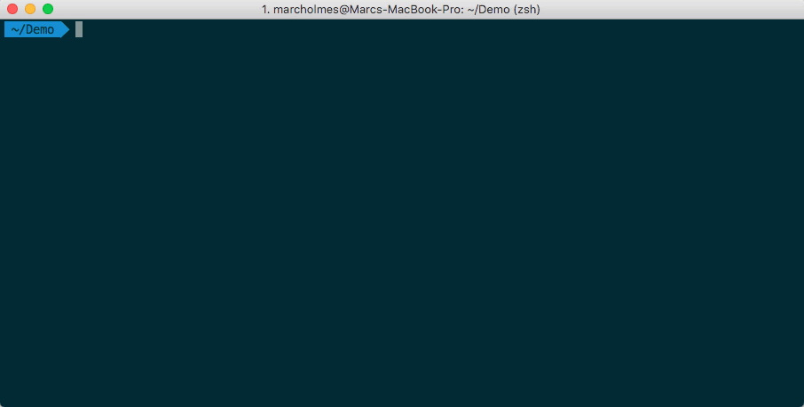
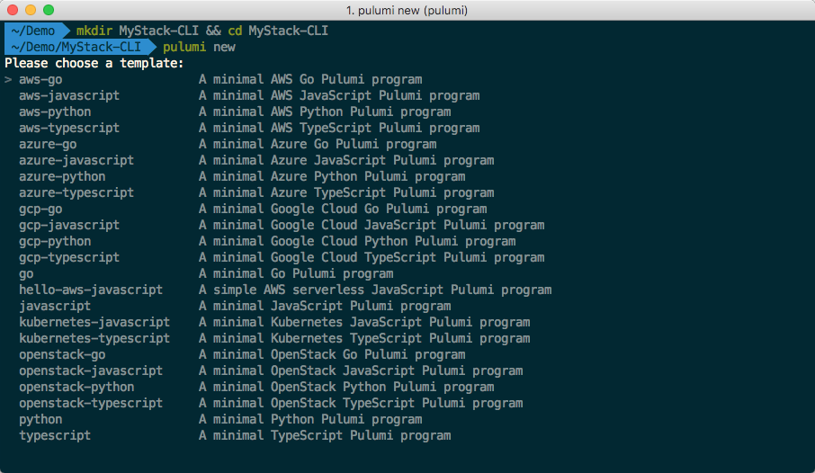

When you're able to build an app for any cloud using real languages,
the obvious question is "Where to start?". We hear you, and so we've
built some new features to help you scaffold your app and program the
cloud even faster than before.

In this post, we'll look at how to use `pulumi new` and our [selection
of templates](https://github.com/pulumi/templates) to build your Pulumi
app. <!--more--> There is template support for:

- AWS, Microsoft Azure, Google Cloud, Kubernetes, and OpenStack in
  each of...
- TypeScript, JavaScript, Python, and Go (K8S is currently just JS/TS)
- You can see all these options at
  <https://github.com/pulumi/templates> where we'll gladly accept
  updates and new templates as PRs

## Creating a project from the Pulumi dashboard

Head over to <https://app.pulumi.com> and - supposing you're logged in
- you'll be presented with the usual homepage. But now we've added a
shiny new 'Add New Project' button. Here's how that works:

- Clicking the 'Add New Project' button takes you to a series of
  available templates - essentially a matrix of cloud provider and
  language: from Go on GCP, through TypeScript on AWS, to Python on
  OpenStack, and everything in-between.
- Choosing an option will present a screen with some standard
  configuration options that you can change or leave defaulted.
- Click again, and Pulumi creates a project which is ready for you to
  initialize your first stack. The project page shows the command line
  instruction to run to get started with your chosen stack.

We can use that code by creating a folder, and then running the command
in the folder to get build our boilerplate stack. All of the stack
templates create a storage bucket (e.g. an AWS S3 bucket).

    mkdir MyStack && cd MyStack
    pulumi new https://github.com/pulumi/templates/aws-javascript -s mehzer/my-stack-dev

The output of this command will create the new stack from the template,
display a preview of the stack, and ask if you'd like to create it for
real. Assuming you have setup the relevant cloud provider, that's all
there is to it.

Back in the dashboard, you can now see the state of your stack, and
you're ready to flesh it out with the detail you need.

## Creating a project from the Pulumi CLI

Alternatively, you can do the same thing from the CLI. Create a folder,
then type `pulumi new` in there to retrieve a list of available
templates. Templates ahoy!

After you've selected the template you'd like, you can again
`pulumi preview` or `pulumi up` to get your stack running.

## Wait, wasn't that just a link to a repo? Does that mean..?

Yes it was, and yes you can run `pulumi up` against an arbitrary repo
supposing that there is a `Pulumi.yaml` and package metadata (e.g.
`package.json` or `Gopkg.toml` or `requirements.txt` files) alongside
the stack code meaning you can build your own templates and share them.

We hope you like these helpers. If you're keen to get stuck in:

- [Join the Slack conversation](https://slack.pulumi.io) - it's
  heating up in there.
- Try out the [many examples we have](https://app.pulumi.com), and
  [dive into the docs]().
- [Submit new templates as PRs](https://github.com/pulumi/templates) -
  contribution == [t-shirts at least](https://info.pulumi.com/community/give-me-a-tshirt).

 

