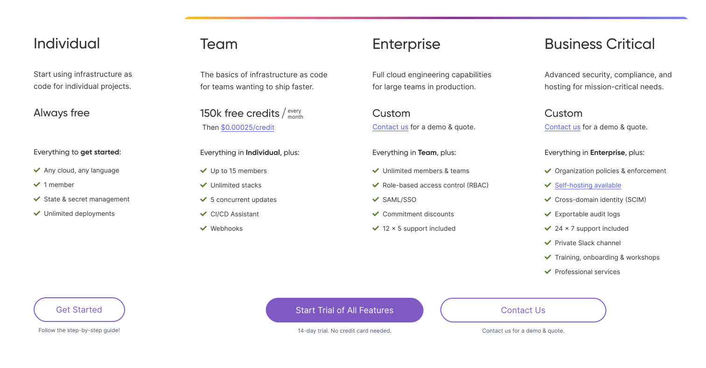
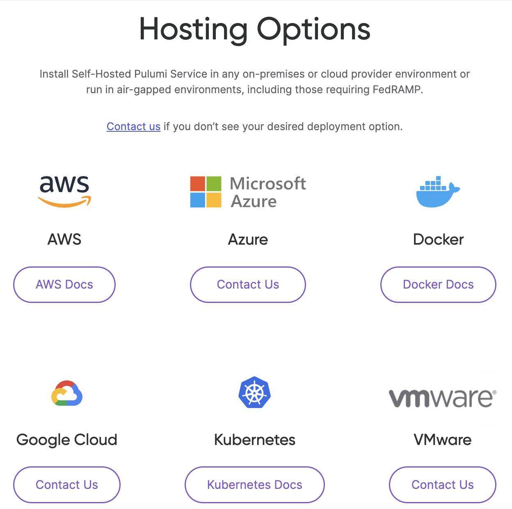

In the last 12 months, we have experienced 350% year-over-year growth of our enterprise customers, including Mercedes-Benz, Snowflake, Atlassian and SANS Institute. Given the growth in our enterprise customer base, we are excited to launch today a new Business Critical Edition for the Pulumi Service, a 30 day Self-Hosted Pulumi Service trial, and the option to purchase Pulumi Enterprise and Business Critical through the AWS Marketplace!

<!--more-->

## Pulumi Business Critical Edition

The Pulumi Cloud Engineering Platform enables organizations to build, deploy, and manage modern cloud infrastructure and applications with infrastructure as code using popular  programming languages. With Pulumi, infrastructure and platform engineers can empower other developers in their organization to easily build modern cloud applications with self-service infrastructure or reusable infrastructure components. Full-stack developers or developers at companies without platform teams can quickly become proficient at building and deploying cloud infrastructure using Pulumi’s SDK and libraries, all backed by the ease and power of general-purpose programming languages.

Pulumi adoption continues to accelerate across enterprises around the world with more than one million downloads per month. These enterprise customers have specific requirements, like advanced security and compliance features, premium support, and self-hosting options. Today, the Pulumi Business Critical Edition joins our existing offerings, the Pulumi Team Edition and the Pulumi Enterprise Edition, to meet these customers' needs. We are thrilled to be launching a new offering that enables us to support the most sophisticated production workloads in the modern cloud.

Existing customers of Pulumi Team and Enterprise Editions are unaffected by these changes. Customers who are looking to expand to leverage the features of Pulumi Business Critical Edition can [contact us]() to get started. New customers trialing Pulumi for their organization will get access to all of the features of Business Critical Edition during their 14 day trial.

Full details of our Pulumi Service editions can be found on [our pricing page]().

The Pulumi Business Critical edition includes everything in the Pulumi Enterprise Edition, plus:

- [Organization policies and enforcement]()
- [Self-hosting available]()
- [Cross-domain identity (SCIM)]()
- [Automatic export of audit logs]()
- 24 x 7 support included
- Premium training, onboarding and certain professional services

Policy as Code (CrossGuard), a Business Critical feature:

## Self-Hosted Pulumi Service

We are also announcing today a 30 day trial for self-hosting the [Pulumi Service](). Self-Hosted Pulumi Service allows you to deploy and manage the Pulumi Service on your own infrastructure, either in the cloud or on-premises.  Self-hosting is an option for organizations that need to maintain complete control over hosting, network isolation, identity, and data ownership in order to satisfy segment-specific compliance requirements. It can take time to install and configure a self-hosted product in your desired deployment option, and we want to make sure there is enough time to assess the product. This is why we have launched a 30 day trial, instead of 14 day like the Pulumi Service. Sign up today for the 30 day trial on our [Self-Hosted Pulumi Service page]().

The Self-Hosted Pulumi Service can be installed in any on-premises or cloud provider environment. It can also run in air-gapped environments without access to the Internet, including those with the most demanding compliance needs such as FedRAMP. In concert with the launch of the 30 day trial, we have made the [deployment reference architectures](https://github.com/pulumi/pulumi-self-hosted-installers) public. For assistance setting up your environment or if you don’t see your desired deployment option, [contact us]().  Full details on self-hosting the Pulumi Service can be found in our [Self-Hosted Pulumi Service documentation]().

## Pulumi in the Amazon Web Services (AWS) Marketplace

In concert with the new Pulumi Business Critical Edition and Self-Hosted Pulumi Service trial we are excited to be [listing on the AWS Marketplace](https://aws.amazon.com/marketplace/pp/prodview-dwn22batkhsyg). Pulumi Enterprise and Business Critical Editions are now available for purchase through AWS Marketplace, and support for additional cloud provider marketplaces is imminent. The AWS Marketplace listing can streamline the purchasing and internal approval processes for our customers managing cloud resources on AWS.

We hope the new Pulumi Business Critical Edition, Self-Hosted Pulumi Service trial, and AWS Marketplace listing make it easier for your organization to adopt and scale your Cloud Engineering practices using the Pulumi Service.

All editions of the Pulumi Service, including Business Critical and Self-Hosted, are immediately available. Enterprises can [contact us]() to discuss which product experiences might be best suited to their needs. Enterprises can choose to deploy Pulumi on their own or take advantage of Pulumi’s Business Critical Edition onboarding program.
