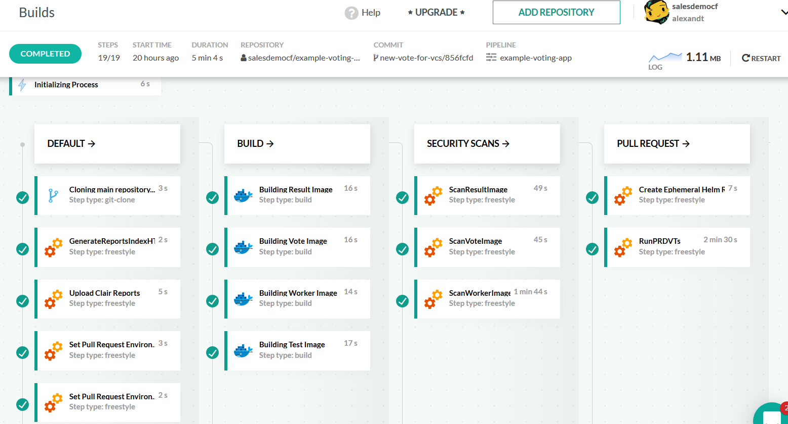
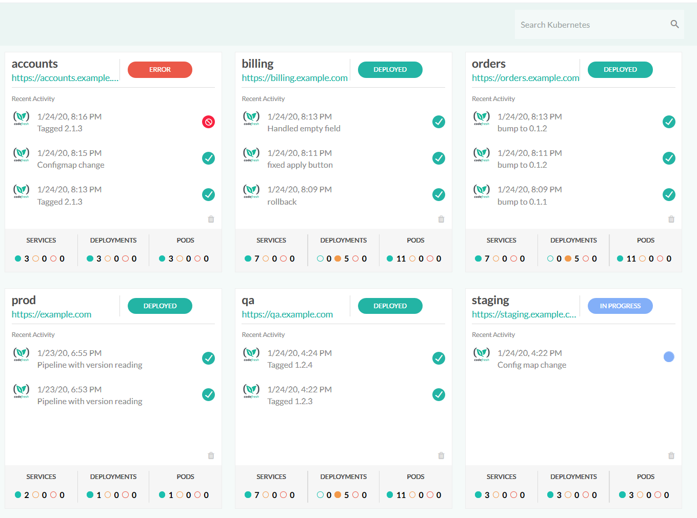

Delivering modern applications is complicated and requires the coordination of many moving parts. Applications are frequently updated to implement new features and improve security and performance, translating to a better user experience for your customers. To further complicate matters, infrastructure must also be deployed and maintained simultaneously with applications to avoid conflicts or dependencies.

Containerized applications deployed on Kubernetes are particularly susceptible to a misalignment between developers who frequently push changes and operators who want to maintain a stable architecture. Continuous Integration builds and tests software and delivers it as packages. Continuous Delivery or Deployment deploys applications on infrastructure. Let's take a look at how we can accomplish CI/CD for both applications and infrastructure.

{}
Join us for a [CI/CD with Kubernetes technical session](https://www.pulumi.com/resources/ci-cd-pipelines-for-kubernetes-apps-with-codefresh/) on January 21st.
{}

<!--more-->

## CI/CD and Pipelines

CD is sometimes called Continuous Delivery or Continuous Deployment. These have the same results, i.e., deploying software artifacts to production. However, Continuous Deployment is an automated process that deploys artifacts without human intervention. Continuous Delivery occurs when a person decides when to deploy an application. The reason could be a business decision, such as coordinating the release with a marketing campaign or having a final check by an engineer before release.

Continuous integration is an automated process that begins with a code push to a repository. From there, the code can be built and tested, and eventually released as an artifact. Your organization determines the CI process, and it can include manual testing of the code to catch corner cases.

A pipeline is the deployable unit path for CI/CD. A pipeline starts when code is committed to a repository like GitHub. The next step is a notification to a build system, such as Codefresh. The build system compiles the code and runs unit tests. If your code passes the unit tests, integration tests are the next step. If your code passes both unit and integration tests, the images will be created and pushed into a registry service in the case of containers. This is the simplest example of a pipeline, but you can do many more things such as security scans, check modules for CVEs (Common Vulnerabilities and Exploits), send Slack notifications, and run quality checks. A pipeline can be fully automated or have checkpoints that require approval before resuming.

Codefresh is a modern CI/CD platform specifically created for Kubernetes and containers. A pipeline in Codefresh is composed of a series of steps, where every step is a Docker container. This means that creating a pipeline is as easy as collecting your favorite Docker images from any public or private Registry. Integration with Pulumi is trivial as Pulumi is already offered in the form of a [public image](https://hub.docker.com/r/pulumi/pulumi).

On the deployment front, Codefresh has native integration for Kubernetes, container registries, and Git providers. This means you can set up your cluster once in a central configuration and then make it available to all your pipelines by name. Codefresh is cloud-agnostic on all fronts. All major Git providers are supported, and deployment can happen on any compliant Kubernetes cluster.

Every Codefresh account comes with a built-in graphical dashboard that allows you to inspect your Kubernetes cluster not only on the service/pod level but also on the application (i.e., Helm releases). This means that with Codefresh, you don’t need to use multiple unrelated applications to understand if your deployment was successful.

A deployment that starts from a Git commit can be monitored with Codefresh from beginning to end, following all pipeline stages from application compilation/packaging to security scanning and infrastructure deployment.

See our dedicated documentation page on how to use [Pulumi and Codefresh together](https://www.pulumi.com/docs/guides/continuous-delivery/codefresh/).

## Building Modern Infrastructure

Just like your application code, you can build your infrastructure with a CI/CD pipeline. Pulumi lets developers write infrastructure using their favorite language, such as Typescript, Python, or go.  Developers can take advantage of abstractions, code reuse, refactoring, favorite development environments, and testing tools.

In addition to supporting multiple languages, you can build infrastructure on any cloud such as AWS, Azure, GCP, and Kubernetes and take full advantage of their service offerings. Choose your toolchain and frameworks, and you're set to deploy infrastructure on any major cloud provider and even hybrid and on-premises environments.

By leveraging infrastructure as code combined with software developement practices, engineers can achieve greater productivity while enabling their development teams to be more "self-serve" with appropriate policies and guardrails in place. Pulumi brings cloud security engineering to the infrastructure and development teams. Using one common workflow that spans any cloud environment, whether public, private, or hybrid, security teams can enforce policies that accomplish cloud governance projects of all kinds — security, compliance, cost control, and more.

To see how infrastructure as code simplifies infrastructure deployment, let's look at an example for deploying Kubernetes with python on AWS. The full [example](https://github.com/pulumi/examples/tree/master/aws-py-eks) is available on Github.

The code breaks up the Kubernetes deployment into python modules:

- [vpc.py](https://github.com/pulumi/examples/blob/master/aws-py-eks/vpc.py) creates an AWS Virtual Private Cloud containing the cluster, security group, and networking.
- [iam.py](https://github.com/pulumi/examples/blob/master/aws-py-eks/iam.py) creates roles for the cluster, and the nodegroup and policy attachments
- [utils.py](https://github.com/pulumi/examples/blob/master/aws-py-eks/utils.py) creates a `kubeconfig` file that can be used with `kubectl` to manage Kubernetes

The main program (__main__.py) creates the Kubernetes cluster by calling the modules to deploy a cluster and a nodegroup with the policies applied. Using modules, we can make changes to the vpc, networking, roles, and policies and customize it to our application. In a CI/CD, all these changes would be pushed through a pipeline before deployment.

Although this example is written in Python for AWS, there are similar examples in other languages and cloud providers in [Pulumi Examples](https://github.com/pulumi/examples).

## Putting it Together

This article described how we could build both applications and infrastructure with CI/CD pipelines. To learn more about how Codefresh and Pulumi can automate Kubernetes deployments join us for a [technical session](https://www.pulumi.com/resources/ci-cd-pipelines-for-kubernetes-apps-with-codefresh/) on January 21st.
