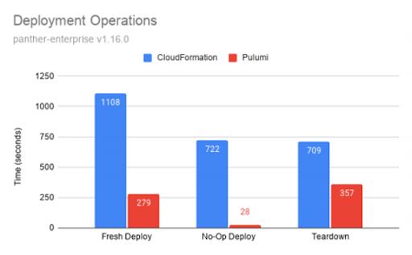

The story of how the cloud fuels startup innovation seems never ending. In the beginning, AWS birthed cloud computing with its first service, SQS, in 2004 and quickly released several additional services (like S3, EC2, and SimpleDB). From this innovation, startups flourished because they were able to build, experiment, and grow faster than before at much lower cost. Airbnb, Netflix, Zynga, and many more were born, and the rest is history.

Today, a new generation of startups is flourishing because of the cloud, but this time with modern cloud architectures that are distributed, API-driven, and more resilient and scalable than ever. Today’s startups have to get to market even faster and rapidly innovate in order to delight customers and carve out market share. Most startups understand the benefits of adopting the modern cloud to help them achieve this goal. However, their ability to reap these benefits for competitive advantage depends on how well they can harness the modern cloud.

Within the [cloud engineering]() community, we see several common patterns for harnessing the modern cloud. Some startups have teams of full-stack developers who need to deploy cloud infrastructure and applications safely and at high velocity. Others might have a few infrastructure or platform engineers who need to enable other developers to use cloud infrastructure easily on a self-serve basis. Many of these teams started off using domain-specific languages (DSLs) to manage infrastructure as code and quickly found that these languages were the limiting factor in achieving faster velocity. DSLs are cumbersome to use and don’t support the logic and expressiveness needed to build and manage modern architectures that are more complex in nature. DSLs are also a barrier to entry to most developers.

In contrast, cloud engineering makes cloud infrastructure more accessible and easier to use for everyone with tried and true software engineering practices and tools. It embraces the reality that [all software is now cloud software](). A core practice is using a commonly used language like TypeScript, Python, Go, or C#. That’s one reason why more and more startups are choosing Pulumi to help them achieve competitive advantage through cloud infrastructure. It also doesn’t hurt that Pulumi was [rated the “Top Paying Technology” by developers](https://insights.stackoverflow.com/survey/2021#top-paying-technologies-other-tools) in 2021.

Cloud engineering is a central character in the next chapter of how the modern cloud fuels startup innovation. Read on for three mini-stories of cloud engineering in action with startups.

## Panther Labs

Panther Labs helps modern security teams build world-class detection and response pipelines using code and automation, developer-friendly workflows, and big data primitives. Its Platform Team is responsible for a large, complex serverless architecture on AWS. Because of the limitations of its legacy Infrastructure-as-Code (IaC) tool, the team was unable to manage and scale its cloud infrastructure with the speed and automation that the company needed to support its fast-growing business. After comparing different alternatives, Panther Labs decided to migrate to the Pulumi Cloud Engineering Platform. Pulumi increased the company’s deployment speeds by up to 10X, reduced the size of its infrastructure codebase by >50%, and enabled its developers to adopt cloud engineering best practices to deliver its cloud applications faster and more reliably.

### Results

- Infrastructure teardowns were twice as fast, fresh deployments were four times as fast, and simple changes were more than ten times as fast.
- The infrastructure codebase was reduced by more than 50%.
- Developers could use a programming language and existing software development practices that they already knew.
- The ability to create reusable components made it easy to replicate and share components that always followed cloud engineering best practices.
- Central visibility across hundreds of single-tenant customer deployments, including a history of when changes were made and what changed for each account.

[Read the full case study→]()
## WhyLabs

WhyLabs helps organizations run their AI applications with certainty by monitoring them for problems such as data drift and model degradation. Founded by alumni of AWS, the company began building their platform on AWS and used AWS-provided tools to manage their infrastructure. However, the WhyLabs team needed a platform that could handle the complexity of their modern cloud architectures and would set them up for success when they’re ready to adopt multi-cloud deployments. The team also wanted a platform that integrated with the modern development workflows used by WhyLabs’ developers, who have a software engineering-driven culture of tight collaboration and shared responsibility for infrastructure. By migrating to the Pulumi Cloud Engineering Platform, WhyLabs engineers can continuously and reliably ship new features faster than before for improved time-to-market. Pulumi enabled WhyLabs to adopt cloud engineering best practices out-of-the-box, including building infrastructure as code with general-purpose languages like TypeScript, versioning and reviewing infrastructure code through a code review process, and delivering infrastructure through its existing GitLab CI/CD pipeline using Pulumi’s integrations.

### Results

- Pulumi enabled WhyLabs engineers to continuously and reliably ship new features faster than before for improved time-to-market.
- Pulumi enabled WhyLabs to adopt standard programming languages (like TypeScript) to build infrastructure as code. It also allows them to use software engineering best practices like reusability and unit testing.
- Pulumi lowered the barrier to entry for developers to start working with infrastructure. A standard programming language means that every developer can quickly become involved in creating and maintaining the WhyLabs infrastructure.
- Pulumi enables WhyLabs to shift infrastructure left because testing and security controls are automated with Pulumi and GitLab integration. Peer reviews and accountability are built into the GitLab CI/CD pipeline.
- Pulumi’s integration with GitLab enables WhyLabs to deliver infrastructure through CI/CD pipelines just like with application code, which increases iteration frequency and accelerates time to market.
- Pulumi’s support for multiple cloud providers will help WhyLabs expand their platform in the future to meet customers’ needs.

[Read the full case study→]()

## Fauna

Fauna provides a flexible, developer-friendly, transactional database delivered as a secure and scalable cloud API with native GraphQL. It needed to provide a way for customers to use its databases while meeting data residency requirements, such as complying with GDPR or FIPS. This meant allowing customers to store data in specific geographies while maintaining low latency and high availability. To build this capability, Fauna’s engineers needed a repeatable, scalable, and efficient way to build, deploy, and manage databases on behalf of its customers. Every database is backed by a cluster of nodes across multiple regions and cloud providers. After evaluating CloudFormation and Terraform, Fauna found that these tools’ domain-specific languages and features would be insufficient for the project. Fauna chose Pulumi to build, deploy, and manage its multi-cloud infrastructure because Pulumi enabled cloud engineering best practices that met its requirements. This included the ability to use a familiar and powerful programming language like Python, integration with existing software development workflows and tools, and software engineering automation.

### Results

- Delivered its new multi-region, multi-cloud database feature by using familiar and existing software tools and practices that were enabled by Pulumi.
- Built and managed its complex cloud architecture more efficiently by using familiar languages like Python.
- Increased the reliability and quality of infrastructure using existing code review processes and running unit tests.
- Controlled access to its infrastructure using Pulumi’s SSO integration with its identity provider service.

[Read Fauna's blog post→](https://fauna.com/blog/building-faunas-gdpr-compliant-distributed-and-scalable-database)

## Summary

Cloud engineering is enabling startups to build, deploy, and manage modern cloud infrastructure and applications faster and with more confidence. By applying standard software engineering languages, practices and tools to cloud infrastructure, startups can harness modern cloud architectures like containers or serverless to their full potential. To illustrate this, we shared three case studies of startups practicing cloud engineering. Pulumi’s Cloud Engineering Platform was built to enable any organization to adopt cloud engineering best practices out-of-the-box. If you’re starting your cloud engineering journey, try Pulumi for free today with this [Getting Started guide]().
