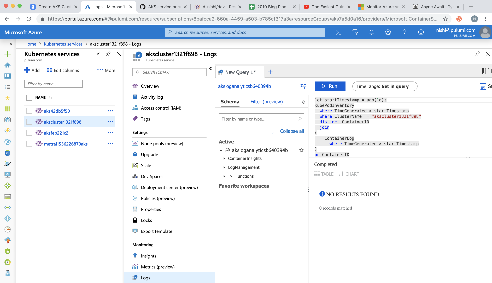

Pulumi-Azure open source package can be used to create Azure Kubernetes
Service (AKS) clusters with AD service principals tied to the cluster.
Monitoring and logging can also be enabled by default in simple steps
with Pulumi for core AKS components. This article will show you how to
write this as a simple example using Pulumi SDKs.
<!--more-->

 ## Prerequisites

1. [Install `pulumi` CLI]()
  and set up your [*Azure credentials*]()
2.  Initialize a new [Pulumi project]() from available
    templates. We use **`****`azure-typescript`****`** template here to
    install all dependencies and save the configuration.

## Step 1: Export required configurations for the AKS stack

```typescript
import * as azure from "@pulumi/azure";
import * as pulumi from "@pulumi/pulumi";
import * as k8s from "@pulumi/kubernetes";
import * as azuread from "@pulumi/azuread";

// Step 1: Parse and export configuration variables for the AKS stack.

const config = new pulumi.Config();
export const password = config.require("password");
export const location = config.get("location") || "East US";
export const failoverLocation = config.get("failoverLocation") || "East US 2";
export const nodeCount = config.getNumber("nodeCount") || 2;
export const nodeSize = config.get("nodeSize") || "Standard_D2_v2";
export const sshPublicKey = config.require("sshPublicKey");

export const resourceGroup = new azure.core.ResourceGroup("aks", { location });
export const loganalytics = new azure.operationalinsights.AnalyticsWorkspace("aksloganalytics", {
    resourceGroupName: resourceGroup.name,
    location: resourceGroup.location,
    sku: "PerGB2018",
    retentionInDays: 30,
})
```

## Step 2: Create the AD Service principal for the AKS cluster

When you register an Azure AD application in the
[Azure portal](https://portal.azure.com/), two objects are created in your
Azure AD tenant: a) An application object, and b) A service principal
object. To access resources that are secured by an Azure AD tenant, the
entity that requires access must be represented by a security principal
that defines the access policy and permissions for the user/application
in the Azure AD tenant. This is true for both users (user principal) and
applications (service principal). This enables core features such as
authentication of the user/application during sign-in, and authorization
during resource access.

In our example we create the Service principal which is a required in
the successful creation of the AKS cluster. If you see that the Service
Principal Id was not found: "Service principal clientID: xxxxx not
found", simply re-run `pulumi update`to proceed.

```javascript
// Step 2: Create the AD service principal for the k8s cluster.
let adApp = new azuread.Application("aks");
let adSp = new azuread.ServicePrincipal("aksSp", { applicationId: adApp.applicationId });
let adSpPassword = new azuread.ServicePrincipalPassword("aksSpPassword", {
    servicePrincipalId: adSp.id,
    value: password,
    endDate: "2099-01-01T00:00:00Z",
});
```

## Step 3: Create the AKS cluster

Now let's add the logic to create the AKS cluster with the Service
principal.

```javascript
// Step 3: This step creates an AKS cluster.
export const k8sCluster = new azure.containerservice.KubernetesCluster("aksCluster", {
        resourceGroupName: resourceGroup.name,
        location: location,
        agentPoolProfile: {
            name: "aksagentpool",
            count: nodeCount,
            vmSize: nodeSize,
        },
        dnsPrefix: `${pulumi.getStack()}-kube`,
        linuxProfile: {
            adminUsername: "aksuser", 
            sshKey: { keyData: sshPublicKey, }
        },
        servicePrincipal: {
            clientId: applicationId,
            clientSecret: adSpPassword.value,
        },
        addonProfile: {
            omsAgent: {
                enabled: true,
                logAnalyticsWorkspaceId: loganalytics.id,
            },
        },
    }); 

// Expose a k8s provider instance using our custom cluster instance.
export const k8sProvider = new k8s.Provider("aksK8s", {
        kubeconfig: k8sCluster.kubeConfigRaw,
    });

// Export the kubeconfig
export const kubeconfig = k8sCluster.kubeConfigRaw
```

## Step 4: Enable default monitoring and logging for the AKS cluster

Log queries are used to retrieve any log data from Azure Monitor.
Whether you're
[analyzing data in the portal](https://docs.microsoft.com/en-us/azure/azure-monitor/log-query/portals),
[configuring an alert rule](https://docs.microsoft.com/en-us/azure/azure-monitor/platform/alerts-metric)
to be notified of a particular condition, or retrieving data using the
[Azure Monitor Logs API](https://dev.loganalytics.io/), you will use a
query to specify the data you want.

We will now enable monitoring and logging by default for the cluster and
run `pulumi up`

```javascript
// Step 4: Enables the Monitoring Diagonostic control plane component logs and AllMetrics   
export const azMonitoringDiagnostic = new azure.monitoring.DiagnosticSetting("aks", {
    logAnalyticsWorkspaceId: loganalytics.id,
    targetResourceId: k8sCluster.id,
    logs:  [{
        category: "kube-apiserver",
        enabled : true,
    
        retentionPolicy: {
        enabled: true,
        }
    },
    ],
    metrics: [{
        category: "AllMetrics",
    
        retentionPolicy: {
        enabled: true,
        }
    }],
})
```
       

If you run `pulumi up` with the entire `index.ts` file as defined
[here](https://gist.github.com/d-nishi/b757e1e8b3ebe187d81ce32a4d15525e)
you will see an AKS cluster get created with monitoring and logging
enabled.

## Step 5: Check if everything worked

a) Check with Pulumi CLI and `kubectl`

    $ pulumi stack output kubeconfig > kubeconfig.yaml

    $ kubectl config current-context
    akscluster1321f898

b) Check Pulumi Service Console for the resource creation on the stack
you just initialized: `d-nishi/azure-mean/dev`.


c) Check your Azure portal for the cluster-id and to find all the
metrics (Insights) and logs (Logs) show up as follows:




## Summary

We discussed how to set up AKS clusters with monitoring
and logging in simple steps with Pulumi packages. You can find the
complete pulumi code for our example
[*here*](https://gist.github.com/d-nishi/b757e1e8b3ebe187d81ce32a4d15525e).
For more examples visit our [GitHub examples](https://github.com/pulumi/examples) repo.

If you want to additionally look at how to integrate Azure DevOps with
Pulumi, check out our other post
[CI/CD made easy with Pulumi and Azure Pipelines]().
