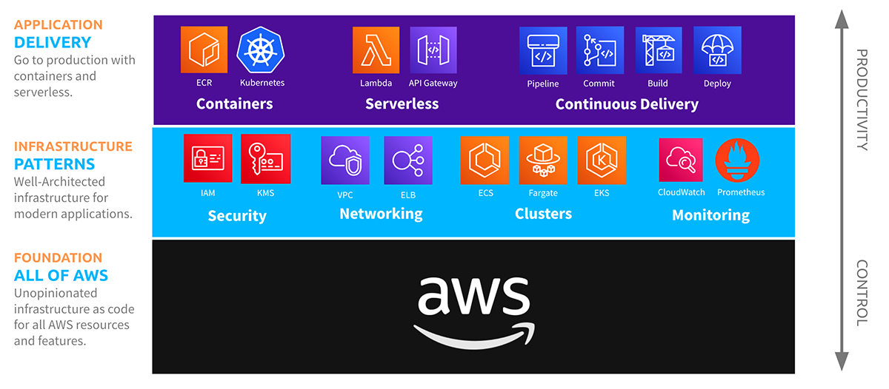

Crosswalk for AWS is a collection of libraries that make it easy to work with AWS using Pulumi Infrastructure as Code.  The Crosswalk for AWS libraries are some of the most widely used higher-level components in the Pulumi ecosystem, with hundreds of organizations building their infrastructure on the simple abstractions over key AWS services like ECS, API Gateway, VPC, Load Balancing, CloudTrail, EC2, ECR, and more.

<!--more-->

Crosswalk for AWS is the easiest way to get started with core compute and application primitives on AWS.  Running a containerized or serverless application on AWS requires just a handful of lines of code. This enables application and service development teams to directly own and manage the infrastructure for their applications. As Crosswalk builds on the primitive building blocks of the AWS platform, you can use 100% of what AWS offers, and can seamlessly move between high-level components and low-level platform primitives, mixing-and-matching as needed.

These libraries use automatic well-architected best practices to make common infrastructure as code tasks in AWS easier and more secure. To date, this library has been available only to Pulumi TypeScript/JavaScript users.

Today, we are making Crosswalk for AWS available to users in all Pulumi languages, [TypeScript](https://www.pulumi.com/docs/intro/languages/javascript), [Python](https://www.pulumi.com/docs/intro/languages/python), [.NET](https://www.pulumi.com/docs/intro/languages/dotnet), [Go](https://www.pulumi.com/docs/intro/languages/go), [Java](https://www.pulumi.com/docs/intro/languages/java) and [YAML](https://www.pulumi.com/docs/intro/languages/yaml). The AWSx package now joins the existing API Gateway and EKS packages in the Pulumi Registry, available in all Pulumi languages.



## From Zero to Production And Beyond with Crosswalk for AWS

Let’s walk through some examples of using Crosswalk for AWS for common use cases.

### Containers (ECS, Fargate)

Many Pulumi customers deploy containerized workloads on AWS with ECS or Fargate. AWSx significantly simplifies deploying your application to these managed container services. With just a few lines of code and tens of seconds to deploy, our container is running in production in AWS.


{}

```typescript
import * as awsx from "@pulumi/awsx";
import * as aws from "@pulumi/aws";

// Create a repository.
const repo = new awsx.ecr.Repository("my-repo");

// Build an image from the "./app" directory (relative to our project and containing Dockerfile),
// and publish it to our ECR repository provisioned above.
const image = new awsx.ecr.Image("image", {
    repositoryUrl: repo.url,
    path: "./app",
})

// Create an ECS Cluster
const cluster = new aws.ecs.Cluster("default-cluster");

// // Create a load balancer on port 80 and spin up two instances of Nginx.
const lb = new awsx.lb.ApplicationLoadBalancer("nginx-lb");

const service = new awsx.ecs.FargateService("my-service", {
    cluster: cluster.arn,
    taskDefinitionArgs: {
        container: {
            image: image.imageUri,
            cpu: 512,
            memory: 128,
            essential: true,
            portMappings: [
                {
                    containerPort: 80,
                    targetGroup: lb.defaultTargetGroup,
                },
            ],
        },
    },
});

// Export the load balancer's address so that it's easy to access.
export const url = lb.loadBalancer.dnsName;
```

{}
{}

```python
import pulumi
import pulumi_aws as aws
import pulumi_awsx as awsx

repo = awsx.ecr.Repository("my-repo");

image = awsx.ecr.Image("image",
                       repository_url=repo.url,
                       path="./app")


cluster = aws.ecs.Cluster("default-cluster")

lb = awsx.lb.ApplicationLoadBalancer("nginx-lb")

service = awsx.ecs.FargateService("service",
                                  cluster=cluster.arn,
                                  task_definition_args=awsx.ecs.FargateServiceTaskDefinitionArgs(
                                      containers={
                                          "nginx": awsx.ecs.TaskDefinitionContainerDefinitionArgs(
                                              image=image.image_uri,
                                              memory=128,
                                              port_mappings=[awsx.ecs.TaskDefinitionPortMappingArgs(
                                                  container_port=80,
                                                  target_group=lb.default_target_group,
                                              )]
                                          )
                                      }
                                  ))

pulumi.export("url", lb.load_balancer.dns_name)

```

{}
{}

```csharp
using System.Collections.Generic;
using System.Threading.Tasks;
using Pulumi;
using Pulumi.Awsx.Ecs.Inputs;
using Aws = Pulumi.Aws;
using Ecr = Pulumi.Awsx.Ecr;
using Ecs = Pulumi.Awsx.Ecs;
using Lb = Pulumi.Awsx.Lb;

class MyStack : Stack
{
    public MyStack()
    {
        var repo = new Ecr.Repository("my-repo");

        var image = new Ecr.Image("image", new Ecr.ImageArgs
        {
            RepositoryUrl = repo.Url,
            Path = "./app",
        });

        var cluster = new Aws.Ecs.Cluster("demo-cluster");

        var lb = new Lb.ApplicationLoadBalancer("nginx-lb");

        var service = new Ecs.FargateService("my-service", new Ecs.FargateServiceArgs
        {
            Cluster = cluster.Arn,
            TaskDefinitionArgs = new FargateServiceTaskDefinitionArgs
            {
                Container = new TaskDefinitionContainerDefinitionArgs
                {
                    Memory = 128,
                    Cpu = 512,
                    Image = “
                    Essential = true,
                    PortMappings = new TaskDefinitionPortMappingArgs
                    {
                        ContainerPort = 80,
                        TargetGroup = lb.DefaultTargetGroup,
                    }
                }
            }
        });
    }
}

class Program
{
    static Task<int> Main(string[] args) => Deployment.RunAsync<MyStack>();
}
```

{}

{}

Using ECS, Fargate, ECR and ALB, we get a robust production-ready container deployment - horizontally scaled out, load-balanced, and integrated with a private image repository. With just a few more lines of code, we can add autoscaling, customize our ECS cluster, or wire through advanced container configuration (volumes, environment variables, and more).

### Networking (VPC)

To adopt a security posture using best practices, we may want to move our cluster into a custom VPC, and run the containers in private subnets. We can define and configure our VPC:



{}

```typescript
import * as awsx from "@pulumi/awsx";

// Allocate a new VPC with the default settings:
const vpc = new awsx.ec2.Vpc("custom");

// Export a few resulting fields to make them easy to use:
export const vpcId = vpc.vpcId;
export const privateSubnetIds = vpc.privateSubnetIds;
export const publicSubnetIds = vpc.publicSubnetIds;
```

{}

{}

```python
import pulumi
import pulumi_awsx as awsx

vpc = awsx.ec2.Vpc("custom")

pulumi.export("vpcId", vpc.vpc_id)
pulumi.export("publicSubnetIds", vpc.public_subnet_ids)
pulumi.export("privateSubnetIds", vpc.private_subnet_ids)
```

{}

{}

```csharp
using Pulumi;
using Ec2 = Pulumi.Awsx.Ec2;

class MyStack : Stack
{
    public MyStack()
    {
        var vpc = new Ec2.Vpc("custom");

        this.VpcId = vpc.VpcId;
    }


    [Output] public Output<string> VpcId { get; set; }
}

class Program
{
    static Task<int> Main(string[] args) => Deployment.RunAsync<MyStack>();
}
```

{}

{}

The `Vpc` component builds on best-practices Virtual Private Cloud (VPC) design patterns based on AWS guidance and documentation. By building in simple defaults for routing, subnet structure, NATs and multi-AZ we can get started quickly without having to re-discover these best practices. And as your needs grow, we can deeply customize and evolve our VPC structure - defining custom CIDR blocks, customizing Internet and NAT Gateways or additional private subnets.

### Serverless (Lambda, API Gateway)

It’s common to start with serving a simple REST API on the internet when beginning a new cloud project. With just a few lines of code and tens of seconds to deploy, Crosswalk for AWS makes it easy to build and deploy our API.



{}

```typescript
import * as apigateway from "@pulumi/aws-apigateway";
import * as aws from "@pulumi/aws";

const f = new aws.lambda.CallbackFunction("f", {
    callback: async (ev, ctx) => {
        console.log(JSON.stringify(ev));
        return {
            statusCode: 200,
            body: "goodbye",
        };
    },
});

const api = new apigateway.RestAPI("api", {
    routes: [{
        path: "/",
        method: "GET",
        eventHandler: f,
    }],
});

export const url = api.url;
```

{}

{}

```python
import json
import pulumi
import pulumi_aws as aws
import pulumi_apigateway as apigateway

role = aws.iam.Role("mylambda-role",
    assume_role_policy=json.dumps({
        "Version": "2012-10-17",
        "Statement": [{
            "Effect": "Allow",
            "Principal": { "Service": "lambda.amazonaws.com" },
            "Action": "sts:AssumeRole"
        }]
    })
)

policy = aws.iam.RolePolicy("mylambda-policy",
    role=role.id,
    policy=json.dumps({
        "Version": "2012-10-17",
        "Statement": [{
            "Action": ["logs:*", "cloudwatch:*"],
            "Resource": "*",
            "Effect": "Allow",
        }],
    }))

# Closure serialization is not supported in multi-lang components
# so we need to provide a handler function explicitly from the file-system.
# Refer to https://github.com/pulumi/pulumi-aws-apigateway/tree/main/examples/simple-py/handler
# for an example handler.
f = aws.lambda_.Function("mylambda",
    runtime=aws.lambda_.Runtime.PYTHON3D8,
    code=pulumi.AssetArchive({
        ".": pulumi.FileArchive("./handler"),
    }),
    timeout=300,
    handler="handler.handler",
    role=role.arn,
    opts=pulumi.ResourceOptions(depends_on=[policy]),
)

api = apigateway.RestAPI('api', routes=[
    apigateway.RouteArgs(path="/", method="GET", event_handler=f),
])

pulumi.export('url', api.url)
```

{}

{}

```csharp
using Pulumi;
using System.Collections.Generic;
using ApiGW = Pulumi.AwsApiGateway;
using Lambda = Pulumi.Aws.Lambda;
using Iam = Pulumi.Aws.Iam;

class MyStack : Stack
{
    public MyStack()
    {
        var lambdaRole = new Iam.Role("mylambda-role", new Iam.RoleArgs
        {
            AssumeRolePolicy =
                @"{
                ""Version"": ""2012-10-17"",
                ""Statement"": [{
                    ""Effect"": ""Allow"",
                    ""Principal"": { ""Service"": ""lambda.amazonaws.com"" },
                    ""Action"": ""sts:AssumeRole""
                }]
            }"
        });

        var rolePolicy = new Iam.RolePolicy("mylambda-policy", new Iam.RolePolicyArgs
        {
            Role = lambdaRole.Id,
            Policy =
               @"{
                ""Version"": ""2012-10-17"",
                ""Statement"": [{
                    ""Action"": [""logs:*"", ""cloudwatch:*""],
                    ""Resource"": ""*"",
                    ""Effect"": ""Allow""
                }]
            }"
        });

        // Closure serialization is not supported in multi-lang components
        // so we need to provide a handler function explicitly from the file-system.
        // Refer to https://github.com/pulumi/pulumi-aws-apigateway/tree/main/examples/simple-cs/handler
        // for an example handler.
        var lambda = new Lambda.Function("lambda", new Lambda.FunctionArgs
        {
            Runtime = Lambda.Runtime.Python3d8,
            Code = new AssetArchive(new Dictionary<string, AssetOrArchive>{
                ["."] = new FileArchive("./handler"),
            }),
            Timeout = 300,
            Handler = "handler.handler",
            Role = lambdaRole.Arn
        }, new Pulumi.CustomResourceOptions { DependsOn = { rolePolicy } });

        var restAPI = new ApiGW.RestAPI("api", new ApiGW.RestAPIArgs
        {
            Routes = new List<ApiGW.Inputs.RouteArgs>{
            new ApiGW.Inputs.RouteArgs{Path="/", Method=ApiGW.Method.GET, EventHandler=lambda}}
        });

        this.Url = restAPI.Url;
    }

    [Output]
    public Output<string> Url { get; set; }
}
```

{}

{}

```go
package main

import (
	apigateway "github.com/pulumi/pulumi-aws-apigateway/sdk/go/apigateway"
	"github.com/pulumi/pulumi-aws/sdk/v4/go/aws/iam"
	"github.com/pulumi/pulumi-aws/sdk/v4/go/aws/lambda"
	"github.com/pulumi/pulumi/sdk/v3/go/pulumi"
)

func main() {
	pulumi.Run(func(ctx *pulumi.Context) error {

		role, err := iam.NewRole(ctx, "lambda-role", &iam.RoleArgs{
			AssumeRolePolicy: pulumi.String(`{
				"Version": "2012-10-17",
				"Statement": [{
					"Effect": "Allow",
					"Principal": { "Service": "lambda.amazonaws.com" },
					"Action": "sts:AssumeRole"
				}]
			}`),
		})
		if err != nil {
			return err
		}

		policy, err := iam.NewRolePolicy(ctx, "lambda-policy", &iam.RolePolicyArgs{
			Role: role.ID(),
			Policy: pulumi.String(`{
				"Version": "2012-10-17",
				"Statement": [{
					"Action": ["logs:*", "cloudwatch:*"],
					"Resource": "*",
					"Effect": "Allow"
				}]
			}`),
		})
		if err != nil {
			return err
		}

		// Closure serialization is not supported in multi-lang components
		// so we need to provide a handler function explicitly from the file-system.
		// Refer to https://github.com/pulumi/pulumi-aws-apigateway/tree/main/examples/simple-go/handler
		// for an example handler.
		f, err := lambda.NewFunction(ctx, "lambda", &lambda.FunctionArgs{
			Runtime: lambda.RuntimePython3d8,
			Code: pulumi.NewAssetArchive(map[string]interface{}{
				".": pulumi.NewFileArchive("./handler"),
			}),
			Timeout: pulumi.Int(300),
			Handler: pulumi.String("handler.handler"),
			Role:    role.Arn,
		}, pulumi.DependsOn([]pulumi.Resource{policy}))
		if err != nil {
			return err
		}

		getMethod := apigateway.MethodGET
		restAPI, err := apigateway.NewRestAPI(ctx, "api", &apigateway.RestAPIArgs{
			Routes: []apigateway.RouteArgs{
				apigateway.RouteArgs{
					Path:         "/",
					Method:       &getMethod,
					EventHandler: f,
				},
			},
		})
		if err != nil {
			return err
		}

		ctx.Export("url", restAPI.Url)
		return nil
	})
}
```

{}

{}

By building on top of great AWS building blocks like Lambda, API Gateway, IAM and more, you avoid needing to worry about infrastructure, pay nearly zero fixed costs, and gain the ability to iterate quickly. With just a few more lines of code, you can wire up your own domain, add authorization, provision a database, or chain together a more complex event-driven application.

### Kubernetes (EKS)

As your project continues to evolve, you may want to move your container workloads into Kubernetes using EKS. We can stand up an EKS cluster with just a few lines of code, then customize the cluster and deploy Kubernetes workloads into the cluster.



{}

```typescript
import * as pulumi from "@pulumi/pulumi";
import * as eks from "@pulumi/eks";

const projectName = pulumi.getProject();

// Create an EKS cluster with the default configuration.
const cluster1 = new eks.Cluster(`${projectName}-1`);


// Export the clusters' kubeconfig.
export const kubeconfig1 = cluster1.kubeconfig;
```

{}

{}

```python
import pulumi
import pulumi_eks as eks

project_name = pulumi.get_project()

# Create an EKS cluster with the default configuration.
cluster1 = eks.Cluster(f"{project_name}-1")

pulumi.export("kubeconfig1", cluster1.kubeconfig)
```

{}

{}

```csharp
using Pulumi;
using Pulumi.Eks;

class MyStack : Stack
{
    public MyStack()
    {
      string projectName = Deployment.Instance.ProjectName;

      var cluster1 = new Cluster($"{projectName}-1");

      Kubeconfig1 = cluster1.Kubeconfig;
    }


    [Output("kubeconfig1")]
    public Output<object> Kubeconfig1 { get; set; }
}

class Program
{
    static Task<int> Main(string[] args) => Deployment.RunAsync<MyStack>();
}
```

{}

{}

```go
package main

import (
	"github.com/pulumi/pulumi-eks/sdk/go/eks"
	"github.com/pulumi/pulumi/sdk/v3/go/pulumi"
)

func main() {
	pulumi.Run(func(ctx *pulumi.Context) error {
		// Create cluster with default settings
		cluster1, err := eks.NewCluster(ctx, "example-cluster-go-1", nil)
		if err != nil {
			return err
		}

		// Export the kubeconfig for clusters
		ctx.Export("kubeconfig1", cluster1.Kubeconfig)
		return nil
	})
}
```

{}

{}

By building on EKS, we get all the benefits of managed Kubernetes paired with the platform capabilities of AWS. With Crosswalk for AWS, we can get started quickly, and then evolve to take advantage of all of these platform features, like customized node groups, private networking, and even deploying Kubernetes YAML and Helm charts to our cluster.

### Upgrading from an existing version of AWSx

Users of the existing TypeScript version of the AWSx package can migrate to the new multi-language implementations of the core AWSx features, or can continue using the existing TypeScript-specific implementations, now available in the `classic` namespace. This means that you are not required to use the new code when you update to the new version of the library. In order to use the existing version of the library, you simply need to use the classic namespace:

```typescript
import * as awsx from “@pulumi/awsx/classic”;

const vpc = new awsx.ec2.Vpc(“my-classic-vpc”, {})

export const vpcId = vpc.Id;
```

## What’s Next?

Crosswalk for AWS is free and open source, and you can [get started](https://www.pulumi.com/docs/guides/crosswalk/aws) today.

For more on Crosswalk for AWS see:

- [Pulumi Crosswalk for AWS API Gateway documentation]()
- [Pulumi Crosswalk for AWS Auto Scaling documentation]()
- [Pulumi Crosswalk for AWS Elastic Container Registry (ECR) documentation]()
- [Pulumi Crosswalk for AWS Elastic Kubernetes Service (EKS)]()
- [Pulumi Crosswalk for AWS Elastic Load Balancing (ELB)]()
- [Pulumi Crosswalk for AWS Virtual Private Cloud (VPC)]()
