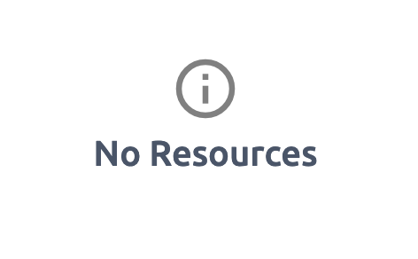
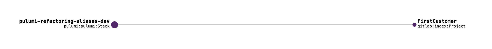
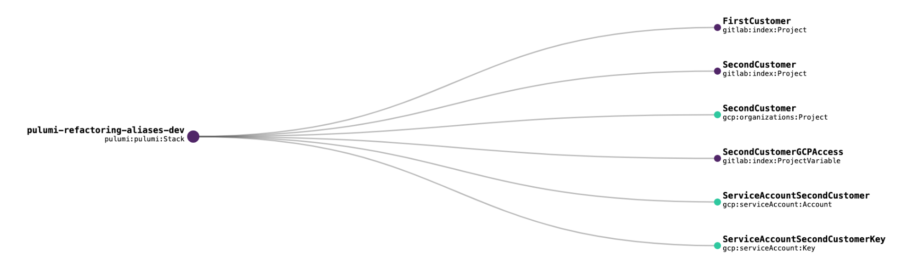
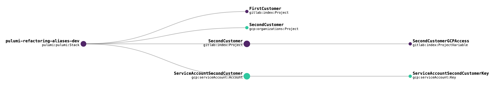
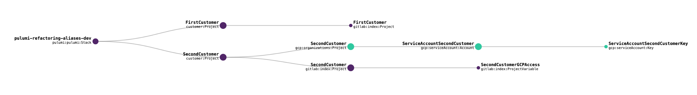

**Guest Article:** [Ringo De Smet](https://www.linkedin.com/in/ringodesmet/), Founder of [Cumundi](https://www.cumundi.cloud), standardizes on Pulumi for writing infrastructure as code libraries to deliver reusable building blocks. Pulumi enables him to iterate through the build-test-release cycle of these building blocks rapidly.

Cumundi helps companies adopt the cloud more integrally. Companies are rebuilding the same 75% of the underlying infrastructure. But the shortage of people and time has led to limited investment in integrating all the non-functional requirements needed to run applications in the cloud.

<!--more-->

## How Pulumi code keeps up with changing requirements

At Cumundi, we build reusable libraries for our customers to set up their infrastructure integrated with best practices. These best practices span the range of non-functional requirements, which are most of the time not taken up with the same focus as application feature development. Where these non-functional requirements can be integrated into infrastructure setups, we include these in our code libraries. Cumundi focuses on all three major cloud providers to provide application-focused infrastructure libraries.

For our internal infrastructure, it is not surprising that we also use Pulumi. At this early phase of our company (founded January 1st!), it is hard to foresee how we will evolve. With Pulumi, we write code in a modern programming language. A good coding practice is not to [optimize prematurely](http://wiki.c2.com/?PrematureOptimization) because the future is unpredictable. Another coding best practice is [red-green-refactor](https://en.wikipedia.org/wiki/Test-driven_development) or formally known as Test Driven Development. You take the current code, write a test for the new requirement, which initially fails (red). Next, you implement the code in the most straightforward way to make the test succeed (green) and you complete the cycle by refactoring the code to keep the design in a proper shape.

This blog post demonstrates a TDD cycle for Pulumi code with a reduced version of the code used to configure the internal infrastructure we provide for each customer. This example focuses on one specific Pulumi resource property: [`aliases`](https://www.pulumi.com/docs/intro/concepts/programming-model/#aliases)

All the code is [published here](https://github.com/cumundi/pulumi-refactoring-aliases) if you want to follow along with a full project setup. Every step described here is committed as a separate branch with the starting point on `master`, the default branch.

### The starting point

Every Pulumi project starts empty, so ours is no exception. This is how our main Pulumi code file looks for now.

```ts
import * as pulumi from "@pulumi/pulumi";

const config = new pulumi.Config('gitlab')
```

Applying the above code does nothing, which you can see in the *Resources* tab on the hosted Pulumi platform:



### Adding the Git repository

We created a separate repository for each of our customers:

```ts
const config = new pulumi.Config('gitlab')

const gitlabNamespace = config.getNumber('namespace')

const firstCustomer = new gitlab.Project("FirstCustomer",
    {
        name: "first-customer",
        description: "First Customer code",
        namespaceId: gitlabNamespace,
        visibilityLevel: "private",
        defaultBranch: "master",
        pipelinesEnabled: true,
        issuesEnabled: false,
        wikiEnabled: false,
        snippetsEnabled: false,
        containerRegistryEnabled: false,
        mergeRequestsEnabled: false,
        mergeMethod: "ff",
        onlyAllowMergeIfPipelineSucceeds: true,
        sharedRunnersEnabled: true
    }
)
```

We wrote the code in the simplest way to get the job done. After `pulumi up`, the Gitlab project is created:



### A customer needs cloud infrastructure

For our second customer, I just duplicated the creation of the Gitlab repository and created a Google Cloud project and service account.

```ts
const secondCustomer = new gitlab.Project("SecondCustomer",
    {
        ... // properties here
    }
)

const secondCustomerProject = new gcp.organizations.Project("SecondCustomer",
    {
        projectId: 'second-customer',
        name: 'Second Customer Infrastructure'
    }
)

const serviceAccountSecondCustomer = new gcp.serviceAccount.Account("ServiceAccountSecondCustomer",
    {
        accountId: 'secondcustomer',
        displayName: 'Service Account for Second Customer project',
        project: secondCustomerProject.projectId
    }
);

const serviceAccountSecondCustomerKey = new gcp.serviceAccount.Key("ServiceAccountSecondCustomerKey",
    {
        serviceAccountId: serviceAccountSecondCustomer.email
    }
);

const secondCustomerGitlabCIVariable = new gitlab.ProjectVariable("SecondCustomerGCPAccess",
    {
        project: secondCustomer.id,
        variableType: 'file',
        key: "GOOGLE_APPLICATION_CREDENTIALS",
        value: serviceAccountSecondCustomerKey.privateKey.apply(value => Buffer.from(value, 'base64').toString('utf-8')),
        protected: true,
        environmentScope: "*"
    }
)
```

These resources are all added with the `Stack` as their parent in the resource view, as seen below. This is getting clumsy.



Visualization goes a long way, but a flat list of resources does not clearly show what belongs together.

### Find relationships between resources

In the current state of the code, we created a Google Cloud service account and a key. Since a key can't be created without a service account, we also created a Gitlab CI project variable for the Gitlab project of the second customer. Two cases of a parent-child relationship.

Although we have this relationship between our resources, the Pulumi state graph doesn't display it. How can we change this without affecting the real resources on Gitlab and Google Cloud?

We can pass [`CustomResourceOptions`](https://www.pulumi.com/docs/reference/pkg/nodejs/pulumi/pulumi/#CustomResourceOptions) as the last argument to every Pulumi resource that we want to create. We use `parent` and `aliases` for refactoring.

To link the key to the service account, we set the `parent` property to the service account resource. If you run `pulumi preview`,  Pulumi wants to recreate the key. It wants to do this because it searches for the key as a child resource of the service account. In your last applied Pulumi state, that is not the case.

```ts
const serviceAccountSecondCustomerKey = new gcp.serviceAccount.Key("ServiceAccountSecondCustomerKey",
    {
        serviceAccountId: serviceAccountSecondCustomer.email
    },
    {
        parent: serviceAccountSecondCustomer
    }
);
```

How can we tell Pulumi that the existing key resource fulfills the expectation in our code? The `aliases` property comes to the rescue!

If you want to rename resources in a Pulumi state or change the parent-child relationships, then the `aliases` property is your friend. Let's indicate in our code that the existing key resource, linked to the `Stack`, is the key of interest.

```ts
const serviceAccountSecondCustomerKey = new gcp.serviceAccount.Key("ServiceAccountSecondCustomerKey",
    {
        serviceAccountId: serviceAccountSecondCustomer.email
    },
    {
        parent: serviceAccountSecondCustomer,
        aliases: [
            { parent: pulumi.rootStackResource }
        ]
    }
);
```

Before going forward, we also changed the relationship between the Gitlab repository and the Gitlab CI variable. When you run `pulumi up`, nothing changes on Gitlab and Google Cloud. But after applying the changes, refreshing the resource view on the Pulumi platform displays the following state graph.



### Clean up duplication

In the previous step, I copied the code for the Gitlab repository from our first customer to our second customer. In this step, we resolve the duplication issue, and ensure that customer projects can conditionally create the Google infrastructure needed.

I introduced a `ComponentResource` subclass, which encapsulates moving the code for the individual resources into the customer resource class. As we set up Google Cloud resources for other customers, we create a Google Cloud project and related resources only when required. We can use a regular Typescript `if` conditional for this.

```ts
import * as pulumi from "@pulumi/pulumi";
import * as gcp from "@pulumi/gcp";
import * as gitlab from "@pulumi/gitlab";
import * as util from 'util';

export interface ProjectArgs {
    // The name of the customer, e.g. "First Customer"
    customer: pulumi.Input<string>;
    // Indication whether we need to create Google Cloud infrastructure for this customer
    needsGoogleInfra: boolean;
    // Namespace in Gitlab to create the repositories in.
    gitlabNamespace?: pulumi.Input<number> | undefined
}

// Pulumi custom resource representing a customer project
export class Project extends pulumi.ComponentResource {
    constructor(name: string, args: ProjectArgs, opts: pulumi.CustomResourceOptions = {}) {
        super('customer:Project', name, {}, opts);

        var customerId = name.replace(/([a-zA-Z])(?=[A-Z])/g, '$1-').toLowerCase();
        var serviceId = name.replace(/([a-zA-Z])(?=[A-Z])/g, '$1').toLowerCase();

        const gitlabProject = new gitlab.Project(name,
            {
                name: customerId,
                description: pulumi.interpolate`${args.customer} code`,
                namespaceId: args.gitlabNamespace,
                visibilityLevel: "private",
                defaultBranch: "master",
                pipelinesEnabled: true,
                issuesEnabled: false,
                wikiEnabled: false,
                snippetsEnabled: false,
                containerRegistryEnabled: false,
                mergeRequestsEnabled: false,
                mergeMethod: "ff",
                onlyAllowMergeIfPipelineSucceeds: true,
                sharedRunnersEnabled: true
            }
        )

        if (args.needsGoogleInfra) {
            ... // Google Cloud and Gitlab CI Variable code here.
        }
    }
}
```

Now that I have our custom resource, I can use it for our existing customers. Our refactored main Pulumi file looks like this:

```ts
const firstCustomer = new customer.Project("FirstCustomer",
    {
        customer: 'First Customer',
        needsGoogleInfra: false,
        gitlabNamespace: gitlabNamespace
    }
)

const secondCustomerProject = new customer.Project('SecondCustomer',
    {
        customer: 'Second Customer',
        needsGoogleInfra: true,
        gitlabNamespace: gitlabNamespace
    }
)
```

When we apply this to our infrastructure, two custom resources are created and saved to your Pulumi state.


However, we have not updated the parent-child relationships.

### Fix the remaining relationships

We have a representation of a customer project in our Pulumi state graph, but we want to see the resources of each customer as child resources of this abstraction, right?

The same trick with `parent` and `aliases` is used to *re-parent* our resources. Our resources are created within the constructor of our `Project` class. In Typescript, the language used in this example, we can use the keyword `this` to point to the `Project` instance.

```ts
export class Project extends pulumi.ComponentResource {
    constructor(name: string, args: ProjectArgs, opts: pulumi.CustomResourceOptions = {}) {
        super('customer:Project', name, {}, opts);

        var customerId = name.replace(/([a-zA-Z])(?=[A-Z])/g, '$1-').toLowerCase();
        var serviceId = name.replace(/([a-zA-Z])(?=[A-Z])/g, '$1').toLowerCase();

        const gitlabProject = new gitlab.Project(name,
            {
                name: customerId,
                description: pulumi.interpolate`${args.customer} code`,
                namespaceId: args.gitlabNamespace,
                visibilityLevel: "private",
                defaultBranch: "master",
                pipelinesEnabled: true,
                issuesEnabled: false,
                wikiEnabled: false,
                snippetsEnabled: false,
                containerRegistryEnabled: false,
                mergeRequestsEnabled: false,
                mergeMethod: "ff",
                onlyAllowMergeIfPipelineSucceeds: true,
                sharedRunnersEnabled: true
            },
            {
                parent: this,
                aliases: [
                    { parent: pulumi.rootStackResource }
                ]
            }
        )
```

While we are changing parent-child relationships, the service account resource is also updated to have the Google Cloud project as its parent. The result should look like the state graph below.



If another developer reads this code, they might not immediately have a clear picture of how everything is wired together. However, looking at the Pulumi resource visualization, the following properties can immediately be deduced:

* our infrastructure has 2 customer projects
* one customer only has a Gitlab repository, while the other also has Google Cloud infrastructure
* if we create a Google Cloud project, we create a service account and a key together with it
* if we create a Google Cloud project, we also set a Gitlab CI variable. It's a pity though I can't link the Gitlab CI variable to the key.

### Next steps

You probably noticed by now that the `aliases` property accepts a list. You can provide entries like:

* `{ name: <some old name> }`
* `{ parent: <some previous parent> }`
* `{ name: <some old name>, parent: <some previous parent> }`

Note that putting the first two in the `aliases` list is not the same as putting the third one as the single entry. I leave it up to the reader to test it and understand the difference.

The take away from this example is: values for `name` in the `aliases` property can not be `Input`s as they need to be resolvable at `preview` time, similar to the name of the resources themselves.

## Conclusion

The Pulumi programming model well designed with regards to the evolution of an infrastructure. With `ComponentResource` and the `parent` and `aliases` properties, refactoring your infrastructure code is a breeze with visualizing abstractions on the Pulumi platform.
