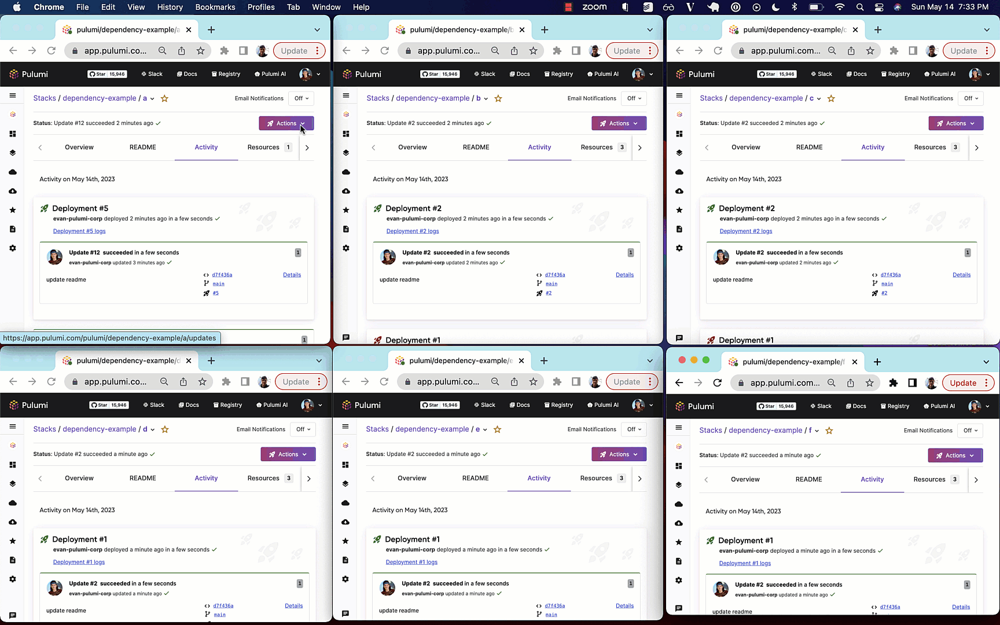

As infrastructure projects grow in size and complexity, you need to decompose infrastructure into smaller stacks to limit the blast radius of errors, extract and reference common layers like networking, and limit access to sensitive components. This comes with a coordination cost as you now need to figure out how to detect and propagate changes to downstream stacks in your dependency graph. Today we’re announcing two features that can help you manage this complexity by automatically updating dependent stacks:

- [Deployment Webhook Destinations](/docs/pulumi-cloud/webhooks/#deployment-webhooks) for triggering downstream stack updates automatically
- [The Pulumi Auto Deploy Package](/registry/packages/auto-deploy) for easily expressing dependencies and configuring downstream updates via Deployment Webhooks.

```
The following example shows automatic deployment of stacks with the following dependency graph

    a
    ├── b
    │   ├── d
    │   ├── e
    │   └── f
    └── c

Whenever a node in the graph is updated, all downstream nodes will be automatically updated
via a webhook triggering Pulumi Deployments.
```



[Automatically updating dependent stacks](https://github.com/pulumi/pulumi/issues/2309) and providing a way to write Pulumi programs that can [express nested stack updates](https://github.com/pulumi/pulumi/issues/2209) are two of the most requested features across the Pulumi project, and we’re excited to enable both of these via Pulumi Cloud and Pulumi Deployments.

## Deployment Webhook Destinations

Pulumi Webhooks allow you to pick one or more event types on a stack (i.e. `update succeeded`, or `refresh failed`) and automatically deliver an event to a destination such a slack channel or a webserver you’ve deployed with custom code. Now you can choose Pulumi Deployments as a webhook destination. When an update completes on the parent stack, a deployment will automatically be triggered on the destination stack. This makes it easy to keep dependent stacks up to date. For instance, you can use Deployment Webhook Destinations to configure every successful update on your `networking` stack to trigger downstream updates on your `database` and `compute` stacks.



{}

```ts
import * as pulumi from "@pulumi/pulumi";
import * as pulumiservice from "@pulumi/pulumiservice";

const databaseWebhook = new pulumiservice.Webhook("databaseWebhook", {
    organizationName: "org",
    projectName: "network",
    stackName: "prod",
    format: pulumiservice.WebhookFormat.PulumiDeployments,
    payloadUrl: "database/prod",
    active: true,
    displayName: "deploy-database",
    filters: [pulumiservice.WebhookFilters.UpdateSucceeded],
});
const computeWebhook = new pulumiservice.Webhook("computeWebhook", {
    organizationName: "org",
    projectName: "database",
    stackName: "prod",
    format: pulumiservice.WebhookFormat.PulumiDeployments,
    payloadUrl: "compute/prod",
    active: true,
    displayName: "deploy-compute",
    filters: [pulumiservice.WebhookFilters.UpdateSucceeded],
});
```

{}
{}

```csharp
using System.Collections.Generic;
using System.Linq;
using Pulumi;
using PulumiService = Pulumi.PulumiService;

return await Deployment.RunAsync(() =>
{
    var databaseWebhook = new PulumiService.Webhook("databaseWebhook", new()
    {
        OrganizationName = "org",
        ProjectName = "network",
        StackName = "prod",
        Format = PulumiService.WebhookFormat.PulumiDeployments,
        PayloadUrl = "database/prod",
        Active = true,
        DisplayName = "deploy-database",
        Filters = new[]
        {
            PulumiService.WebhookFilters.UpdateSucceeded,
        },
    });

    var computeWebhook = new PulumiService.Webhook("computeWebhook", new()
    {
        OrganizationName = "org",
        ProjectName = "database",
        StackName = "prod",
        Format = PulumiService.WebhookFormat.PulumiDeployments,
        PayloadUrl = "compute/prod",
        Active = true,
        DisplayName = "deploy-compute",
        Filters = new[]
        {
            PulumiService.WebhookFilters.UpdateSucceeded,
        },
    });

});
```

{}

{}

```python
import pulumi
import pulumi_pulumiservice as pulumiservice

database_webhook = pulumiservice.Webhook("databaseWebhook",
    organization_name="org",
    project_name="network",
    stack_name="prod",
    format=pulumiservice.WebhookFormat.PULUMI_DEPLOYMENTS,
    payload_url="database/prod",
    active=True,
    display_name="deploy-database",
    filters=[pulumiservice.WebhookFilters.UPDATE_SUCCEEDED])
compute_webhook = pulumiservice.Webhook("computeWebhook",
    organization_name="org",
    project_name="database",
    stack_name="prod",
    format=pulumiservice.WebhookFormat.PULUMI_DEPLOYMENTS,
    payload_url="compute/prod",
    active=True,
    display_name="deploy-compute",
    filters=[pulumiservice.WebhookFilters.UPDATE_SUCCEEDED])
```

{}

{}

```go
package main

import (
	"github.com/pulumi/pulumi-pulumiservice/sdk/go/pulumiservice"
	"github.com/pulumi/pulumi/sdk/v3/go/pulumi"
)

func main() {
	pulumi.Run(func(ctx *pulumi.Context) error {
		_, err := pulumiservice.NewWebhook(ctx, "databaseWebhook", &pulumiservice.WebhookArgs{
			OrganizationName: pulumi.String("org"),
			ProjectName:      pulumi.String("network"),
			StackName:        pulumi.String("prod"),
			Format:           pulumiservice.WebhookFormatPulumiDeployments,
			PayloadUrl:       pulumi.String("database/prod"),
			Active:           pulumi.Bool(true),
			DisplayName:      pulumi.String("deploy-database"),
			Filters: pulumiservice.WebhookFiltersArray{
				pulumiservice.WebhookFiltersUpdateSucceeded,
			},
		})
		if err != nil {
			return err
		}
		_, err = pulumiservice.NewWebhook(ctx, "computeWebhook", &pulumiservice.WebhookArgs{
			OrganizationName: pulumi.String("org"),
			ProjectName:      pulumi.String("database"),
			StackName:        pulumi.String("prod"),
			Format:           pulumiservice.WebhookFormatPulumiDeployments,
			PayloadUrl:       pulumi.String("compute/prod"),
			Active:           pulumi.Bool(true),
			DisplayName:      pulumi.String("deploy-compute"),
			Filters: pulumiservice.WebhookFiltersArray{
				pulumiservice.WebhookFiltersUpdateSucceeded,
			},
		})
		if err != nil {
			return err
		}
		return nil
	})
}
```

{}

{}

```yaml
name: auto-deploy-demo
runtime: yaml
description: A simple auto-deploy example
resources:
  databaseWebhook:
    type: pulumiservice:Webhook
    properties:
      organizationName: org
      projectName: network
      stackName: prod
      format: pulumi_deployments
      payloadUrl: database/prod
      active: true
      displayName: deploy-database
      filters:
      - update_succeeded
  computeWebhook:
    type: pulumiservice:Webhook
    properties:
      organizationName: org
      projectName: database
      stackName: prod
      format: pulumi_deployments
      payloadUrl: compute/prod
      active: true
      displayName: deploy-compute
      filters:
      - update_succeeded
```

{}



## Expressing Stack Dependencies with Pulumi Auto Deploy

We’ve also shipped a new Pulumi package called [`Pulumi Auto Deploy`](/registry/packages/auto-deploy). It lets you simply express dependencies between stacks, and takes care of creating and updating the necessary Deployment Webhooks under the hood.



{}

```ts
import * as autodeploy from "@pulumi/auto-deploy";
import * as pulumi from "@pulumi/pulumi";

/**
 *
 * The following example configures automatic deployment of stacks with the following dependency graph:
    a
    ├── b
    │   ├── d
    │   ├── e
    │   └── f
    └── c
 * Whenever a node in the graph is updated,
 * all downstream nodes will be automatically updated via a webhook triggering Pulumi Deployments.
 */

const organization = pulumi.getOrganization();
const project = "dependency-example"

export const f = new autodeploy.AutoDeployer("auto-deployer-f", {
    organization,
    project,
    stack: "f",
    downstreamRefs: [],
});

export const e = new autodeploy.AutoDeployer("auto-deployer-e", {
    organization,
    project,
    stack: "e",
    downstreamRefs: [],
});

export const d = new autodeploy.AutoDeployer("auto-deployer-d", {
    organization,
    project,
    stack: "d",
    downstreamRefs: [],
});

export const c = new autodeploy.AutoDeployer("auto-deployer-c", {
    organization,
    project,
    stack: "c",
    downstreamRefs: [],
});

export const b = new autodeploy.AutoDeployer("auto-deployer-b", {
    organization,
    project,
    stack: "b",
    downstreamRefs: [d.ref, e.ref, f.ref],

});

export const a = new autodeploy.AutoDeployer("auto-deployer-a", {
    organization,
    project,
    stack: "a",
    downstreamRefs: [b.ref, c.ref],
});
```

{}
{}

```csharp
using System.Collections.Generic;
using System.Linq;
using Pulumi;
using AutoDeploy = Pulumi.AutoDeploy;

/**
 *
 * The following example configures automatic deployment of stacks with the following dependency graph:
    a
    ├── b
    │   ├── d
    │   ├── e
    │   └── f
    └── c
 * Whenever a node in the graph is updated,
 * all downstream nodes will be automatically updated via a webhook triggering Pulumi Deployments.
 */

return await Deployment.RunAsync(() =>
{
    var projectVar = "dependency-example";

    var organization = "pulumi";

    var f = new AutoDeploy.AutoDeployer("f", new()
    {
        Organization = organization,
        Project = projectVar,
        Stack = "f",
        DownstreamRefs = new[] {},
    });

    var e = new AutoDeploy.AutoDeployer("e", new()
    {
        Organization = organization,
        Project = projectVar,
        Stack = "e",
        DownstreamRefs = new[] {},
    });

    var d = new AutoDeploy.AutoDeployer("d", new()
    {
        Organization = organization,
        Project = projectVar,
        Stack = "d",
        DownstreamRefs = new[] {},
    });

    var c = new AutoDeploy.AutoDeployer("c", new()
    {
        Organization = organization,
        Project = projectVar,
        Stack = "c",
        DownstreamRefs = new[] {},
    });

    var b = new AutoDeploy.AutoDeployer("b", new()
    {
        Organization = organization,
        Project = projectVar,
        Stack = "b",
        DownstreamRefs = new[]
        {
            d.Ref,
            e.Ref,
            f.Ref,
        },
    });

    var a = new AutoDeploy.AutoDeployer("a", new()
    {
        Organization = organization,
        Project = projectVar,
        Stack = "a",
        DownstreamRefs = new[]
        {
            b.Ref,
            c.Ref,
        },
    });

});
```

{}

{}

```python
import pulumi
import pulumi_auto_deploy as auto_deploy

'''

The following example configures automatic deployment of stacks with the following dependency graph:
    a
    ├── b
    │   ├── d
    │   ├── e
    │   └── f
    └── c
Whenever a node in the graph is updated,
all downstream nodes will be automatically updated via a webhook triggering Pulumi Deployments.
'''

project_var = "dependency-example"
organization = pulumi.get_organization()
f = auto_deploy.AutoDeployer("f",
    organization=organization,
    project=project_var,
    stack="f",
    downstream_refs=[])
e = auto_deploy.AutoDeployer("e",
    organization=organization,
    project=project_var,
    stack="e",
    downstream_refs=[])
d = auto_deploy.AutoDeployer("d",
    organization=organization,
    project=project_var,
    stack="d",
    downstream_refs=[])
c = auto_deploy.AutoDeployer("c",
    organization=organization,
    project=project_var,
    stack="c",
    downstream_refs=[])
b = auto_deploy.AutoDeployer("b",
    organization=organization,
    project=project_var,
    stack="b",
    downstream_refs=[
        d.ref,
        e.ref,
        f.ref,
    ])
a = auto_deploy.AutoDeployer("a",
    organization=organization,
    project=project_var,
    stack="a",
    downstream_refs=[
        b.ref,
        c.ref,
    ])
```

{}

{}

```go
package main

import (
	"github.com/pulumi/pulumi-auto-deploy/sdk/go/autodeploy"
	"github.com/pulumi/pulumi/sdk/v3/go/pulumi"
)

func main() {
	/**
	*
	* The following example configures automatic deployment of stacks with the following dependency graph:
	   a
	   ├── b
	   │   ├── d
	   │   ├── e
	   │   └── f
	   └── c
	* Whenever a node in the graph is updated,
	* all downstream nodes will be automatically updated via a webhook triggering Pulumi Deployments.
	*/

	pulumi.Run(func(ctx *pulumi.Context) error {
		projectVar := "dependency-example"
		organization := "pulumi"
		f, err := autodeploy.NewAutoDeployer(ctx, "f", &autodeploy.AutoDeployerArgs{
			Organization:   pulumi.String(organization),
			Project:        pulumi.String(projectVar),
			Stack:          pulumi.String("f"),
			DownstreamRefs: pulumi.StringArray{},
		})
		if err != nil {
			return err
		}
		e, err := autodeploy.NewAutoDeployer(ctx, "e", &autodeploy.AutoDeployerArgs{
			Organization:   pulumi.String(organization),
			Project:        pulumi.String(projectVar),
			Stack:          pulumi.String("e"),
			DownstreamRefs: pulumi.StringArray{},
		})
		if err != nil {
			return err
		}
		d, err := autodeploy.NewAutoDeployer(ctx, "d", &autodeploy.AutoDeployerArgs{
			Organization:   pulumi.String(organization),
			Project:        pulumi.String(projectVar),
			Stack:          pulumi.String("d"),
			DownstreamRefs: pulumi.StringArray{},
		})
		if err != nil {
			return err
		}
		c, err := autodeploy.NewAutoDeployer(ctx, "c", &autodeploy.AutoDeployerArgs{
			Organization:   pulumi.String(organization),
			Project:        pulumi.String(projectVar),
			Stack:          pulumi.String("c"),
			DownstreamRefs: pulumi.StringArray{},
		})
		if err != nil {
			return err
		}
		b, err := autodeploy.NewAutoDeployer(ctx, "b", &autodeploy.AutoDeployerArgs{
			Organization: pulumi.String(organization),
			Project:      pulumi.String(projectVar),
			Stack:        pulumi.String("b"),
			DownstreamRefs: pulumi.StringArray{
				d.Ref,
				e.Ref,
				f.Ref,
			},
		})
		if err != nil {
			return err
		}
		_, err = autodeploy.NewAutoDeployer(ctx, "a", &autodeploy.AutoDeployerArgs{
			Organization: pulumi.String(organization),
			Project:      pulumi.String(projectVar),
			Stack:        pulumi.String("a"),
			DownstreamRefs: pulumi.StringArray{
				b.Ref,
				c.Ref,
			},
		})
		if err != nil {
			return err
		}
		return nil
	})
}
```

{}

{}

```yaml
name: auto-deploy-demo
runtime: yaml
description: A simple auto-deploy example
variables:
  project: dependency-example
  # TODO: update once https://github.com/pulumi/pulumi-yaml/issues/461 is fixed
  organization: pulumi
resources:
  f:
    type: auto-deploy:AutoDeployer
    properties:
      organization: ${organization}
      project: ${project}
      stack: f
      downstreamRefs: []
  e:
    type: auto-deploy:AutoDeployer
    properties:
      organization: ${organization}
      project: ${project}
      stack: e
      downstreamRefs: []
  d:
    type: auto-deploy:AutoDeployer
    properties:
      organization: ${organization}
      project: ${project}
      stack: d
      downstreamRefs: []
  c:
    type: auto-deploy:AutoDeployer
    properties:
      organization: ${organization}
      project: ${project}
      stack: c
      downstreamRefs: []
  b:
    type: auto-deploy:AutoDeployer
    properties:
      organization: ${organization}
      project: ${project}
      stack: b
      downstreamRefs:
        - ${d.ref}
        - ${e.ref}
        - ${f.ref}
  a:
    type: auto-deploy:AutoDeployer
    properties:
      organization: ${organization}
      project: ${project}
      stack: a
      downstreamRefs:
        - ${b.ref}
        - ${c.ref}
```

{}



Just declare an `AutoDeployer` resource for each stack, and any `downstream` stacks will automatically be updated whenever a stack in its dependency chain is updated.

## Scale Infrastructure with Software

At Pulumi, we build tools to help you scale your infrastructure footprint with software instead of just humans. Deployment Webhook Destinations and `pulumi-auto-deploy` give you the tools to keep all of your dependent infrastructure up to date with automation instead of manual runbooks and human-driven operations.

Check out these resources to get started today:

- [Check out the Pulumi Deployments documentation](/docs/pulumi-cloud/deployments) and learn about configuring [Deployment Settings](/docs/pulumi-cloud/deployments/reference/#deployment-settings) for your stacks.
- Get started with the [Pulumi Auto Deploy Package](/registry/packages/auto-deploy).
- Learn more about [Pulumi Cloud Webhooks](/docs/pulumi-cloud/webhooks/#deployment-webhooks).
- Join us in the [#pulumi-deployments community slack channel](https://slack.pulumi.com/).

🚀🚀🚀 Happy building! 🚀🚀🚀
