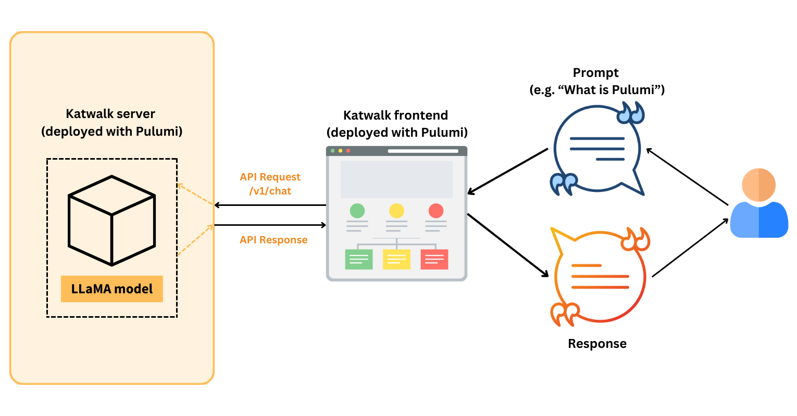
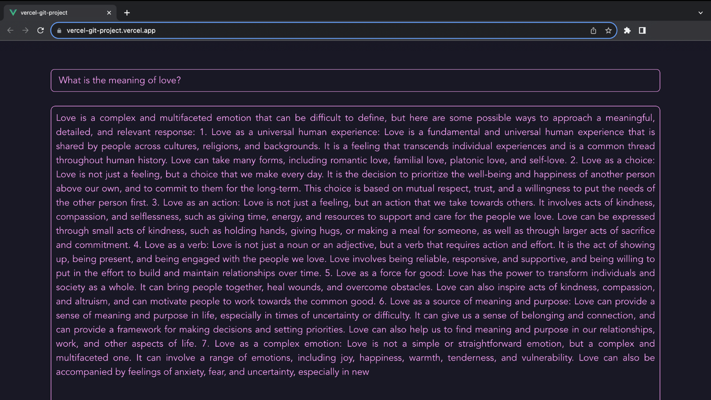

The process of taking an idea and turning it into reality has been nothing short of extraordinary since we started innovating with Artificial Intelligence. With this technology, machines learn about and communicate with people, while also helping us in ways we never could have imagined only a few years ago. If you've been following along, you might recall our [previous article](https://www.pulumi.com/blog/mlops-the-ai-challenge-is-cloud-not-code/) where we used Python and Pulumi to a chatbot API (named katwalk) to the cloud.

But our AI adventure hasn't ended there; it's only just begun.

Now, imagine this: A Vue.js chatbot frontend, seamlessly integrating human interaction and the AI chatbot API. This blog post is part of the series on AI Infrastructure as Python. We'd delve into the creation of a captivating Vue.js chatbot frontend, and with Pulumi, we'll deploy it to Vercel.

> Figure 1. Architecture diagram


The complexity of building end-to-end AI/ML applications rests not only in the algorithms and models, but also in the several layers of infrastructure required to bring them to life. Consider this: You have a brilliantly designed Vue.js chatbot frontend, a chatbot API powered by LLaMA models, a Vercel cloud hosting environment for the frontend, and a Runpod environment for the API. But here's the catch: you have to weave all of these pieces together seamlessly.

Individual scripts or manual settings to set up and manage each component can soon create a tangled web of inefficiencies and potential problems. That's where Pulumi comes in as the pivotal figure in our AI/ML journey. From the frontend to the backend, Pulumi orchestrates the programmatic generation and coordination of every critical infrastructure element. It's the link that connects your lofty AI goals with the pragmatism of efficient development.

With Pulumi, developer productivity increases, scalability is a breeze, and the complex infrastructure pieces fit together easily. Now that you can see why this is important, let's get started.

Before we get into the details of using Pulumi to deploy a Vue.js frontend app to Vercel, let's start with some quick terminology/context:

- [Katwalk Frontend](https://github.com/pulumiverse/katwalk/tree/main/src/app/katwalk-frontend) is a demo Vue.js application that integrates with the [Katwalk Server](https://github.com/pulumiverse/katwalk) to produce a function web interface for you to communicate with your chatbot. 
- [Vercel](https://vercel.com/) is a modern web development cloud platform and hosting provider. It specialises in making web application deployment simple and efficient.

## Integrate Your Chatbot Service With a Frontend And Deploy It!
If you are ready to integrate your chatbot and deploy it to Vercel along with us, then let's double check a few requirements before we continue. While Pulumi supports many languages, we chose Python for this project, as Python is a familiar language in the AI industry and this is part of the *#PulumiMLOps* challenge.

### Requirements

* [Pulumi CLI](https://www.pulumi.com/docs/install/)
* [Pulumi account and access token](https://app.pulumi.com/signup)
* [Python3](https://www.python.org/downloads/)
* [Git CLI](https://git-scm.com/book/en/v2/Getting-Started-Installing-Git)
* Endpoint of Katwalk Server API. Follow the steps in [this article](https://www.pulumi.com/blog/mlops-the-ai-challenge-is-cloud-not-code/) to deploy the API and get your endpoint.
* [Vercel account and access token](https://vercel.com/guides/how-do-i-use-a-vercel-api-access-token#creating-an-access-token)


Now that you have everything needed to get started, let's hook up our frontend and deploy the frontend to Vercel using Pulumi.

### 1. Clone the repo and setup your project

The first thing we need to do is clone the repository from GitHub and setup the Pulumi Python environment.

```bash
# Clone the repository and cd to the infra directory
git clone https://github.com/pulumiverse/katwalk && cd katwalk/pulumi

# Create and initialize the python virtual env
python3 -m venv venv && source venv/bin/activate

# Install python dependencies
python -m pip install -r requirements.txt
```

### 2. Login to Pulumi Cloud and initialize stack

Next, let's setup our state and secrets store in Pulumi Cloud. 

```bash
# You can store Pulumi state in multiple ways, here we use Pulumi Cloud
# Other state backends include Azure storage, Amazon S3, local file, and more
pulumi login 

# Initialize your stack
# Here we name the stack "dev"
pulumi stack init --stack dev
```

### 3. Configure deployment credentials

Before the deployment, you will need to set the config values for your Vercel token, the repository name, and the repository type. The Vercel token is supposed to be set as a secret. If you open the `Pulumi.${stackName}.yaml` file, you can see the encrypted secret in this plain text YAML configuration.

```bash
# The name of the git repository. It should have this format {account-name}/{repository-name}
pulumi config set repoName <repo_name>

# The git provider of the repository. Must be either `github`, `gitlab`, or `bitbucket`.
pulumi config set repoType <github|gitlab|bitbucket>

# Configure vercel token as secret
pulumi config set --secret token <vercel_token>

```

### 4. Deploy to Vercel

Now, you're set up to deploy your Vue app to Vercel. 

```bash
# Finally, run `pulumi up` to deploy!
pulumi up
```

### 5. Interact with your chatbot

Once your web app is running, you can visit the website, send prompts and see the response in real-time!

> Figure 2. A prompt and response screenshot from our Katwalk Frontend


### 6. Tear down resources

Now that you've tested out this code and you can see the chatbot in action, remember to deprovision your deployment by running: 

```bash
pulumi destroy
```

## Explaining the Pulumi code

If you'd like to learn about what the Pulumi code is doing, then stick around. In this section, we'll dive into the Python Pulumi code which is responsible for deploying the Vue.js project to Vercel using Pulumi. Let's break down the code step by step to understand how it works. 

### 1. Import the necessary modules

```python
import pulumi
import pulumiverse_vercel as vercel
```
The code begins by importing the required modules. `pulumi` is the primary Pulumi Python library, while `pulumiverse_vercel` is a Pulumi provider for Vercel. These modules provide the necessary functionality to define and manage our web app infrastructure.

### 2. Configuration settings

```python
config = pulumi.Config()
token = config.require_secret("token")
repoName = config.require("repoName")
repoType = config.require("repoType")
```
Here, we retrieve configuration settings using Pulumi's configuration management. Configuration values like `token`, `repoName`, and `repoType` are essential for setting up the Vercel deployment. These were the values that you provided using the `pulumi config set` command before deploying the stack.

### 3. Vercel provider

```python
provider = vercel.Provider("vercel-provider",
    api_token = token
)
```
This part initializes the Vercel provider with the Vercel API token. The provider is used to authenticate and interact with the Vercel platform programmatically.

### 4. Creating a Vercel project

```python
project = vercel.Project("vercel-project", 
    name = "vercel-git-project",
    framework = "vue",
    git_repository = vercel.ProjectGitRepositoryArgs(
        repo = repoName,
        type = repoType
    ),
    root_directory = "src/app/katwalk-frontend",
    opts = pulumi.ResourceOptions(
        provider = provider
    )
)
```
Here, we define a Vercel project named `vercel-git-project`. The `git_repository` parameter specifies the Git repository details, including `repoName` and `repoType`. We also associate this project with the Vercel provider using `opts`.

### 5. Setting Environment Variables

```python
environment = vercel.ProjectEnvironmentVariable("vercel-env",
    project_id = project.id,
    key = "VUE_APP_BACKEND_DNS",
    value = backendDns,
    targets = ["production"],
    opts = pulumi.ResourceOptions(
        provider = provider
    )
)
```
This section sets an environment variable named `VUE_APP_BACKEND_DNS` for the Vercel project. It links this environment variable to the `project.id` and specifies that it should be available only in the `production` environment.

### 6. Deploying the Project

```python
deployment = vercel.Deployment("vercel-deployment",
    project_id = project.id,
    production = True,
    ref = "main",
    opts = pulumi.ResourceOptions(
        provider = provider
    )
)
```
Finally, we deploy the Vercel project with the `vercel.Deployment` resource. This deployment is configured to use the `main` branch and is marked as a production deployment.

Platform engineering, DevOps, and MLOps are the next frontier in shaping the AI landscape, and Pulumi continues to be a beacon of reliability and efficiency on this journey. When coupled with Python-based Infrastructure as Code (IaC), Pulumi becomes an indispensable tool that empowers the MLOps community to collaborate, develop, and scale AI applications with unprecedented ease.

If you've joined us on this incredible journey to connect the dots between the API and the Vue.js chatbot frontend using Pulumi and Python, we're eager to hear your story. How did it work out for you? Did you find the process as exhilarating and empowering as we did? What are you most excited about in this AI-powered future?

Our journey doesn't end here; it's merely a waypoint on the ever-evolving road of innovation. We invite you to share your thoughts, ideas, and suggestions for future installments of the Pulumi Python + MLOps series. Together, we'll continue pushing the boundaries of what's possible in the world of AI development.

Join us in the [Pulumi Community Slack](https://slack.pulumi.com) or in the [Pulumiverse Community Katwalk Frontend Github repository](https://github.com/pulumiverse/katwalk-frontend) to decide what #aiChallenge we tackle next!