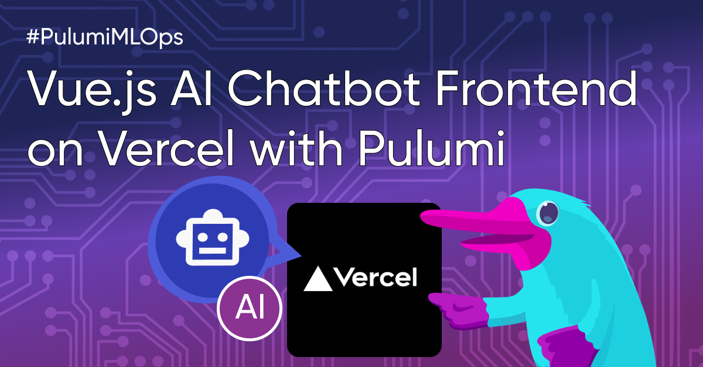

The process of taking an idea and turning it into reality has been nothing short of extraordinary since we started innovating with Artificial Intelligence. With this technology, machines learn about and communicate with people, while also helping us in ways we never could have imagined only a few years ago. If you've been following along, you might recall our [previous article](https://www.pulumi.com/blog/mlops-the-ai-challenge-is-cloud-not-code/) where we used Python and Pulumi to a chatbot API (named katwalk) to the cloud.

But our AI adventure hasn't ended there; it's only just begun.

Now, imagine this: A Vue.js chatbot frontend, seamlessly integrating human interaction and the AI chatbot API. This blog post is the second installment of a series on AI Infrastructure as Python. We'd delve into the creation of a captivating Vue.js chatbot frontend, and with Pulumi, we'll deploy it to Vercel.

Before we get into the details of using Pulumi to deploy a Vuejs frontend app to Vercel, let's start with some quick terminology/context:

- Katwalk Frontend is a demo Vuejs application that integrates with the Katwalk Server to produce a function web interface for you to communicate with your chatbot. 
- Vercel is a modern web development cloud platform and hosting provider. It specialises in making web application deployment simple and efficient.

## Code Samples

```typescript
let bucket = new aws.s3.Bucket("stuff");
...
```

## Images



## Videos



Note the `?rel=0` param, which tells YouTube to suggest only videos from same channel.
